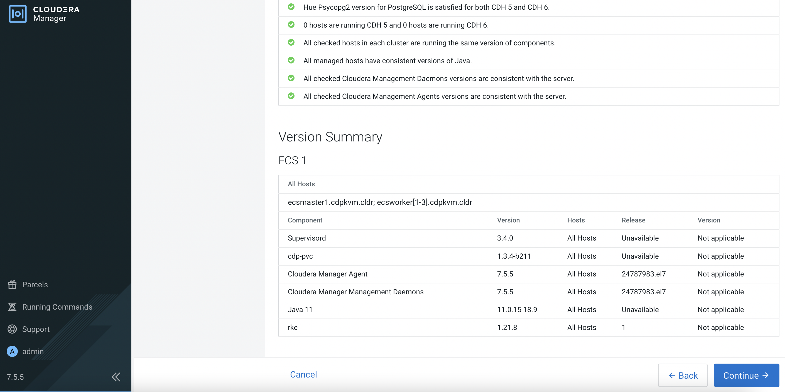
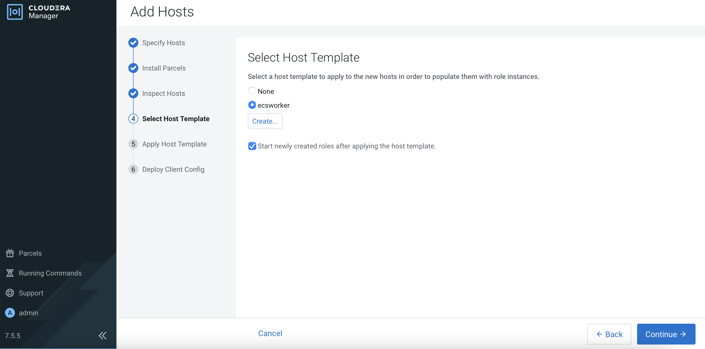
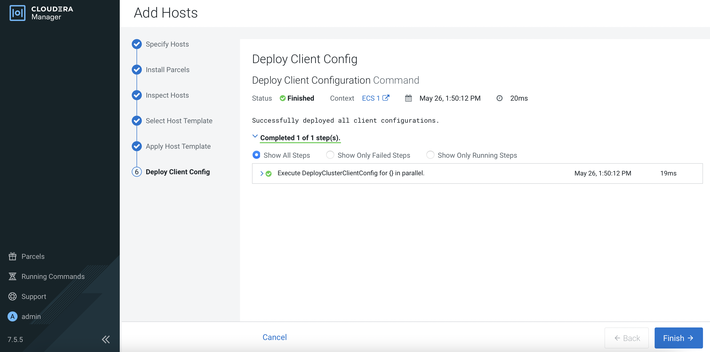
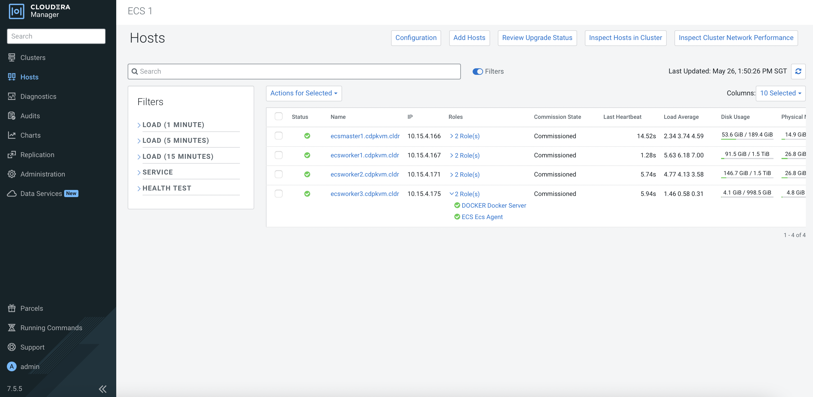
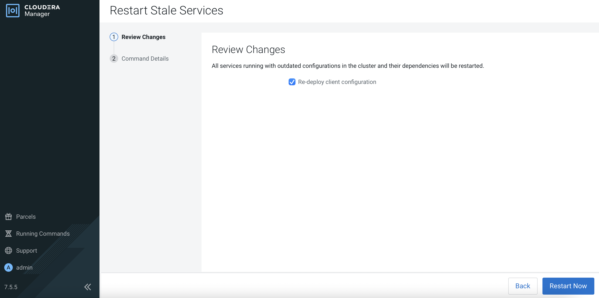

# Add ECS Node
{: .no_toc }

This article explains the steps to deploy


1. In 

    
    
2. In 

        

3. In 

    
    
4. In 

    
    
5. In 

    
    
6. In 

    
    
7. In 

    
    
8. In 

    
    
9. In 

    
    
10. In 

    
    
11. In 

        
    
12. In 

      
    
13. In 

      
    
14. In 

      
    
15. In 

      
    
16. In 

      
    
17. In 

      
    
18. In 

      
    
19. In 

      
    
20. In 

          
    
21. In 

        
    
22. In 

        
    
23. In 

            
    
24. In 

            

```bash
]# kubectl get nodes
NAME                     STATUS   ROLES                       AGE     VERSION
ecsmaster1.cdpkvm.cldr   Ready    control-plane,etcd,master   4d13h   v1.21.8+rke2r2
ecsworker1.cdpkvm.cldr   Ready    <none>                      4d13h   v1.21.8+rke2r2
ecsworker2.cdpkvm.cldr   Ready    <none>                      4d13h   v1.21.8+rke2r2
```

```bash
# kubectl get nodes
NAME                     STATUS   ROLES                       AGE     VERSION
ecsmaster1.cdpkvm.cldr   Ready    control-plane,etcd,master   4d13h   v1.21.8+rke2r2
ecsworker1.cdpkvm.cldr   Ready    <none>                      4d13h   v1.21.8+rke2r2
ecsworker2.cdpkvm.cldr   Ready    <none>                      4d13h   v1.21.8+rke2r2
ecsworker3.cdpkvm.cldr   Ready    <none>                      111s    v1.21.8+rke2r2
    ```

```bash
# kubectl get nodes
NAME                     STATUS     ROLES                       AGE     VERSION
ecsmaster1.cdpkvm.cldr   NotReady   control-plane,etcd,master   4d13h   v1.21.8+rke2r2
ecsworker1.cdpkvm.cldr   NotReady   <none>                      4d13h   v1.21.8+rke2r2
ecsworker2.cdpkvm.cldr   NotReady   <none>                      4d13h   v1.21.8+rke2r2
ecsworker3.cdpkvm.cldr   NotReady   <none>                      11m     v1.21.8+rke2r2
    ```
    
    ```bash
# kubectl get nodes
NAME                     STATUS   ROLES                       AGE     VERSION
ecsmaster1.cdpkvm.cldr   Ready    control-plane,etcd,master   4d14h   v1.21.8+rke2r2
ecsworker1.cdpkvm.cldr   Ready    <none>                      4d13h   v1.21.8+rke2r2
ecsworker2.cdpkvm.cldr   Ready    <none>                      4d13h   v1.21.8+rke2r2
ecsworker3.cdpkvm.cldr   Ready    <none>                      14m     v1.21.8+rke2r2
    ```
    
    ```bash
# tree /longhorn
/longhorn
`-- ecs
    `-- longhorn-storage
        |-- longhorn-disk.cfg
        `-- replicas
            |-- pvc-40338fdb-c0dd-4e0d-a634-d3e8263a46e6-bbcad0e4
            |   |-- revision.counter
            |   |-- volume-head-000.img
            |   |-- volume-head-000.img.meta
            |   `-- volume.meta
            |-- pvc-6709bacb-db5e-4129-8f9e-c645e07ad921-16dcd615
            |   |-- revision.counter
            |   |-- volume-head-000.img
            |   |-- volume-head-000.img.meta
            |   `-- volume.meta
            |-- pvc-bc1e2346-d9d8-4ff6-be00-4105a6b8f433-ae9b50e3
            |   |-- revision.counter
            |   |-- volume-head-000.img
            |   |-- volume-head-000.img.meta
            |   `-- volume.meta
            |-- pvc-cd6d226b-075a-475c-b5b3-9b79961bc338-8224c2de
            |   |-- revision.counter
            |   |-- volume-head-000.img
            |   |-- volume-head-000.img.meta
            |   `-- volume.meta
            `-- pvc-d37b564f-8d77-4cc0-b634-b85c0d1bca91-cf49bf98
                |-- revision.counter
                |-- volume-head-000.img
                |-- volume-head-000.img.meta
                `-- volume.meta
```

```bash
# tree /localpath/
/localpath/
`-- local-storage
    `-- pvc-a8c1086a-e7e3-4cf2-af02-da0a17ab146b_impala-1653548482-kwb7_scratch-cache-volume-impala-executor-000-0
        |-- impala-cache-file-b94f4c649f4d8adc:5ac6c6fd6c847ba3
        `-- impala-scratch

3 directories, 1 file
```