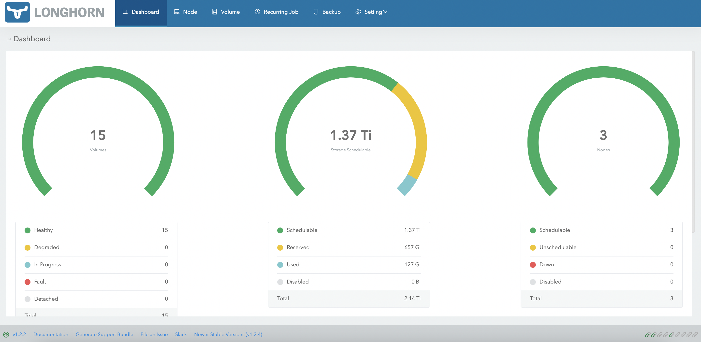
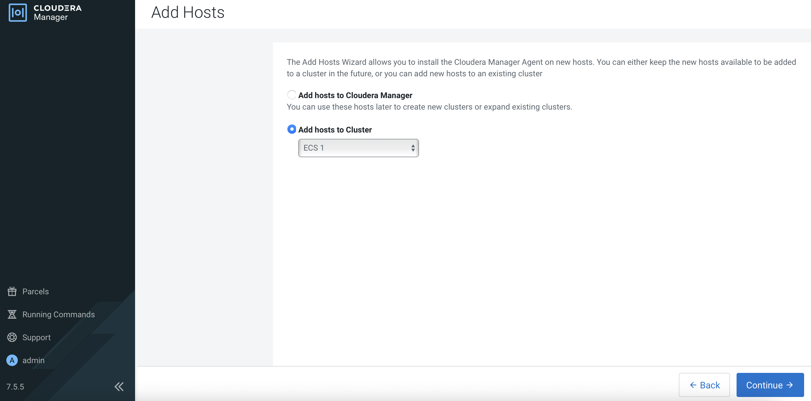
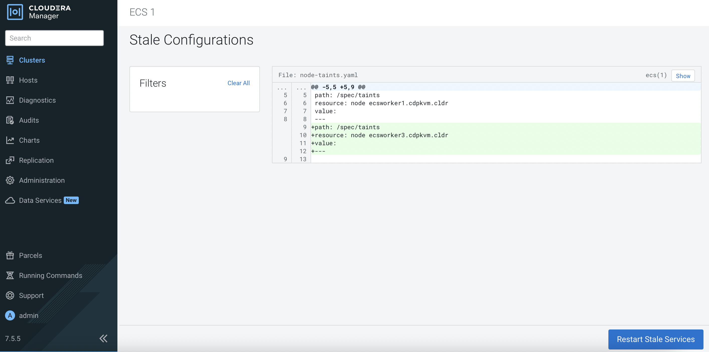
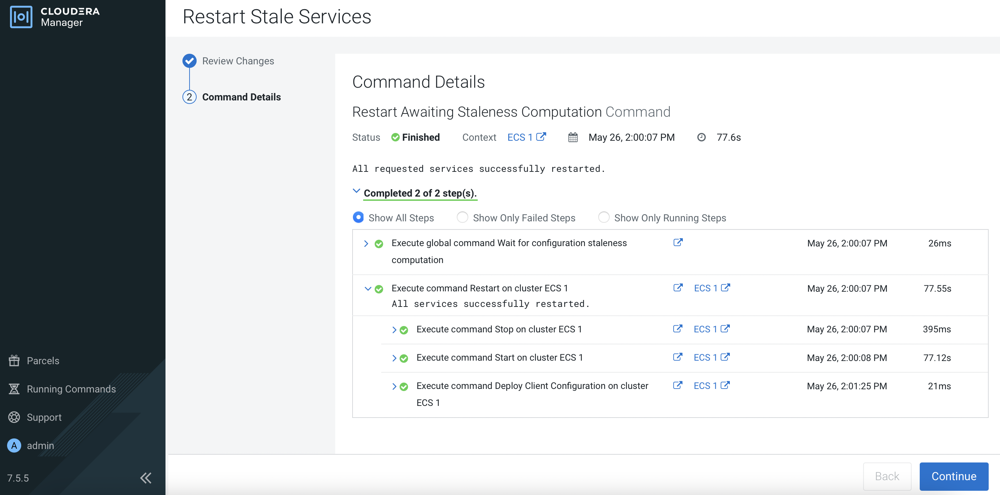
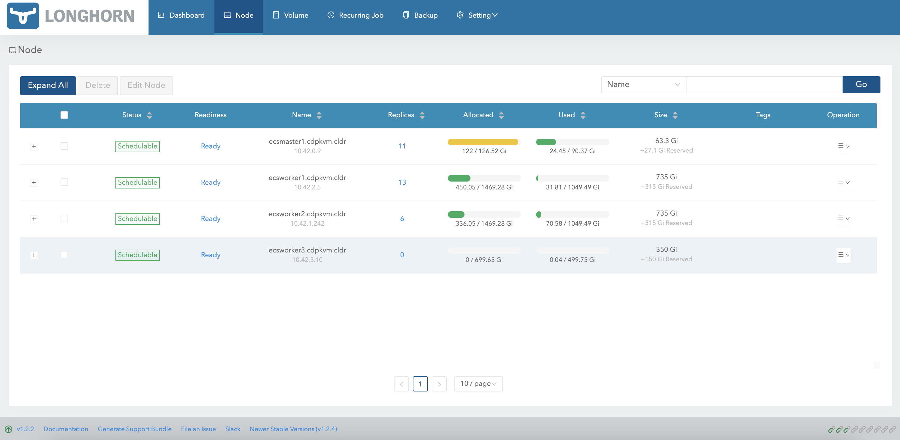

# Add ECS Node
{: .no_toc }

This article explains the steps to add a new ECS node into the existing CDP PvC ECS cluster. Please note that this activity will need to restart the entire ECS cluster including the ECS master/server node. Service disruption is expected.
This is only applicable to CDP Private Cloud solution installed with ECS system.

---

1. In CM, navigate to `Clusters` > `ECS` > `Storage UI` to launch the Longhorn dashboard.

    
    
2. In Longhorn dashboard, take note that there is only 3 Longhorn nodes currently.

        
    
    Check that the ECS cluster has 3 nodes currently.
    
    ```bash
    # kubectl get nodes
    NAME                     STATUS   ROLES                       AGE     VERSION
    ecsmaster1.cdpkvm.cldr   Ready    control-plane,etcd,master   4d13h   v1.21.8+rke2r2
    ecsworker1.cdpkvm.cldr   Ready    <none>                      4d13h   v1.21.8+rke2r2
    ecsworker2.cdpkvm.cldr   Ready    <none>                      4d13h   v1.21.8+rke2r2
    ```

3. In CM, navigate to `Clusters` > `ECS 1`. Click `3 Hosts` to view the following page. Click `Add Hosts`.

    
    
4. Select `ECS 1` cluster as follows. Click `Continue`.

    
    
5. Enter the FQDN of the ECS node and click `Search`. Upon successful scan, the hostname alongside each host's IP address will appear. Check the details before clicking `Continue`.

    
    
6. Click `Continue`. 

    
    
7. Ensure that JDK has already been installed in each ECS host. Select `Manually manage JDK` and click `Continue`.

    
    
8. Enter the login credentials. Click `Continue`. 

    
    
9. CM is installing the agent in each ECS node in parallel and will subsequently install the parcels.

    
    
10. Check the results if needed. Otherwise, click `Continue`.  

    
    
11. Click `Create...`.

        
    
12. Fill in the `Template Name` and select the role groups for this ECS worker/agent node.

      
    
13. Verify the details and click `Continue`.     

      
    
14. Upon successful deployment, click `Continue`.

      
    
15. Click `Finish`.  

      
    
16. Note that the new ECS worker/agent node has been added successfully.

      
    
    The ECS cluster is now updated with the new node.
    
    ```bash
    # kubectl get nodes
    NAME                     STATUS   ROLES                       AGE     VERSION
    ecsmaster1.cdpkvm.cldr   Ready    control-plane,etcd,master   4d13h   v1.21.8+rke2r2
    ecsworker1.cdpkvm.cldr   Ready    <none>                      4d13h   v1.21.8+rke2r2
    ecsworker2.cdpkvm.cldr   Ready    <none>                      4d13h   v1.21.8+rke2r2
    ecsworker3.cdpkvm.cldr   Ready    <none>                      111s    v1.21.8+rke2r2
    ```    
    
17. Navigate to `Clusters` > `ECS 1`. Click the orange button to restart the ECS cluster.

      
    
18. Click `Restart Stale Services`.

      
    
19. Select `Re-deploy client configuration` and subsequently click `Restart Now`.

      
    
    This will restart the entire ECS cluster. During this process, the nodes will be reflected as `NotReady`.
    
    ```bash
    # kubectl get nodes
    NAME                     STATUS     ROLES                       AGE     VERSION
    ecsmaster1.cdpkvm.cldr   NotReady   control-plane,etcd,master   4d13h   v1.21.8+rke2r2
    ecsworker1.cdpkvm.cldr   NotReady   <none>                      4d13h   v1.21.8+rke2r2
    ecsworker2.cdpkvm.cldr   NotReady   <none>                      4d13h   v1.21.8+rke2r2
    ecsworker3.cdpkvm.cldr   NotReady   <none>                      11m     v1.21.8+rke2r2
    ```
    
20. Upon successful restart, click `Continue`.   

          
    
21. The Longhorn dashboard now displays a total of 4 Longhorn nodes. This implies that the new ECS node has been added into the Longhorn cluster successfully.

        
    
    All ECS nodes should be in `Ready` mode.
    
    ```bash
    # kubectl get nodes
    NAME                     STATUS   ROLES                       AGE     VERSION
    ecsmaster1.cdpkvm.cldr   Ready    control-plane,etcd,master   4d14h   v1.21.8+rke2r2
    ecsworker1.cdpkvm.cldr   Ready    <none>                      4d13h   v1.21.8+rke2r2
    ecsworker2.cdpkvm.cldr   Ready    <none>                      4d13h   v1.21.8+rke2r2
    ecsworker3.cdpkvm.cldr   Ready    <none>                      14m     v1.21.8+rke2r2
    ```
22. The storage is now currently empty for this newly added node.

        
    
23. In CM, ensure that new node is in green mode with the correct roles provisioned.

            
    
24. Create a new environment in the [CDP Data Services Management Console]({{ site.baseurl }}). After successful creation of the environment, the system might choose this new node to provision the storage. If so, the longhorn dashboard will show that some space has been provisioned in this newly added node.

            

    Verify that the system has provisioned some volumes at this new node in the `/longhorn`directory which was specified during the initial ECS cluster installation.

    ```bash
    # tree /longhorn
    /longhorn
    `-- ecs
        `-- longhorn-storage
            |-- longhorn-disk.cfg
            `-- replicas
                |-- pvc-40338fdb-c0dd-4e0d-a634-d3e8263a46e6-bbcad0e4
                |   |-- revision.counter
                |   |-- volume-head-000.img
                |   |-- volume-head-000.img.meta
                |   `-- volume.meta
                |-- pvc-6709bacb-db5e-4129-8f9e-c645e07ad921-16dcd615
                |   |-- revision.counter
                |   |-- volume-head-000.img
                |   |-- volume-head-000.img.meta
                |   `-- volume.meta
                |-- pvc-bc1e2346-d9d8-4ff6-be00-4105a6b8f433-ae9b50e3
                |   |-- revision.counter
                |   |-- volume-head-000.img
                |   |-- volume-head-000.img.meta
                |   `-- volume.meta
                |-- pvc-cd6d226b-075a-475c-b5b3-9b79961bc338-8224c2de
                |   |-- revision.counter
                |   |-- volume-head-000.img
                |   |-- volume-head-000.img.meta
                |   `-- volume.meta
                `-- pvc-d37b564f-8d77-4cc0-b634-b85c0d1bca91-cf49bf98
                    |-- revision.counter
                    |-- volume-head-000.img
                    |-- volume-head-000.img.meta
                    `-- volume.meta
    ```

26. Create a new Impala database at the CDW console. The system might choose to provision the CDW pods and its persistent volume in this new node. If so, the direct attached local disk with the `localpath` mountpoint will be provisioned with the impala cache file as shown below. The `localpath` directory was configured during the initial ECS cluster installation.


    ```bash
    # tree /localpath/
    /localpath/
    `-- local-storage
        `-- pvc-a8c1086a-e7e3-4cf2-af02-da0a17ab146b_impala-1653548482-kwb7_scratch-cache-volume-impala-executor-000-0
            |-- impala-cache-file-b94f4c649f4d8adc:5ac6c6fd6c847ba3
            `-- impala-scratch

    3 directories, 1 file
    ```