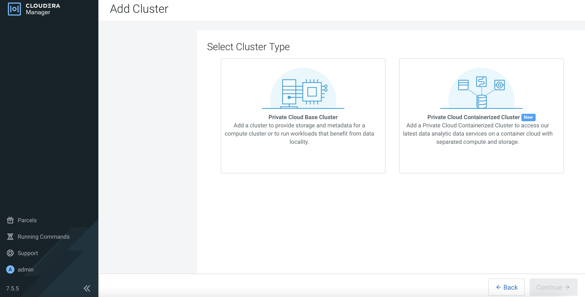

# CDP Base Installation
{: .no_toc }

This article explains the necessary steps to install the minimum services on CDP Base platform. Please ensure that the [prerequisites]({{ site.baseurl }}) have already been prepared and [CM]({{ site.baseurl }}) has already been installed successfully prior to running this procedure.

- TOC
{:toc}

---

## Run sanity check in each host

1. JDK has already been installed.

    ```bash
    # rpm -qa | grep jdk
    copy-jdk-configs-3.3-10.el7_5.noarch
    java-11-openjdk-11.0.14.1.1-1.el7_9.x86_64
    java-11-openjdk-headless-11.0.14.1.1-1.el7_9.x86_64
    java-11-openjdk-devel-11.0.14.1.1-1.el7_9.x86_64
    ```

2. The external DNS server is able to resolve the hostname and perform reverse DNS lookup. Please this step for all the CDP PvC Base and ECS nodes.

    ```bash
    # nslookup idm
    Server:		10.15.4.150
    Address:	10.15.4.150#53

    Name:	idm.cdpkvm.cldr
    Address: 10.15.4.150

    # nslookup 10.15.4.150
    150.4.15.10.in-addr.arpa	name = idm.cdpkvm.cldr.
    ```

3. NTP client is synchronizing time with the external NTP server.

4. Each host has already been registered with the external Kerberos server.

    ```bash
    # ipa host-show bmaster1
    Host name: bmaster1.cdpkvm.cldr
    Principal name: host/bmaster1.cdpkvm.cldr@CDPKVM.CLDR
    Principal alias: host/bmaster1.cdpkvm.cldr@CDPKVM.CLDR
    SSH public key fingerprint: SHA256:dyShLpzkqlRHc2LHiqXDbhM8ynT7v4yjZP4CZ212tqU root@bmaster1.cdpkvm.cldr (ssh-rsa),
                              SHA256:C+BAHEBbVAXfhUIpdFxoL2MOkF5pUGATuKnFQXCgJnc root@bmaster1.cdpkvm.cldr (ssh-rsa),
                              SHA256:/COofNFRyGmwAGR6sfonAcXtc/Knjs5/an1+SMX/8GA (ecdsa-sha2-nistp256), SHA256:OL8ZeU7+2E4yl7rsvKftXYTM7Bvr8fEVuxQaQBouwwo
                              (ssh-ed25519)
    Password: False
    Keytab: True
    Managed by: bmaster1.cdpkvm.cldr
    ```

## Configure higher session timeout value

1. Navigate to `Administration` > `Settings`. Search for `session timeout`. Key in `2 days` to avoid session timeout during CDP Base installation. 

    

## Install CDP services on CDP Base via CM

1. Navigate to `Clusters` > `Add Cluster`. 
   Select `Private Cloud Base Cluster` and click `Continue`.

    

    

2. Enter the Cluster Name and click `Continue`. 

    

3. Enter the FQDN of each CDP Base host and click `Search`. Upon successful scan, the hostname alongside each host's IP address will appear. Check the details before clicking `Continue`.

    
    
4. Select the software parcel. Click `Continue`.  

    
    
5. Ensure that JDK has already been installed in each CDP Base host. Select `Manually manage JDK` and click `Continue`.

    
    
6. Enter the login credentials. Click `Continue`. 

    
    
7. CM is installing the agent in each CDP Base host in parallel and will subsequently install the parcels. After completion, click `Continue`. 

    
    
    
8. E 

    
    
9. E 

    
    
10. E 

    
    
3. E 

    
    

    

