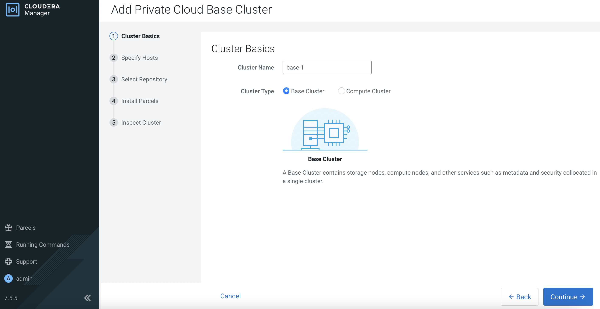

# CDP Base Installation
{: .no_toc }

This article explains the necessary steps to install the minimum services on CDP Base platform. Please ensure that the [prerequisites]({{ site.baseurl }}) have already been prepared and [CM]({{ site.baseurl }}) has already been installed successfully prior to running this procedure.

- TOC
{:toc}

---

## Sanity check

1. Ensure that JDK has already been installed in each host.

    ```bash
    # rpm -qa | grep jdk
    copy-jdk-configs-3.3-10.el7_5.noarch
    java-11-openjdk-11.0.14.1.1-1.el7_9.x86_64
    java-11-openjdk-headless-11.0.14.1.1-1.el7_9.x86_64
    java-11-openjdk-devel-11.0.14.1.1-1.el7_9.x86_64
    ```

2. The external DNS server is able to resolve the hostname and perform reverse DNS lookup. Please this step for all the CDP PvC Base and ECS nodes.

    ```bash
    # nslookup idm
    Server:		10.15.4.150
    Address:	10.15.4.150#53

    Name:	idm.cdpkvm.cldr
    Address: 10.15.4.150

    # nslookup 10.15.4.150
    150.4.15.10.in-addr.arpa	name = idm.cdpkvm.cldr.
    ```

3. NTP client of each host is synchronizing time with the external NTP server.

4. Each host has already been registered with the external Kerberos server.

    ```bash
    # ipa host-show bmaster1
    Host name: bmaster1.cdpkvm.cldr
    Principal name: host/bmaster1.cdpkvm.cldr@CDPKVM.CLDR
    Principal alias: host/bmaster1.cdpkvm.cldr@CDPKVM.CLDR
    SSH public key fingerprint: SHA256:dyShLpzkqlRHc2LHiqXDbhM8ynT7v4yjZP4CZ212tqU root@bmaster1.cdpkvm.cldr (ssh-rsa),
                              SHA256:C+BAHEBbVAXfhUIpdFxoL2MOkF5pUGATuKnFQXCgJnc root@bmaster1.cdpkvm.cldr (ssh-rsa),
                              SHA256:/COofNFRyGmwAGR6sfonAcXtc/Knjs5/an1+SMX/8GA (ecdsa-sha2-nistp256), SHA256:OL8ZeU7+2E4yl7rsvKftXYTM7Bvr8fEVuxQaQBouwwo
                              (ssh-ed25519)
    Password: False
    Keytab: True
    Managed by: bmaster1.cdpkvm.cldr
    ```

## Session Timeout

1. Navigate to `Administration` > `Settings`. Search for `session timeout`. Key in `5 days`. This is a temporary setting to avoid session timeout during CDP Base installation (You may revert this setting after successful installation). Log out and log in CM portal.

    

## Install CDP services on CDP Base via CM

1. Navigate to `Clusters` > `Add Cluster`. 
   Select `Private Cloud Base Cluster` and click `Continue`.

    

    

2. Enter the Cluster Name and click `Continue`. 

    

3. Enter the FQDN of each CDP Base host and click `Search`. Upon successful scan, the hostname alongside each host's IP address will appear. Check the details before clicking `Continue`.

    
    
4. Select the software parcel. Click `Continue`.  

    
    
5. Ensure that JDK has already been installed in each CDP Base host. Select `Manually manage JDK` and click `Continue`.

    
    
6. Enter the login credentials. Click `Continue`. 

    
    
7. CM is installing the agent in each CDP Base host in parallel and will subsequently install the parcels.

    
    
    
8. Select `Inspect hosts`. Check the results if needed. Otherwise, click `Continue`. 

    
    
    
9. Select `Custom Services`. Select `Atlas`, `HDFS`, `Hive`, `Ozone`, `Ranger`, `Yarn`, `Yarn Queue Manager` and `Zookeeper`. These are the minimum services needed on the CDP Base cluster to provision CDW, CML and CDE on ECS platform later.

    
    
10. Select the node in the green boxes to host each service. Click `Continue`.

    
    
11. The outcome is similar to the following diagram. The placement is based on the recommended design architecture as depicted below.

    
    
    
12. Fill the database parameters based on the created databases in PostgreSQL. Click `Test Connection`. After getting positive result, click `Continue`.

    
    
13. Enter the required parameters. Click `Continue`.

    
    
14. Review and amend the parameters accordingly. Note that the directory path for services such as HDFS, Ozone and Zookeeper might require dedicated storage disk that is expected to be formatted and mounted prior to this installation as explained in the [prerequisites]({{ site.baseurl }}) subtopic. The directory must be configured here in accordance to the mounted disk folder name.

    

    For Ozone with SCM HA instances, configure hostname of one of the SCM hosts in the `Ozone SCM Primordial Node ID` field.
    
    
15. Click `Continue`.

    
    
16. The system will start to install the CDP Base services accordingly. Click `Continue` after successful installation.

    

## Post CDP Base Installation Settings

1. All services should be in green mode as depicted below. Resolve the warning configuration issues or compress the warning if necessary.

    

2. Proceed to configure the necessary settings of CDP Base cluster in the next [subtopic]({{ site.baseurl }}).