# CDP Base Configuration
{: .no_toc }

Check and make necessary configurations to ensure that the CDP Base cluster has been set up correctly prior to installing the ECS platform. 

- TOC
{:toc}

---

## Check Dependencies

1. After the CDP Base has successfully been installed, the dependencies should be reflected in the each service's configurations as shown below. If not, please amend the configurations accordingly.

    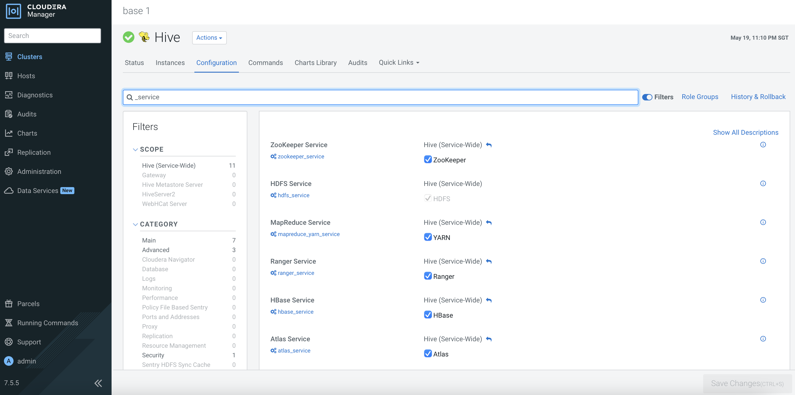
    
    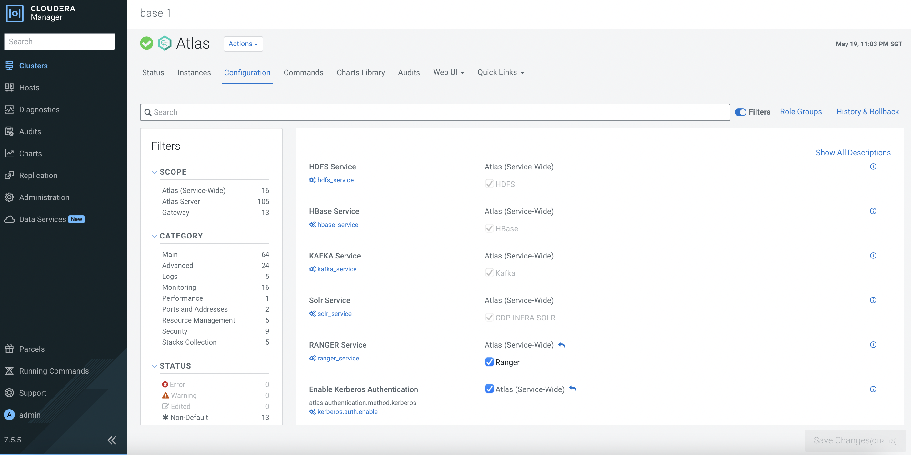
    
    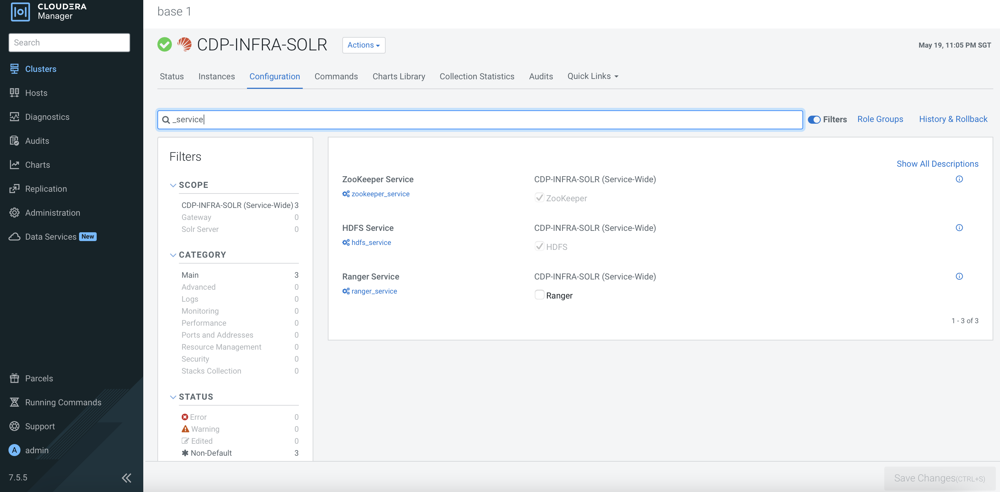
    
    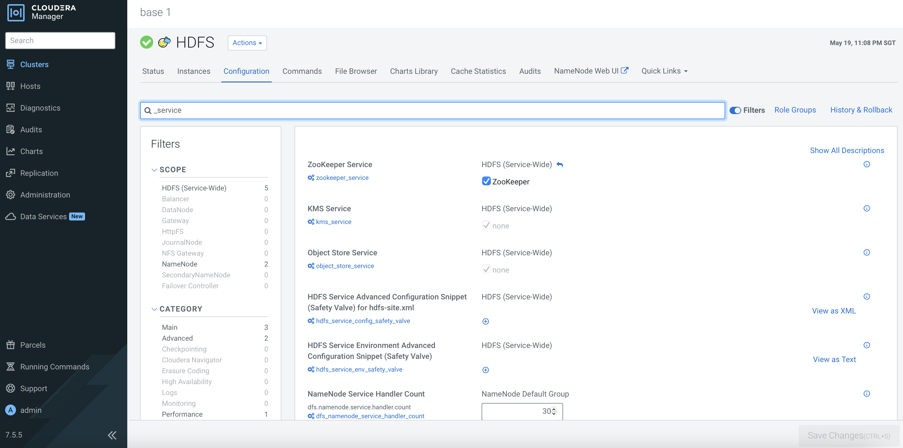
    
    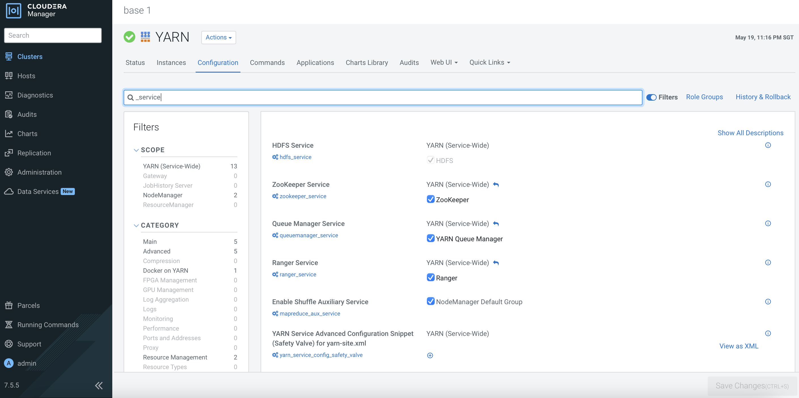
    
    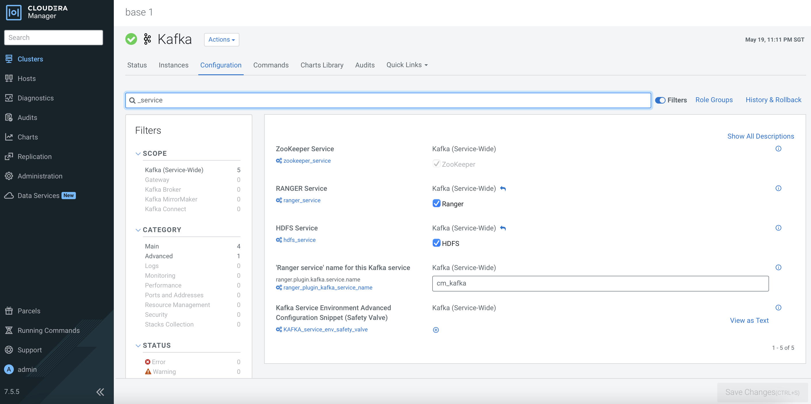

    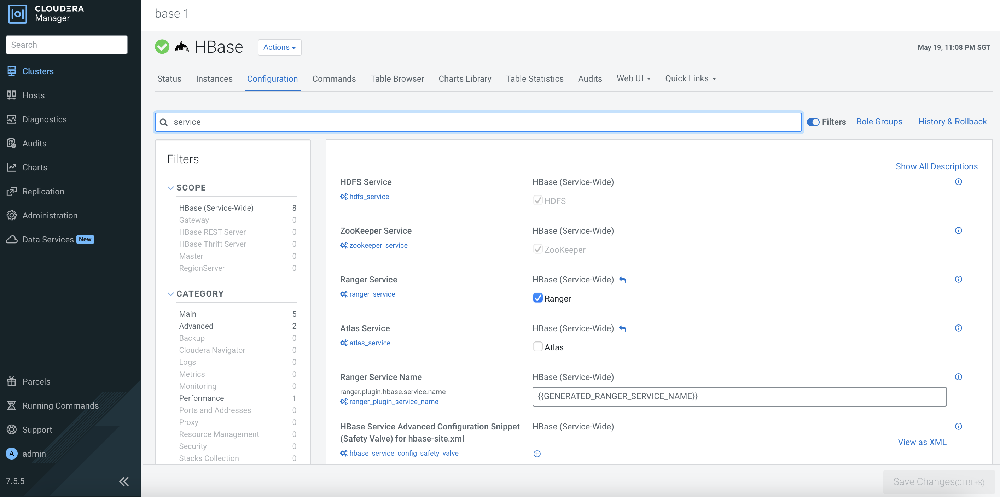

    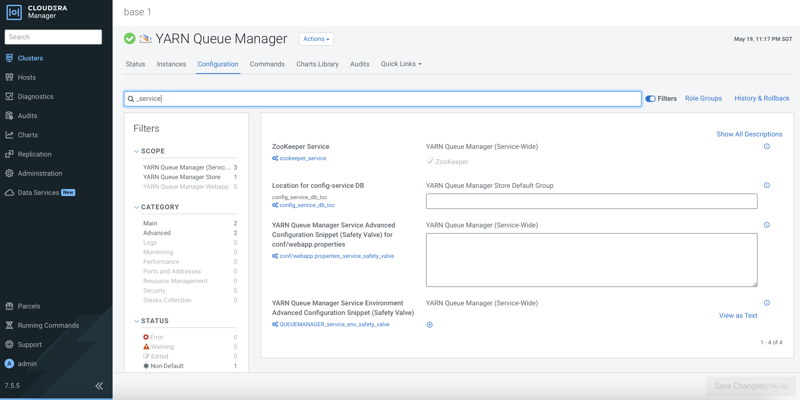
    
    
    

## Ranger Configuration

1. After the CDP Base has successfully been installed, the dependencies should be reflected in the each service's configurations     

## Ranger Configuration

1. The external LDAP server is the centralized user authentication database that stores the user credentials with the associated group. This demo is connected to Red Hat IPA. Navigate to `base 1` > `Ranger` > `Configurations`. Configure Ranger with the necessary external LDAP server settings as shown in the following example. Click `Save Changes`.

| Parameter       | Value         |
|:----------------|:------------------|
| Source for Syncing User and Groups | org.apache.ranger.unixusersync.process.UnixUserGroupBuilder  | 
| Ranger Usersync Unix Backend  | nss  | 
| Usersync LDAP/AD URL | ldap://idm.cdpkvm.cldr  | 
| Usersync Bind User | uid=admin,cn=users,cn=accounts,dc=cdpkvm,dc=cldr  | 
| Usersync Bind User Password | `password`  | 
| Usersync User Search Base | cn=users,cn=accounts,dc=cdpkvm,dc=cldr  | 
| Usersync User Search Scope |  sub | 
| Usersync User Object Class  | person  | 
| Usersync User Search Filter | uid=*  | 
| Usersync User Name Attribute |  uid | 
| Usersync Referral | follow | 
| Usersync Username Case Conversion | none | 
| Usersync Groupname Case Conversion | none | 
| Usersync Enable User Search | Ranger Usersync Default Group | 
| Usersync Group Search Base | cn=groups,cn=accounts,dc=cdpkvm,dc=cldr | 
| Usersync Group Search Scope | sub | 
| Usersync Group Object Class | ipausergroup | 
| Usersync Group Name Attribute | cn | 
| Usersync Group Member Attribute | member | 

2. Click the orange button. Click `Restart Stale Services`.

    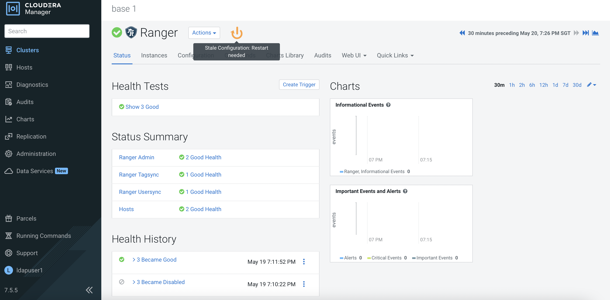
    
    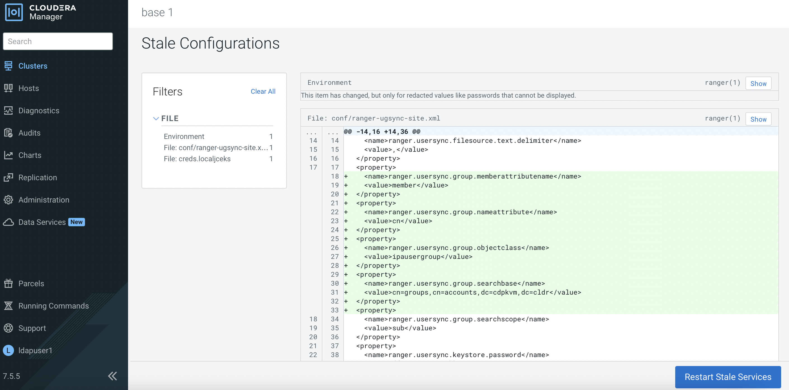
    
3. Select `Re-deploy client configuration` and click `Restart Now`.

    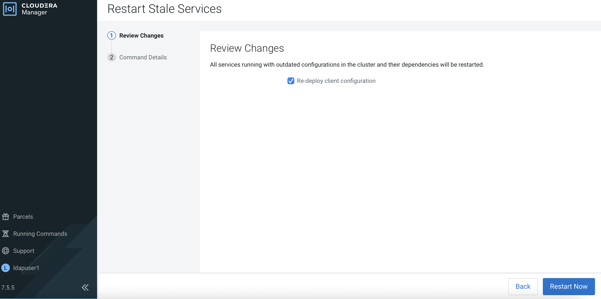
    
4. Ensure the result is successful.

    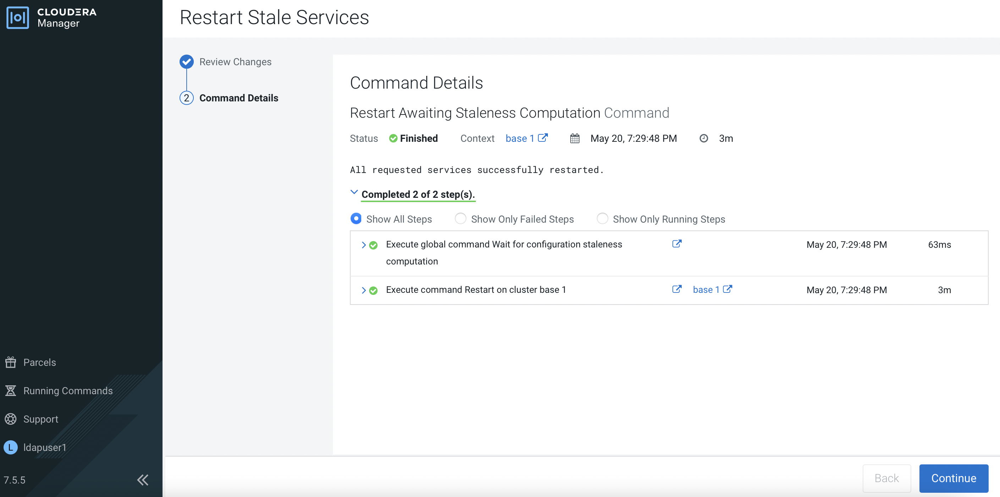    
    
    
---    
   Next Step
   {: .label .label-blue }
   Proceed to install the ECS cluster in the next [subtopic]({{ site.baseurl }}).