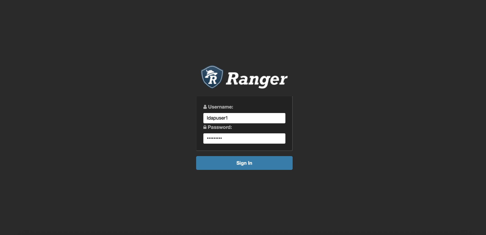
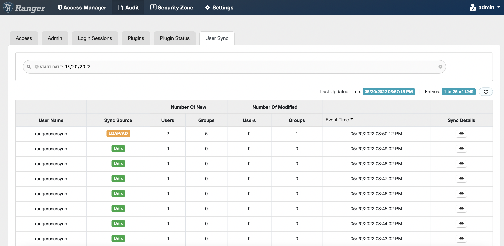
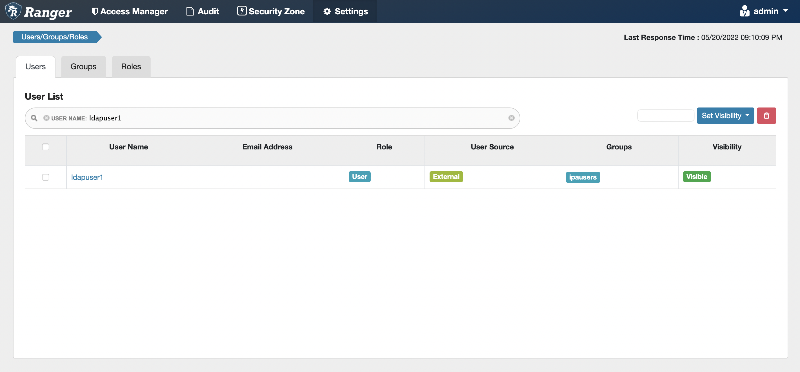
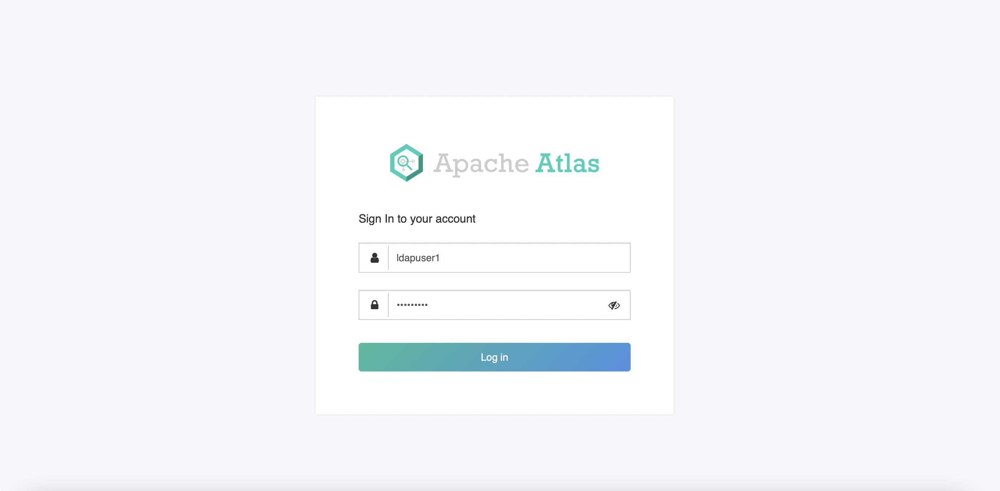
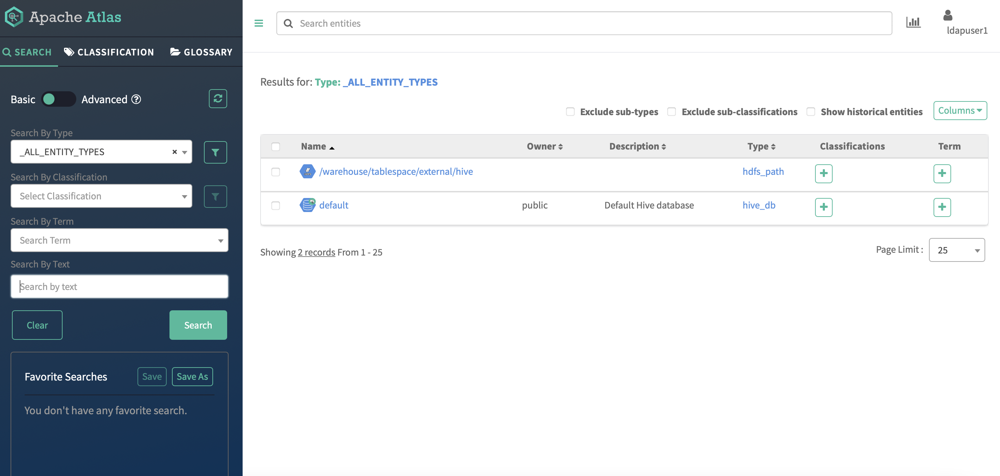

# CDP PvC Base Post-Deployment Configuration
{: .no_toc }

Check and make necessary configurations to ensure that the CDP PvC Base cluster has been set up correctly prior to installing the CDP PvC Data Services on the Kubernetes platform. 

- TOC
{:toc}

---

## Dependencies Check

1. After the CDP PvC Base cluster has successfully been installed, the dependencies should be reflected in the each service's configurations as shown below. Otherwise, please amend the configurations accordingly.

    
    
    
    
    
    
    
    
    
    
    

    

    
    
    
     

## Ranger Configuration

1. The external LDAP server is the centralized user authentication database that stores the user credentials with the associated group. This demo is connected to the Red Hat IPA. Navigate to `base 1` > `Ranger` > `Configurations`. Configure Ranger with the necessary external LDAP server settings as shown in the following example. Click `Save Changes`.

    | Parameter       | Value         |
    |:----------------|:------------------|
    | Source for Syncing User and Groups | org.apache.ranger.unixusersync.process.UnixUserGroupBuilder  | 
    | Ranger Usersync Unix Backend  | nss  | 
    | Usersync LDAP/AD URL | ldap://idm.cdpkvm.cldr  | 
    | Usersync Bind User | uid=admin,cn=users,cn=accounts,dc=cdpkvm,dc=cldr  | 
    | Usersync Bind User Password | `password`  | 
    | Usersync User Search Base | cn=users,cn=accounts,dc=cdpkvm,dc=cldr  | 
    | Usersync User Search Scope |  sub | 
    | Usersync User Object Class  | person  | 
    | Usersync User Search Filter | uid=*  | 
    | Usersync User Name Attribute |  uid | 
    | Usersync Referral | follow | 
    | Usersync Username Case Conversion | none | 
    | Usersync Groupname Case Conversion | none | 
    | Usersync Enable User Search | Ranger Usersync Default Group | 
    | Usersync Group Search Base | cn=groups,cn=accounts,dc=cdpkvm,dc=cldr | 
    | Usersync Group Search Scope | sub | 
    | Usersync Group Object Class | ipausergroup | 
    | Usersync Group Name Attribute | cn | 
    | Usersync Group Member Attribute | member | 

2. Click the orange button. Click `Restart Stale Services` to take the changes into effect.

    
    
    
    
3. Select `Re-deploy client configuration` and click `Restart Now`.

    
    
4. The outcome should be successful as shown below.

        
        
## LDAP User in Ranger

1. After successful Ranger usersync's integration with the external LDAP server, log in Ranger dashboard as admin user and check that the LDAP user(s) in LDAP server has successfully been synced and updated in Ranger. 

    
    
    
    
    
      
    
## Atlas Check

1. After successful Ranger usersync's integration with the external LDAP server, log in Atlas dashboard using the LDAP user credentials.

    
    
           

## External Database SSL Certificate Import

The following steps are the mandatory to run prior to creating the ECS platform. This allows CDW to establish SSL connection with the external database using the database's certificate inside the CM's truststore.

1. Retrieve the keystore password from one of the CDP Base master hosts.

    ```bash
    # cat /etc/hadoop/conf/ssl-client.xml | grep ssl.client.truststore.password -A1
    <name>ssl.client.truststore.password</name>
    <value>nws59gzoRHLsQBqJ2nuB2cE8EoZ3vq2DFchyxGJrQdL</value>
    ```
2. Copy the SSL `server.crt` from the external database to CM host. 

3. In CM host, import the SSL enabled external database certificate into the CM's truststore.

    ```bash
    # keytool -import -alias postgres -file /root/server.crt -storetype JKS -keystore /var/lib/cloudera-scm-agent/agent-cert/cm-auto-global_truststore.jks
    Enter keystore password: 
    ```
---  

