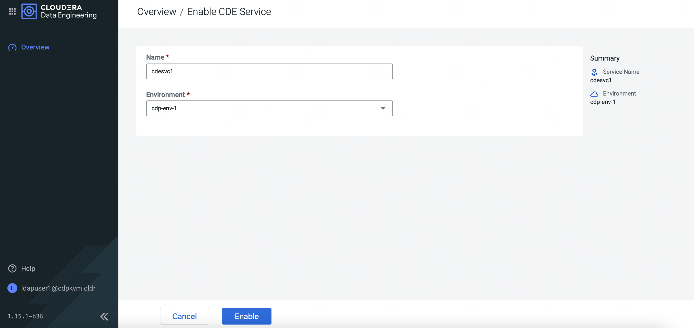
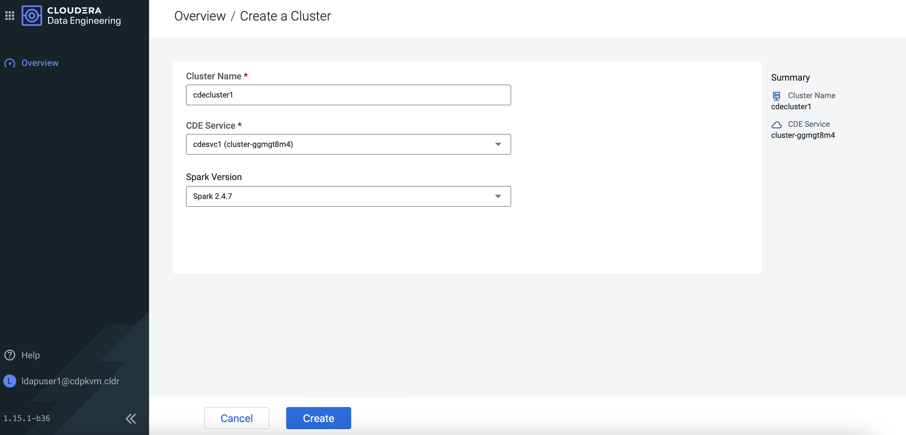

# Cloudera Data Engineering (CDE)
{: .no_toc }

This article explains the steps to deploy the CDE service on the ECS platform after successful configuration of the [Data Services Management Console]({{ site.baseurl }}).

- TOC
{:toc}

---


## CDE Deployment

1. In CM, navigate to `Data Services`. Click `Open CDP Private Cloud Data Services`. 

    
    
2. The browser will redirect to the following page. Click `Data Engineering`.   

    
    
3. At the CDE main portal, you may enable the CDE service. Click `Enable CDE Service`.      

    

4. Fill in the fields below and click `Enable`.

    
    
5. Next, you may create a new virtual cluster. Click `Create DE Cluster`.        
    
    
    
6. Fill in the fields below and click `Create`.    
    
    
    
7. The virtual CDE cluster is ready to run the Spark/Airflow job. Proceed to create the job accordingly. 
    
    
  

## CDE Artifacts inside ECS Platform

   ```bash
   # kubectl -n dex-base-nl7jsswf get pods
   NAME                                            READY   STATUS    RESTARTS   AGE
   cdp-cde-embedded-db-0                           1/1     Running   0          2m8s
   dex-base-configs-manager-7d575fd6b4-h8l7f       2/2     Running   0          2m8s
   dex-base-dex-downloads-7b7944f8c8-chvs6         1/1     Running   0          2m8s
   dex-base-grafana-65b4f7b755-hz97c               1/1     Running   0          2m8s
   dex-base-knox-7bc8b5d574-98846                  1/1     Running   0          2m8s
   dex-base-management-api-b9476df47-j5bt8         1/1     Running   4          2m8s
   dex-base-nl7jsswf-controller-77c484b6dd-5ztvt   1/1     Running   0          2m8s
   fluentd-forwarder-6cdfd9954f-gpgh8              1/1     Running   0          2m8s
   ```
   ```bash
   # kubectl -n dex-base-nl7jsswf get pvc
   NAME               STATUS   VOLUME                                     CAPACITY   ACCESS MODES   STORAGECLASS   AGE
   dex-base-db-pvc    Bound    pvc-c4f1a2ba-1ec6-4a76-85b6-fe0272363e85   100Gi      RWO            longhorn       2m14s
   dex-base-grafana   Bound    pvc-16da7be5-d313-4519-866d-ad0df66b7b6f   10Gi       RWO            longhorn       2m14s
   ```
   ```bash
   # kubectl get ns
   NAME                                     STATUS   AGE
   cdp                                      Active   8h
   cdp-env-1-d668dab9-monitoring-platform   Active   43m
   default                                  Active   8h
   default-43e25dc6-monitoring-platform     Active   8h
   dex-app-zbgpdh88                         Active   32s
   dex-base-nl7jsswf                        Active   5m43s
   ecs-webhooks                             Active   8h
   infra-prometheus                         Active   8h
   kube-node-lease                          Active   8h
   kube-public                              Active   8h
   kube-system                              Active   8h
   kubernetes-dashboard                     Active   8h
   local-path-storage                       Active   8h
   longhorn-system                          Active   8h
   shared-services                          Active   4h31m
   vault-system                             Active   8h
   workspace1                               Active   20m
   yunikorn                                 Active   8h
   ```
   
   ```bash   
   # kubectl get sc
   NAME                 PROVISIONER             RECLAIMPOLICY   VOLUMEBINDINGMODE      ALLOWVOLUMEEXPANSION   AGE
   local-path           rancher.io/local-path   Delete          WaitForFirstConsumer   false                  8h
   longhorn (default)   driver.longhorn.io      Delete          Immediate              true                   8h
   longhorn-nfs         nfs.longhorn.io         Delete          Immediate              false                  8h
   ```
   
   ```bash   
   # kubectl -n dex-app-zbgpdh88 get pvc
   NAME                             STATUS   VOLUME                                     CAPACITY   ACCESS MODES     STORAGECLASS   AGE
   airflow-dags                     Bound    pvc-198d7daa-6b56-4a85-88ec-af188e8ba78e   100Gi      RWX            longhorn-nfs   93s
   airflow-logs                     Bound    pvc-4f535bcb-31bf-4f73-9280-c68951727fa4   100Gi      RWX            longhorn-nfs   93s
   dex-app-zbgpdh88-livystate-pvc   Bound    pvc-197f8d0b-3619-48b7-ba6f-c835a49de798   100Gi      RWX            longhorn-nfs   93s
   dex-app-zbgpdh88-safari-pvc      Bound    pvc-8b95ad8e-378e-449f-88bb-fed3961fd67e   100Gi      RWX            longhorn-nfs   93s
   dex-app-zbgpdh88-storage-pvc     Bound    pvc-80a46184-8055-40f9-ab5e-cb0e693a7f60   100Gi      RWX            longhorn-nfs   93s
   ```

   ```bash
   # kubectl -n dex-app-zbgpdh88 get pods
   NAME                                                  READY   STATUS    RESTARTS   AGE
   dex-app-zbgpdh88-airflow-scheduler-595d8546b5-47lxs   1/1     Running   0          117s
   dex-app-zbgpdh88-airflow-web-74bc9ddc8f-pxcvw         0/1     Running   0          117s
   dex-app-zbgpdh88-airflowapi-f4f6cc788-pmjdr           1/2     Running   0          117s
   dex-app-zbgpdh88-api-5cfcbf686b-7nnhj                 1/1     Running   0          117s
   dex-app-zbgpdh88-livy-6d5f47d458-ztv5v                1/1     Running   0          117s
   dex-app-zbgpdh88-safari-7f8674f4-p7r2r                1/1     Running   0          117s
   ```
