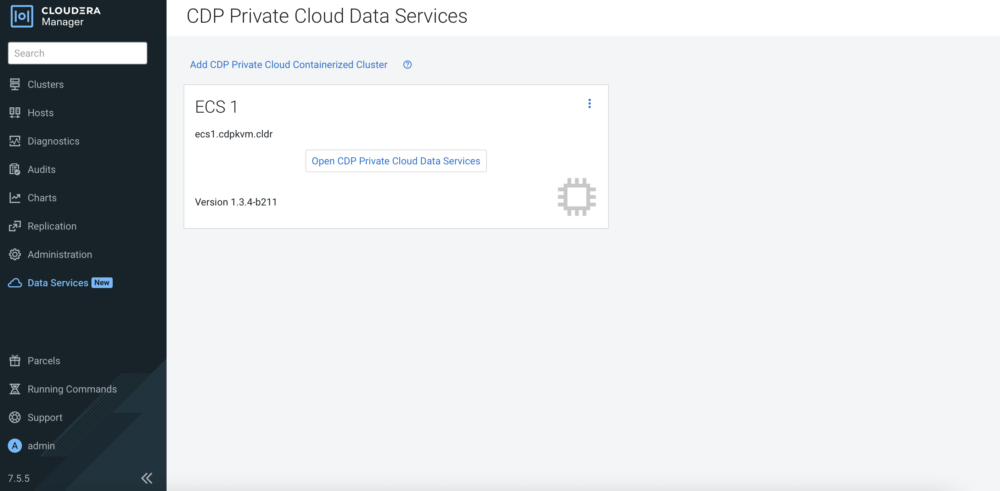
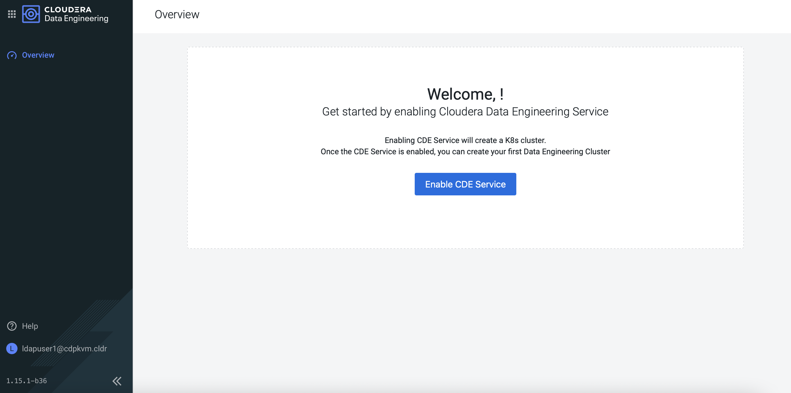

# Cloudera Data Engineering (CDE)
{: .no_toc }

This article explains the steps to deploy the CDE service on the Kubernetes platform after successful configuration of the [Data Services Management Console]({{ site.baseurl }}).

- TOC
{:toc}

---


## CDE Deployment

1. In CM, navigate to `Data Services`. Click `Open CDP Private Cloud Data Services`. 

    
    
2. The browser will redirect to the following page. Click `Data Engineering`.   

    
    
3. At the CDE main portal, you may enable the CDE service. Click `Enable CDE Service`.      

    

4. Fill in the fields below and click `Enable`.

    
    
5. Next, you may create a new virtual cluster. Click `Create DE Cluster`.        
    
    
    
6. Fill in the fields below and click `Create`.    
    
    
    
7. The virtual CDE cluster is ready to run the Spark/Airflow job. Proceed to create the job accordingly. 
    
    
  

## CDE Artifacts inside ECS Platform

   ```bash
# kubectl get ns | head -1 ; kubectl get ns | grep dex
NAME                                     STATUS   AGE
dex-app-nqjfkfb2                         Active   25m
dex-base-ggmgt8m4                        Active   30m
   ```

   ```bash
# kubectl -n dex-app-nqjfkfb2 get pods
NAME                                                 READY   STATUS    RESTARTS   AGE
dex-app-nqjfkfb2-airflow-scheduler-79bb7fcc9-2nt5k   1/1     Running   0          31m
dex-app-nqjfkfb2-airflow-web-68bbb47bc8-mqk66        1/1     Running   0          31m
dex-app-nqjfkfb2-airflowapi-6758987794-tplfn         2/2     Running   2          31m
dex-app-nqjfkfb2-api-6cb85f94b9-qmj5b                1/1     Running   0          31m
dex-app-nqjfkfb2-livy-564c8b45c8-4r4ng               1/1     Running   0          31m
dex-app-nqjfkfb2-safari-77fb94577-whrjd              1/1     Running   0          31m
   ```
   
   ```bash
# kubectl -n dex-app-nqjfkfb2 get pvc
NAME                             STATUS   VOLUME                                     CAPACITY   ACCESS MODES   STORAGECLASS   AGE
airflow-dags                     Bound    pvc-1a57ffb4-92dc-4c03-a958-38702549ceb1   100Gi      RWX            longhorn-nfs   28m
airflow-logs                     Bound    pvc-d424fdf6-2035-4418-8d95-03769926a069   100Gi      RWX            longhorn-nfs   28m
dex-app-nqjfkfb2-livystate-pvc   Bound    pvc-b9088e9a-1fb6-42a8-9e34-5135f0e1ce07   100Gi      RWX            longhorn-nfs   28m
dex-app-nqjfkfb2-safari-pvc      Bound    pvc-e565af81-424a-4e2c-8b32-ade212159492   100Gi      RWX            longhorn-nfs   28m
dex-app-nqjfkfb2-storage-pvc     Bound    pvc-af9ad8cb-b069-45cd-8338-97351ba0bacd   100Gi      RWX            longhorn-nfs   28m
   ```
   
   ```bash
# kubectl -n dex-base-ggmgt8m4  get pods
NAME                                            READY   STATUS    RESTARTS   AGE
cdp-cde-embedded-db-0                           1/1     Running   0          34m
dex-base-configs-manager-686d55b995-992nl       2/2     Running   0          34m
dex-base-dex-downloads-5fb84f65c6-sxqj6         1/1     Running   0          34m
dex-base-ggmgt8m4-controller-6d6c7d598b-79rh9   1/1     Running   0          34m
dex-base-grafana-67d95886cf-kcjpl               1/1     Running   0          34m
dex-base-knox-5d4b8fd79d-f7nxz                  1/1     Running   0          34m
dex-base-management-api-5f76b698f-hqmss         1/1     Running   4          34m
fluentd-forwarder-6747b5b567-bmv5x              1/1     Running   0          34m
   ```
   
   ```bash   
# kubectl -n dex-base-ggmgt8m4  get pvc
NAME               STATUS   VOLUME                                     CAPACITY   ACCESS MODES   STORAGECLASS   AGE
dex-base-db-pvc    Bound    pvc-a12be944-e529-4f23-afad-d0ec58fb9677   100Gi      RWO            longhorn       34m
dex-base-grafana   Bound    pvc-64a82154-e511-4262-960b-92b4be27d631   10Gi       RWO            longhorn       34m
   ```
   
   ```bash   
# kubectl get sc
NAME                 PROVISIONER             RECLAIMPOLICY   VOLUMEBINDINGMODE      ALLOWVOLUMEEXPANSION   AGE
local-path           rancher.io/local-path   Delete          WaitForFirstConsumer   false                  3d12h
longhorn (default)   driver.longhorn.io      Delete          Immediate              true                   3d12h
longhorn-nfs         nfs.longhorn.io         Delete          Immediate              false                  3d12h
   ```


