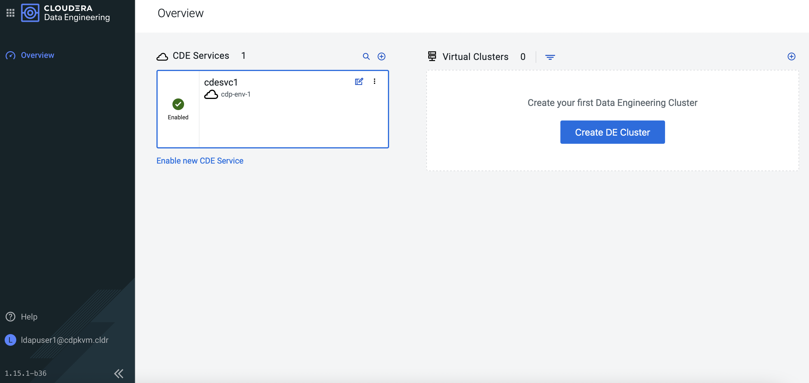
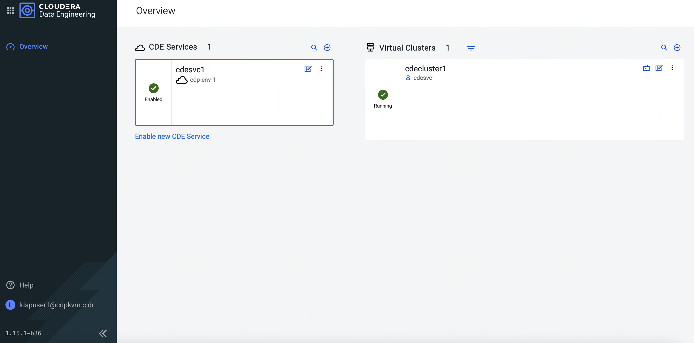

# Cloudera Data Engineering (CDE) on ECS
{: .no_toc }

This article explains the steps to deploy the CDE service on the ECS platform after successful configuration of the [CDP PvC Data Services Management Console]({{ site.baseurl }}).

- TOC
{:toc}

---


## CDE Deployment

1. In CM, navigate to `Data Services`. Click `Open CDP Private Cloud Data Services`. 

    
    
2. The browser will redirect to the following page. Click `Data Engineering`.   

    
    
3. At the CDE main portal, you may enable the CDE service. Click `Enable CDE Service`.      

    

4. Fill in the fields below and click `Enable`.

    
    
5. Next, you may create a new virtual cluster. Click `Create DE Cluster`.        
    
    
    
6. Fill in the fields below and click `Create`.    
    
    
    
7. The virtual CDE cluster is ready to run the Spark/Airflow job. Proceed to create the job accordingly. 
    
    
  

8. 

## CDE Artifacts inside Openshift Platform

   ```bash
# # oc get ns | head -1 ;oc get ns | grep dex
NAME                                               STATUS   AGE
dex-app-8pzf9tsf                                   Active   16m
dex-base-vc4tzlpg                                  Active   19m
   ```

   ```bash
# oc -n dex-base-vc4tzlpg get pods
NAME                                            READY   STATUS    RESTARTS   AGE
cdp-cde-embedded-db-0                           1/1     Running   0          20m
dex-base-configs-manager-658c4454d6-hxkml       2/2     Running   0          20m
dex-base-dex-downloads-57cb854c5-59nc6          1/1     Running   0          20m
dex-base-grafana-7587c89fcd-945ln               1/1     Running   0          20m
dex-base-knox-7b5fb7c8d8-mfgkv                  1/1     Running   0          20m
dex-base-management-api-577887f9d4-n7cq5        1/1     Running   0          20m
dex-base-vc4tzlpg-controller-74747f7dfc-6sk87   1/1     Running   0          20m
fluentd-forwarder-8ddc9d9dc-hs7hc               1/1     Running   0          20m
   ```
   
   ```bash
# oc -n dex-base-vc4tzlpg get pvc
NAME               STATUS   VOLUME                                     CAPACITY   ACCESS MODES   STORAGECLASS                  AGE
dex-base-db-pvc    Bound    pvc-d83f86c8-20bb-4105-b911-0e2d317e24e9   100Gi      RWO            ocs-storagecluster-ceph-rbd   20m
dex-base-grafana   Bound    pvc-2bba6b28-d223-447c-a650-f730b86a27e0   10Gi       RWO            ocs-storagecluster-ceph-rbd   20m
   ```
   
   ```bash
# oc -n dex-base-vc4tzlpg get ingress
NAME                     CLASS                          HOSTS                                                                                             ADDRESS                 PORTS     AGE
dex-app-8pzf9tsf-api     <none>                         8pzf9tsf.cde-vc4tzlpg.apps.apps.ocp4.cdpkvm.cldr                                                  apps.ocp4.cdpkvm.cldr   80, 443   17m
dex-base-api             <none>                         service.cde-vc4tzlpg.apps.apps.ocp4.cdpkvm.cldr                                                   apps.ocp4.cdpkvm.cldr   80, 443   20m
dex-base-dex-downloads   cde-ingress-cluster-vc4tzlpg   service.cde-vc4tzlpg.apps.apps.ocp4.cdpkvm.cldr,service.cde-vc4tzlpg.apps.apps.ocp4.cdpkvm.cldr   apps.ocp4.cdpkvm.cldr   80        20m
dex-base-grafana         cde-ingress-cluster-vc4tzlpg   service.cde-vc4tzlpg.apps.apps.ocp4.cdpkvm.cldr                                                   apps.ocp4.cdpkvm.cldr   80        20m
dex-base-knox            cde-ingress-cluster-vc4tzlpg   service.cde-vc4tzlpg.apps.apps.ocp4.cdpkvm.cldr                                                   apps.ocp4.cdpkvm.cldr   80        20m
   ```
   
   
   ```bash
# oc -n dex-base-vc4tzlpg get route
NAME                           HOST/PORT                                          PATH               SERVICES                       PORT          TERMINATION     WILDCARD
dex-app-8pzf9tsf-api-k8flj     8pzf9tsf.cde-vc4tzlpg.apps.apps.ocp4.cdpkvm.cldr   /                  dex-base-vc4tzlpg-controller   http          edge/Redirect   None
dex-base-api-whwcb             service.cde-vc4tzlpg.apps.apps.ocp4.cdpkvm.cldr    /                  dex-base-vc4tzlpg-controller   http          edge/Redirect   None
dex-base-dex-downloads-7hqxk   service.cde-vc4tzlpg.apps.apps.ocp4.cdpkvm.cldr    /downloads/?(.*)   dex-base-dex-downloads         http-port                     None
dex-base-dex-downloads-7qwth   service.cde-vc4tzlpg.apps.apps.ocp4.cdpkvm.cldr    /(favicon\.ico)    dex-base-dex-downloads         http-port                     None
dex-base-grafana-77zkn         service.cde-vc4tzlpg.apps.apps.ocp4.cdpkvm.cldr    /grafana           dex-base-grafana               service                       None
dex-base-knox-tz2md            service.cde-vc4tzlpg.apps.apps.ocp4.cdpkvm.cldr    /gateway           dex-base-knox                  gatewayport                   None
   ```

   ```bash   
# oc -n dex-app-8pzf9tsf get route
NAME                                 HOST/PORT            PATH          SERVICES                       PORT        TERMINATION   WILDCARD
dex-app-8pzf9tsf-airflow-web-6f9xg   HostAlreadyClaimed   /airflow      dex-app-8pzf9tsf-airflow-web   http-web                  None
dex-app-8pzf9tsf-api-hgskh           HostAlreadyClaimed   /dex/?(.*)    dex-app-8pzf9tsf-api           api-port                  None
dex-app-8pzf9tsf-livy-6wvbf          HostAlreadyClaimed   /livy/?(.*)   dex-app-8pzf9tsf-livy          http-port                 None
   ```

   ```bash   
# oc -n dex-app-8pzf9tsf get pods
NAME                                                  READY   STATUS    RESTARTS   AGE
dex-app-8pzf9tsf-airflow-scheduler-8546d5cdc7-gjcw9   1/1     Running   0          61m
dex-app-8pzf9tsf-airflow-web-799455574-v48mz          1/1     Running   1          61m
dex-app-8pzf9tsf-airflowapi-65954ddd9-6j2wm           2/2     Running   2          61m
dex-app-8pzf9tsf-api-75bf5c675f-gklm8                 1/1     Running   0          61m
dex-app-8pzf9tsf-livy-7d464fb6d9-f988f                1/1     Running   0          61m
   ```
   
   ```bash   
# oc -n dex-app-8pzf9tsf get pvc
NAME                             STATUS   VOLUME                                     CAPACITY   ACCESS MODES   STORAGECLASS   AGE
airflow-dags                     Bound    pvc-b41d4416-9df4-4197-8e17-f9373f03a789   100Gi      RWX            nfs            61m
airflow-logs                     Bound    pvc-0b3c35d2-ea4e-4d89-8535-82ba1f8f0dfe   100Gi      RWX            nfs            61m
dex-app-8pzf9tsf-livystate-pvc   Bound    pvc-1a1fbaea-cbf7-4211-81e2-e783c1b19bc0   100Gi      RWX            nfs            61m
dex-app-8pzf9tsf-storage-pvc     Bound    pvc-6a74747e-8e88-41e2-a619-597c4f303eed   100Gi      RWX            nfs            61m
   ```
   
   ```bash   
# oc -n dex-app-8pzf9tsf get ingress
NAME                           CLASS                          HOSTS                                              ADDRESS          PORTS   AGE
dex-app-8pzf9tsf-airflow-web   cde-ingress-cluster-vc4tzlpg   8pzf9tsf.cde-vc4tzlpg.apps.apps.ocp4.cdpkvm.cldr   172.30.108.176   80      61m
dex-app-8pzf9tsf-api           cde-ingress-cluster-vc4tzlpg   8pzf9tsf.cde-vc4tzlpg.apps.apps.ocp4.cdpkvm.cldr   172.30.108.176   80      61m
dex-app-8pzf9tsf-livy          cde-ingress-cluster-vc4tzlpg   8pzf9tsf.cde-vc4tzlpg.apps.apps.ocp4.cdpkvm.cldr   172.30.108.176   80      61m
   ```

   ```bash   
# oc -n dex-app-8pzf9tsf get route
NAME                                 HOST/PORT            PATH          SERVICES                       PORT        TERMINATION   WILDCARD
dex-app-8pzf9tsf-airflow-web-6f9xg   HostAlreadyClaimed   /airflow      dex-app-8pzf9tsf-airflow-web   http-web                  None
dex-app-8pzf9tsf-api-hgskh           HostAlreadyClaimed   /dex/?(.*)    dex-app-8pzf9tsf-api           api-port                  None
dex-app-8pzf9tsf-livy-6wvbf          HostAlreadyClaimed   /livy/?(.*)   dex-app-8pzf9tsf-livy          http-port                 None
   ```
