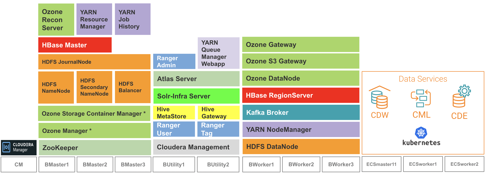

# CDP Private Cloud
{: .no_toc }

- CDP Private Cloud delivers powerful analytic, transactional, and machine learning workloads in an on-premise environment. 
- It consists of 2 main components - CDP Private Cloud Base (CDP PvC Base) and CDP Private Cloud Data Services (CDP PvC DS). 
- Cloudera Manager (CM) installs, manages, configures, and monitors the entire CDP Private Cloud solution.
- CDP PvC Base cluster stores data store options including HDFS and Ozone that serve as the data lake. It has high degree of consistent security and governance with SDX (Shared Data Experience) to enable safe and compliant data lakes with policy-based data access for users. 
- CDP PvC Base cluster also hosts other powerful big data services such as Hive, Kudu, Kafka, Solr, Hbase and many others. CDP PvC DS leverages Kubernetes for microservices cloud strategy by capitalizing on the benefits such as rapid deployment, portability and scalability. 
- As of time of writing, CDP PvC DS platform can host Cloudera Data Warehouse (CDW), Cloudera Machine Learning (CML) and Cloudera Data Engineering (CDE) data services in which they are provisioned on the Kubernetes platform. Similar to CDP PvC Base services, these data services utilize Apache data analytics projects such as Impala, Hive and Spark. Apache Yunikorn is the latest addition as an universal resource scheduler for running big data/Machine Learning workloads on the Kubernetes platform.

## Demo Architecture
- This article is articulated based on the demo architecture diagram as depicted below.

    

- The minimum CDP PvC Base services are installed on the CDP PvC Base hosts. These are the prerequisites to install the CDP PvC Data Services on the ECS platform.
- Only 1 ECS master/server node is being used here but the latest CDP software version supports 3 ECS master/server nodes.

