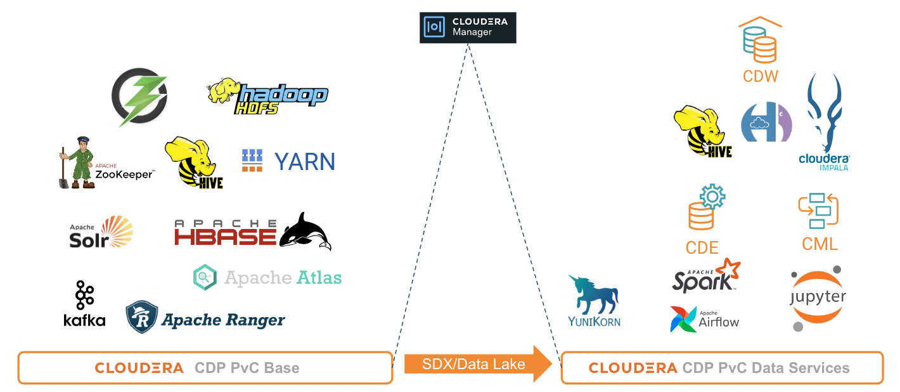

# CDP Private Cloud
{: .no_toc }

- CDP Private Cloud delivers powerful analytic, transactional, and machine learning workloads in an on-premises environment. 
- It consists of 2 major components - CDP Private Cloud Base (CDP PvC Base) and CDP Private Cloud Data Services (CDP PvC DS). 
- CDP PvC Base stores data store options including HDFS and Ozone that serve as the data lake. It has high degree of consistent security and governance with SDX to enable safe and compliant data lakes with policy-based data access for users. 
- CDP PvC Base also hosts many relevant open source projects such as Yarn, Hive, Kudu, Kafka, Solr, Hbase and many others. CDP PvC DS leverages Kubernetes for microservices cloud strategy by capitalizing on the benefits such as rapid deployment, portability and scalability. 
- As of now, CDP PvC DS comprises Cloudera Data Warehouse (CDW), Cloudera Machine Learning (CML) and Cloudera Data Engineering (CDE) data services that are hosted on Kubernetes platform. Similarl to CDP PvC Base services, these data services make use of Apache data analytics projects such as Impala and Spark. Apache Yunikorn is the latest addition as an universal resource scheduler for scheduling resources for running big data/Machine Learning workloads on Kubernetes.

This article and its sub-articles explain the requirements as well as the step-by-step procedure to deploy CDP Private Cloud solution.
