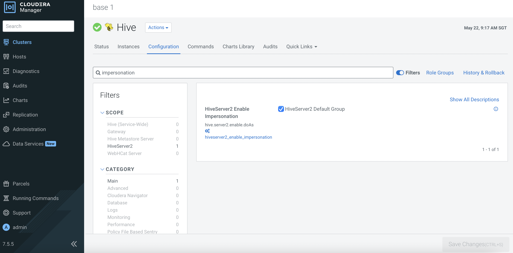
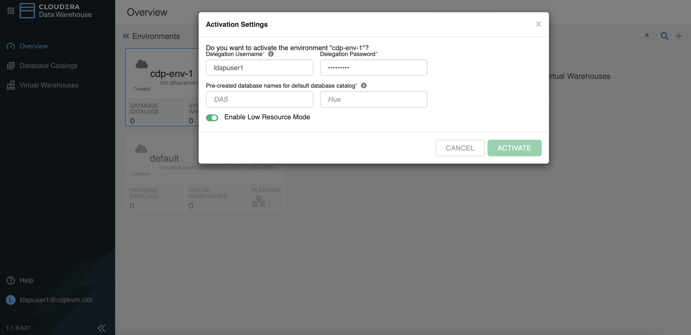

# Cloudera Data Warehouse (CDW)
{: .no_toc }

This article explains the steps to deploy the CDW service on ECS platform after the successful configuration of [Data Services Management Console]({{ site.baseurl }}) platform.

- TOC
{:toc}

---  


## Hive Impersonation (doas)

1. This is a mandatory step to allow other user to impersonate `hive` user to access Hive tables. This is the Hive default and Ranger is the only supported and recommended security model. Ensure that Hive Impersonation is enabled as shown below.

      


## CDW Deployment

1. In CM, navigate to `Data Services`. Click `Open CDP Private Cloud Data Services`. 

    
    
2. The system will redirect the browser to the following page. Click `Data Warehouse`.   

    

3. Click the thunder icon of the newly created data lake environment. Fill in the parameters using LDAP user credentials. Note that the databases must be pre-created as highlighted in the [Prerequisites]({{ site.baseurl }}) topic. 

    

4. Create a new database catalog. 

    
    
5. Create a new virtual warehouse as shown in the following example.

        
    
       
    
6. Click `HUE` on the newly created virtual warehouse to access the Hue dashboard.

7. In Hue dashboard, run the SELECT request on the default database will trigger "AuthorizationException" error. This is because the authorization for this user has not been configured in Ranger.

       

8. In Ranger dashboard, click the newly created warehouse under the `Hadoop SQL` category.

       
    
9. Click `all - database, table`. Add the LDAP user in the list and click `save`.

       
    
10. The output should be similar as follows.   
    
          
    
11. In Hue dashboard, rerun the same SELECT request on the default database will no longer trigger "AuthorizationException" error.

          
    

## CDW Artifacts inside ECS Platform

   ```bash
# kubectl get ns
NAME                                     STATUS   AGE
cdp                                      Active   9h
cdp-env-1-85b71ddc-monitoring-platform   Active   117m
default                                  Active   9h
default-470e0dec-monitoring-platform     Active   9h
ecs-webhooks                             Active   9h
impala-1653181201-5gqh                   Active   46m
infra-prometheus                         Active   9h
kube-node-lease                          Active   9h
kube-public                              Active   9h
kube-system                              Active   9h
kubernetes-dashboard                     Active   9h
local-path-storage                       Active   9h
longhorn-system                          Active   9h
shared-services                          Active   116m
vault-system                             Active   9h
warehouse-1653181106-8vj6                Active   47m
warehouse-1653181127-2v5k                Active   47m
yunikorn                                 Active   9h
   ```
   
   ```bash   
# kubectl -n warehouse-1653181106-8vj6  get pods
NAME                    READY   STATUS    RESTARTS   AGE
das-event-processor-0   1/1     Running   0          49m
metastore-0             1/1     Running   0          49m
metastore-1             1/1     Running   0          48m
   ```
   
   ```bash   
# kubectl -n warehouse-1653181127-2v5k get pods
NAME                                     READY   STATUS      RESTARTS   AGE
das-event-processor-0                    1/1     Running     0          46m
metastore-0                              1/1     Running     0          46m
metastore-1                              1/1     Running     0          45m
metastore-ranger-repo-create-job-fsjbk   0/1     Completed   0          46m
   ```
   
   ```bash
# kubectl -n impala-1653181201-5gqh get pods
NAME                                 READY   STATUS    RESTARTS   AGE
catalogd-5cf658bb69-ksl7s            1/1     Running   0          44m
coordinator-0                        4/4     Running   0          44m
huebackend-0                         2/2     Running   0          44m
huefrontend-5949769cf-562r4          1/1     Running   0          44m
impala-autoscaler-578776d9c7-7fz5d   1/1     Running   0          44m
impala-executor-000-0                1/1     Running   0          9m55s
statestored-6499c77cfc-x2h58         1/1     Running   0          44m
usage-monitor-85d5f97cf5-lj54b       1/1     Running   0          44m
   ```
   
   ```bash
# kubectl -n impala-1653181201-5gqh get pvc
NAME                                         STATUS   VOLUME                                     CAPACITY   ACCESS MODES   STORAGECLASS   AGE
scratch-cache-volume-coordinator-0           Bound    pvc-f13cc78e-4422-4688-914e-4ae273f631b0   100Gi      RWO            local-path     44m
scratch-cache-volume-impala-executor-000-0   Bound    pvc-71bc8ec2-93d9-4006-afe5-3bb0bfbb0df1   100Gi      RWO            local-path     44m
   ```

   ```bash
# kubectl get pv | grep impala
pvc-71bc8ec2-93d9-4006-afe5-3bb0bfbb0df1   100Gi      RWO            Delete           Bound    impala-1653181201-5gqh/scratch-cache-volume-impala-executor-000-0                                                       local-path              46m
pvc-f13cc78e-4422-4688-914e-4ae273f631b0   100Gi      RWO            Delete           Bound    impala-1653181201-5gqh/scratch-cache-volume-coordinator-0                                                               local-path              46m
   ```

   ```bash
# kubectl describe pv pvc-f13cc78e-4422-4688-914e-4ae273f631b0
Name:              pvc-f13cc78e-4422-4688-914e-4ae273f631b0
Labels:            <none>
Annotations:       pv.kubernetes.io/provisioned-by: rancher.io/local-path
Finalizers:        [kubernetes.io/pv-protection]
StorageClass:      local-path
Status:            Bound
Claim:             impala-1653181201-5gqh/scratch-cache-volume-coordinator-0
Reclaim Policy:    Delete
Access Modes:      RWO
VolumeMode:        Filesystem
Capacity:          100Gi
Node Affinity:     
  Required Terms:  
    Term 0:        kubernetes.io/hostname in [ecsworker2.cdpkvm.cldr]
Message:           
Source:
    Type:          HostPath (bare host directory volume)
    Path:          /localpath/local-storage/pvc-f13cc78e-4422-4688-914e-4ae273f631b0_impala-1653181201-5gqh_scratch-cache-volume-coordinator-0
    HostPathType:  DirectoryOrCreate
Events:            <none>
   ```

   ```bash
# kubectl -n impala-1653181201-5gqh describe pod coordinator-0  | grep -i Node:
Node:         ecsworker2.cdpkvm.cldr/10.15.4.171
   ```

- In ecsworker2 node, check the contents in the localpath directory.

   ```bash
# tree /localpath
/localpath
`-- local-storage
    `-- pvc-f13cc78e-4422-4688-914e-4ae273f631b0_impala-1653181201-5gqh_scratch-cache-volume-coordinator-0
        |-- impala-cache-file-07482f078a6de140:f90999799fab14bf
        `-- impala-scratch

3 directories, 1 file
   ```
