# Cloudera Data Warehouse (CDW) on Openshift
{: .no_toc }

This article explains the steps to deploy the CDW service on Openshift platform after successful configuration of the [CDP PvC Data Services Management Console]({{ site.baseurl }}).
Please note that the sizing of the direct attached disk for CDW illustrated in this demo does not match the production requirements.

- TOC
{:toc}

---  


## Hive Impersonation (doas)

1. This is a mandatory step to allow other user to impersonate `hive` user to access Hive tables. This is the Hive default setting and Ranger is the only supported and recommended security model. Ensure that Hive Impersonation is enabled as shown below.

    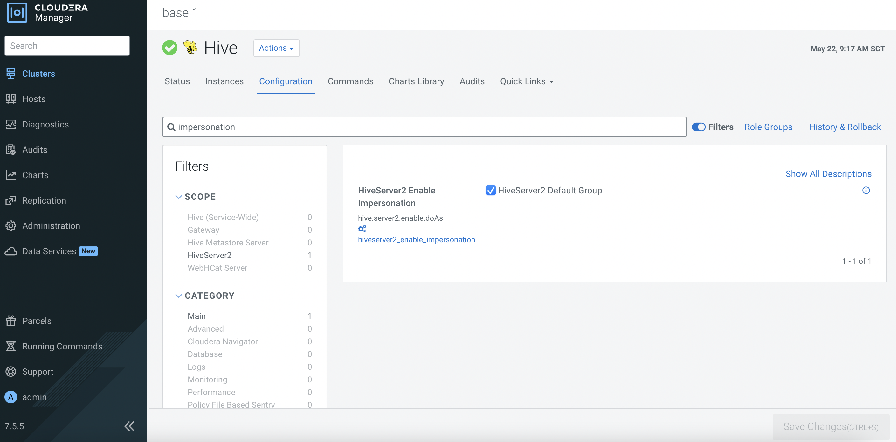  


## CDW Deployment

1. In CM, navigate to `Data Services`. Click `Open CDP Private Cloud Data Services` of `cdp`. 

    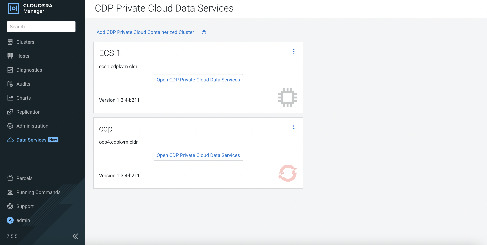 
    
2. The system will redirect the browser to the following page. Log in using LDAP user credential and click `Data Warehouse`.   

    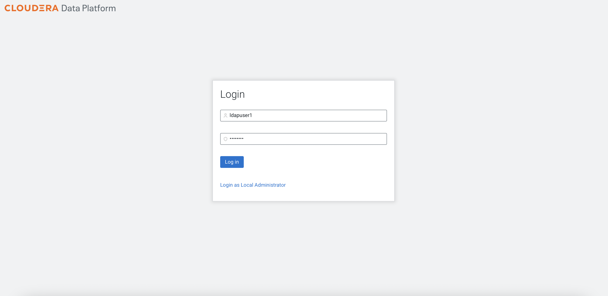
    
    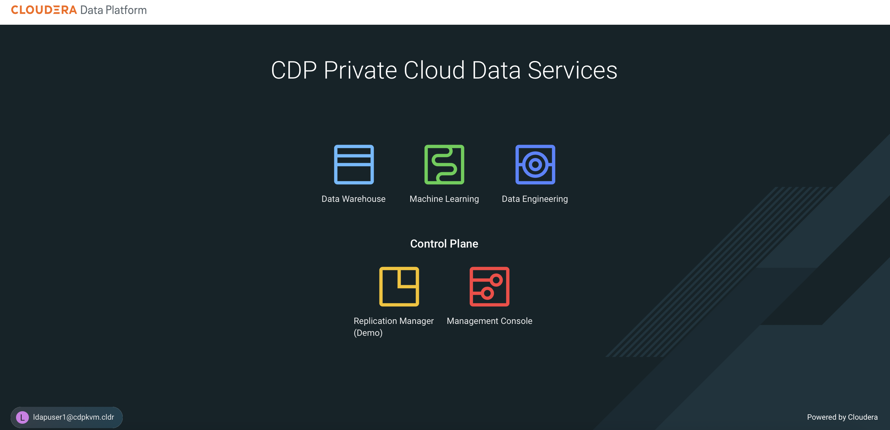

3. Click the thunder icon of the newly created data lake environment. Fill in the parameters using LDAP user credentials. Note that the databases must be pre-created as highlighted in the [prerequisites]({{ site.baseurl }}) topic. 

    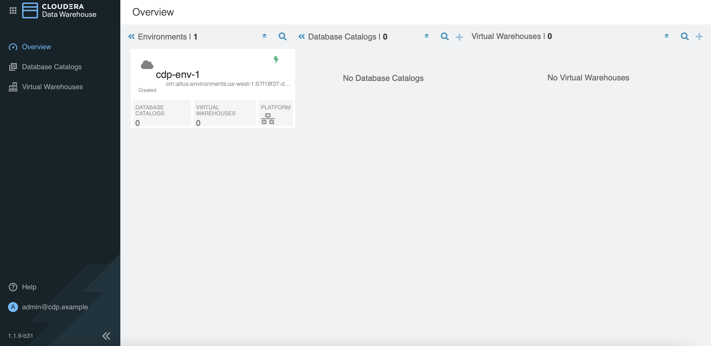

    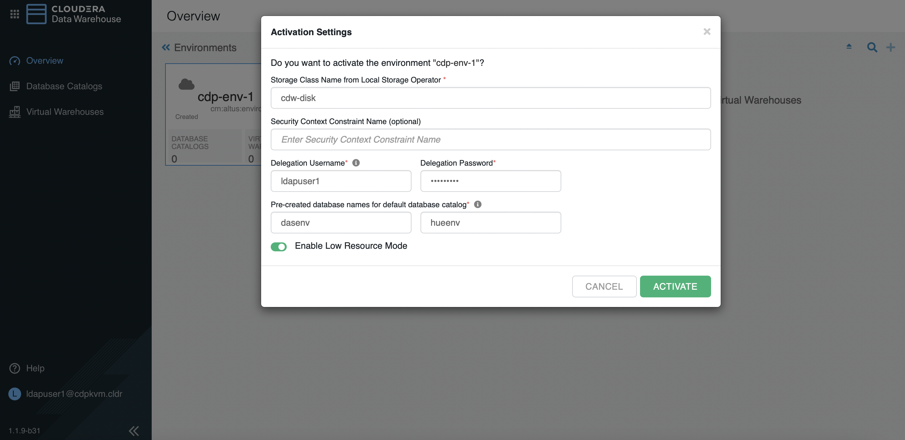
    
4. Create a new `Hive` virtual warehouse with 1 executor as shown below.

    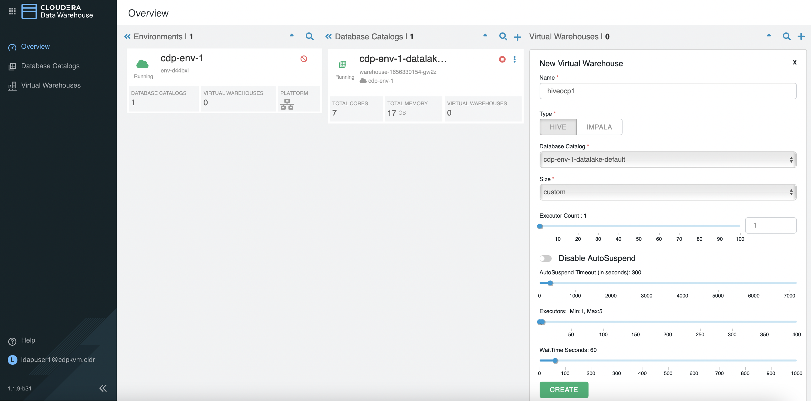 

    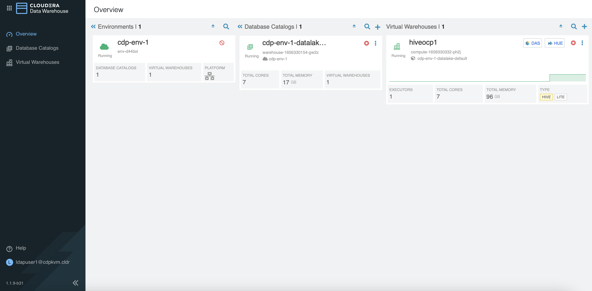 

    Take note of the following artifacts.
    
    ```bash   
    [root@ocpbastion ~]# oc -n compute-1656330332-ph2j get pods
    NAME                             READY   STATUS    RESTARTS   AGE
    das-webapp-0                     1/1     Running   0          2m43s
    hiveserver2-0                    1/1     Running   0          2m43s
    huebackend-0                     1/1     Running   0          2m43s
    huefrontend-6bcbb8fdfb-8kb7s     1/1     Running   0          2m43s
    query-coordinator-0-0            1/1     Running   0          2m32s
    query-executor-0-0               1/1     Running   0          2m32s
    standalone-compute-operator-0    1/1     Running   0          2m43s
    usage-monitor-564fdcdbcc-mbgmc   1/1     Running   0          2m43s

    [root@ocpbastion ~]# oc -n compute-1656330332-ph2j get pvc
    NAME                                                  STATUS   VOLUME              CAPACITY   ACCESS MODES   STORAGECLASS   AGE
    query-executor-1656330358-volume-query-executor-0-0   Bound    local-pv-abb1e063   400Gi      RWO            cdw-disk       2m34s

    [root@ocpbastion ~]# oc -n compute-1656330332-ph2j describe pod query-executor-0-0 | grep Node:
    Node:         master03.ocp4.cdpkvm.cldr/10.15.4.184

    [root@ocpbastion ~]# oc describe pv local-pv-abb1e063 | grep hostname
        Term 0:        kubernetes.io/hostname in [master03.ocp4.cdpkvm.cldr]

    [root@ocpbastion ~]# oc describe pv local-pv-abb1e063 | grep hostname
        Term 0:        kubernetes.io/hostname in [master03.ocp4.cdpkvm.cldr]
    ```
    
5. Remove the above `Hive` virtual warehouse. Create a new `Impala` virtual warehouse with 1 executor as shown in the following example.

    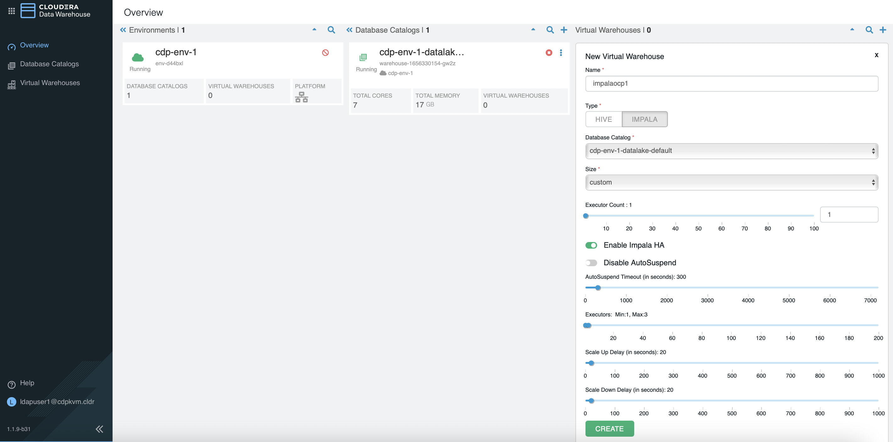 
    
    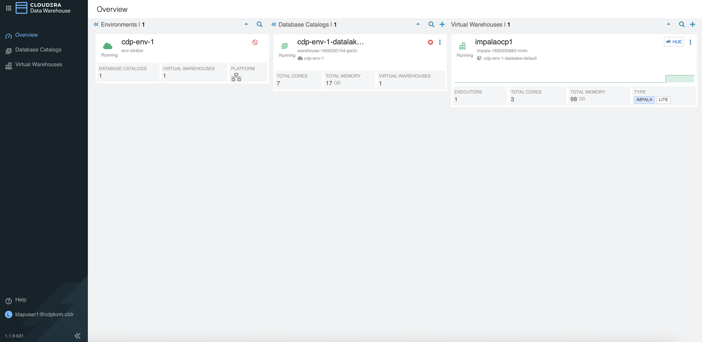 
    
    Take note of the following artifacts.
    
    ```bash    
    [root@ocpbastion ~]# oc -n impala-1656330683-rm4v get pods
    NAME                                 READY   STATUS    RESTARTS   AGE
    catalogd-74869dbf89-ldrmh            1/1     Running   0          2m2s
    coordinator-0                        4/4     Running   0          2m2s
    coordinator-1                        3/4     Running   0          80s
    huebackend-0                         2/2     Running   0          2m2s
    huefrontend-74c45775c-zz2lv          1/1     Running   0          2m2s
    impala-autoscaler-5b484b9fb7-znsxw   1/1     Running   0          2m1s
    impala-executor-000-0                1/1     Running   0          2m2s
    statestored-694d8b5fbb-529tp         1/1     Running   0          2m2s
    usage-monitor-755869884-ww6cn        1/1     Running   0          2m2s

    [root@ocpbastion ~]# oc -n impala-1656330683-rm4v get pvc
    NAME                                         STATUS   VOLUME              CAPACITY   ACCESS MODES   STORAGECLASS   AGE
    scratch-cache-volume-coordinator-0           Bound    local-pv-abb1e063   400Gi      RWO            cdw-disk       9s
    scratch-cache-volume-impala-executor-000-0   Bound    local-pv-33a6a00a   400Gi      RWO            cdw-disk       9s

    [root@ocpbastion ~]# oc -n impala-1656330683-rm4v describe pod coordinator-0 | grep Node:
    Node:         master03.ocp4.cdpkvm.cldr/10.15.4.184
    
    [root@ocpbastion ~]# oc -n impala-1656330683-rm4v describe pod impala-executor-000-0 | grep Node:
    Node:         master02.ocp4.cdpkvm.cldr/10.15.4.183
    
    [root@ocpbastion ~]# oc describe pv local-pv-abb1e063 | grep hostname
        Term 0:        kubernetes.io/hostname in [master03.ocp4.cdpkvm.cldr]
   
    [root@ocpbastion ~]# oc describe pv local-pv-33a6a00a | grep hostname
        Term 0:        kubernetes.io/hostname in [master02.ocp4.cdpkvm.cldr]

    [root@ocpbastion ~]# ssh core@master03.ocp4.cdpkvm.cldr
    Red Hat Enterprise Linux CoreOS 47.84.202206080457-0    
    Part of OpenShift 4.7, RHCOS is a Kubernetes native operating system
    managed by the Machine Config Operator (`clusteroperator/machine-config`).

    WARNING: Direct SSH access to machines is not recommended; instead,
    make configuration changes via `machineconfig` objects:
    https://docs.openshift.com/container-platform/4.7/architecture/architecture-rhcos.html

    ---
    Last login: Mon Jun 27 11:27:34 2022 from 10.15.4.189

    [core@master03 ~]$ ll /mnt/local-storage/
    total 0
    drwxr-xr-x. 2 root root 17 Jun 27 08:41 cdw-disk
    drwxr-xr-x. 2 root root 17 Jun 26 15:18 vdb
    
    [core@master03 ~]$ ll /mnt/local-storage/cdw-disk
    total 0
    lrwxrwxrwx. 1 root root 8 Jun 27 08:41 vdc -> /dev/vdc                                             cdw-disk                               11m
    ```

6. Remove the above `Impala` virtual warehouse. Create a new `Impala` virtual warehouse with 4 executors as shown below.
    
    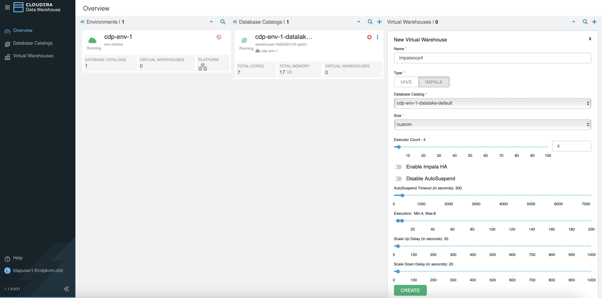 
    
    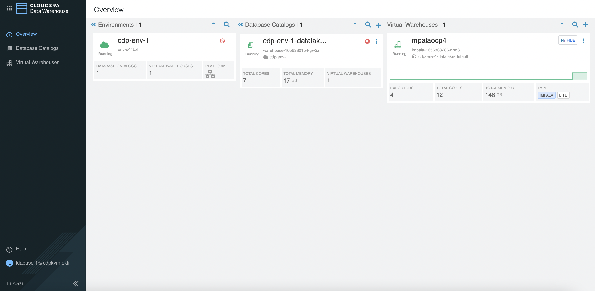 
    
    Take note of the following artifacts.
    
    ```bash    
    [root@ocpbastion ~]# oc -n impala-1656333286-nrm8 get pods
    NAME                                READY   STATUS    RESTARTS   AGE
    catalogd-567f684bcb-4dxph           1/1     Running   0          80s
    coordinator-0                       4/4     Running   0          80s
    huebackend-0                        2/2     Running   0          80s
    huefrontend-7c765bf44d-47dkq        1/1     Running   0          80s
    impala-autoscaler-6c7564d7f-lpndc   1/1     Running   0          80s
    impala-executor-000-0               1/1     Running   0          80s
    impala-executor-000-1               1/1     Running   0          80s
    impala-executor-000-2               1/1     Running   0          80s
    impala-executor-000-3               1/1     Running   0          80s
    statestored-f9d6b4bb7-hhk65         1/1     Running   0          80s
    usage-monitor-8677878c4b-q5hx8      1/1     Running   0          80s
    
    [root@ocpbastion ~]# oc -n impala-1656333286-nrm8 get pvc
    NAME                                         STATUS   VOLUME              CAPACITY   ACCESS MODES   STORAGECLASS   AGE
    scratch-cache-volume-coordinator-0           Bound    local-pv-abb1e063   400Gi      RWO            cdw-disk       103s
    scratch-cache-volume-impala-executor-000-0   Bound    local-pv-d30bd8ac   200Gi      RWO            cdw-disk       103s
    scratch-cache-volume-impala-executor-000-1   Bound    local-pv-dc533915   200Gi      RWO            cdw-disk       103s
    scratch-cache-volume-impala-executor-000-2   Bound    local-pv-c8fe6eea   200Gi      RWO            cdw-disk       103s
    scratch-cache-volume-impala-executor-000-3   Bound    local-pv-33a6a00a   400Gi      RWO            cdw-disk       103s

    [root@ocpbastion ~]# oc describe pv local-pv-33a6a00a | grep hostname
        Term 0:        kubernetes.io/hostname in [master02.ocp4.cdpkvm.cldr]

    [root@ocpbastion ~]# oc describe pv local-pv-dc533915 | grep hostname
        Term 0:        kubernetes.io/hostname in [master02.ocp4.cdpkvm.cldr]
    
    [root@ocpbastion ~]# oc -n impala-1656333286-nrm8 describe pod impala-executor-000-1 | grep Node:
    Node:         master02.ocp4.cdpkvm.cldr/10.15.4.183

    [root@ocpbastion ~]# oc -n impala-1656333286-nrm8 describe pod impala-executor-000-3 | grep Node:
    Node:         master02.ocp4.cdpkvm.cldr/10.15.4.183

    [root@ocpbastion ~]# oc -n impala-1656333286-nrm8 exec -ti impala-executor-000-1 -- /bin/sh
    sh-4.2$ lsblk
    NAME   MAJ:MIN RM  SIZE RO TYPE MOUNTPOINT
    rbd0   251:0    0    2G  0 disk 
    vdd    252:48   0  200G  0 disk /opt/impala/scratch
    vdb    252:16   0  300G  0 disk 
    rbd1   251:16   0    2G  0 disk 
    loop0    7:0    0  300G  0 loop 
    vdc    252:32   0  400G  0 disk 
    vda    252:0    0  100G  0 disk 
    |-vda4 252:4    0 99.5G  0 part /opt/impala/logs/minidumps
    |-vda2 252:2    0  127M  0 part 
    |-vda3 252:3    0  384M  0 part 
    `-vda1 252:1    0    1M  0 part 
    rbd2   251:32   0   20G  0 disk 

    sh-4.2$ ls -l /opt/impala/scratch/
    total 0
    -rw-r--r--. 1 hive 1000800000 0 Jun 27 12:35 impala-cache-file-524e9102ab341ef1:1917da93c3905ab4
    drwxr-sr-x. 2 hive 1000800000 6 Jun 27 12:35 impala-scratch
    ```


    
  
