# Cloudera Manager Installation
{: .no_toc }

This article explains the necessary steps to install Cloudera Manager (CM) on Centos7.9 OS which is [one of the supported operating systems](https://supportmatrix.cloudera.com/). Please ensure that the [prerequisites]({{ site.baseurl }}) have already been prepared prior to running this procedure.

- TOC
{:toc}

---

## Sanity Check

1. Ensure that JDK has already been installed in each host.

    ```bash
    # rpm -qa | grep jdk
    copy-jdk-configs-3.3-10.el7_5.noarch
    java-11-openjdk-11.0.14.1.1-1.el7_9.x86_64
    java-11-openjdk-headless-11.0.14.1.1-1.el7_9.x86_64
    java-11-openjdk-devel-11.0.14.1.1-1.el7_9.x86_64
    ```

2. The external DNS server is able to resolve the hostname and perform reverse DNS lookup. Please this step for all the CDP PvC Base and ECS nodes.

    ```bash
    # nslookup idm
    Server:		10.15.4.150
    Address:	10.15.4.150#53

    Name:	idm.cdpkvm.cldr
    Address: 10.15.4.150

    # nslookup 10.15.4.150
    150.4.15.10.in-addr.arpa	name = idm.cdpkvm.cldr.
    ```

3. NTP client of each host is synchronizing time with the external NTP server.

4. Each host has already been registered with the external Kerberos server.

    ```bash
    # ipa host-show bmaster1
    Host name: bmaster1.cdpkvm.cldr
    Principal name: host/bmaster1.cdpkvm.cldr@CDPKVM.CLDR
    Principal alias: host/bmaster1.cdpkvm.cldr@CDPKVM.CLDR
    SSH public key fingerprint: SHA256:dyShLpzkqlRHc2LHiqXDbhM8ynT7v4yjZP4CZ212tqU root@bmaster1.cdpkvm.cldr (ssh-rsa),
                              SHA256:C+BAHEBbVAXfhUIpdFxoL2MOkF5pUGATuKnFQXCgJnc root@bmaster1.cdpkvm.cldr (ssh-rsa),
                              SHA256:/COofNFRyGmwAGR6sfonAcXtc/Knjs5/an1+SMX/8GA (ecdsa-sha2-nistp256), SHA256:OL8ZeU7+2E4yl7rsvKftXYTM7Bvr8fEVuxQaQBouwwo
                              (ssh-ed25519)
    Password: False
    Keytab: True
    Managed by: bmaster1.cdpkvm.cldr
    ```
5. Ensure that `includedir` lines have been commented in CM host.

    ```bash
    # cat /etc/krb5.conf | grep includedir
      #includedir /etc/krb5.conf.d/
      #includedir /var/lib/sss/pubconf/krb5.include.d/
    ```

## CM Installation

1. Download the Cloudera repo.

    ```bash
    # cd /etc/yum.repos.d/
    # wget https://<userid>:<password>@archive.cloudera.com/p/cm7/7.5.5/redhat7/yum/cloudera-manager.repo
    ```

2. Edit the Cloudera repo. Insert username and password parameters and its values.

    ```yaml
    [cloudera-manager]
    name=Cloudera Manager 7.5.5
    baseurl=https://archive.cloudera.com/p/cm7/7.5.5/redhat7/yum/
    gpgkey=https://archive.cloudera.com/p/cm7/7.5.5/redhat7/yum/RPM-GPG-KEY-cloudera
    username=<userid>
    password=<password>
    gpgcheck=1
    enabled=1
    autorefresh=0
    type=rpm-md
    ```

3. Import the RPM-GPG-KEY.

    ```bash
    # rpm --import  https://<userid>:<password>@archive.cloudera.com/p/cm7/7.5.5/redhat7/yum/RPM-GPG-KEY-cloudera

    ```

4. Install the CM packages.

    ```bash
    # yum install -y cloudera-manager-daemons cloudera-manager-agent cloudera-manager-server

    ```

5. Run the scm_prepare_database.sh script. 
   cm.cdpkvm.cldr is CM hostname.
   db.cdpkvm.cldr is the external PostgreSQL hostname.

    ```bash
    # /opt/cloudera/cm/schema/scm_prepare_database.sh postgresql -h db.cdpkvm.cldr--scm-host cm.cdpkvm.cldr scm scm

    ```

5. Enable and start the cloudera-scm-server service.

    ```bash
    # systemctl enable cloudera-scm-server
    # systemctl start cloudera-scm-server

    ```

6. Monitor the cloudera-scm-server service log.

    ```bash
    # tail -f /var/log/cloudera-scm-server/cloudera-scm-server.log

    ```

7. Enable [AutoTLS](https://docs.cloudera.com/cdp-private-cloud-base/7.1.7/installation/topics/cdpdc-recommended-enable-auto-tls.html). The command creates self signed certificate as an example. User may also sign the CSR with CA.

    ```bash
    # export JAVA_HOME=/usr/lib/jvm/java-11-openjdk-11.0.14.1.1-1.el7_9.x86_64
    # /opt/cloudera/cm-agent/bin/certmanager --location /var/lib/cloudera-scm-server/certmanager setup --configure-services

    ```
    
8. After successful installation, login to the CM website. `https://cm.cdpkvm.cldr:7183`
    
    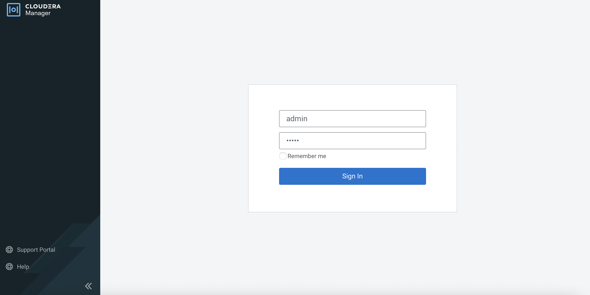
    
9. Select the Cloudera license txt file as requested.

    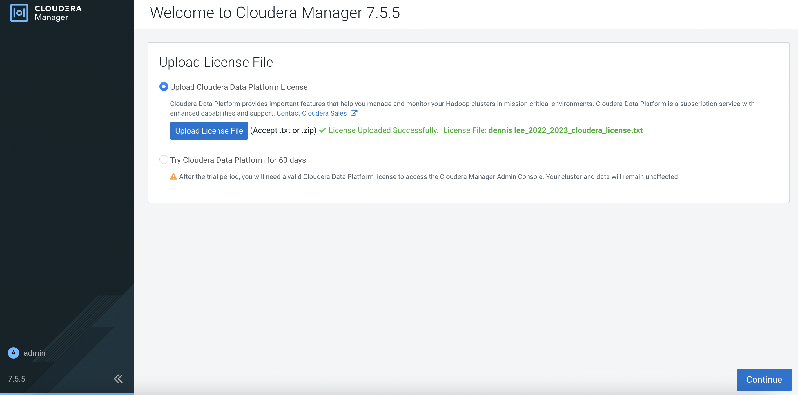
    
10. Click `here to setup a KDC` link and click `Continue`.

    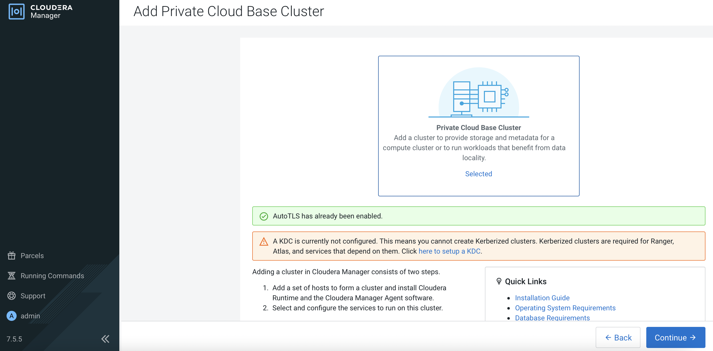    
    
11. In this demo, Red Hat IPA is the KDC server. Apply the instructions based on the OS of the CM. Select `I have completed all the above steps.` and click `Continue`.

    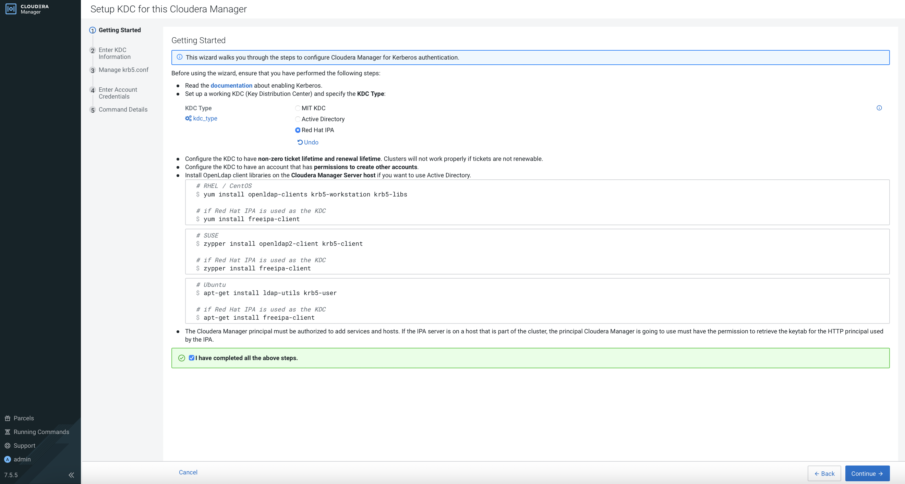 
    
12. Key in the parameters and click `Continue`.

    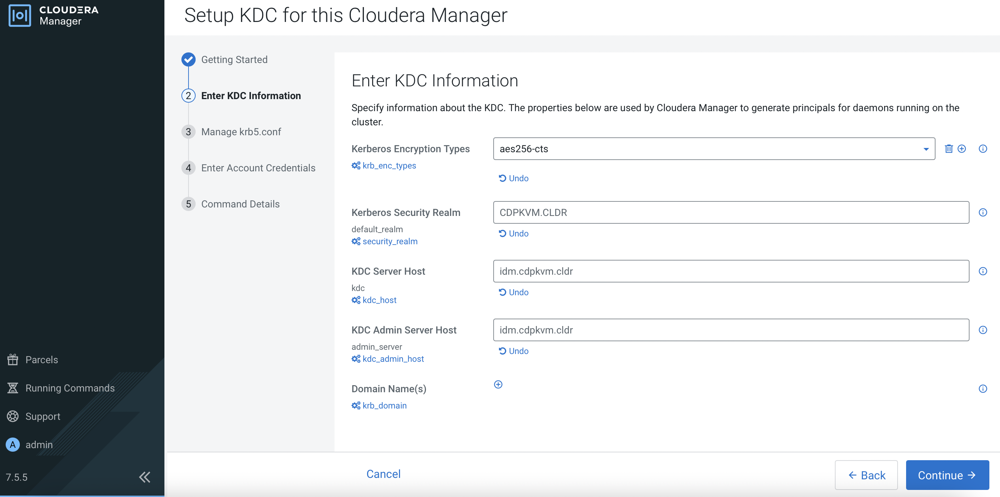 
    
13. Select `Manage krb5.conf through Cloudera Manager` option and click `Continue`.

    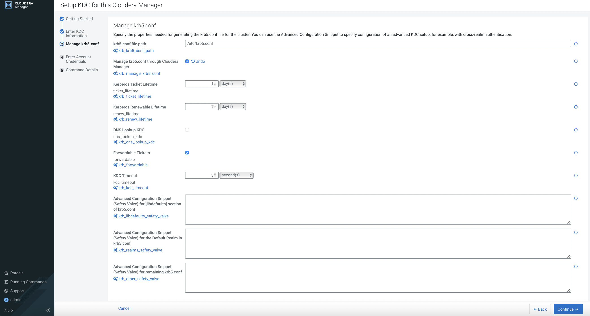 
    
14. Enter account credentials and click `Continue`.

    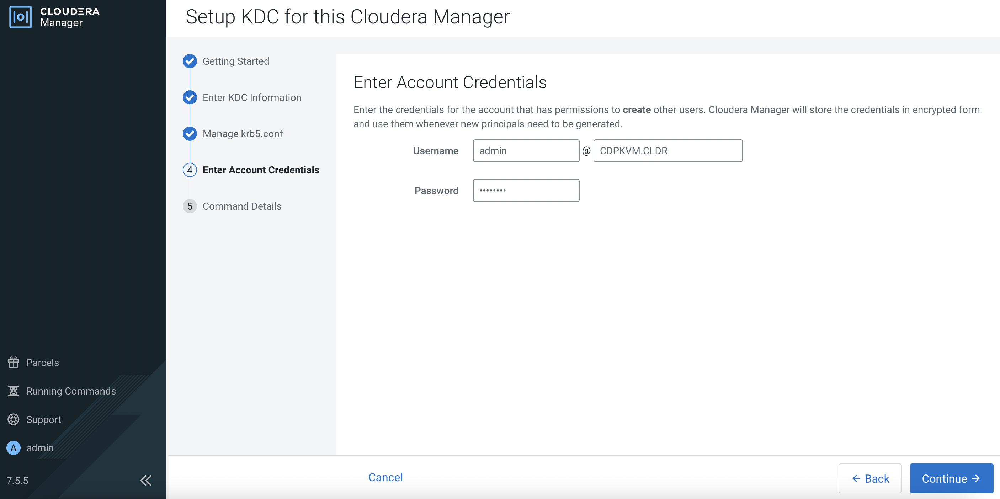 
    
15. The following output shows you have successfully setup the KDC. Click `Finish`.

    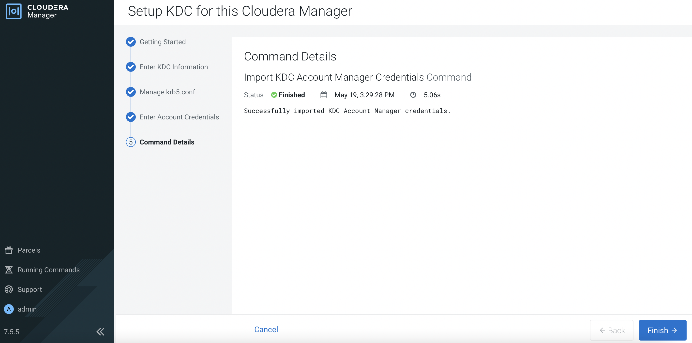 
    
16. Both AutoTLS and KDC have successfully been set up in CM. 

    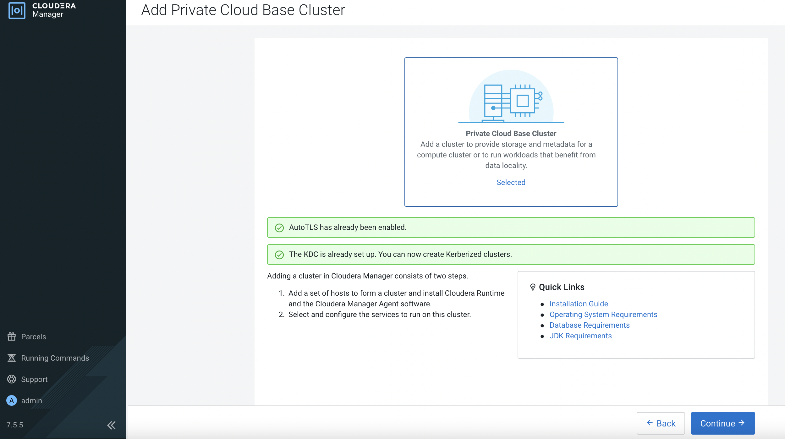 
    
## Connect CM with External LDAP

1. Navigate to `Administration` > `Settings`. Search for `backend` and select the following options so that CM will first look up the user in the external LDAP server.

    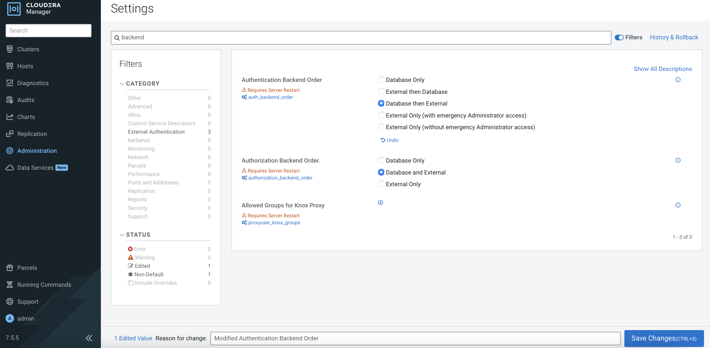 
    
2. Configure CM with the necessary external LDAP server settings as shown in the following example. Note that this demo is connected to Red Hat IPA.

| Parameter       | Value         |
|:----------------|:------------------|
| External Authentication Type         | LDAP  | 
| LDAP URL  | ldap://idm.cdpkvm.cldr  | 
| LDAP Bind User Distinguished Name  |  uid=admin,cn=users,cn=accounts,dc=cdpkvm,dc=cldr | 
| LDAP Bind Password |  `password` | 
| LDAP User Search Filter | (uid={0})  | 
| LDAP User Search Base | cn=users,cn=accounts,dc=cdpkvm,dc=cldr  | 
| LDAP Group Search Filter | (member={0})  | 
| LDAP Group Search Base  |  cn=groups,cn=accounts,dc=cdpkvm,dc=cldr | 

3. Restart the cloudera-scm-server service.

    ```bash
    # systemctl restart cloudera-scm-server
    ```
    
4. Configure a new user in the external LDAP server. Log in CM with this newly created user. Log implies that CM manages to contact LDAP server and allow successful login. However, this new user has no role configured in CM.

    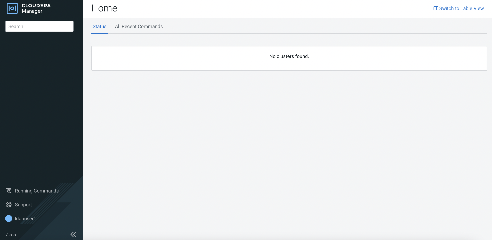 

    ```bash
    # tail -f /var/log/cloudera-scm-server/cloudera-scm-server.log
    2022-05-20 18:55:43,353 INFO scm-web-155:com.cloudera.server.web.cmf.CmfLdapUserDetailsContextMapper: External user ldapuser1 logged in without any roles.
2022-05-20 18:55:43,414 INFO scm-web-155:com.cloudera.server.web.cmf.AuthenticationSuccessEventListener: Authentication success for user: 'ldapuser1' from 10.96.83.175
    ```

5. Log out and log in with the database admin account. Navigate to `Administration` > `Users & Roles`.

    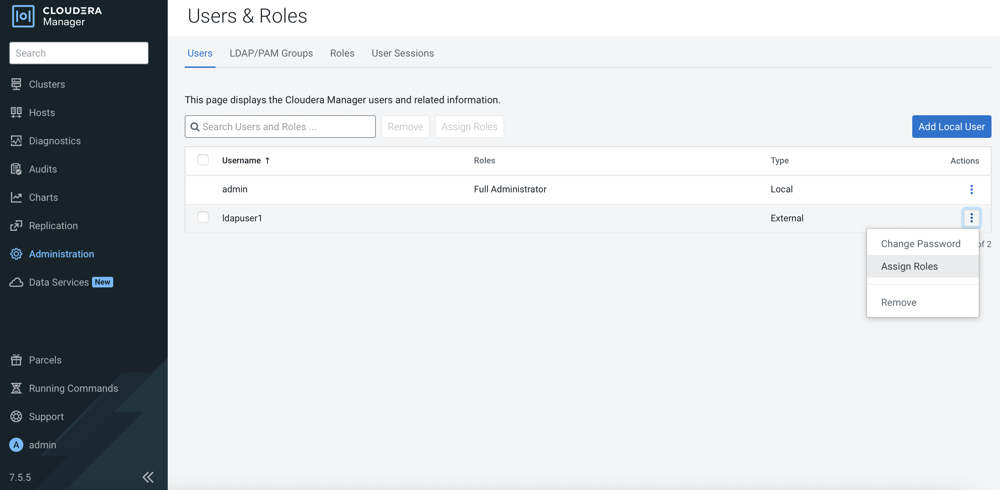 
    
6. Assign `Full Administrator` role for this ldap user.  
    
    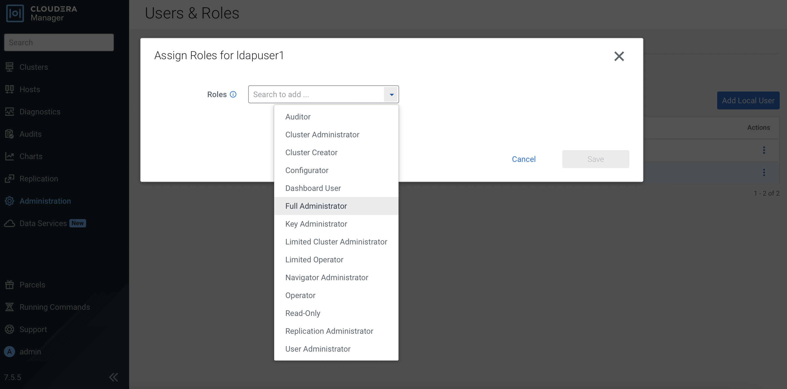  

    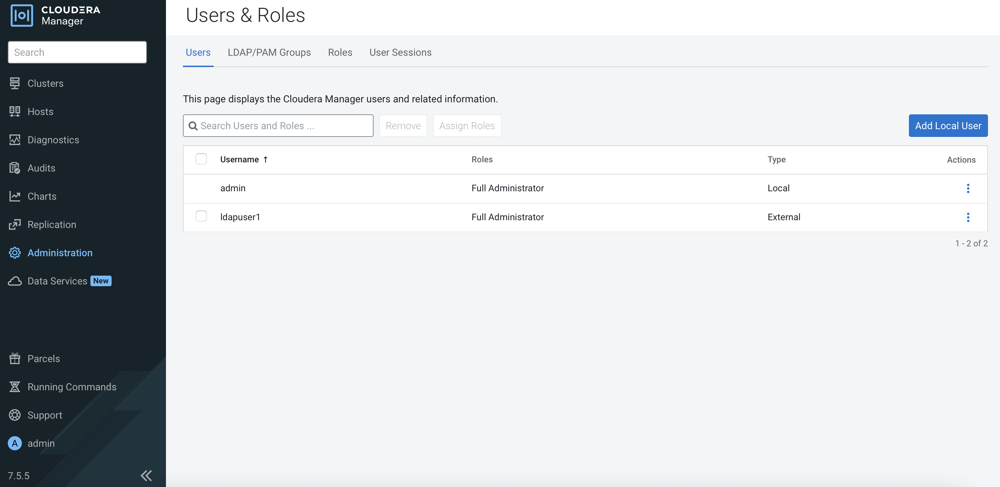  
    
7. Log out and log in with the ldap user again. This time this ldap user has full access of the CM dashboard.

    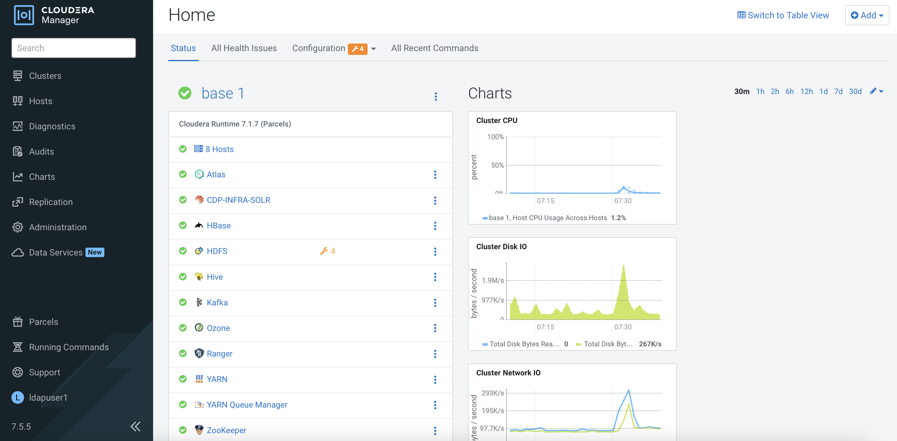   
    

## External Database SSL Certificate Import

The following steps are the mandatory to run prior to creating the ECS platform. This allows CDW to establish SSL connection with the external database using the database's certificate to be stored in CM's truststore.

1. Retrieve the keystore password from one of the CDP Base master hosts.

    ```bash
    # cat /etc/hadoop/conf/ssl-client.xml | grep ssl.client.truststore.password -A1
    <name>ssl.client.truststore.password</name>
    <value>nws59gzoRHLsQBqJ2nuB2cE8EoZ3vq2DFchyxGJrQdL</value>
    ```
2. Copy the SSL `server.crt` from the external database to CM host. 

3. In CM host, import the SSL enabled external database certificate into the CM's truststore.

    ```bash
    # keytool -import -alias postgres -file /root/server.crt -storetype JKS -keystore /var/lib/cloudera-scm-agent/agent-cert/cm-auto-global_truststore.jks
    Enter keystore password: 
    ```
 
    
    
---    
   Next Step
   {: .label .label-blue } 
- Proceed to create the CDP Base cluster in the next [subtopic]({{ site.baseurl }}).
        

