# Cloudera Machine Learning (CML)
{: .no_toc }

This article explains the steps to deploy the CML service on the ECS platform after successful configuration of the [Data Services Management Console]({{ site.baseurl }}).

- TOC
{:toc}

---

## CML Deployment

1. In CM, navigate to `Data Services`. Click `Open CDP Private Cloud Data Services`. 

    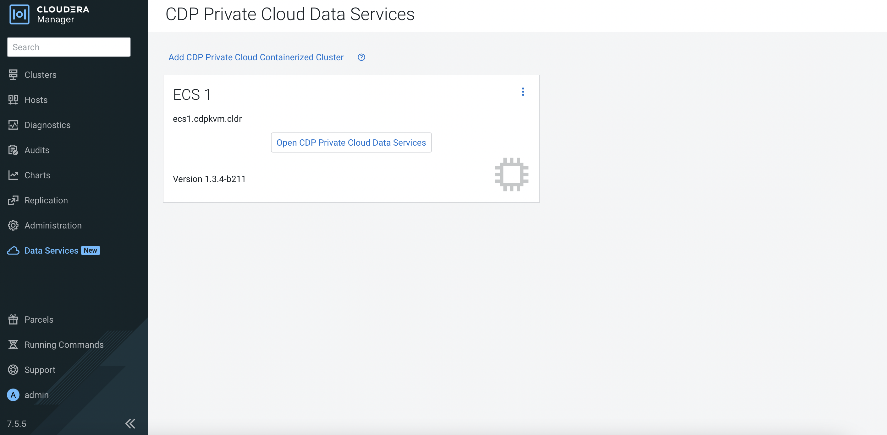
    
2. The system will redirect the browser to the following page. Click `Machine Learning`.   

    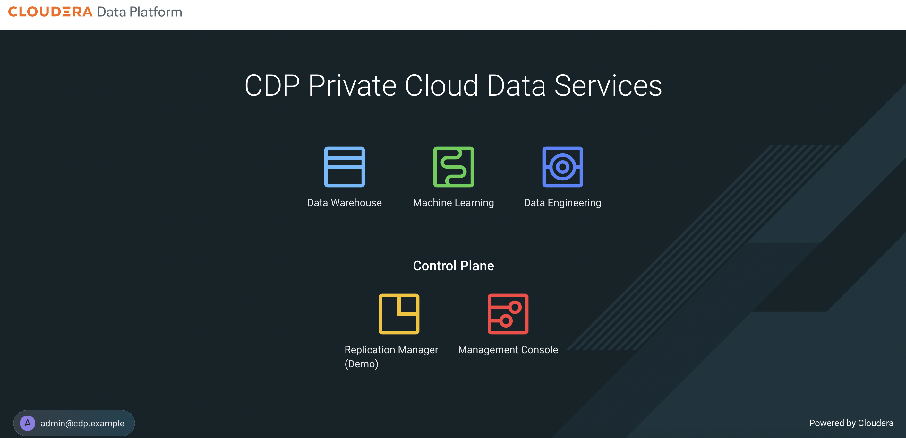

3. Navigate to `ML Workspaces`. Click `Provision Workspace`.

    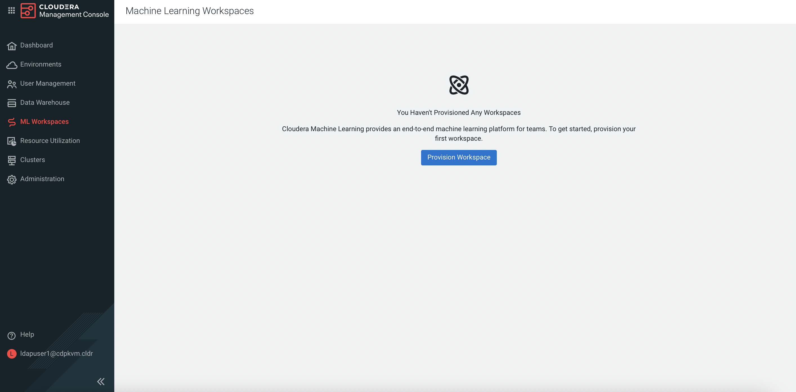

4. Fill in the fields as shown in the following example.

    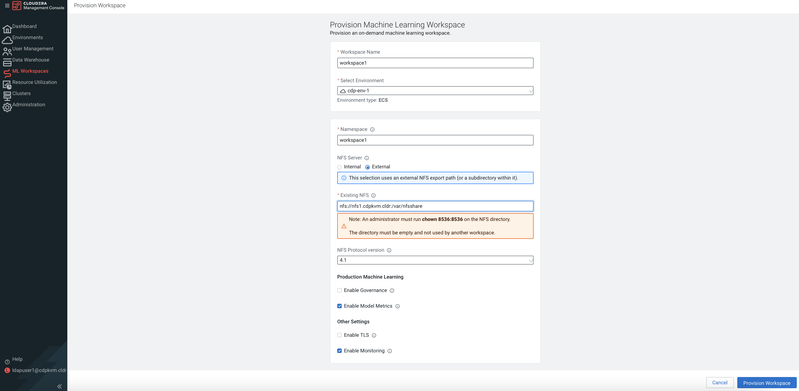

5. The outcome of the workspace creation should be successful as shown below. Click `workspace1`. 

    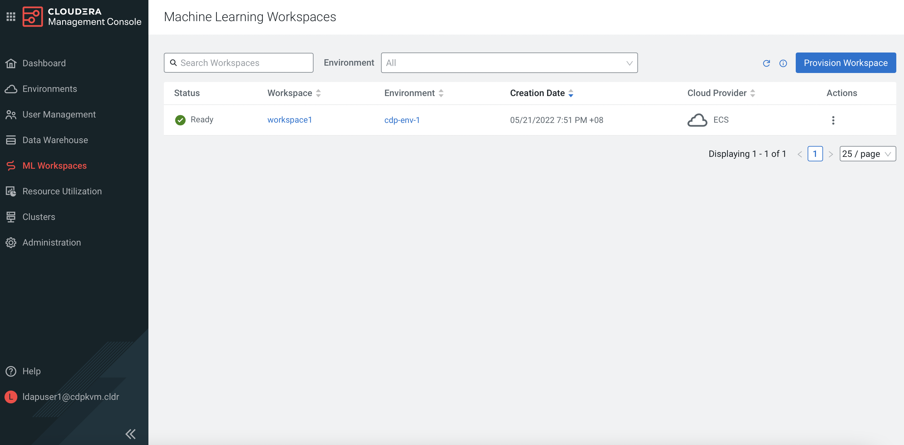
    
6. The system will redirect the browser to the CML dashboard.
   
    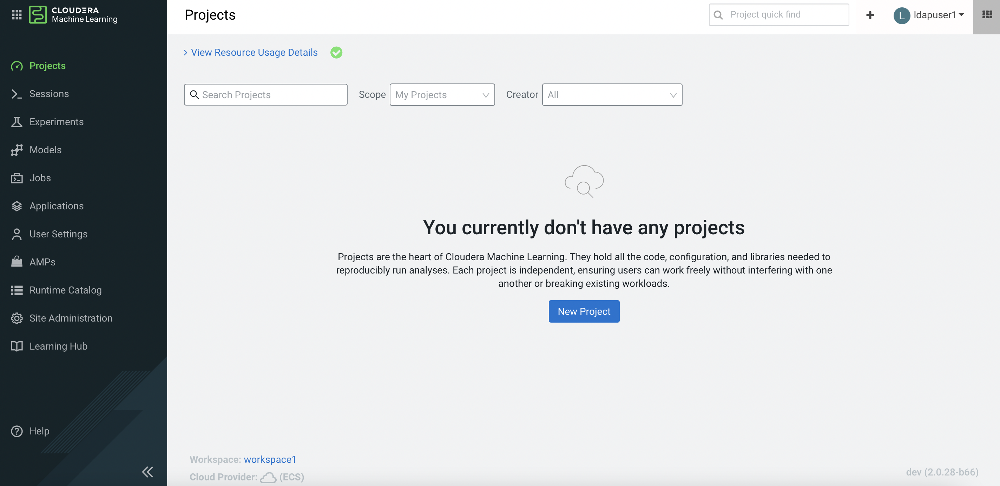     

## AMP Project Creation

1. Navigate to `AMP`. You may select one of the Applied ML Prototypes. In this demo, click `Deep Learning for Image Analysis`.

    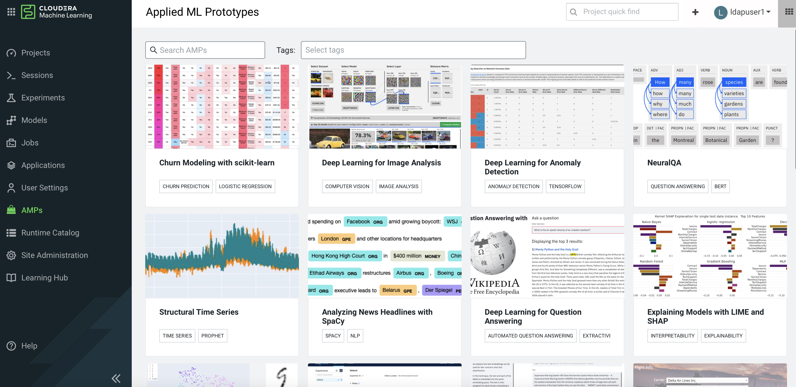  

2. Click `Configure Project`.

    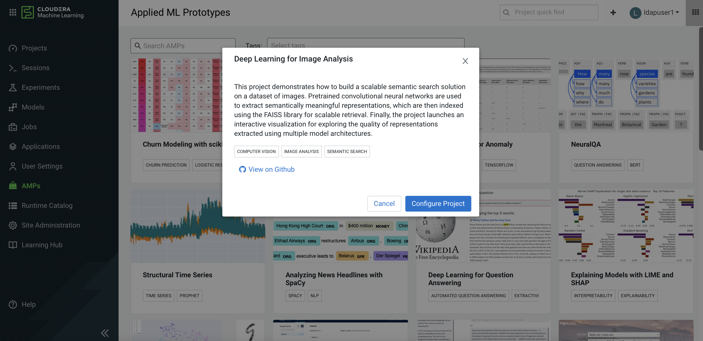  
    
    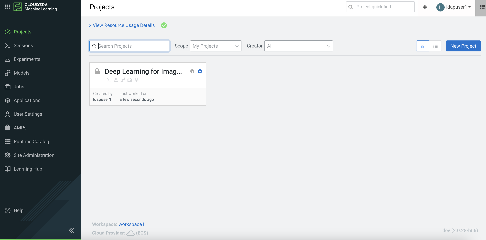  
    
3. Select the parameters. Click `Launch Project`.

    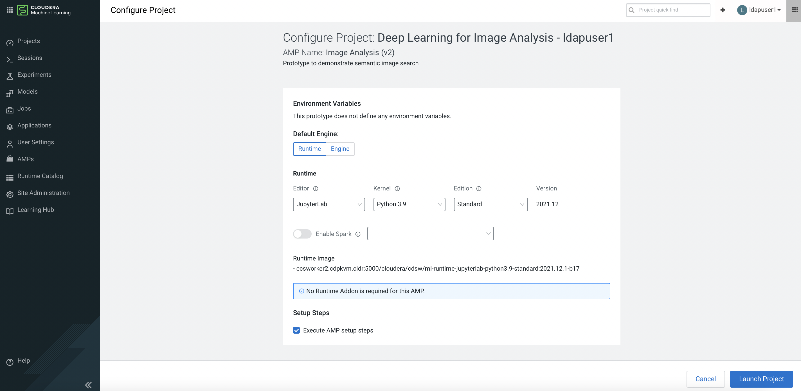  
    
    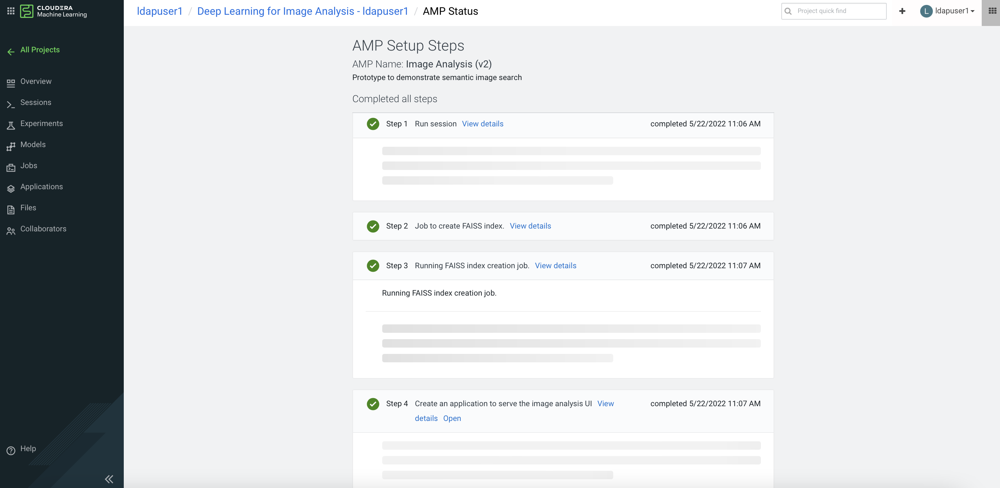  

    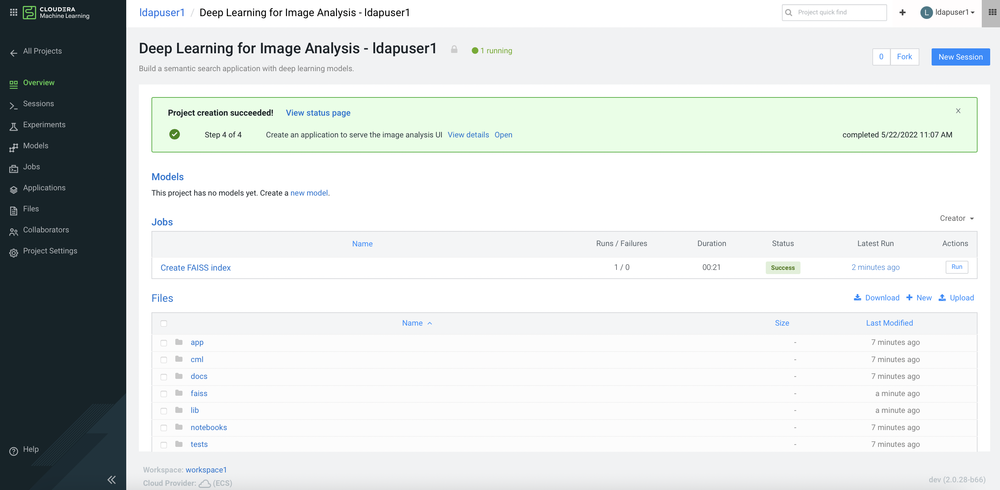  
    
4. Click `Open` to browse the application as shown in the following animated gif. The application user may click on any image at the lower section and then the application will analyze the library and subsequently display a list of similar image's type that was clicked by the user.


      


## CML Artifacts inside ECS Platform


```bash
    # kubectl get pv | head -1 ; kubectl get pv | grep cdp-env-1
    NAME                                       CAPACITY   ACCESS MODES   RECLAIM POLICY   STATUS   CLAIM                                                                                                                   STORAGECLASS   REASON   AGE
    pvc-7022f231-463b-4622-8a21-15f7a729b7d1   2Gi        RWO            Delete           Bound    cdp-env-1-d668dab9-monitoring-platform/storage-volume-monitoring-prometheus-alertmanager-0                              longhorn                66s
    pvc-946e99e2-0ef1-4ba5-8504-246f02c3142f   60Gi       RWO            Delete           Bound    cdp-env-1-d668dab9-monitoring-platform/monitoring-prometheus-server                                                     longhorn                68s
    pvc-c96965bb-b564-4cb5-b373-0fbcc7ead110   2Gi        RWO            Delete           Bound    cdp-env-1-d668dab9-monitoring-platform/storage-volume-monitoring-prometheus-alertmanager-1                              longhorn                11s
```

```bash
    # kubectl get ns
    NAME                                     STATUS   AGE
    cdp                                      Active   8h
    cdp-env-1-d668dab9-monitoring-platform   Active   2m16s
    default                                  Active   8h
    default-43e25dc6-monitoring-platform     Active   7h55m
    ecs-webhooks                             Active   8h
    infra-prometheus                         Active   8h
    kube-node-lease                          Active   8h
    kube-public                              Active   8h
    kube-system                              Active   8h
    kubernetes-dashboard                     Active   8h
    local-path-storage                       Active   8h
    longhorn-system                          Active   8h
    shared-services                          Active   3h50m
    vault-system                             Active   8h
    yunikorn                                 Active   8h
```

```bash
    # kubectl -n cdp-env-1-d668dab9-monitoring-platform get pods
    NAME                                                        READY   STATUS    RESTARTS   AGE
    monitoring-cm-health-exporter-59dc48c4d-twhnj               3/3     Running   0          2m56s
    monitoring-logger-alert-receiver-c89955fb7-zgxn5            2/2     Running   0          2m56s
    monitoring-metrics-server-exporter-94c45955b-pwsb6          2/2     Running   0          2m56s
    monitoring-platform-proxy-c5f8f5578-zglkb                   2/2     Running   0          2m56s
    monitoring-prometheus-alertmanager-0                        3/3     Running   0          2m56s
    monitoring-prometheus-alertmanager-1                        3/3     Running   0          119s
    monitoring-prometheus-kube-state-metrics-66f7f6f9b4-tzrfs   2/2     Running   0          52s
    monitoring-prometheus-pushgateway-64b5765874-9n8c4          2/2     Running   0          2m56s
    monitoring-prometheus-server-c4b8b4456-8lcz9                3/3     Running   0          2m56s
    snmp-notifier-86c7564b69-bkdwm                              2/2     Running   0          52s
```

```bash
    # kubectl -n cdp-env-1-d668dab9-monitoring-platform get pvc
    NAME                                                  STATUS   VOLUME                                     CAPACITY   ACCESS MODES   STORAGECLASS   AGE
    monitoring-prometheus-server                          Bound    pvc-946e99e2-0ef1-4ba5-8504-246f02c3142f   60Gi       RWO            longhorn       3m13s
    storage-volume-monitoring-prometheus-alertmanager-0   Bound    pvc-7022f231-463b-4622-8a21-15f7a729b7d1   2Gi        RWO            longhorn       3m13s
    storage-volume-monitoring-prometheus-alertmanager-1   Bound    pvc-c96965bb-b564-4cb5-b373-0fbcc7ead110   2Gi        RWO            longhorn       2m16s
```

```bash
    # kubectl -n workspace1 get pvc
    NAME                                    STATUS   VOLUME                                     CAPACITY   ACCESS MODES   STORAGECLASS   AGE
    livelog-data-livelog-0                  Bound    pvc-fd0b773a-e785-4b5c-afc1-fcd98afcc56b   1Ti        RWO            longhorn       16s
    model-metrics-data-model-metrics-db-0   Bound    pvc-05b25f2a-29cd-4341-8c69-a83c7e70efef   100Gi      RWO            longhorn       16s
    persist-dir-secret-generator-0          Bound    pvc-a16af508-e380-4243-944c-1473d2a6b711   10Mi       RWO            longhorn       16s
    postgres-data-versioned-db-0            Bound    pvc-39d799cf-6773-46f6-8f16-16778e008824   1Ti        RWO            longhorn       16s
    projects-pvc                            Bound    projects-share-workspace1                  1Ti        RWX                           16s
    s2i-git-server-repos-s2i-git-server-0   Bound    pvc-cb5c9ac7-0201-44be-aeb5-dec057db5870   1Ti        RWO            longhorn       16s
    s2i-queue-pvc                           Bound    pvc-2394a6d2-eecf-452e-b17f-4ab477bb1310   2Gi        RWO            longhorn       16s
```

```bash
    # kubectl get pv | head -1 ; kubectl get pv | grep workspace1
    NAME                                       CAPACITY   ACCESS MODES   RECLAIM POLICY   STATUS   CLAIM                                                                                                                   STORAGECLASS   REASON   AGE
    projects-share-workspace1                  1Ti        RWX            Retain           Bound    workspace1/projects-pvc                                                                                                                         49s
    pvc-05b25f2a-29cd-4341-8c69-a83c7e70efef   100Gi      RWO            Delete           Bound    workspace1/model-metrics-data-model-metrics-db-0                                                                        longhorn                36s
    pvc-2394a6d2-eecf-452e-b17f-4ab477bb1310   2Gi        RWO            Delete           Bound    workspace1/s2i-queue-pvc                                                                                                longhorn                43s
    pvc-39d799cf-6773-46f6-8f16-16778e008824   1Ti        RWO            Delete           Bound    workspace1/postgres-data-versioned-db-0                                                                                 longhorn                39s
    pvc-a16af508-e380-4243-944c-1473d2a6b711   10Mi       RWO            Delete           Bound    workspace1/persist-dir-secret-generator-0                                                                               longhorn                39s
    pvc-cb5c9ac7-0201-44be-aeb5-dec057db5870   1Ti        RWO            Delete           Bound    workspace1/s2i-git-server-repos-s2i-git-server-0                                                                        longhorn                37s
    pvc-fd0b773a-e785-4b5c-afc1-fcd98afcc56b   1Ti        RWO            Delete           Bound    workspace1/livelog-data-livelog-0                                                                                       longhorn                39s
```


```bash
# kubectl -n workspace1 get pods
NAME                                             READY   STATUS      RESTARTS   AGE
api-6945bd58bc-m64kv                             1/1     Running     3          21m
cron-657dbd8b65-csfjv                            2/2     Running     0          21m
db-0                                             2/2     Running     0          21m
db-migrate-2.0.28-b66-5j2pk                      0/1     Completed   0          21m
ds-cdh-client-575bcc8799-54s8h                   3/3     Running     0          21m
ds-operator-94fb98c6b-rkqjq                      2/2     Running     1          21m
ds-reconciler-f7486fbd7-nll5t                    2/2     Running     6          21m
ds-vfs-7478cffd6-mctqk                           2/2     Running     0          21m
feature-flags-5857fc68d-nk8lg                    2/2     Running     0          21m
fluentd-forwarder-5848c4b87d-zq9ln               1/1     Running     0          21m
hadoop-cli-7.2.10-hf1-t94d-qgjxr                 0/1     Completed   0          8m48s
hadoop-cli-7.2.11-hf4-vfc03-mxpxr                0/1     Completed   0          8m48s
hadoop-cli-7.2.8-hf1-5auu1d-4fngq                0/1     Completed   0          8m48s
livelog-0                                        2/2     Running     0          21m
livelog-publisher-ccq7k                          2/2     Running     0          21m
livelog-publisher-r66pm                          2/2     Running     0          21m
mlx-workspace1-pod-evaluator-765985c848-mvn54    1/1     Running     0          21m
model-metrics-6f74997bf7-bzkkn                   1/1     Running     4          21m
model-metrics-db-0                               1/1     Running     0          21m
model-proxy-7fb9bfcb6d-x7z5p                     2/2     Running     0          21m
prometheus-postgres-exporter-5c7b57bf66-8nd7v    1/1     Running     0          21m
runtime-addon-trigger-2.0.28-b66-nhqcf           0/1     Completed   6          21m
runtime-initial-repo-inserter-2.0.28-b66-w9jgn   0/1     Completed   0          21m
runtime-manager-c5844d5f9-rcspl                  2/2     Running     0          21m
s2i-builder-5fd4c7bc59-25q5p                     2/2     Running     0          21m
s2i-builder-5fd4c7bc59-74l99                     2/2     Running     0          21m
s2i-builder-5fd4c7bc59-94lhz                     2/2     Running     0          21m
s2i-client-57c7d8564-nhstd                       2/2     Running     0          21m
s2i-git-server-0                                 2/2     Running     0          21m
s2i-queue-0                                      2/2     Running     0          21m
s2i-server-d79fdb6f8-m8t2s                       2/2     Running     0          21m
secret-generator-0                               2/2     Running     0          21m
spark247-13-hf2-5uhfhd-t5v7k                     0/1     Completed   0          8m48s
spark311-13-hf2-mx7m2j-57xbh                     0/1     Completed   0          8m48s
tcp-ingress-controller-59849bb8d5-zslzd          2/2     Running     8          21m
usage-reporter-7449585bf5-lgc2c                  2/2     Running     0          21m
web-5cb768ddc4-9qs4k                             2/2     Running     1          21m
web-5cb768ddc4-dzbbv                             2/2     Running     1          21m
web-5cb768ddc4-qdhg2                             2/2     Running     1          21m
```


```bash
# kubectl get ns
NAME                                     STATUS   AGE
cdp                                      Active   10h
cdp-env-1-85b71ddc-monitoring-platform   Active   3h17m
default                                  Active   11h
default-470e0dec-monitoring-platform     Active   10h
ecs-webhooks                             Active   11h
infra-prometheus                         Active   10h
kube-node-lease                          Active   11h
kube-public                              Active   11h
kube-system                              Active   11h
kubernetes-dashboard                     Active   10h
local-path-storage                       Active   10h
longhorn-system                          Active   10h
shared-services                          Active   3h16m
vault-system                             Active   10h
workspace1                               Active   24m
workspace1-user-1                        Active   2m15s
yunikorn                                 Active   10h
```
    
```bash
# kubectl -n workspace1-user-1 get pods
NAME               READY   STATUS    RESTARTS   AGE
nv8ou6d2xskx8boy   4/4     Running   0          2m38s
```
    
```bash
# kubectl -n workspace1-user-1 get pvc
NAME       STATUS   VOLUME     CAPACITY   ACCESS MODES   STORAGECLASS                 AGE
28f3a063   Bound    3eda7502   20Gi       RWX            cdsw-storageclass-whiteout   2m50s
5bdf02aa   Bound    b07df1d0   20Gi       RWX            cdsw-storageclass-whiteout   2m50s
8ed58984   Bound    bdc25cd8   20Gi       RWX            cdsw-storageclass-whiteout   2m50s
abe060d7   Bound    338b9a4c   20Gi       RWX            cdsw-storageclass-whiteout   2m50s
```

```bash
# ll /var/nfsshare/
total 0
drwxr-xr-x 8 8536 8536 204 May 22 10:54 addons
drwxr-xr-x 5 8536 8536  78 May 22 11:07 cdn
drwxr-xr-x 2 8536 8536   6 May 22 10:43 output
drwxr-xr-x 3 8536 8536  15 May 22 11:01 projects
drwxr-xr-x 2 8536 8536   6 May 22 10:43 scratch
```


