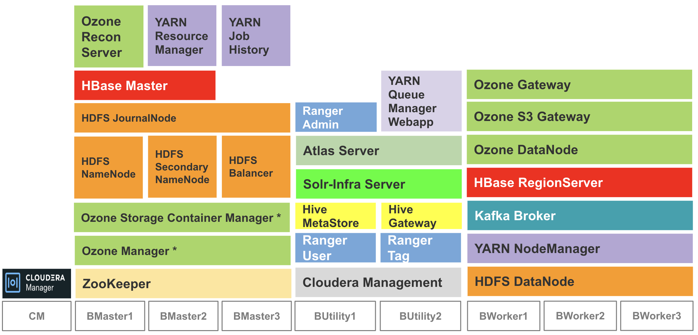
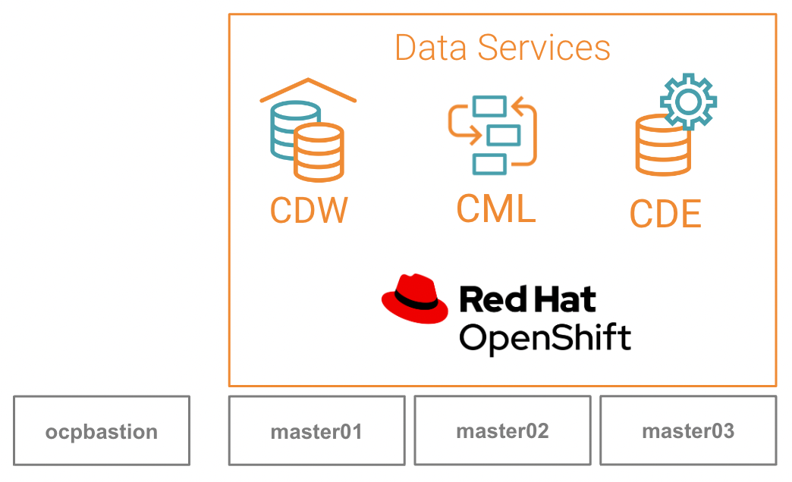
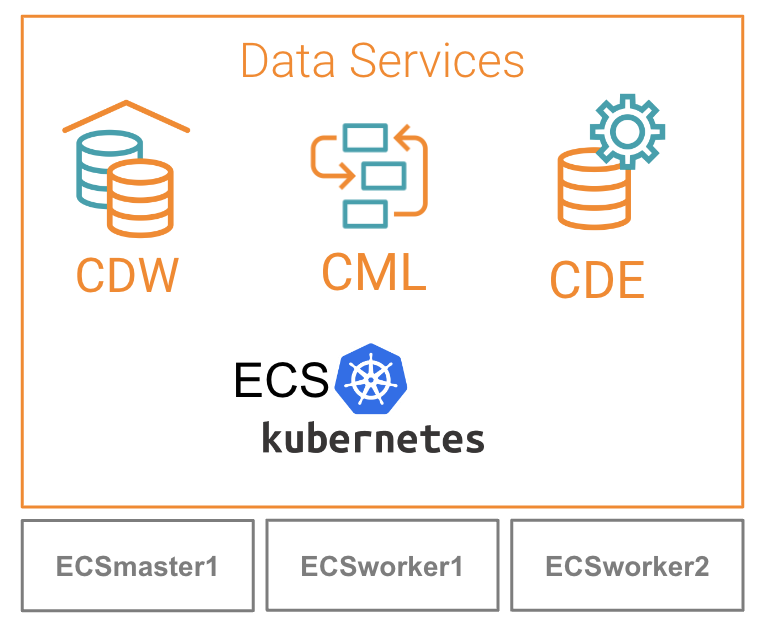

## Demo Architecture 
- CDP Private Cloud solution is comprised of the following components:
        - CDP PvC Base cluster
        - Cloudera Manager (CM)
        - CDP PvC Data Services.
- In this demo, the CDP PvC Data Services are hosted on the Kubernetes platform powered by the Openshift and/or the ECS (Embedded Container Service) platform. Both are mutually exclusive whereby CDP Private Cloud solution requires only one of them. In addition, CDP PvC solution also has the capability to integrate the CDP Base cluster with both Openshift and ECS platforms simultaneously and this setup will be shown in this demo. 
- The next topics will describe the end-to-end CDP Private Cloud installation procedure using the following demo/proof-of-concept architecture.

   CDP Private Cloud Base
   {: .label .label-blue } 
    

- CM installs the minimum CDP PvC Base services in the CDP PvC Base hosts. These services serve as the prerequisites prior to installing the specific CDP PvC Data Service(s) on the Kubernetes platform. 
- This demo environment has 8 servers hosting the minimum CDP PvC Base services.
- Most of the CDP PvC Base services are installed in high availabity mode and hence the aforementioned services are to be deployed in more than one host.
- The placement of the CDP PvC Base services (role assignment) is based on the recommendation highlighted in this [link](https://docs.cloudera.com/cdp-private-cloud-base/7.1.7/installation/topics/cdpdc-runtime-cluster-hosts-role-assignments.html).

   CDP Private Cloud Base with Openshift
   {: .label .label-blue } 
    

- The Openshift platform in this demo environment consists of 3 servers and each server hosts both Openshift master and worker roles. Note that such architecture is only meant for demo purpose and strictly not suitable for production environment.
- OCPbastion node is the Openshift installer and client.

   CDP Private Cloud Base with ECS
   {: .label .label-blue } 
        

- The ECS platform in this demo environment consists of 1 master node and 2 ECS worker/agent nodes. In the actual production environment, the required number of ECS worker nodes depends heavily on the actual dimensioning input and how the failover mechanism is designed accordingly.

---    
   Next Step
   {: .label .label-blue } 
   
- Explore the installation prerequisites for the CDP Private Cloud in the next [topic]({{ site.baseurl }}).
        
