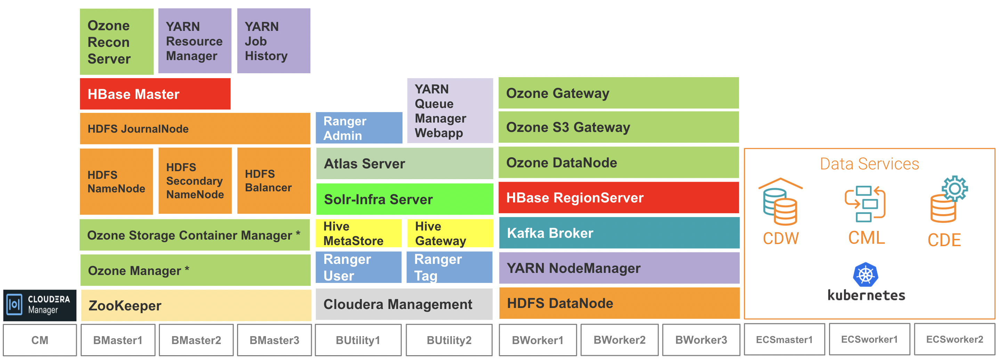

## Demo Architecture
- The next subtopics will describe the end-to-end CDP Private Cloud installation procedure which is articulated based on the following demo architecture diagram.

    

- In this demo, the CDP PvC Data Services are hosted on the Kubernetes platform powered by the ECS (Embedded Container Service) platform.
- CM installs the minimum CDP PvC Base services in the CDP PvC Base hosts. These services serve as the prerequisites prior to installing the specific CDP PvC Data Service(s) on the ECS platform. Further details will be explained in the subsequent subtopic.
- The placement of the CDP PvC Base services (role assignment) is based on the recommendation highlighted in this [link](https://docs.cloudera.com/cdp-private-cloud-base/7.1.7/installation/topics/cdpdc-runtime-cluster-hosts-role-assignments.html).
- Most of the CDP PvC Base services are installed in high availabiity mode and hence the aforementioned services are to be deployed in more than one host.
- Only 2 ECS worker/agent nodes are to be installed in this demo. In production environment, the required total number of nodes depends heavily on the actual dimensioning input and how the failover mechanism is designed.

---    
   Next Step
   {: .label .label-blue } 
   
- Explore the installation prerequisites for CDP Private Cloud in the next [subtopic]({{ site.baseurl }}).
        
