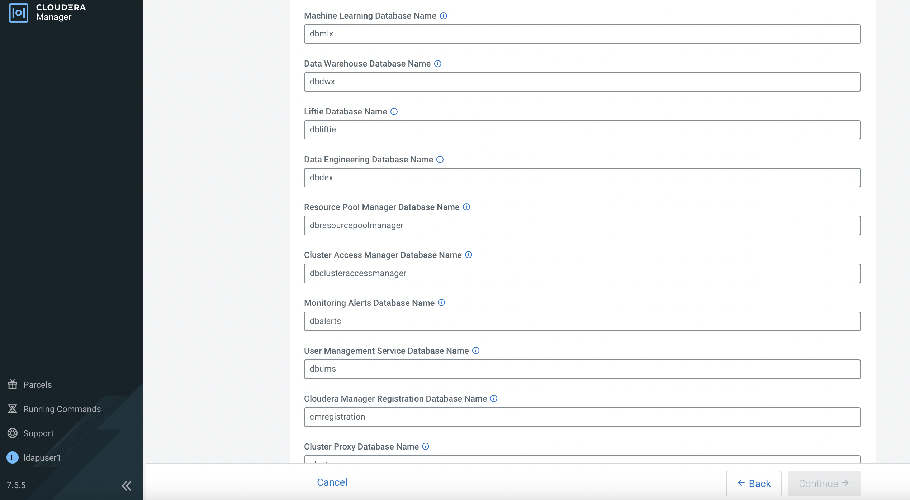

# Data Services Management Console
{: .no_toc }

This article explains the steps to deploy and configure the CDP Data Services environment after the successful installation of [ECS]({{ site.baseurl }}) platform. This sets the stage for hosting CML, CDE and CDW services in the subsequent subtopics.

- TOC
{:toc}

---

1. Navigate to `Clusters` > `Add Cluster`. 
   Select `Private Cloud Base Cluster` and click `Continue`.

    

    

    
    
    
    
    

    
    
    
    
    
    
    
    
    
    
    
    
    
    
    
    
    
    
    
    
    