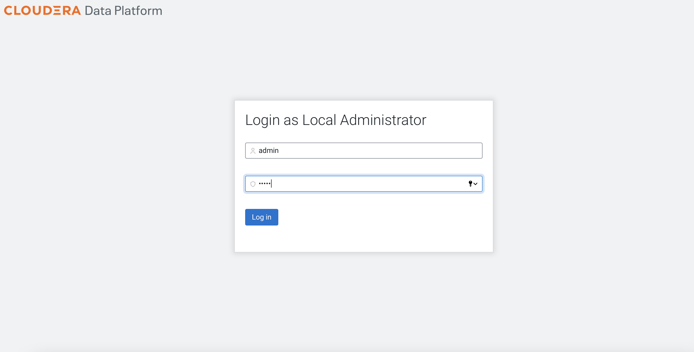
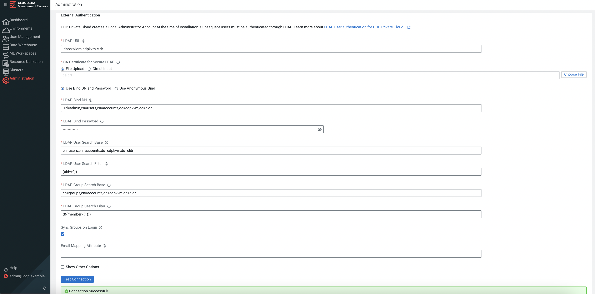
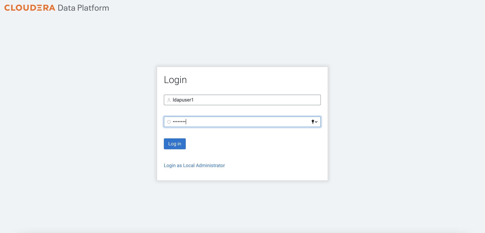
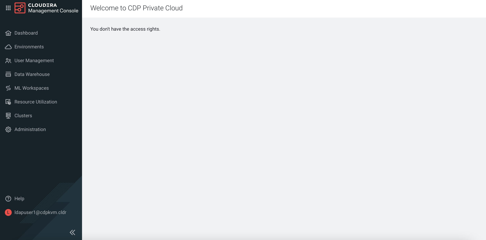
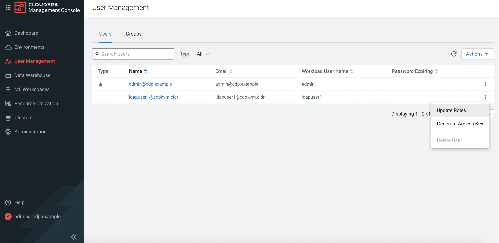
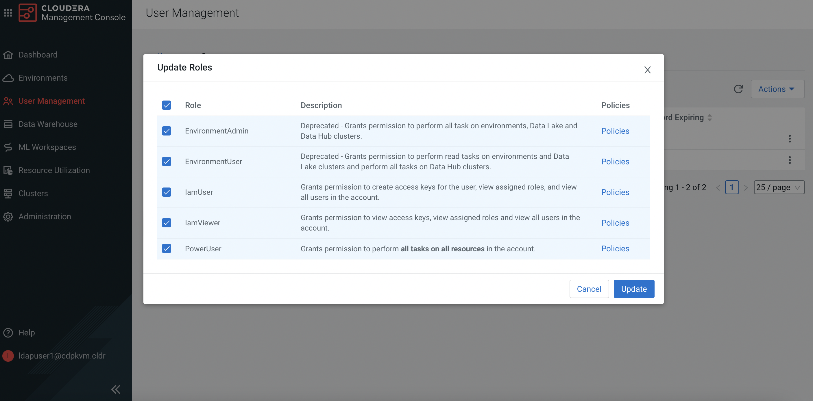
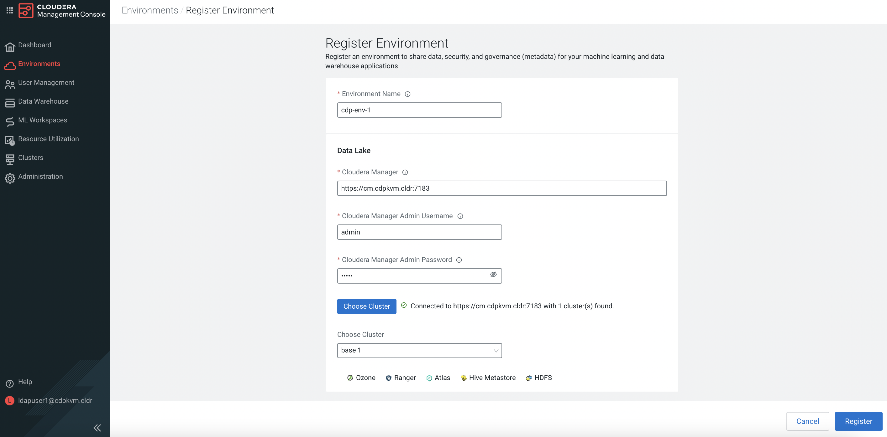
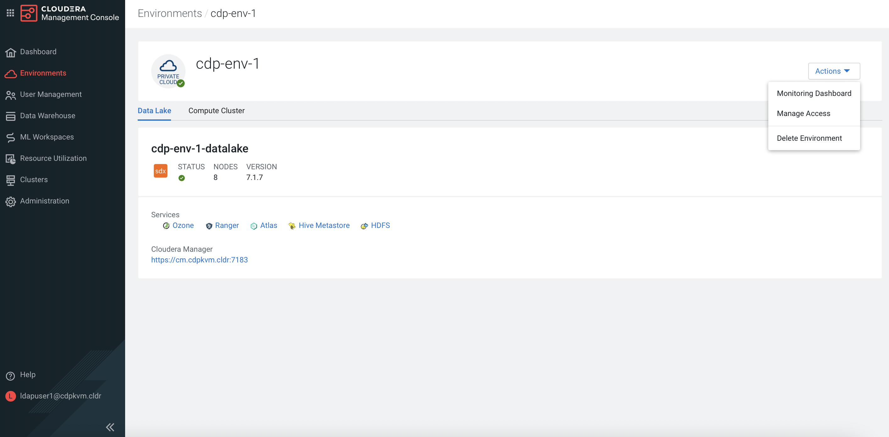
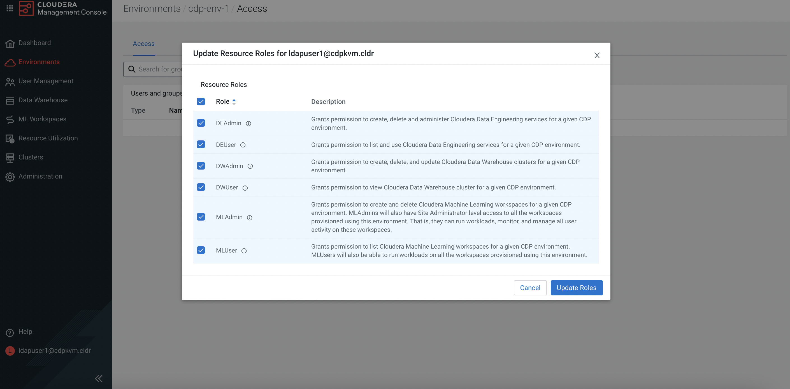

# CDP Data Services Management Console
{: .no_toc }

This article explains the steps to deploy and configure the CDP Data Services environment after successful installation of the [ECS]({{ site.baseurl }}) platform. This sets the stage for hosting CML, CDE and CDW services that will be explained in the subsequent subtopics.

- TOC
{:toc}

---

# LDAP User Setting

1. In CM, navigate to `Data Services`. Click `Open CDP Private Cloud Data Services`. 

    
    
2. The system will redirect the browser to the following page. Click `Management Console`.   

    

3. Log in as the Local Administrator.

    
    
4. Navigate to `Administration` > `Authentication`. The external LDAP server is the centralized user authentication database that stores the user credentials with the associated group. This demo is connected to the Red Hat IPA. Fill in the necessary external LDAP server fields as shown in the following example. Click `Test Connection` and check that the connection is successful. Click `Save`.

    
    
    
    Cross check with the output of the LDAP command as shown in the example below.

    ```bash
    #  ldapsearch  -H ldap://idm.cdpkvm.cldr:389 -D "uid=admin,cn=users,cn=accounts,dc=cdpkvm,dc=cldr" -w 'rootroot' -b "cn=users,cn=accounts,dc=cdpkvm,dc=cldr" '(&(uid=ldapuser1))' | grep -v "#"

    dn: uid=ldapuser1,cn=users,cn=accounts,dc=cdpkvm,dc=cldr
    displayName: ldapuser1 ldapuser1
    uid: ldapuser1
    krbCanonicalName: ldapuser1@CDPKVM.CLDR
    objectClass: top
    objectClass: person
    objectClass: organizationalperson
    objectClass: inetorgperson
    objectClass: inetuser
    objectClass: posixaccount
    objectClass: krbprincipalaux
    objectClass: krbticketpolicyaux
    objectClass: ipaobject
    objectClass: ipasshuser
    objectClass: ipaSshGroupOfPubKeys
    objectClass: mepOriginEntry
    loginShell: /bin/sh
    initials: ll
    gecos: ldapuser1 ldapuser1
    sn: ldapuser1
    homeDirectory: /home/ldapuser1
    mail: ldapuser1@cdpkvm.cldr
    krbPrincipalName: ldapuser1@CDPKVM.CLDR
    givenName: ldapuser1
    cn: ldapuser1 ldapuser1
    ipaUniqueID: 4a377c9c-d82b-11ec-995e-525400b4be20
    uidNumber: 371000021
    gidNumber: 371000021
    krbLastPwdChange: 20220520105515Z
    krbExtraData:: AAKTc4dia2FkbWluZEBDRFBLVk0uQ0xEUgA=
    mepManagedEntry: cn=ldapuser1,cn=groups,cn=accounts,dc=cdpkvm,dc=cldr
    memberOf: cn=ipausers,cn=groups,cn=accounts,dc=cdpkvm,dc=cldr
    krbTicketFlags: 128
    krbLoginFailedCount: 0
    krbPasswordExpiration: 20220818105515Z
    ```
    
    ```bash
    #  ldapsearch  -H ldap://idm.cdpkvm.cldr:389 -D "uid=admin,cn=users,cn=accounts,dc=cdpkvm,dc=cldr" -w 'rootroot' -b "cn=groups,cn=accounts,dc=cdpkvm,dc=cldr" '(&(member=uid=ldapuser1,cn=users,cn=accounts,dc=cdpkvm,dc=cldr))' | grep -v "#"

    dn: cn=ipausers,cn=groups,cn=accounts,dc=cdpkvm,dc=cldr
    objectClass: top
    objectClass: groupofnames
    objectClass: nestedgroup
    objectClass: ipausergroup
    objectClass: ipaobject
    description: Default group for all users
    cn: ipausers
    ipaUniqueID: 894cae12-bcd2-11ec-9ceb-525400b4be20
    member: uid=cmadmin-97fd6767,cn=users,cn=accounts,dc=cdpkvm,dc=cldr
    member: uid=ldapuser1,cn=users,cn=accounts,dc=cdpkvm,dc=cldr
    member: uid=test,cn=users,cn=accounts,dc=cdpkvm,dc=cldr
    ```
    
5. Log out and log in using the LDAP user credential.    

    
    
6. The system is expected to prompt "You don't have the access rights".    
    
    

7. Log out and log in as the Local Administrator. Navigate to `User Management`. Click `Update Roles` next to the LDAP user. 

    
    

8. Select the roles for this LDAP user accordingly. Click `Update Roles`.

    
    

9. Log out and log in as the LDAP user. This time, the LDAP user will get full access rights.


# CDP Data Lake Environment

1. Log in as the LDAP user. Navigate to `Environments`. There is only one environment which is the default environment created by the system upon successful installation of the ECS platform. Click `Register Environment`. Fill in the fields to create a data lake environment for the CDP Data Services to use.
    
    
        

2. Click `Manage Access` of this newly created environment.

    
    

3. Select the DL*, DE* and ML* roles for this LDAP user in this newly created environment accordingly. Click `Update Roles`.

    
    

---    
   Next Step
   {: .label .label-blue } 
   
- Create the CML service in this [subtopic]({{ site.baseurl }}).
- Create the CDW service in this [subtopic]({{ site.baseurl }}).
- Create the CDE service in this [subtopic]({{ site.baseurl }}).
    

    
    

    
    
