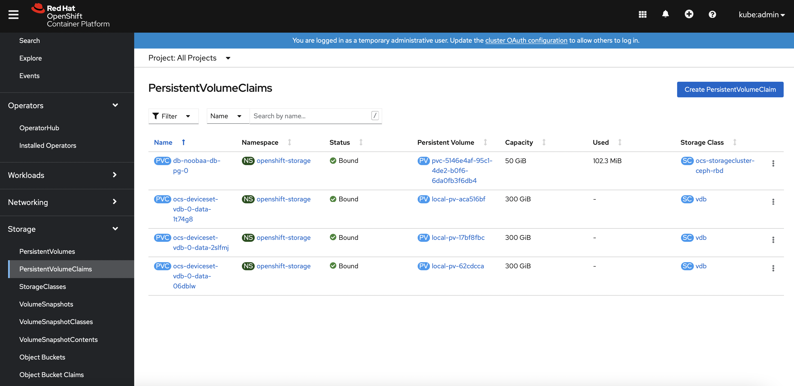
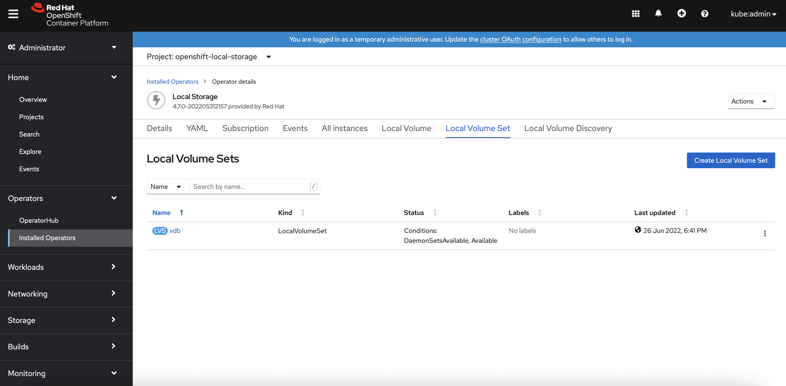

# CDP Data Services Control Plane on Openshift
{: .no_toc }

This article describes the steps to deploy the CDP Data Services Control Plane on the Openshift platform

---

1. blah

    
    
    
       

      
    
    
         

      
    
    
      
    
    
      
    
    
      
    
    
      
    
    
      
    
    
          

       
    
    
      
    
    
      
    
    
      
    
    
          
    
