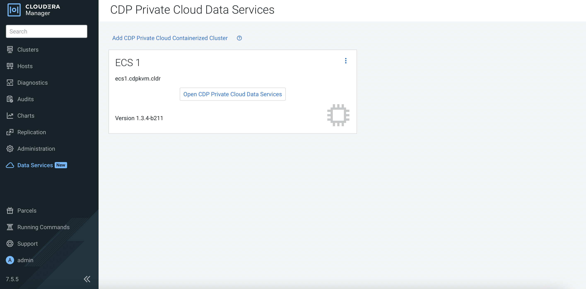
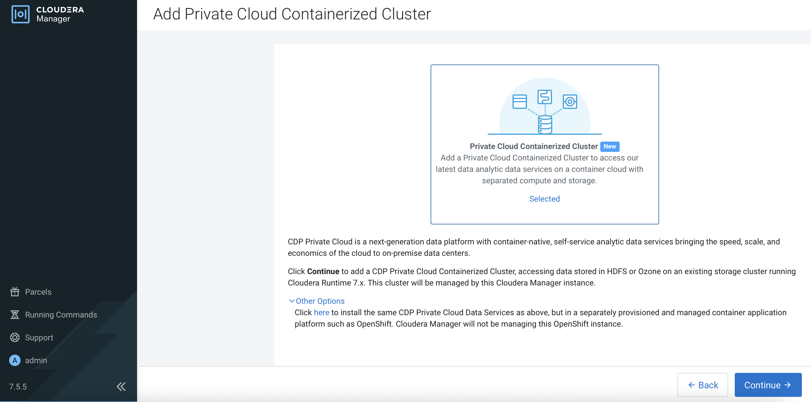
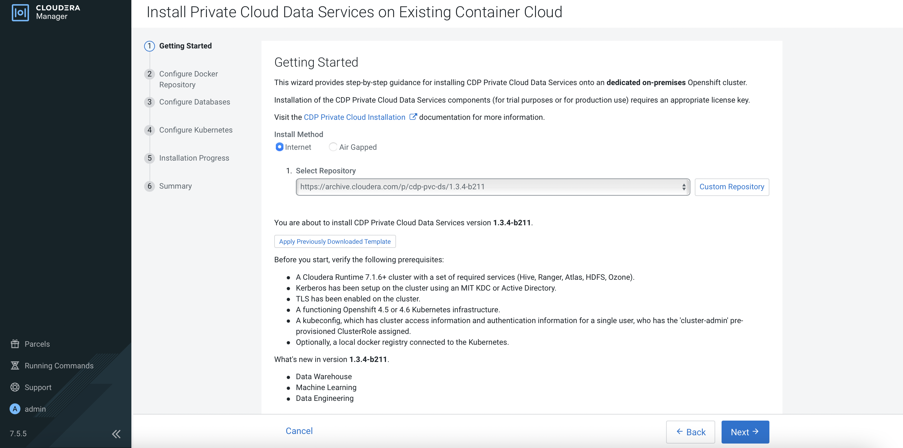
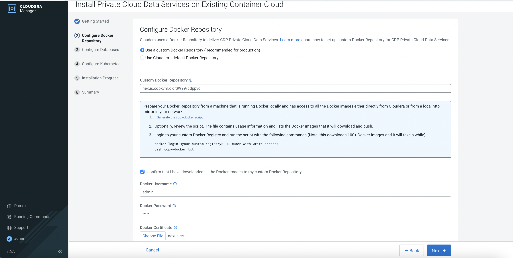
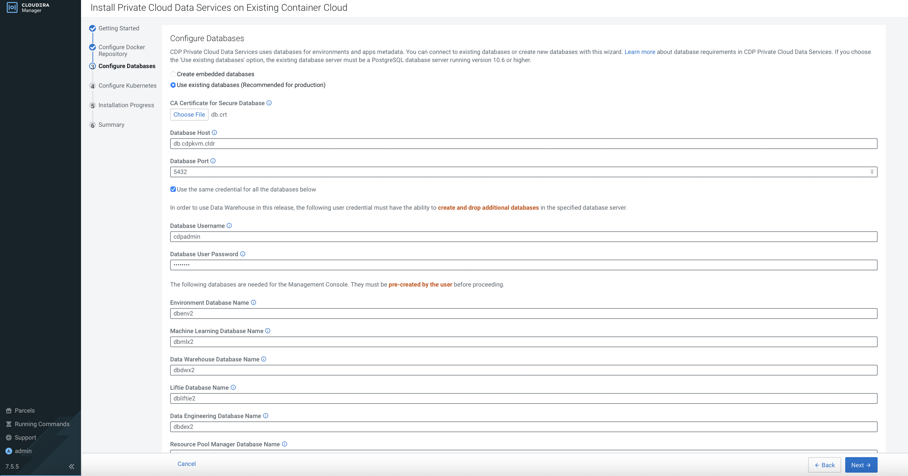
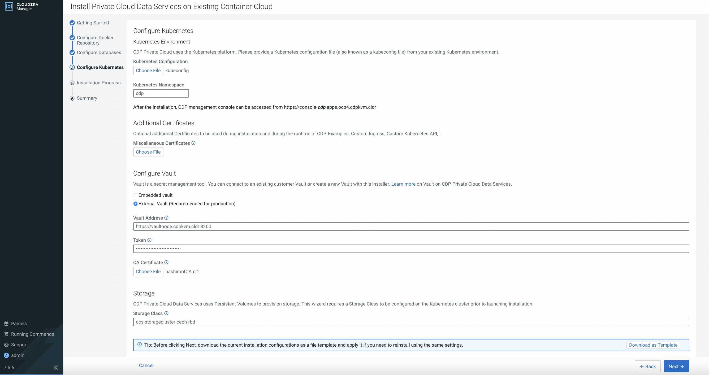
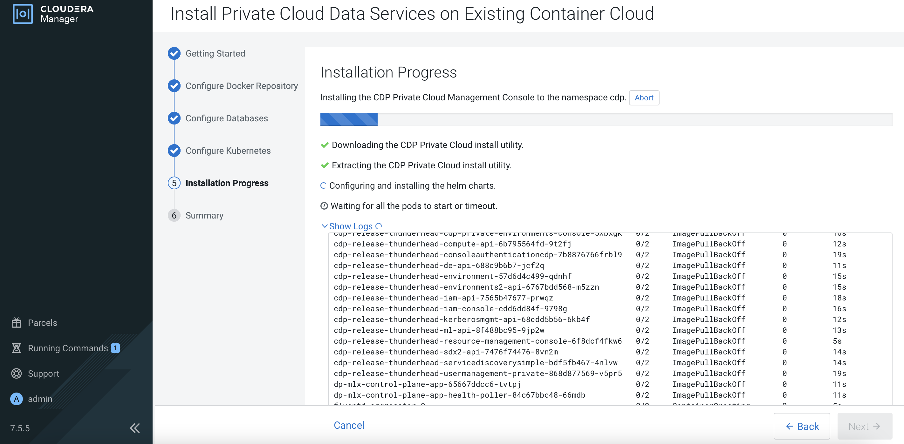
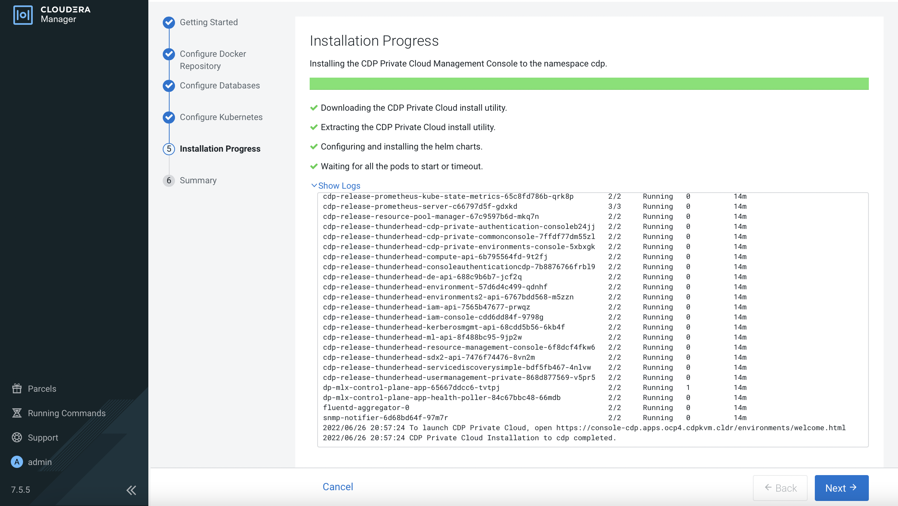
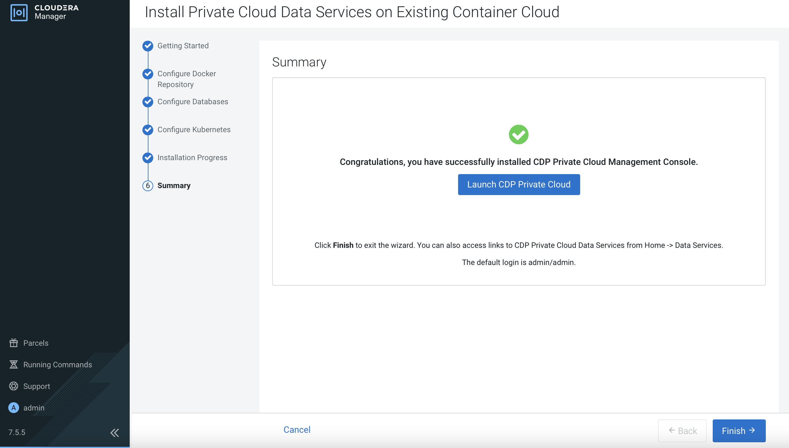

# CDP Data Services Control Plane on Openshift
{: .no_toc }

This article describes the steps to deploy the CDP Data Services Control Plane on the Openshift platform.

- TOC
{:toc}

---

# Install CDP Data Services Control Plane on Openshift
1. In Cloudera Manager portal, navigate to `Data Services` on the left panel and click `Add CDP Private Cloud Containerized Cluster`.

    
    
2. Click `here` link.

       

3. Select the 1.3.4 version and click `Next`.

      
    
4. Select `Use a custom Docker Repository (Recommended for production)` option. Enter the fields based on the setup of the [Docker registry in the Nexus server]({{ site.baseurl }}).

         

5. Select `Use existing databases (Recommended for production)` option. Enter the fields based on the prerequisites highlighted in the [Installation Prerequisites]({{ site.baseurl }}) page.

      
    
6. Select the `kubeconfig` file as highlighted in the [Installation Prerequisites](% link docs/cdppvc/prerequisites.md %}) page. 
For Vault configuration, enter the fields based on the setup of the [Hashicorp Vault]({{ site.baseurl }}). 
For Storage, enter the default block storageClass of the deployed [OCS]({{ site.baseurl }}).

      
    
7. Click `Next`.

      
    
8. Click `Next`.   

      
    
9. Click `Finish`.    

      
    
10. The successful installation creates CDP PvC Control Plane on the Openshift platform as shown below.

      


---    
   Next Step
   {: .label .label-blue } 
   
- Proceed to configure CDP PvC Data Services in this [topic]({{ site.baseurl }}).

# CDP Data Services Control Plane Artifacts
    
```bash
[root@ocpbastion ~]# oc -n cdp get pods
NAME                                                              READY   STATUS    RESTARTS   AGE
cdp-release-alert-admin-service-957bfcb58-8wcr4                   2/2     Running   0          25h
cdp-release-classic-clusters-648cc99645-kr5j7                     3/3     Running   0          25h
cdp-release-cluster-access-manager-69b56fc4db-shvwv               2/2     Running   0          25h
cdp-release-cluster-proxy-1.0.0-7cb6bfbbbd-zwzpr                  2/2     Running   0          25h
cdp-release-cpx-liftie-6568b4669c-tcfwk                           2/2     Running   0          25h
cdp-release-dex-cp-598965f46c-dzg9z                               2/2     Running   0          25h
cdp-release-dmx-55bbfd8cd9-wlqml                                  3/3     Running   0          25h
cdp-release-dps-gateway-1.0-5d58765b8-p5t5m                       3/3     Running   0          25h
cdp-release-dps-gateway-1.0-5d58765b8-scrh2                       3/3     Running   0          25h
cdp-release-dwx-server-76476fc4b5-7nb72                           2/2     Running   0          25h
cdp-release-dwx-ui-865f4998d7-ct5sq                               2/2     Running   0          25h
cdp-release-dwx-ui-865f4998d7-mn7cq                               2/2     Running   0          25h
cdp-release-grafana-54d8b7cf5-64nnm                               3/3     Running   0          25h
cdp-release-logger-alert-receiver-f56f64dc8-4wpzh                 2/2     Running   0          25h
cdp-release-metrics-server-exporter-65f65c54b-2bg7j               2/2     Running   0          25h
cdp-release-monitoring-app-6f6c9b8fb4-dkzdd                       2/2     Running   0          25h
cdp-release-monitoring-metricproxy-b5f85766c-5js7j                2/2     Running   0          25h
cdp-release-monitoring-metricproxy-b5f85766c-6j2dl                2/2     Running   0          25h
cdp-release-monitoring-pvcservice-757bf9bdd4-rmrx4                2/2     Running   0          25h
cdp-release-prometheus-alertmanager-0                             3/3     Running   0          25h
cdp-release-prometheus-alertmanager-1                             3/3     Running   0          25h
cdp-release-prometheus-kube-state-metrics-65c8fd786b-782w2        2/2     Running   0          25h
cdp-release-prometheus-server-c66797d5f-gqlsx                     3/3     Running   0          25h
cdp-release-reloader-676bb9945c-pmjfb                             1/1     Running   0          25h
cdp-release-resource-pool-manager-67dbdfcdd8-6bg9f                2/2     Running   0          25h
cdp-release-thunderhead-cdp-private-authentication-consoletp42g   2/2     Running   0          25h
cdp-release-thunderhead-cdp-private-commonconsole-7ffdf77d4qhnw   2/2     Running   0          25h
cdp-release-thunderhead-cdp-private-environments-console-5ggnpv   2/2     Running   0          25h
cdp-release-thunderhead-compute-api-6b795564fd-s9jj2              2/2     Running   0          25h
cdp-release-thunderhead-consoleauthenticationcdp-8c765dd9725plv   2/2     Running   0          25h
cdp-release-thunderhead-de-api-688c9b6b7-4w5xn                    2/2     Running   0          25h
cdp-release-thunderhead-environment-69b8cd49c5-t878p              2/2     Running   0          25h
cdp-release-thunderhead-environments2-api-6767bdd568-59r8s        2/2     Running   0          25h
cdp-release-thunderhead-iam-api-7565b47677-njsqt                  2/2     Running   0          25h
cdp-release-thunderhead-iam-console-cdd6dd84f-cp98q               2/2     Running   0          25h
cdp-release-thunderhead-kerberosmgmt-api-68cdd5b56-s7qzc          2/2     Running   0          25h
cdp-release-thunderhead-ml-api-8f488bc95-jhq6k                    2/2     Running   0          25h
cdp-release-thunderhead-resource-management-console-6f8dcfsb7nk   2/2     Running   0          25h
cdp-release-thunderhead-sdx2-api-7476f74476-g7lr7                 2/2     Running   0          25h
cdp-release-thunderhead-servicediscoverysimple-bdf5fb467-8whfw    2/2     Running   0          25h
cdp-release-thunderhead-usermanagement-private-5f494b96dd-vwbwp   2/2     Running   0          25h
dp-mlx-control-plane-app-5ff67bdf77-76t46                         2/2     Running   0          25h
dp-mlx-control-plane-app-health-poller-66fd654d9f-zwvtm           2/2     Running   0          25h
fluentd-aggregator-0                                              2/2     Running   0          25h
snmp-notifier-7498cc86bc-rk4g6                                    2/2     Running   0          25h
```

```bash
[root@ocpbastion ~]# oc -n cdp get pvc
NAME                                                   STATUS   VOLUME                                     CAPACITY   ACCESS MODES   STORAGECLASS                  AGE
cdp-release-prometheus-server                          Bound    pvc-7aea8799-4f24-413e-a3e2-c49c396dbc56   10Gi       RWO            ocs-storagecluster-ceph-rbd   25h
logs                                                   Bound    pvc-2a6dbf72-2bbe-424c-b8af-4c5e65904745   20Gi       RWO            ocs-storagecluster-ceph-rbd   25h
storage-volume-cdp-release-prometheus-alertmanager-0   Bound    pvc-ddcad581-310b-4320-a234-13081c888f9c   2Gi        RWO            ocs-storagecluster-ceph-rbd   25h
storage-volume-cdp-release-prometheus-alertmanager-1   Bound    pvc-39ff2e13-2df2-45ad-88b4-2cd666099842   2Gi        RWO            ocs-storagecluster-ceph-rbd   25h
```

