# Embedded Container Service (ECS) Installation
{: .no_toc }

This article explains the necessary steps to install the ECS platform upon successful [deployment and configuration of CDP Base cluster]({{ site.baseurl }}). Please ensure that all the [Prerequisites]({{ site.baseurl }}) have already been prepared.

- TOC
{:toc}

---

## Sanity Check

1. Ensure that JDK has already been installed in each ECS node.

    ```bash
    # rpm -qa | grep jdk
    copy-jdk-configs-3.3-10.el7_5.noarch
    java-11-openjdk-11.0.14.1.1-1.el7_9.x86_64
    java-11-openjdk-headless-11.0.14.1.1-1.el7_9.x86_64
    java-11-openjdk-devel-11.0.14.1.1-1.el7_9.x86_64
    ```

2. The external DNS server is able to resolve the hostname and perform reverse DNS lookup. Repeat this step for all ECS nodes.

    ```bash
    # nslookup idm
    Server:		10.15.4.150
    Address:	10.15.4.150#53

    Name:	idm.cdpkvm.cldr
    Address: 10.15.4.150

    # nslookup 10.15.4.150
    150.4.15.10.in-addr.arpa	name = idm.cdpkvm.cldr.
    ```

3. NTP client of each ECS node is synchronizing time with the external NTP server.

4. Ensure that ECS master node is able to resolve `console-cdp.apps.ecs1.cdpkvm.cldr` to the IP address of ECS master/server node.

    ```bash
    # nslookup console-cdp.apps.ecs1.cdpkvm.cldr
    Server:		10.15.4.150
    Address:	10.15.4.150#53

    Name:	console-cdp.apps.ecs1.cdpkvm.cldr
    Address: 10.15.4.166
    ```
    
## ECS Platform Installation

1. Navigate to `Clusters` > `Add Cluster`. Select `Private Cloud Base Cluster` and click `Continue`.

    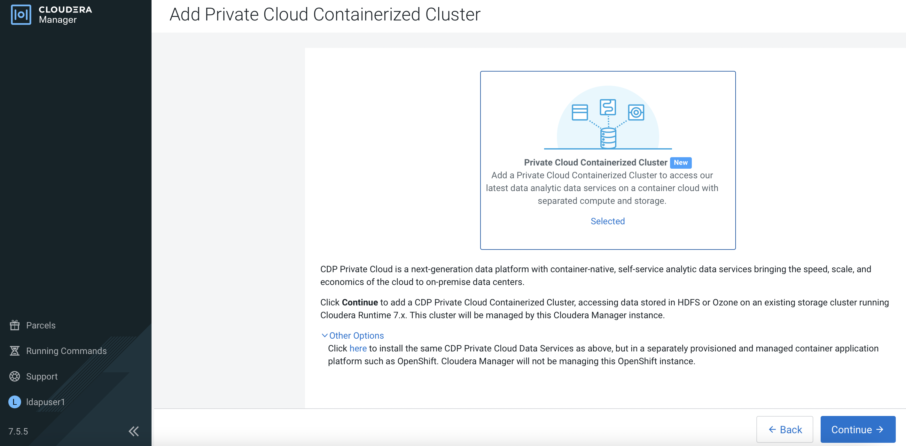
    
2. Select `Internet` and click `Continue`. 

    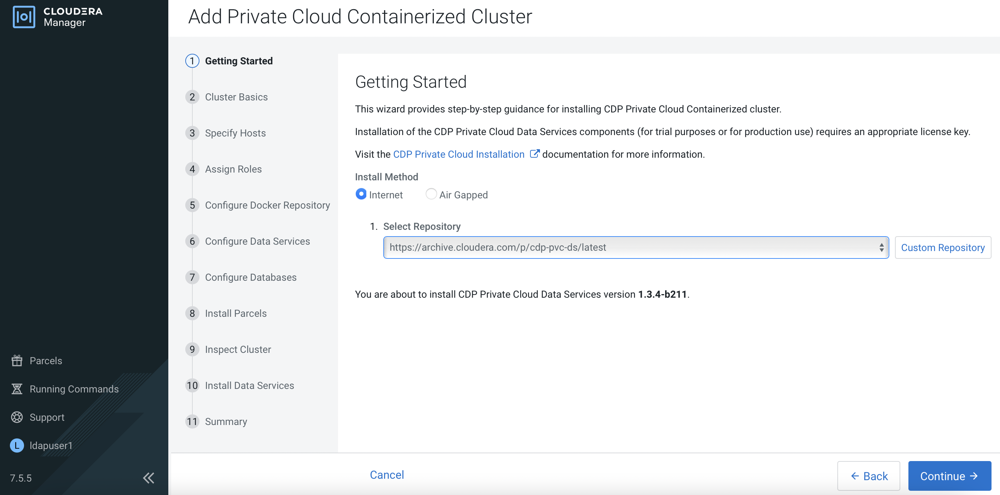

3. Enter the FQDN of each ECS host and click `Search`. Upon successful scan, the hostname alongside each host's IP address will appear. Check the details before clicking `Continue`.

    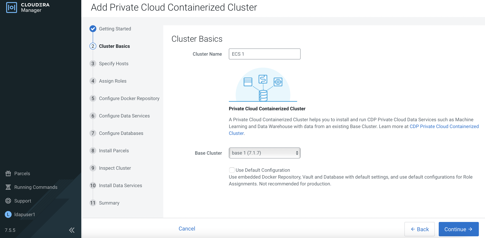
    
4. Ensure that JDK has already been installed in each ECS host. Select `Manually manage JDK` and click `Continue`.

    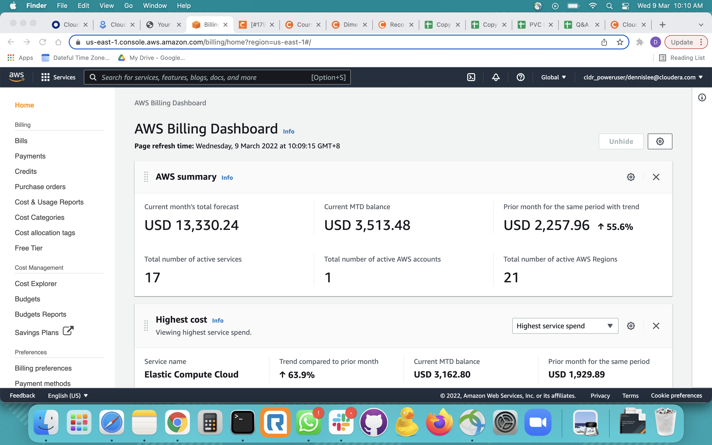

5. Enter the login credentials. Click `Continue`. 

    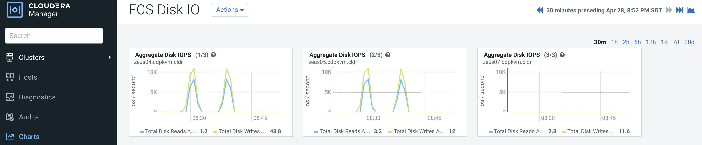
    
6. CM is installing the agent in each ECS host in parallel and will subsequently install the parcels.
    
    
    
7. Select all ECS nodes in the `Docker Server` field. Select the ECS master node in the `Ecs Server` field and select the ECS worker nodes in the `Ecs Agent` field. Click `View By Host` to confirm your choices. Click `Close` and `Continue`.   
    
    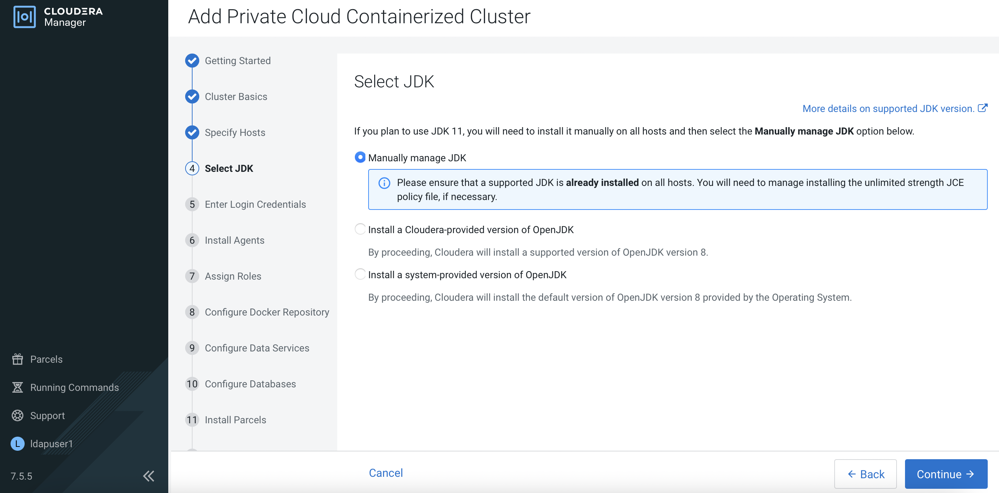
    
    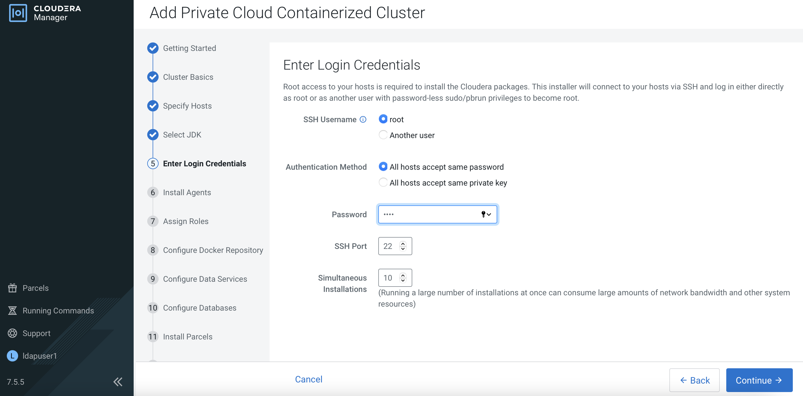
    
8. Click `Continue`.
    
    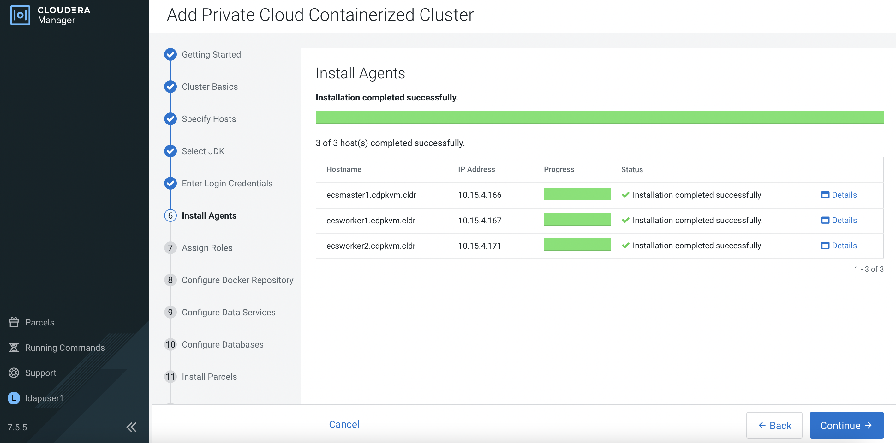
    
9. Review and amend the parameters accordingly. Directory path for Longhorn storage and local SSD/NVMe (for CDW cache) in each node must be configured here in accordance to the mounted disk folder name. Dedicated storage disk that is expected to be formatted and mounted prior to this installation as explained in the [Prerequisites]({{ site.baseurl }}) subtopic. The value for `Application Domain` field will determine the subdomain of wildcard DNS.
    
    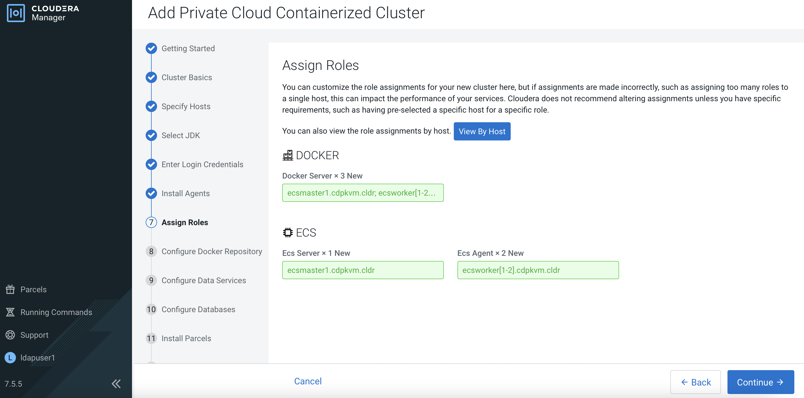
    
10. Fill the database parameters based on the created databases in PostgreSQL. Click `Test Connection`. After getting successful result, click `Continue`.
    
    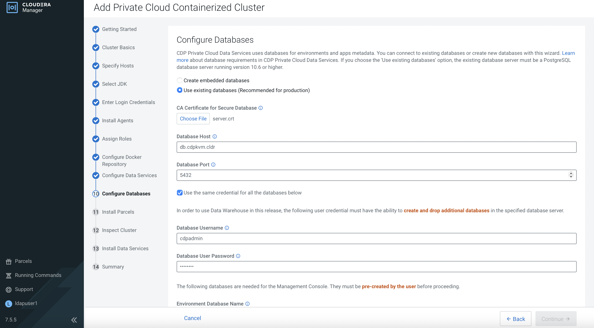
    
    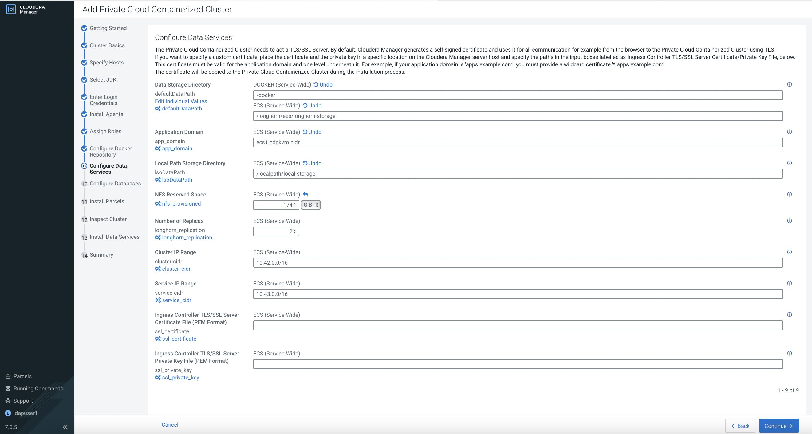

12. CM is installing the parcels in each ECS host in parallel.

    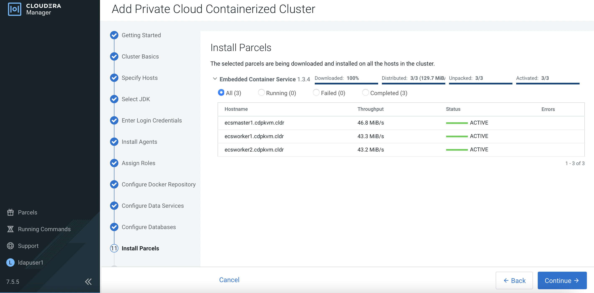
    
14. Select `Inspect hosts`. Check the results if needed. Otherwise, click `Continue`. 
    
     
    
15. CM will proceed to install the ECS platform. This process will take some time to complete. After successful installation, click `Continue`. 
    
    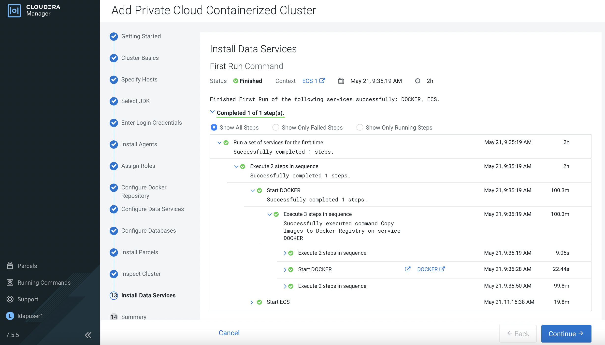  
    
16. Navigate to `Clusters` > `ECS 1`. Status of all components are supposed to be in green mode as depicted below.

      
    
17. Click `ECS`. You may explore other dashboards such as `Storage UI` and `ECS Web UI`.  

    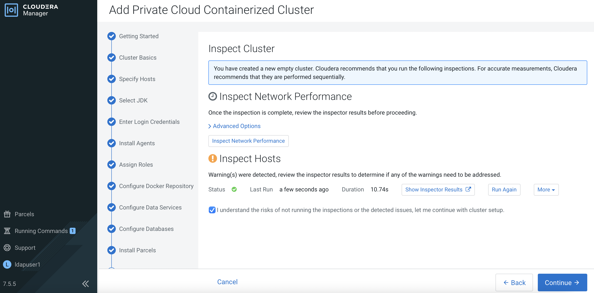  
    
---    
   Next Step
   {: .label .label-blue } 
- Proceed to configure CDP Data Services Management Console in the next [subtopic]({{ site.baseurl }}).
        
