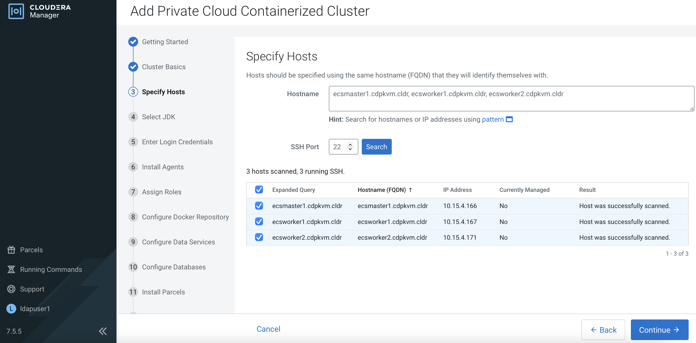
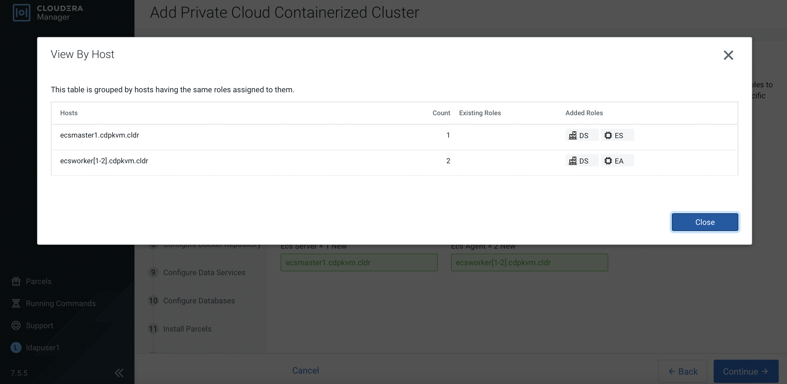
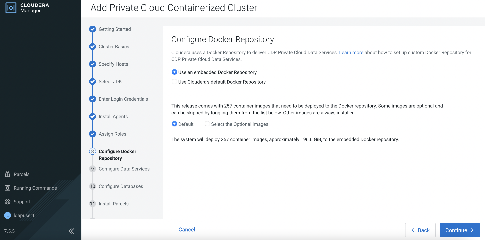
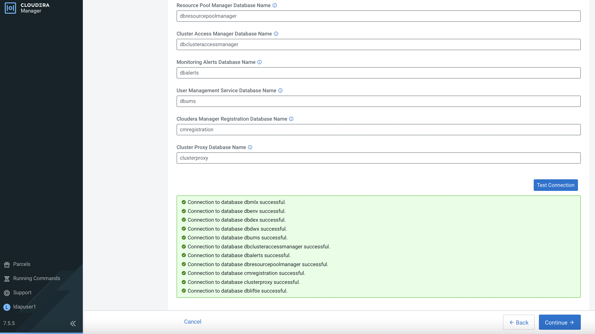
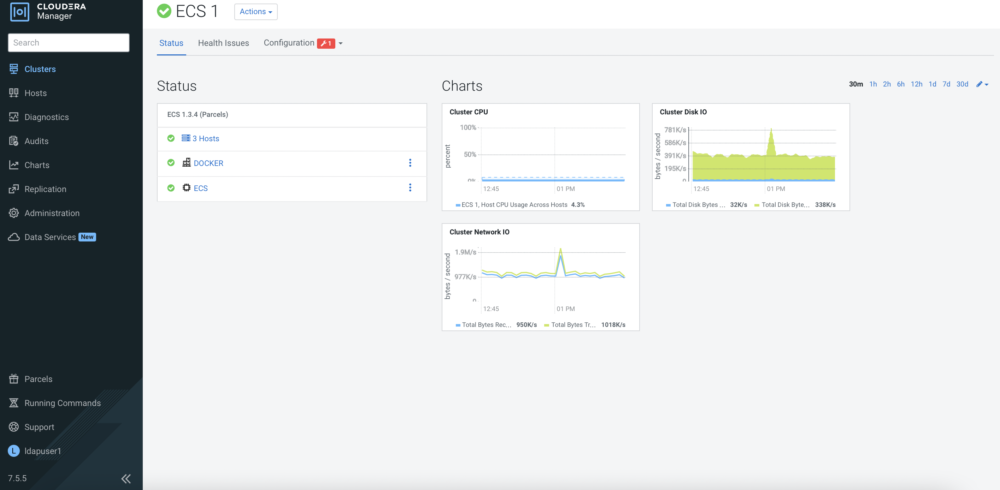
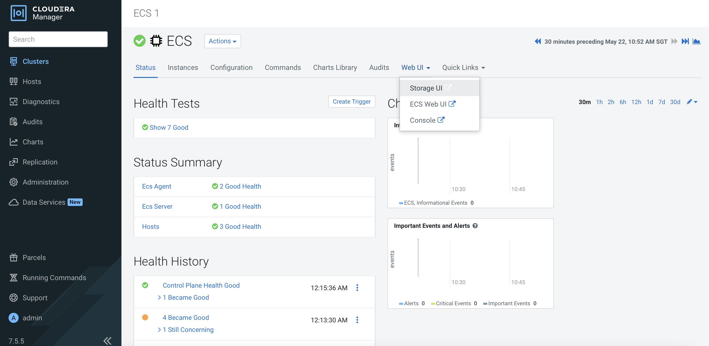

# Embedded Container Service (ECS) Installation
{: .no_toc }

This article

- TOC
{:toc}

---

## Sanity Check

1. Ensure that JDK has already been installed in each ECS node.

    ```bash
    # rpm -qa | grep jdk
    copy-jdk-configs-3.3-10.el7_5.noarch
    java-11-openjdk-11.0.14.1.1-1.el7_9.x86_64
    java-11-openjdk-headless-11.0.14.1.1-1.el7_9.x86_64
    java-11-openjdk-devel-11.0.14.1.1-1.el7_9.x86_64
    ```

2. The external DNS server is able to resolve the hostname and perform reverse DNS lookup. Please this step for all ECS nodes.

    ```bash
    # nslookup idm
    Server:		10.15.4.150
    Address:	10.15.4.150#53

    Name:	idm.cdpkvm.cldr
    Address: 10.15.4.150

    # nslookup 10.15.4.150
    150.4.15.10.in-addr.arpa	name = idm.cdpkvm.cldr.
    ```

3. NTP client of each ECS node is synchronizing time with the external NTP server.

4. Each ECS node has already been registered with the external Kerberos server.

    ```bash
    # ipa host-show bmaster1
    Host name: bmaster1.cdpkvm.cldr
    Principal name: host/bmaster1.cdpkvm.cldr@CDPKVM.CLDR
    Principal alias: host/bmaster1.cdpkvm.cldr@CDPKVM.CLDR
    SSH public key fingerprint: SHA256:dyShLpzkqlRHc2LHiqXDbhM8ynT7v4yjZP4CZ212tqU root@bmaster1.cdpkvm.cldr (ssh-rsa),
                              SHA256:C+BAHEBbVAXfhUIpdFxoL2MOkF5pUGATuKnFQXCgJnc root@bmaster1.cdpkvm.cldr (ssh-rsa),
                              SHA256:/COofNFRyGmwAGR6sfonAcXtc/Knjs5/an1+SMX/8GA (ecdsa-sha2-nistp256), SHA256:OL8ZeU7+2E4yl7rsvKftXYTM7Bvr8fEVuxQaQBouwwo
                              (ssh-ed25519)
    Password: False
    Keytab: True
    Managed by: bmaster1.cdpkvm.cldr
    ```

## Install ECS on CDP PvC Platform

1. Navigate to `Clusters` > `Add Cluster`. 
   Select `Private Cloud Base Cluster` and click `Continue`.

    

    

2. Enter the Cluster Name and click `Continue`. 

    

    
    
    
    
    
    
    
    
    
    
    
    
    
    
    
    
    
    
    
    
        
    
      
    
      
    
      
    
     