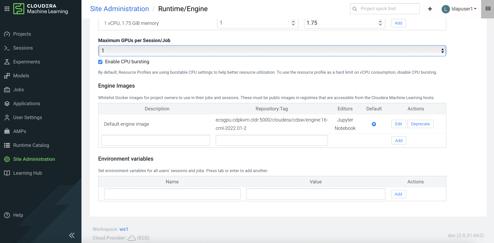

# Nvidia GPU in ECS
{: .no_toc }

This article describes the steps to install the Nvidia GPU software driver and its associated software in the CDP PvC Data Services platform with ECS solution. These implementation steps must be carried out after the node (with Nvidia GPU card) is added into the ECS platform/cluster. This article also describes the steps to test the GPU card in the CML workspace.

- TOC
{:toc}

---

## Install Nvidia Driver and Nvidia-container-runtime

1. Based on the Nvidia GPU card specification, browse the Nvidia [site](https://www.nvidia.com/Download/index.aspx?lang=en-us) in order to check which software driver version to use. This demo uses Nvidia A100 GPU card and a check at the Nvidia site shows that version `515.65.01` is recommended.

    

    

2. Cordon the GPU worker node.

    ```bash
    # kubectl cordon ecsgpu.cdpkvm.cldr 
    node/ecsgpu.cdpkvm.cldr cordoned
    ```

3. In the ECS host/node installed with Nvidia GPU card, install the necessary OS software packages as described below and subsequently reboot the node. In this demo, the OS of the node is Centos7.9 and the hostname of the node with GPU card installed is `ecsgpu.cdpkvm.cldr`.

    ```bash
    # yum update -y

    # yum install -y tar bzip2 make automake gcc gcc-c++ pciutils elfutils-libelf-devel libglvnd-devel vim bind-utils wget

    # yum install -y https://dl.fedoraproject.org/pub/epel/epel-release-latest-7.noarch.rpm

    # yum -y group install "Development Tools"

    # yum install -y kernel-devel-$(uname -r) kernel-headers-$(uname -r)
    
    # reboot
    ```

4. Subsequently, install the Nvidia driver and `nvidia-container-runtime` software by executing the following commands.

    ```bash
    # BASE_URL=https://us.download.nvidia.com/tesla
    # DRIVER_VERSION=515.65.01
    # curl -fSsl -O $BASE_URL/$DRIVER_VERSION/NVIDIA-Linux-x86_64-$DRIVER_VERSION.run
    # sh NVIDIA-Linux-x86_64-$DRIVER_VERSION.run
    ```
    
      
    
     

        
    

5. After successful installation, run the `nvidia-smi` tool and ensure the driver is deployed successfully by verifying the similar output as shown in the following example.

    ```bash
    [root@ecsgpu ~]# nvidia-smi    
    Wed Aug 24 13:03:46 2022       
    +-----------------------------------------------------------------------------+
    | NVIDIA-SMI 515.65.01    Driver Version: 515.65.01    CUDA Version: 11.7     |
    |-------------------------------+----------------------+----------------------+
    | GPU  Name        Persistence-M| Bus-Id        Disp.A | Volatile Uncorr. ECC |
    | Fan  Temp  Perf  Pwr:Usage/Cap|         Memory-Usage | GPU-Util  Compute M. |
    |                               |                      |               MIG M. |
    |===============================+======================+======================|
    |   0  NVIDIA A100-PCI...  Off  | 00000000:08:00.0 Off |                    0 |
    | N/A   32C    P0    37W / 250W |      0MiB / 40960MiB |      3%      Default |
    |                               |                      |             Disabled |
    +-------------------------------+----------------------+----------------------+
                                                                               
    +-----------------------------------------------------------------------------+
    | Processes:                                                                  |
    |  GPU   GI   CI        PID   Type   Process name                  GPU Memory |
    |        ID   ID                                                   Usage      |
    |=============================================================================|
    |  No running processes found                                                 |
    +-----------------------------------------------------------------------------+
    
    [root@ecsgpu ~]# lsmod | grep nvidia
    nvidia_drm             53212  0 
    nvidia_modeset       1142094  1 nvidia_drm
    nvidia              40761292  1 nvidia_modeset
    drm_kms_helper        186531  3 qxl,nouveau,nvidia_drm
    drm                   468454  7 qxl,ttm,drm_kms_helper,nvidia,nouveau,nvidia_drm
    
    [root@ecsgpu ~]# dmesg | grep nvidia
    [  123.588172] nvidia: loading out-of-tree module taints kernel.
    [  123.588182] nvidia: module license 'NVIDIA' taints kernel.
    [  123.704411] nvidia: module verification failed: signature and/or required key missing - tainting kernel
    [  123.802826] nvidia-nvlink: Nvlink Core is being initialized, major device number 239
    [  123.925577] nvidia-uvm: Loaded the UVM driver, major device number 237.
    [  123.934813] nvidia-modeset: Loading NVIDIA Kernel Mode Setting Driver for UNIX platforms  515.65.01  Wed Jul 20 13:43:59 UTC 2022
    [  123.940999] [drm] [nvidia-drm] [GPU ID 0x00000800] Loading driver
    [  123.941018] [drm] Initialized nvidia-drm 0.0.0 20160202 for 0000:08:00.0 on minor 1
    [  123.958317] [drm] [nvidia-drm] [GPU ID 0x00000800] Unloading driver
    [  123.968642] nvidia-modeset: Unloading
    [  123.978362] nvidia-uvm: Unloaded the UVM driver.
    [  123.993831] nvidia-nvlink: Unregistered Nvlink Core, major device number 239
    [  137.450679] nvidia-nvlink: Nvlink Core is being initialized, major device number 240
    [  137.503657] nvidia-modeset: Loading NVIDIA Kernel Mode Setting Driver for UNIX platforms  515.65.01  Wed Jul 20 13:43:59 UTC 2022
    [  137.508187] [drm] [nvidia-drm] [GPU ID 0x00000800] Loading driver
    [  137.508190] [drm] Initialized nvidia-drm 0.0.0 20160202 for 0000:08:00.0 on minor 1
    [  149.717193] nvidia 0000:08:00.0: irq 48 for MSI/MSI-X
    [  149.717222] nvidia 0000:08:00.0: irq 49 for MSI/MSI-X
    [  149.717248] nvidia 0000:08:00.0: irq 50 for MSI/MSI-X
    [  149.717275] nvidia 0000:08:00.0: irq 51 for MSI/MSI-X
    [  149.717301] nvidia 0000:08:00.0: irq 52 for MSI/MSI-X
    [  149.717330] nvidia 0000:08:00.0: irq 53 for MSI/MSI-X
    ```

6. Install the `nvidia-container-runtime` software package. Reboot the server.

    ```bash
    # curl -s -L https://nvidia.github.io/nvidia-container-runtime/$(. /etc/os-release;echo $ID$VERSION_ID)/nvidia-container-runtime.repo |  sudo tee /etc/yum.repos.d/nvidia-container-runtime.repo
    
    # yum -y install nvidia-container-runtime
    
    # rpm -qa | grep nvidia
    libnvidia-container-tools-1.11.0-1.x86_64
    libnvidia-container1-1.11.0-1.x86_64
    nvidia-container-toolkit-base-1.11.0-1.x86_64
    nvidia-container-runtime-3.11.0-1.noarch
    nvidia-container-toolkit-1.11.0-1.x86_64
    
    # nvidia-container-toolkit -version
    NVIDIA Container Runtime Hook version 1.11.0
    commit: d9de4a0

    # reboot 
    ```

7. Uncordon the GPU worker node. 

    ```bash
    # kubectl uncordon ecsgpu.cdpkvm.cldr 
    node/ecsgpu.cdpkvm.cldr cordoned
    ```
    
## Nvidia GPU Card Testing and Verification in CML

1. Assuming the CDP PvC Data Services with ECS platform is already installed, SSH into the ECS master node and run the following command to ensure that `ecsgpu.cdpkvm.cldr` host has `nvidia.com/gpu:` field in the node specification. Host `ecsgpu.cdpkvm.cldr` is a typical ECS worker node without Nvidia GPU card installed.

    ```bash
    [root@ecsmaster1 ~]# kubectl describe node ecsgpu.cdpkvm.cldr | grep -A15 Capacity:
    Capacity:
        cpu:                16
        ephemeral-storage:  209703916Ki
        hugepages-1Gi:      0
        hugepages-2Mi:      0
        memory:             263975200Ki
        nvidia.com/gpu:     1
        pods:               110
    Allocatable:
        cpu:                16
        ephemeral-storage:  203999969325
        hugepages-1Gi:      0
        hugepages-2Mi:      0
        memory:             263975200Ki
        nvidia.com/gpu:     1
        pods:               110
  
    [root@ecsmaster1 ~]# kubectl describe node ecsworker1.cdpkvm.cldr | grep -A13 Capacity:
    Capacity:
        cpu:                16
        ephemeral-storage:  103797740Ki
        hugepages-1Gi:      0
        hugepages-2Mi:      0
        memory:             263974872Ki
        pods:               110
    Allocatable:
        cpu:                16
        ephemeral-storage:  100974441393
        hugepages-1Gi:      0
        hugepages-2Mi:      0
        memory:             263974872Ki
        pods:               110
    ```   


2. Assuming a CML workspace is already provisioned in the CDP PvC Data Services platform, navigate to `Site Administration` > `Runtime/Engine`. Select the number for `Maximum GPUs per Session/GPU`. This procedure effectively allows the CML session to consume the GPU card.   

    

3. Create a CML project and start a new session by selecting the `Workbench` editor with Python kernel alongside `Nvidia GPU` edition. Choose the number of GPU to use - in this demo, the quantity is 1.

    
    
4. Create a new Python file and run the following script. Also, open the terminal session and run `nvidia-smi` tool. Note that the output shows the Nvidia GPU card details.

    ```yaml
    !pip3 install torch
    import torch
    
    torch.cuda.is_available()
    torch.cuda.device_count()
    torch.cuda.get_device_name(0)
    ```

       

5. Navigate to the CML project main page and a check at the user resources dashboard displays the GPU card availability.
    
    
    
    
    

6. SSH into the ECS master node and run the following command to verify the node that hosting the above CML project session pod is `ecsgpu.cdpkvm.cldr`.

    ```bash
    [root@ecsmaster1 ~]# oc -n workspace1-user-1 describe pod wifz6t8mvxv5ghwy | grep Node:
    Node:         ecsgpu.cdpkvm.cldr/10.15.4.185
    
    [root@ecsmaster1 ~]# oc -n workspace1-user-1 describe pod wifz6t8mvxv5ghwy | grep -B2 -i nvidia
        Limits:
            memory:          7714196Ki
            nvidia.com/gpu:  1
        --
            cpu:             1960m
            memory:          7714196Ki
            nvidia.com/gpu:  1
        --
    ```

7. When a process is consuming the Nvidia GPU, the output of `nvidia-smi` tool will show the PID of that process (in this case, the CML session pod).

    ```bash
    [root@ecsgpu ~]# nvidia-smi
    Thu Aug 25 13:58:40 2022       
    +-----------------------------------------------------------------------------+
    | NVIDIA-SMI 515.65.01    Driver Version: 515.65.01    CUDA Version: 11.7     |
    |-------------------------------+----------------------+----------------------+
    | GPU  Name        Persistence-M| Bus-Id        Disp.A | Volatile Uncorr. ECC |
    | Fan  Temp  Perf  Pwr:Usage/Cap|         Memory-Usage | GPU-Util  Compute M. |
    |                               |                      |               MIG M. |
    |===============================+======================+======================|
    |   0  NVIDIA A100-PCI...  Off  | 00000000:08:00.0 Off |                    0 |
    | N/A   29C    P0    35W / 250W |  39185MiB / 40960MiB |      0%      Default |
    |                               |                      |             Disabled |
    +-------------------------------+----------------------+----------------------+
                                                                   
    +-----------------------------------------------------------------------------+
    | Processes:                                                                  |
    |  GPU   GI   CI        PID   Type   Process name                  GPU Memory |
    |        ID   ID                                                   Usage      |
    |=============================================================================|
    |   0   N/A  N/A     29990      C   /usr/local/bin/python3.9       39183MiB   |
    +-----------------------------------------------------------------------------+
    ```
    
8. In the event the ECS platform has no available worker node with GPU card, provisioning a session with GPU will result in `Pending` state as the system is looking for a worker node installed with at least one Nvidia GPU card.
    
        
    
