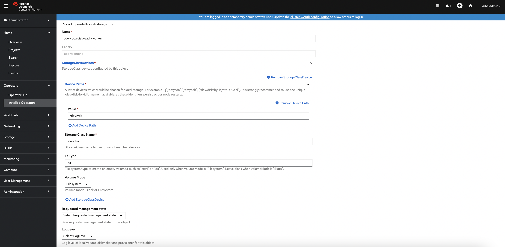
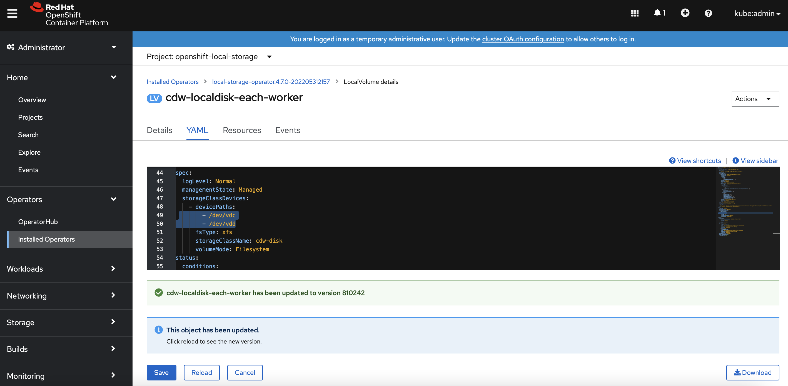

# CDW Disk in Openshift
{: .no_toc }

This article describes the steps to deploy and scale the direct attached disk(s) in each Openshift worker node for CDW by using the `Local Storage Operator` in Openshift platform.
Please note that the sizing of the direct attached disk for CDW illustrated in this demo does not match the production requirements. For production requirements, please refer to this [link](https://docs.cloudera.com/data-warehouse/1.3.4/private-cloud-getting-started/topics/dw-private-cloud-openshift-get-started-requirements.html).

- TOC
{:toc}

---


## Deploy CDW Disk in Openshift

1. Install the `Local Storage Operator` based on the published procedure in this [link](https://docs.openshift.com/container-platform/4.7/storage/persistent_storage/persistent-storage-local.html).

2. In Openshift dashboard, navigate to `Operators` > `Installed Operators` > `Local Storage Operator` > `All Instances`. Click `Create New` > `Local Volume`.

    
    
3. Enter the fields based on the identical device path of the direct attached disk for each Openshift worker node. In this demo, the device path is `/dev/vdc`.

    

    
    
4. Successful implementation will produce the following local persistent volumes automatically. In this demo, each Openshift worker node has a single 400Gi direct attached SSD.

    ```bash
    [root@ocpbastion ~]# oc get pv | head -1; oc get pv | grep local
    NAME                                       CAPACITY   ACCESS MODES   RECLAIM POLICY   STATUS      CLAIM                                                                                          STORAGECLASS                  REASON   AGE
    local-pv-12e7ab5                           400Gi      RWO            Delete           Available                                                                                                  cdw-disk                               2m33s
    local-pv-17bf8fbc                          300Gi      RWO            Delete           Bound       openshift-storage/ocs-deviceset-vdb-0-data-2slfmj                                            vdb                                    24h
    local-pv-33a6a00a                          400Gi      RWO            Delete           Available                                                                                                  cdw-disk                               2m34s
    local-pv-62cdcca                           300Gi      RWO            Delete           Bound       openshift-storage/ocs-deviceset-vdb-0-data-06dblw                                            vdb                                    24h   
    local-pv-abb1e063                          400Gi      RWO            Delete           Available                                                                                                 cdw-disk                               2m34s
    local-pv-aca516bf                          300Gi      RWO            Delete           Bound       openshift-storage/ocs-deviceset-vdb-0-data-1t74g8                                            vdb                                    24h
    ```    

5. Successful implememtation also creates a new storageClass `cdw-disk` ready to be consumed by CDW.

    ```bash
    [root@ocpbastion ~]# oc get sc | head -1; oc get sc | grep cdw
    NAME                                    PROVISIONER                             RECLAIMPOLICY   VOLUMEBINDINGMODE      ALLOWVOLUMEEXPANSION   AGE
    cdw-disk                                kubernetes.io/no-provisioner            Delete          WaitForFirstConsumer   false                  2m9s
    ```
    
## Scale CDW Disk in Openshift

1. A new 200Gi disk has been added in each Openshift worker node and the device path is `/dev/vdd`.

2. In Openshift dashboard, navigate to `Operators` > `Installed Operators` > `Local Storage Operator` > `All Instances` > `cdw-localdisk-each-worker` > `YAML`. Edit the YAML file by adding `- /dev/vdd` under the `devicePaths` category. Click `Save` button.
    
    
    
    
        
    
3. Successful implementation will produce the new local persistent volumes with 200Gi SSD automatically.

    ```bash
    [root@ocpbastion ~]# oc get pv | head -1; oc get pv | grep local
    NAME                                       CAPACITY   ACCESS MODES   RECLAIM POLICY   STATUS      CLAIM                                                                                          STORAGECLASS                  REASON   AGE
    local-pv-12e7ab5                           400Gi      RWO            Delete           Available                                                                                                cdw-disk                               5m59s
    local-pv-17bf8fbc                          300Gi      RWO            Delete           Bound       openshift-storage/ocs-deviceset-vdb-0-data-2slfmj                                            vdb                                    25h
    local-pv-33a6a00a                          400Gi      RWO            Delete           Available                                                                                                cdw-disk                              6m40s
    local-pv-62cdcca                           300Gi      RWO            Delete           Bound       openshift-storage/ocs-deviceset-vdb-0-data-06dblw                                            vdb                                    25h
    local-pv-abb1e063                          400Gi      RWO            Delete           Available                                                                                                cdw-disk                               6m10s
    local-pv-aca516bf                          300Gi      RWO            Delete           Bound       openshift-storage/ocs-deviceset-vdb-0-data-1t74g8                                            vdb                                    25h
    local-pv-c8fe6eea                          200Gi      RWO            Delete           Available                                                                                                cdw-disk                               85s
    local-pv-d30bd8ac                          200Gi      RWO            Delete           Available                                                                                                cdw-disk                               77s
    local-pv-dc533915                          200Gi      RWO            Delete           Available                                                                                                cdw-disk                               66s

    ```        