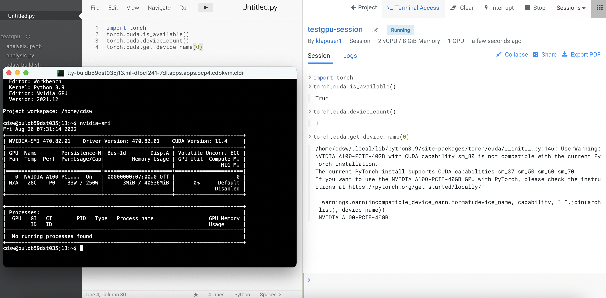
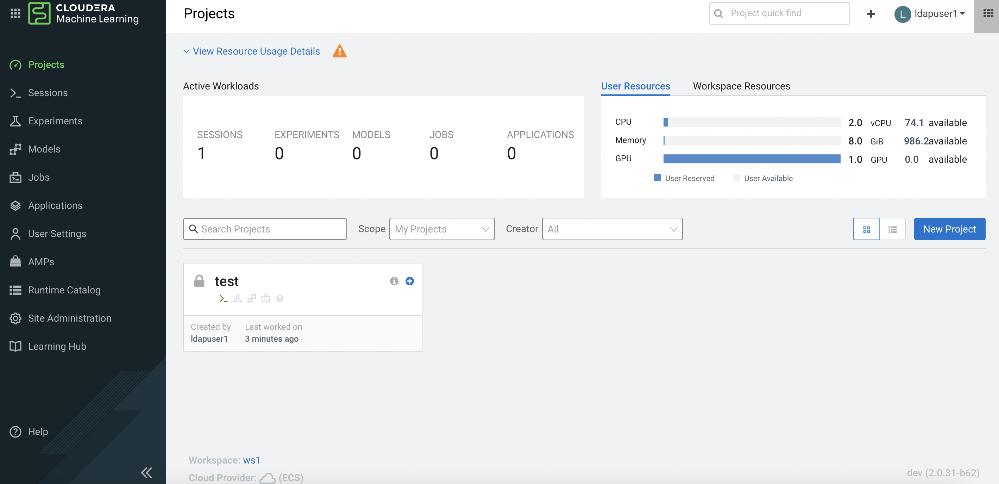

# Nvidia GPU in Openshift
{: .no_toc }

This article describes the steps to install the Nvidia GPU software driver and its associated software in the CDP PvC Data Services platform with Openshift solution. The described implementation steps are carried out after the Openshift platform installation. This article also describes the steps to test the Nvidia GPU card in the CML workspace.

- TOC
{:toc}

---
## Assumption

- The software version of the CDP Private Cloud Data Services components in this demo is described below.

| Software       | Version         |
|:-------------|:------------------|
| CDP PvC Base           | 7.1.7 SP1 | 
| Cloudera Manager   | 7.6.5  | 
| CDP PvC Data Services  | 1.4.0   | 
|Red Hat Openshift Container Platform (OCP)|4.8| 
|Red Hat Openshift Container Storage (OCS)|4.8| 

## Install NFD Operator

1. In Openshift dashboard, navigate to `Operators` > `OperatorHub`. Search for `Node Feature Discovery`. Install the NFD operator and its API.

    

    
    
        

    


2. SSH into the Openshift bastion node and run the following command to ensure that `ocpgpu.cdpkvm.cldr` host (with GPU card installed) has `pci-10de.present=true` field in the node specification. This indicates the presence of the GPU card in this particular worker node.

    ```bash
    [root@ocpbastion ~]# oc describe node ocpgpu.ocp4.cdpkvm.cldr | grep pci-10de.present
                        feature.node.kubernetes.io/pci-10de.present=true
    ```                    
                    

## Install Nvidia GPU Operator

1. Navigate to `Operators` > `OperatorHub`. Search for `Nvidia GPU Operator`. Install the operator and its `ClusterPolicies`.

    

    
    
        

    

    


2. SSH into the Openshift bastion node and run the following command to verify the successful installation of the operator and the clusterPolicy.

    ```bash
    [root@ocpbastion ~]# oc get pods,daemonset -n nvidia-gpu-operator
    NAME                                                     READY   STATUS      RESTARTS   AGE
    pod/gpu-feature-discovery-l7pqc                          1/1     Running     0          6m46s
    pod/gpu-operator-765ff6c665-mznvk                        1/1     Running     0          7m50s
    pod/nvidia-container-toolkit-daemonset-6brmr             1/1     Running     0          6m47s
    pod/nvidia-cuda-validator-8brpz                          0/1     Completed   0          2m50s
    pod/nvidia-dcgm-5txs7                                    1/1     Running     0          6m47s
    pod/nvidia-dcgm-exporter-wj4dg                           1/1     Running     0          6m46s
    pod/nvidia-device-plugin-daemonset-b2k5x                 1/1     Running     0          6m47s
    pod/nvidia-device-plugin-validator-29b9g                 0/1     Completed   0          2m32s
    pod/nvidia-driver-daemonset-48.84.202208152344-0-cxsld   2/2     Running     0          6m47s
    pod/nvidia-mig-manager-kqzk5                             1/1     Running     0          87s
    pod/nvidia-node-status-exporter-2xsdc                    1/1     Running     0          6m47s
    pod/nvidia-operator-validator-f2zdm                      1/1     Running     0          6m47s

    NAME                                                          DESIRED   CURRENT   READY   UP-TO-DATE   AVAILABLE   NODE SELECTOR                                                                                                        AGE
    daemonset.apps/gpu-feature-discovery                          1         1         1       1            1           nvidia.com/gpu.deploy.gpu-feature-discovery=true                                                                     6m46s
    daemonset.apps/nvidia-container-toolkit-daemonset             1         1         1       1            1           nvidia.com/gpu.deploy.container-toolkit=true                                                                         6m47s
    daemonset.apps/nvidia-dcgm                                    1         1         1       1            1           nvidia.com/gpu.deploy.dcgm=true                                                                                      6m47s
    daemonset.apps/nvidia-dcgm-exporter                           1         1         1       1            1           nvidia.com/gpu.deploy.dcgm-exporter=true                                                                             6m46s
    daemonset.apps/nvidia-device-plugin-daemonset                 1         1         1       1            1           nvidia.com/gpu.deploy.device-plugin=true                                                                             6m47s
    daemonset.apps/nvidia-driver-daemonset-48.84.202208152344-0   1         1         1       1            1           feature.node.kubernetes.io/system-os_release.OSTREE_VERSION=48.84.202208152344-0,nvidia.com/gpu.deploy.driver=true   6m47s
    daemonset.apps/nvidia-mig-manager                             1         1         1       1            1           nvidia.com/gpu.deploy.mig-manager=true                                                                               6m46s
    daemonset.apps/nvidia-node-status-exporter                    1         1         1       1            1           nvidia.com/gpu.deploy.node-status-exporter=true                                                                      6m47s
    daemonset.apps/nvidia-operator-validator                      1         1         1       1            1           nvidia.com/gpu.deploy.operator-validator=true                                                                        6m47s
    ```

3. Verify that the Nvidia GPU card can be consumed by the CUDA pod.

    ```bash
    [root@ocpbastion ~]# oc new-project nvidia-test
    Now using project "nvidia-test" on server "https://api.ocp4.cdpkvm.cldr:6443".

    You can add applications to this project with the 'new-app' command. For example, try:

        oc new-app rails-postgresql-example

    to build a new example application in Ruby. Or use kubectl to deploy a simple Kubernetes application:

    kubectl create deployment hello-node --image=k8s.gcr.io/serve_hostname

    [root@ocpbastion ~]# cat << EOF | oc create -f -
    > 
    > apiVersion: v1
    > kind: Pod
    > metadata:
    >   name: cuda-vectoradd
    > spec:
    >  restartPolicy: OnFailure
    >  containers:
    >  - name: cuda-vectoradd
    >    image: "nvidia/samples:vectoradd-cuda11.2.1"
    >    resources:
    >      limits:
    >        nvidia.com/gpu: 1
    > EOF
    pod/cuda-vectoradd created

    [root@ocpbastion ~]# oc get pods
    NAME             READY   STATUS      RESTARTS   AGE
    cuda-vectoradd   0/1     Completed   0          13s

    [root@ocpbastion ~]# oc logs cuda-vectoradd
    [Vector addition of 50000 elements]
    Copy input data from the host memory to the CUDA device
    CUDA kernel launch with 196 blocks of 256 threads
    Copy output data from the CUDA device to the host memory
    Test PASSED
    Done

    [root@ocpbastion ~]# oc describe pod cuda-vectoradd | grep -i Node:
    Node:         ocpgpu.ocp4.cdpkvm.cldr/10.15.4.185


    [root@ocpbastion ~]# oc exec -it nvidia-driver-daemonset-48.84.202208152344-0-cxsld -- nvidia-smi
    Defaulted container "nvidia-driver-ctr" out of: nvidia-driver-ctr, openshift-driver-toolkit-ctr, k8s-driver-manager (init)
    Fri Aug 26 06:07:36 2022       
    +-----------------------------------------------------------------------------+
    | NVIDIA-SMI 470.82.01    Driver Version: 470.82.01    CUDA Version: 11.4     |
    |-------------------------------+----------------------+----------------------+
    | GPU  Name        Persistence-M| Bus-Id        Disp.A | Volatile Uncorr. ECC |
    | Fan  Temp  Perf  Pwr:Usage/Cap|         Memory-Usage | GPU-Util  Compute M. |
    |                               |                      |               MIG M. |
    |===============================+======================+======================|
    |   0  NVIDIA A100-PCI...  On   | 00000000:07:00.0 Off |                    0 |
    | N/A   28C    P0    33W / 250W |      0MiB / 40536MiB |      0%      Default |
    |                               |                      |             Disabled |
    +-------------------------------+----------------------+----------------------+
                                                                               
    +-----------------------------------------------------------------------------+
    | Processes:                                                                  |
    |  GPU   GI   CI        PID   Type   Process name                  GPU Memory |
    |        ID   ID                                                   Usage      |
    |=============================================================================|
    |  No running processes found                                                 |
    +-----------------------------------------------------------------------------+

    [root@ocpbastion ~]# oc describe pod nvidia-driver-daemonset-48.84.202208152344-0-cxsld  | grep Node:
    Node:                 ocpgpu.ocp4.cdpkvm.cldr/10.15.4.185
    ```

## Nvidia GPU Card Testing and Verification in CML

1. Assuming a CML workspace is already provisioned in the CDP PvC Data Services platform, navigate to `Site Administration` > `Runtime/Engine`. Select the number for `Maximum GPUs per Session/GPU`. This procedure effectively allows the CML session to consume the GPU card.   

    

2. Create a CML project and start a new session by selecting the `Workbench` editor with Python kernel alongside `Nvidia GPU` edition. Choose the number of GPU to use - in this demo, the quantity is 1.

    
    
3. Create a new Python file and run the following script. Also, open the terminal session and run `nvidia-smi` tool. Note that the output shows the Nvidia GPU card details.

    ```yaml
    !pip3 install torch
    import torch
    
    torch.cuda.is_available()
    torch.cuda.device_count()
    torch.cuda.get_device_name(0)
    ```

       

4. Navigate to the CML project main page and a check at the user resources dashboard displays the GPU card availability.
    
    
    
    
    

5. SSH into the Openshift bastion node and run the following command to verify the node that hosting the above CML project session pod is `ocpgpu.cdpkvm.cldr`.

    ```bash
    [root@ocpbastion ~]# oc -n workspace-user-1 describe pod buldb59dst035j13 | grep Node:
    Node:         ocpgpu.ocp4.cdpkvm.cldr/10.15.4.185
    ```

6. When running script that consuming the GPU card, the worker node will display a particular process (in this case, the CML session pod) is using the GPU card.

    ```bash
    [root@ocpbastion ~]# oc -n nvidia-gpu-operator exec -it nvidia-driver-daemonset-48.84.202208152344-0-r8rpv -- nvidia-smi
    Defaulted container "nvidia-driver-ctr" out of: nvidia-driver-ctr, openshift-driver-toolkit-ctr, k8s-driver-manager (init)
    Fri Aug 26 07:42:07 2022       
    +-----------------------------------------------------------------------------+
    | NVIDIA-SMI 470.82.01    Driver Version: 470.82.01    CUDA Version: 11.4     |
    |-------------------------------+----------------------+----------------------+
    | GPU  Name        Persistence-M| Bus-Id        Disp.A | Volatile Uncorr. ECC |
    | Fan  Temp  Perf  Pwr:Usage/Cap|         Memory-Usage | GPU-Util  Compute M. |
    |                               |                      |               MIG M. |
    |===============================+======================+======================|
    |   0  NVIDIA A100-PCI...  On   | 00000000:07:00.0 Off |                    0 |
    | N/A   30C    P0    44W / 250W |  39326MiB / 40536MiB |     12%      Default |
    |                               |                      |             Disabled |
    +-------------------------------+----------------------+----------------------+
                                                                               
    +-----------------------------------------------------------------------------+
    | Processes:                                                                  |
    |  GPU   GI   CI        PID   Type   Process name                  GPU Memory |
    |        ID   ID                                                   Usage      |
    |=============================================================================|
    |    0   N/A  N/A    189226      C   /usr/local/bin/python3.9        39323MiB |
    +-----------------------------------------------------------------------------+
    ```

## Taint the Openshift Worker Node with Nvidia GPU Card
1. Reserve the worker node with Nvidia GPU Card for any CML session that require GPU by running the following command. This will disallow all other non-GPU related workloads on this particular node.

    ```bash    
    [root@ocpbastion ~]# oc adm taint node ocpgpu.ocp4.cdpkvm.cldr nvidia.com/gpu=true:NoSchedule
    node/ocpgpu.ocp4.cdpkvm.cldr tainted