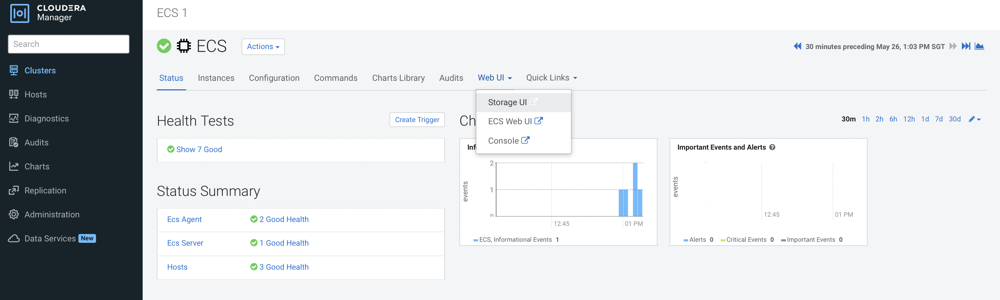
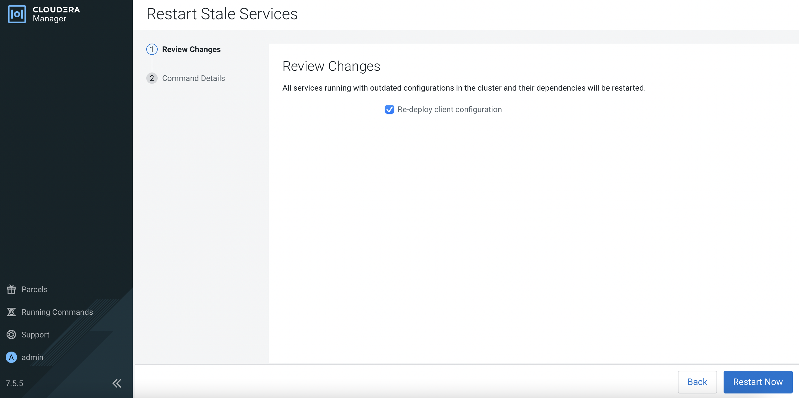

# Expand Longhorn Disk Space

{: .no_toc }

This article describes the steps to scale the Longhorn storage capacity by adding a new disk into the existing Longhorn volume disk that had initially been deployed with LVM.

---

1. In CM, navigate to `Clusters` > `ECS` > `Storage UI` to launch the Longhorn dashboard.

    
    

19. Select `Re-deploy client configuration` and subsequently click `Restart Now`.

      
    
    This will restart the entire ECS cluster. During this process, the nodes will be reflected as `NotReady`.
    
    ```bash
    # kubectl get nodes
    NAME                     STATUS     ROLES                       AGE     VERSION
    ecsmaster1.cdpkvm.cldr   NotReady   control-plane,etcd,master   4d13h   v1.21.8+rke2r2
    ecsworker1.cdpkvm.cldr   NotReady   <none>                      4d13h   v1.21.8+rke2r2
    ecsworker2.cdpkvm.cldr   NotReady   <none>                      4d13h   v1.21.8+rke2r2
    ecsworker3.cdpkvm.cldr   NotReady   <none>                      11m     v1.21.8+rke2r2
    ```

1. Install the LVM2 package. In this example, the underlying OS is Centos7.9.

    ```bash
    # yum install lvm2 -y
    ```

2. Check the status of the direct attached disks in this host.

    ```bash
    # lsblk
    NAME   MAJ:MIN RM  SIZE RO TYPE MOUNTPOINT
    sr0     11:0    1  368K  0 rom  
    vda    253:0    0   99G  0 disk 
    `-vda1 253:1    0   99G  0 part /
    vdb    253:16   0  500G  0 disk 
    vdc    253:32   0  500G  0 disk 
    vdd    253:48   0  400G  0 disk 
    ```

3. Create a physical volume.

    ```bash
    # pvcreate /dev/vdb
    Physical volume "/dev/vdb" successfully created.
    ```

    ```bash
    # pvscan
    PV /dev/vdb                      lvm2 [500.00 GiB]
    Total: 1 [500.00 GiB] / in use: 0 [0   ] / in no VG: 1 [500.00 GiB]
    ```

    ```bash
    # pvdisplay /dev/vdb
    "/dev/vdb" is a new physical volume of "500.00 GiB"
    --- NEW Physical volume ---
    PV Name               /dev/vdb
    VG Name               
    PV Size               500.00 GiB
    Allocatable           NO
    PE Size               0   
    Total PE              0
    Free PE               0
    Allocated PE          0
    PV UUID               AE3Zoh-pgdd-1vKK-euUl-oELk-v6yF-jnV4X3
    ```  

4. Create a volume group using the identified disk.

    ```bash  
    # vgcreate vg1 /dev/vdb
    Volume group "vg1" successfully created
    ```  
  
    ```bash 
    # vgdisplay vg1
    --- Volume group ---
    VG Name               vg1
    System ID             
    Format                lvm2
    Metadata Areas        1
    Metadata Sequence No  1
    VG Access             read/write
    VG Status             resizable
    MAX LV                0
    Cur LV                0
    Open LV               0
    Max PV                0
    Cur PV                1
    Act PV                1
    VG Size               <500.00 GiB
    PE Size               4.00 MiB
    Total PE              127999
    Alloc PE / Size       0 / 0   
    Free  PE / Size       127999 / <500.00 GiB
    VG UUID               hlI7n7-tjky-Tdsp-N8RQ-Zej8-Ao6u-kqmqA2
    ```
 
 5. Create a logical volume and use the entire disk capacity.
 
    ```bash
    # lvcreate -n lv1 -l 100%FREE vg1
    Logical volume "lv1" created.   
    ```bash  
    # lvscan
    ACTIVE            '/dev/vg1/lv1' [<500.00 GiB] inherit
    ```
    
    ```bash  
    # lvdisplay vg1/lv1
    --- Logical volume ---
    LV Path                /dev/vg1/lv1
    LV Name                lv1
    VG Name                vg1
    LV UUID                SCYwjz-xePq-BqJK-5ctU-0N1L-PpuY-wL0o2F
    LV Write Access        read/write
    LV Creation host, time ecsworker3.cdpkvm.cldr, 2022-05-26 13:19:26 +0800
    LV Status              available
    # open                 0
    LV Size                <500.00 GiB
    Current LE             127999
    Segments               1
    Allocation             inherit
    Read ahead sectors     auto
    - currently set to     8192
    Block device           252:0
    ```  

 6. Format the logical volume.

    ```bash
    # mkfs.xfs /dev/vg1/lv1
    ```

 7. Create the specified directory and mount the logical volume.
 
    ```bash          
    # mkdir /longhorn
    ```    
    
    ```bash
    # mount /dev/vg1/lv1 /longhorn
    ```
    
    ```bash
    # df -kh | head -1; df -kh | grep longhorn
    Filesystem           Size  Used Avail Use% Mounted on
    /dev/mapper/vg1-lv1  500G   33M  500G   1% /longhorn
    ```
    
 8. The mountpoint is now ready to be used.
 
    ```bash
    # ls -l /longhorn
    total 0
    ```

