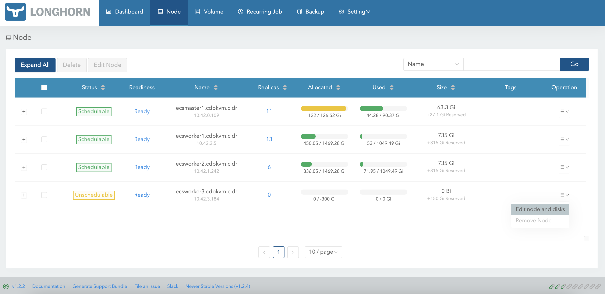
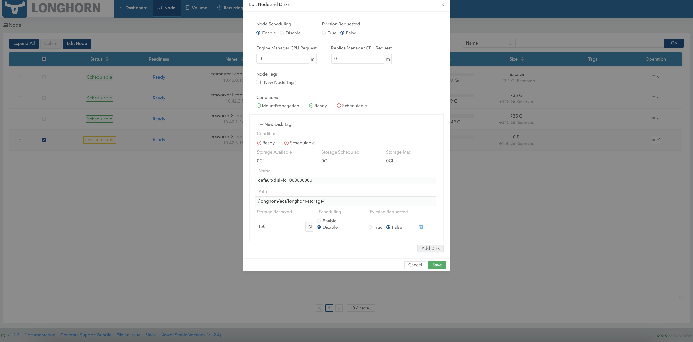

# Expand Longhorn Disk Space

{: .no_toc }

This article describes the steps to scale the Longhorn storage capacity in one of the ECS nodes (ecsworker3.cdpkvm.cldr) by adding a new disk into the existing Longhorn volume disk that had initially been deployed with LVM (Logical Volume Manager).

---

1. In the event that CDW is part of the CDP PvC workloads on this ECS platform, ensure that the CDW pods are not provisioned on this particular ECS node. The CDW disk should be empty. Note that the `localpath` directory was configured as the mountpoint for CDW disk during the ECS installation.

    ```bash
    # tree /localpath/
    /localpath/
    `-- local-storage

    1 directory, 0 files
    ```

2. All ECS nodes are now in `Ready` mode.
    
    ```bash
    # kubectl get nodes
    NAME                     STATUS   ROLES                       AGE     VERSION
    ecsmaster1.cdpkvm.cldr   Ready    control-plane,etcd,master   4d14h   v1.21.8+rke2r2
    ecsworker1.cdpkvm.cldr   Ready    <none>                      4d13h   v1.21.8+rke2r2
    ecsworker2.cdpkvm.cldr   Ready    <none>                      4d13h   v1.21.8+rke2r2
    ecsworker3.cdpkvm.cldr   Ready    <none>                      14m     v1.21.8+rke2r2
    ```
    
3. In CM, navigate to `Clusters` > `ECS` > `Storage UI` to launch the Longhorn dashboard. Click `Node` at the Longhorn dashboard. Note that ecsworker3.cdpkvm.cldr node has 4 volume replicas currently.
    
    
    

4. At the ecsworker3.cdpkvm.cldr node, check the status of the `/longhorn` directory. The `longhorn` directory was configured as the mountpoint for longhorn disk during the ECS installation.


    ```bash
    # tree /longhorn
    /longhorn
    `-- ecs
        `-- longhorn-storage
            |-- longhorn-disk.cfg
            `-- replicas
                |-- pvc-1e3726f1-5316-470f-bc8c-d916329eb98d-ba87e915
                |   |-- revision.counter
                |   |-- volume-head-000.img
                |   |-- volume-head-000.img.meta
                |   `-- volume.meta
                |-- pvc-3e9d28f0-441f-4239-b561-bdee3d789781-de260f3d
                |   |-- revision.counter
                |   |-- volume-head-000.img
                |   |-- volume-head-000.img.meta
                |   `-- volume.meta
                |-- pvc-4e711771-4928-48d3-853a-384db8a5e050-c6230c5a
                |   |-- revision.counter
                |   |-- volume-head-000.img
                |   |-- volume-head-000.img.meta
                |   `-- volume.meta
                `-- pvc-8636d6a3-01e2-499e-b30f-e0ab43f51fc8-ff55c10f
                    |-- revision.counter
                    |-- volume-head-000.img
                    |-- volume-head-000.img.meta
                    `-- volume.meta

    7 directories, 17 files
    ```

5. Run the following command to evict all of the pods from ecsworker3.cdpkvm.cldr node.

    ```bash
    # kubectl drain ecsworker3.cdpkvm.cldr 
    ```

6. Note that ecsworker3.cdpkvm.cldr is now in `Ready,SchedulingDisabled` mode.

    ```bash
    # kubectl get nodes
    NAME                     STATUS                     ROLES                       AGE     VERSION
    ecsmaster1.cdpkvm.cldr   Ready                      control-plane,etcd,master   5d14h   v1.21.8+rke2r2
    ecsworker1.cdpkvm.cldr   Ready                      <none>                      5d14h   v1.21.8+rke2r2
    ecsworker2.cdpkvm.cldr   Ready                      <none>                      5d14h   v1.21.8+rke2r2
    ecsworker3.cdpkvm.cldr   Ready,SchedulingDisabled   <none>                      24h     v1.21.8+rke2r2
    ```
    
7. At the ecsworker3.cdpkvm.cldr node, check the status of the `/longhorn` directory. The `kubectl drain node` command should have relocated the volume replicas away from the ecsworker3.cdpkvm.cldr node to other available nodes. Thus,  `/longhorn` directory in the ecsworker3.cdpkvm.cldr node should be empty as shown below.

    ```bash
    # tree /longhorn
    /longhorn
    `-- ecs
        `-- longhorn-storage
            |-- longhorn-disk.cfg
            `-- replicas

    3 directories, 1 file
    ```

8. The Longhorn dashboard should reflect that the ecsworker3.cdpkvm.cldr node is now `Unschedulable` and has no volume replica.
    
    
    
    
9. At the ecsworker3.cdpkvm.cldr node, check the LVM disk of the `/longhorn` directory mountpoint. In this case, the LVM disk is `/dev/vg1/lv1`.

    ```bash
    # lsblk | grep longhorn
    `-vg1-lv1 252:0    0   500G  0 lvm  /longhorn
    ```
    
10. Check the information of the disk that formed the physical volume of `/dev/vdb`.  
 
    ```bash
    # pvdisplay /dev/vdb
    "/dev/vdb" is a new physical volume of "500.00 GiB"
    --- NEW Physical volume ---
    PV Name               /dev/vdb
    VG Name               
    PV Size               500.00 GiB
    Allocatable           NO
    PE Size               0   
    Total PE              0
    Free PE               0
    Allocated PE          0
    PV UUID               AE3Zoh-pgdd-1vKK-euUl-oELk-v6yF-jnV4X3
    ```  

11. Create a new physical volume of the new disk which has been identified to be added into the existing logical volume. In this case, the new disk is `/dev/vdc`.

    ```bash
    # pvcreate /dev/vdc
    Physical volume "/dev/vdc" successfully created.
    ```

    ```bash
    # pvscan
    PV /dev/vdb   VG vg1             lvm2 [<500.00 GiB / 0    free]
    PV /dev/vdc                      lvm2 [500.00 GiB]
    Total: 2 [<1000.00 GiB] / in use: 1 [<500.00 GiB] / in no VG: 1 [500.00 GiB]
    ```

    ```bash
    # pvdisplay /dev/vdc
    "/dev/vdc" is a new physical volume of "500.00 GiB"
    --- NEW Physical volume ---
    PV Name               /dev/vdc
    VG Name               
    PV Size               500.00 GiB
    Allocatable           NO
    PE Size               0   
    Total PE              0
    Free PE               0
    Allocated PE          0
    PV UUID               Qq89qb-pdM4-X8cR-IekT-vXEd-3Y5R-ThEdM3
    ```  
12. Check the status of the volume group `vg1`. The current storage capacity is 500G.

    ```bash
    # vgs
    VG  #PV #LV #SN Attr   VSize    VFree
    vg1   1   1   0 wz--n- <500.00g    0 
    ```    
    
13. Check the status of the logical volume `lv1`. The current storage capacity is 500G.

    ```bash
    # lvs
    LV   VG  Attr       LSize    Pool Origin Data%  Meta%  Move Log Cpy%Sync Convert
    lv1  vg1 -wi-ao---- <500.00g  
    ```    
    
14. Add `/dev/vdc` to the volume group `vg1` to extend its size.

    ```bash
    # vgextend vg1 /dev/vdc
    Volume group "vg1" successfully extended
    ```    
    
15. Check the status of the volume group `vg1`. The current storage capacity is approximately 1000G.

    ```bash
    # vgs
    VG  #PV #LV #SN Attr   VSize   VFree   
    vg1   2   1   0 wz--n- 999.99g <500.00g
    ```    
    
    ```        
16. Extend the size of the logical volume `lv1` from the `vg1` volume group.


    ```bash
    # lvextend -l +100%FREE /dev/vg1/lv1
    Size of logical volume vg1/lv1 changed from <500.00 GiB (127999 extents) to 999.99 GiB (255998 extents).
    Logical volume vg1/lv1 successfully resized.
    ```   

17. Check the status of the logical volume `lv1`. The current storage capacity is now approximately 1000G.

    ```bash
    # lvs
    LV   VG  Attr       LSize   Pool Origin Data%  Meta%  Move Log Cpy%Sync Convert
    lv1  vg1 -wi-ao---- 999.99g 
    ```   
18. Run the following command to inform the ECS system to resume scheduling new pods onto the ecsworker3.cdpkvm.cldr node.

    ```bash
    # kubectl uncordon ecsworker3.cdpkvm.cldr 
    node/ecsworker3.cdpkvm.cldr uncordoned
    ```   
    
    ```bash
    # kubectl get nodes
    NAME                     STATUS   ROLES                       AGE     VERSION
    ecsmaster1.cdpkvm.cldr   Ready    control-plane,etcd,master   5d15h   v1.21.8+rke2r2
    ecsworker1.cdpkvm.cldr   Ready    <none>                      5d15h   v1.21.8+rke2r2
    ecsworker2.cdpkvm.cldr   Ready    <none>                      5d15h   v1.21.8+rke2r2
    ecsworker3.cdpkvm.cldr   Ready    <none>                      25h     v1.21.8+rke2r2
    ```   
    
21. The Longhorn dashboard should now reflect that the ecsworker3.cdpkvm.cldr node is `Schedulable`.

    
    
    
22. Provision a new CML workspace and the system might select ecsworker3.cdpkvm.cldr node to store the Longhorn volume replicas. In this case, 5 volume have successfully been created in ecsworker3.cdpkvm.cldr node.

    
    

23. At the ecsworker3.cdpkvm.cldr node, check the status of the `/longhorn` directory to verify the outcome of the previous step.

    ```bash
    # tree /longhorn
    /longhorn
    `-- ecs
        `-- longhorn-storage
            |-- longhorn-disk.cfg
            `-- replicas
                |-- pvc-0041b1bb-1a5c-4bef-8f9b-38a3065cfc23-db38d90f
                |   |-- revision.counter
                |   |-- volume-head-000.img
                |   |-- volume-head-000.img.meta
                |   `-- volume.meta
                |-- pvc-01e06973-21e6-458e-a128-ecdd462b2b6c-a4150b3c
                |   |-- revision.counter
                |   |-- volume-head-000.img
                |   |-- volume-head-000.img.meta
                |   `-- volume.meta
                |-- pvc-391ee046-ae71-459c-b033-2db6014d1e3c-b8bdbf18
                |   |-- revision.counter
                |   |-- volume-head-000.img
                |   |-- volume-head-000.img.meta
                |   `-- volume.meta
                |-- pvc-be8bf914-c04b-4a8b-a6fb-d3075447f3da-84a923fb
                |   |-- revision.counter
                |   |-- volume-head-000.img
                |   |-- volume-head-000.img.meta
                |   `-- volume.meta
                `-- pvc-f71138e6-3ecb-47cc-abd0-1c9abcb3e2f6-d2f5891c
                    |-- revision.counter
                    |-- volume-head-000.img
                    |-- volume-head-000.img.meta
                    `-- volume.meta

    8 directories, 21 files
    ```