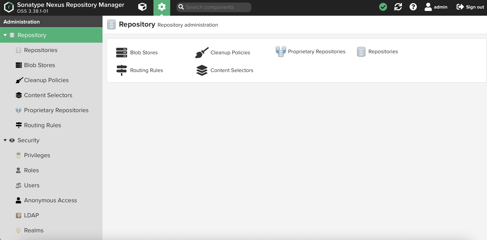
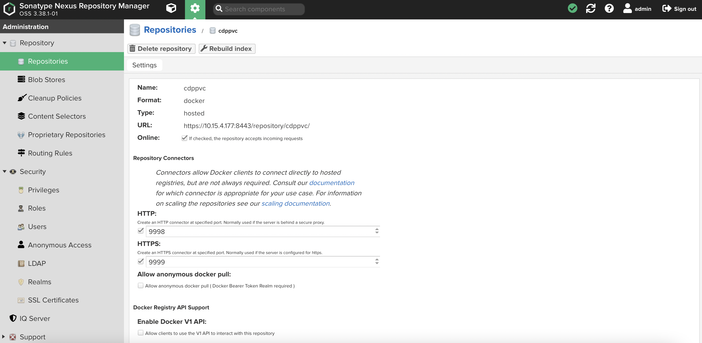

# Docker Registry in Nexus
{: .no_toc }

This article describes the steps to deploy the external docker registry using Nexus in the designated Nexus server.

---


1. Download the Nexus repository.

    ```bash
    # wget -P /etc/yum.repos.d/ https://repo.sonatype.com/repository/community-hosted/rpm/sonatype-community.repo
    ```

2. Install the following software packages.

    ```bash
    # yum install docker wget -y
    ```

3. Deploy and start the Nexus software.

    ```bash
    # yum install nexus-repository-manager
    
    # systemctl start nexus-repository-manager 
    ```


4. Create the SSL certificates on the server based on the description highlighted in this [link](https://help.sonatype.com/repomanager3/nexus-repository-administration/configuring-ssl). The following `nexus.crt` certificate will be used during CDP PvC Data Services installation.

    ```bash  
    # keytool -genkeypair -keystore keystore.jks -storepass password -alias jetty -keyalg RSA -keysize 2048 -validity 5000 -keypass password -dname 'CN=nexus.cdpkvm.cldr, OU=Sonatype, O=Sonatype, L=Unspecified, ST=Unspecified, C=SG' -ext 'SAN=DNS:nexus.cdpkvm.cldr' -ext "BC=ca:true"

    # keytool -exportcert -keystore keystore.jks -alias jetty -rfc > nexus.crt

    # keytool -importkeystore -srckeystore keystore.jks -destkeystore nexus.p12 -deststoretype PKCS12

    # openssl pkcs12 -nokeys -in nexus.p12 -out nexus.pem

    # openssl pkcs12 -nocerts -nodes -in nexus.p12 -out nexus.key
    ```  
    
5. Copy the JKS file to '/opt/sonatype/sonatype-work/nexus3/etc/ssl/' directory.

    ```bash   
    # cp keystore.jks /opt/sonatype/sonatype-work/nexus3/etc/ssl/
    ```      
    
6. Check that the hostname is correctly defined in the certificate.

    ```bash 
    # openssl x509 -noout -text -in nexus.crt | grep -A1 X509v3
        X509v3 extensions:
            X509v3 Basic Constraints: 
                CA:TRUE
            X509v3 Subject Alternative Name: 
                DNS:nexus.cdpkvm.cldr
            X509v3 Subject Key Identifier: 
                08:BF:E3:9F:53:50:0A:57:B5:BB:1E:E4:5A:D2:4E:0F:E1:10:5D:11
    ```  
    
7. Configure the '/opt/sonatype/nexus3/etc/jetty/jetty-https.xml' file. Sample is shown as follows.

    ```yaml
    <New id="sslContextFactory" class="org.eclipse.jetty.util.ssl.SslContextFactory$Server">
        <Set name="certAlias">jetty</Set>
        <Set name="KeyStorePath"><Property name="ssl.etc"/>/keystore.jks</Set>
        <Set name="KeyStorePassword">password</Set>
        <Set name="KeyManagerPassword">password</Set>
        <Set name="TrustStorePath"><Property name="ssl.etc"/>/keystore.jks</Set>
        <Set name="TrustStorePassword">password</Set>
        <Set name="EndpointIdentificationAlgorithm"></Set>
        <Set name="NeedClientAuth"><Property name="jetty.ssl.needClientAuth" default="false"/></Set>
        <Set name="WantClientAuth"><Property name="jetty.ssl.wantClientAuth" default="false"/></Set>
        <Set name="IncludeProtocols">
            <Array type="java.lang.String">
                <Item>TLSv1.2</Item>
            </Array>
        </Set>
    </New>
    ``` 

8. Configure the `/opt/sonatype/sonatype-work/nexus3/etc/nexus.properties` file. Sample is shown below.

    ```yaml
    # Jetty section
    # application-port=8081
    # application-host=0.0.0.0
    # nexus-args=${jetty.etc}/jetty.xml,${jetty.etc}/jetty-http.xml,${jetty.etc}/jetty-requestlog.xml
    nexus-args=${jetty.etc}/jetty.xml,${jetty.etc}/jetty-http.xml,${jetty.etc}/jetty-https.xml,${jetty.etc}/jetty-requestlog.xml
    # nexus-context-path=/

    # Nexus section
    # nexus-edition=nexus-pro-edition
    # nexus-features=\
    #  nexus-pro-feature

    # nexus.hazelcast.discovery.isEnabled=true
    application-port-ssl=8443
    ssl.etc=${karaf.data}/etc/ssl
    ``` 

9. Restart the Nexus service.

    ```bash
    # systemctl restart nexus-repository-manager 
    ```

10. Log in to the Nexus portal to setup the Docker repository with SSL port.

    
    
       


11. Ensure that the port SSL port 9999 is up and running.

    ```bash
    # netstat -an | grep 999
    tcp        0      0 0.0.0.0:9998            0.0.0.0:*               LISTEN     
    tcp        0      0 0.0.0.0:9999            0.0.0.0:*               LISTEN  
    ```
    
12. Test the SSL Docker URL. Note that an error "SEC_ERROR_UNTRUSTED_ISSUER" has occured.

    ```bash
    # curl -v -u admin:admin "https://nexus.cdpkvm.cldr:9999/v2/_catalog"
    * About to connect() to nexus.cdpkvm.cldr port 9999 (#0)
    *   Trying 10.15.4.177...
    * Connected to nexus.cdpkvm.cldr (10.15.4.177) port 9999 (#0)
    * Initializing NSS with certpath: sql:/etc/pki/nssdb
    *   CAfile: /etc/pki/tls/certs/ca-bundle.crt
    CApath: none
    * Server certificate:
    * 	subject: CN=nexus.cdpkvm.cldr,OU=Sonatype,O=Sonatype,L=Unspecified,ST=Unspecified,C=SG
    * 	start date: Jun 25 12:33:15 2022 GMT
    * 	expire date: Mar 03 12:33:15 2036 GMT
    * 	common name: nexus.cdpkvm.cldr
    * 	issuer: CN=nexus.cdpkvm.cldr,OU=Sonatype,O=Sonatype,L=Unspecified,ST=Unspecified,C=SG
    * NSS error -8172 (SEC_ERROR_UNTRUSTED_ISSUER)
    * Peer's certificate issuer has been marked as not trusted by the user.
    * Closing connection 0
    curl: (60) Peer's certificate issuer has been marked as not trusted by the user.
    More details here: http://curl.haxx.se/docs/sslcerts.html

    curl performs SSL certificate verification by default, using a "bundle"
    of Certificate Authority (CA) public keys (CA certs). If the default
    bundle file isn't adequate, you can specify an alternate file
    using the --cacert option.
    If this HTTPS server uses a certificate signed by a CA represented in
    the bundle, the certificate verification probably failed due to a
    problem with the certificate (it might be expired, or the name might
    not match the domain name in the URL).
    If you'd like to turn off curl's verification of the certificate, use
    the -k (or --insecure) option.

    ```


13. Update the CA cert (nexus.crt) in the server.
 
    ```bash 
    # cp nexus.crt /etc/pki/ca-trust/source/anchors/
    # update-ca-trust extract
    ```


14. Check that the CA cert has succesfully been imported into the truststore of the server.
 
    ```bash 
    # openssl crl2pkcs7 -nocrl -certfile /etc/pki/tls/certs/ca-bundle.crt | openssl pkcs7 -print_certs | grep subject | grep nexus
    subject=/C=SG/ST=Unspecified/L=Unspecified/O=Sonatype/OU=Sonatype/CN=nexus.cdpkvm.cldr
    ```


14. You may now curl the SSL-enabled Docker URL successfully.  
 
    ```bash 
    #  curl -u admin:admin "https://nexus.cdpkvm.cldr:9999/v2/_catalog" | jq
    % Total    % Received % Xferd  Average Speed   Time    Time     Time  Current
    Dload  Upload   Total   Spent    Left  Speed
    100  9711  100  9711    0     0  69165      0 --:--:-- --:--:-- --:--:-- 69364
    {
    "repositories": [
    ```

15. Perform a test to ensure that you can login and pull the image from the Cloudera repository.
 
    ```bash 
    # docker login https://nexus.cdpkvm.cldr:9999/cdppvc --username admin --password admin
    Login Succeeded
    
    # docker image ls
    REPOSITORY          TAG                 IMAGE ID            CREATED             SIZE

    # docker pull nexus.cdpkvm.cldr:9999/cdppvc/cloudera_thirdparty/fluent-bit:v1.4.6-3896242
    Trying to pull repository nexus.cdpkvm.cldr:9999/cdppvc/cloudera_thirdparty/fluent-bit ... 
    v1.4.6-3896242: Pulling from nexus.cdpkvm.cldr:9999/cdppvc/cloudera_thirdparty/fluent-bit
    f4816e38b7e0: Pull complete 
    7c949fdfdbff: Pull complete 
    f949750d27a4: Pull complete 
    fe54547c530b: Pull complete 
    Digest: sha256:d3d7a16bc8f3eb5782efde9b79945eeb5c67119361e1d8daf31f7421d795ff5f
    Status: Downloaded newer image for nexus.cdpkvm.cldr:9999/cdppvc/cloudera_thirdparty/fluent-bit:v1.4.6-3896242
    
    # docker image ls
    REPOSITORY                                                     TAG                 IMAGE ID            CREATED             SIZE
    nexus.cdpkvm.cldr:9999/cdppvc/cloudera_thirdparty/fluent-bit   v1.4.6-3896242      a5d1d3a3a3ef        2 years ago         220 MB
    ```

16. For CDP Data Services on Openshift platform solution, import the CA certificate `nexus.crt` into the Openshift platform using this [method](https://docs.openshift.com/container-platform/4.7/cicd/builds/setting-up-trusted-ca.html). This step is needed to prevent "x509: certificate signed by unknown authority" issue when the system attempts to pull the docker images from the above Docker registry to provision the CDP Data Services Control Plane pods.

