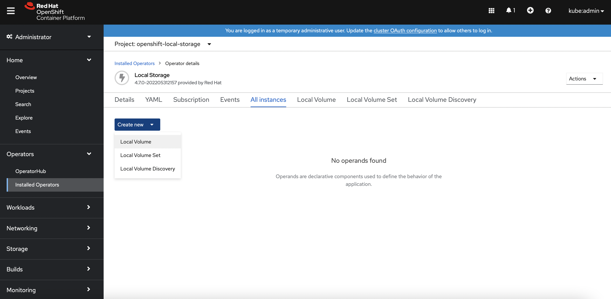
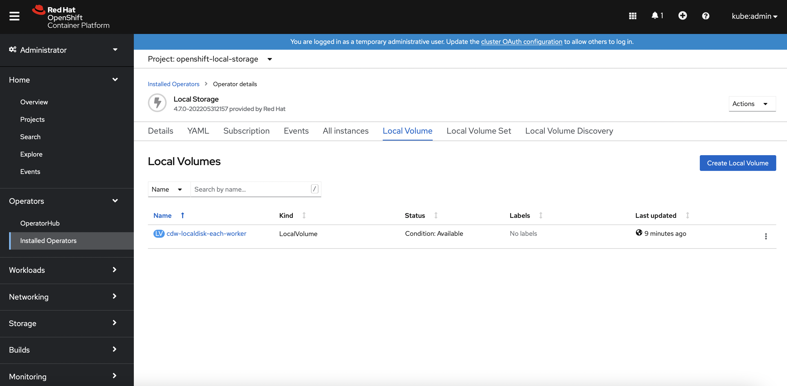

# Deploy CDW Disk in Openshift
{: .no_toc }

This article describes the steps to deploy the CDW disk using `Local Storage Operator` in Openshift platform.

---

1. blah

    
    
    
    
    
    
    
    
        