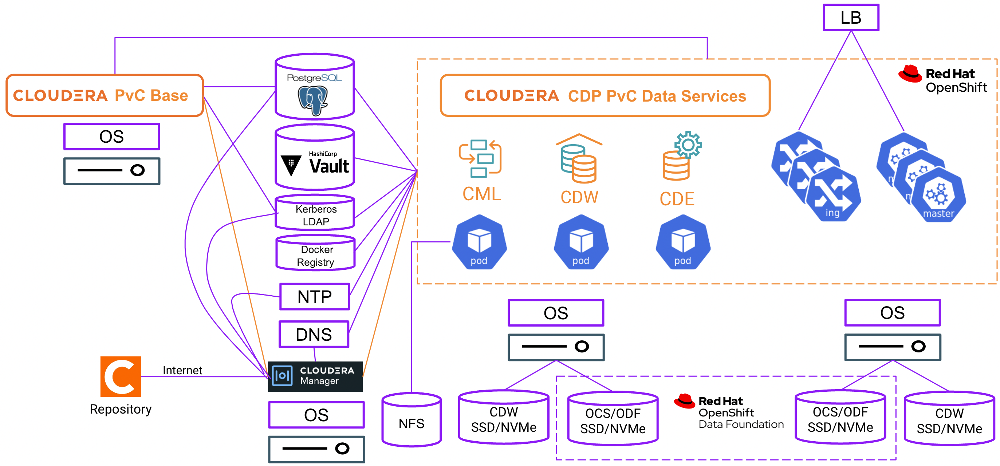
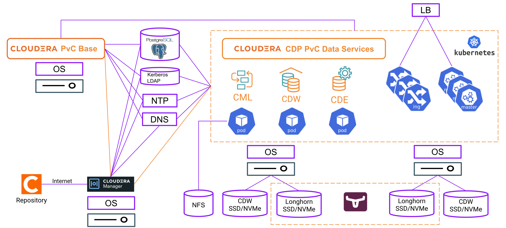
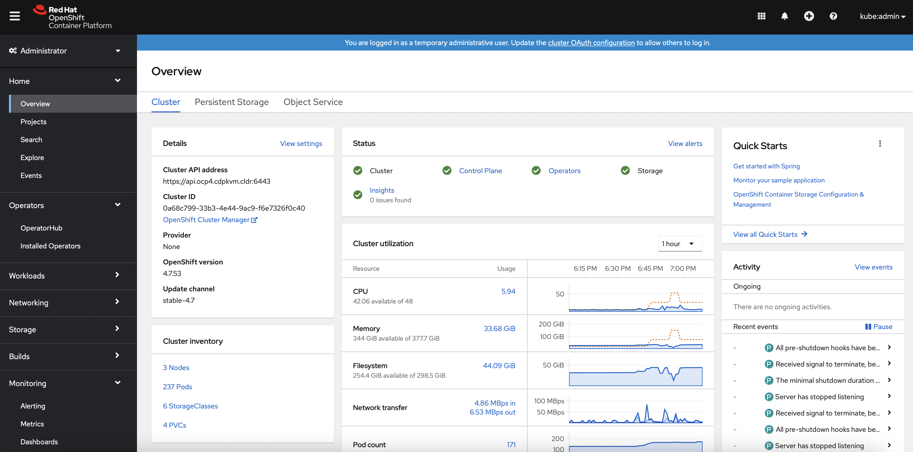
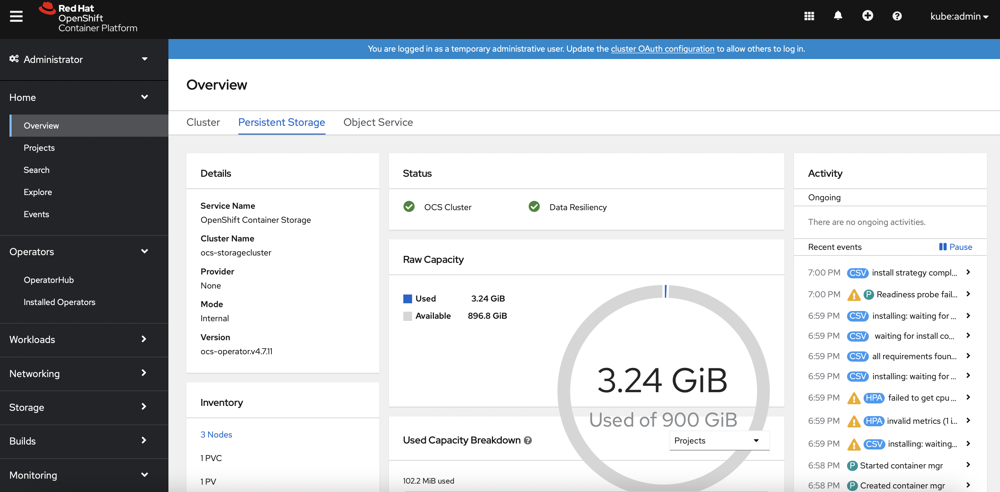
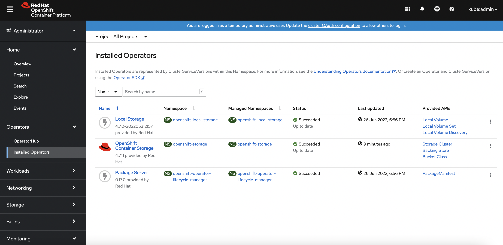
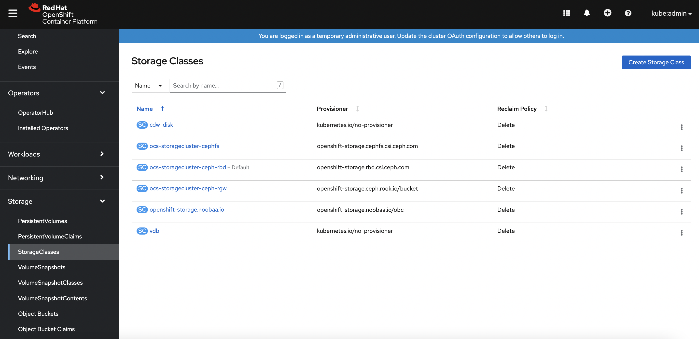

---

layout: default
title: Installation Prerequisites
parent: CDP Private Cloud
nav_order: 2

---

# Installation Prerequisites
{: .no_toc }

- CDP Private Cloud solution requires direct integration with some 3rd party/external components. 
- For CDP Private Cloud solution with Openshift platform, the required external components are represented by the purple-coloured boxes as shown in the following diagram.



- For CDP Private Cloud solution with ECS platform, the required external components are represented by the purple-coloured boxes as shown below.




- TOC
{:toc}

---
## General Requirements

### Software Version
 
- The software version of the CDP Private Cloud solution components involved in this demo is stated below.
- Obtain a valid product subscription from Cloudera. Cloudera Manager requires a valid license to install accordingly.

| Software       | Version         |
|:-------------|:------------------|
| CDP Base           | 7.1.7 `rel. May 2022`  | 
| Cloudera Manager   | 7.5.5 `rel. May 2022`  | 
| CDP Data Services  | 1.3.4 `rel. May 2022`  | 

- The supported Openshift version is explained in this [link](https://docs.cloudera.com/cdp-private-cloud-data-services/1.3.4/installation/topics/cdppvc-installation-openshift.html). This demo uses Openshift 4.7.

### CDP Base Services

- The minimum CDP PvC Base services and its dependencies to install CML, CDW and CDE are illustrated in the table below.

    
    
### Hardware
    
- Hardware requirements are determined by specific CDP services to be installed in both CDP PvC Base cluster and the data services on the Kubernetes platform. For instance, CDP PvC Base services such as [HDFS](https://docs.cloudera.com/cdp-private-cloud-upgrade/latest/release-guide/topics/cdpdc-hdfs.html), [Zookeeper](https://docs.cloudera.com/cdp-private-cloud-upgrade/latest/release-guide/topics/cdpdc-zookeeper.html) and [Ozone](https://docs.cloudera.com/cdp-private-cloud-upgrade/latest/release-guide/topics/cdpdc-ozone.html) have dedicated storage requirements. 
- CDW requires locally attached SCSI device (SSD/NVMe) in each Kubernetes worker node.


### CDP Base Host Settings

- The supported OS and the filesystems are listed [here](https://docs.cloudera.com/cdp-private-cloud-base/7.1.7/installation/topics/cdpdc-os-requirements.html).
- [JDK](https://docs.cloudera.com/cdp-private-cloud-base/7.1.7/installation/topics/cdpdc-java-requirements.html) must be installed in each host.
- Configure the hosts with [IPv4](https://docs.cloudera.com/cdp-private-cloud-base/7.1.7/installation/topics/cdpdc-configure-network-names.html) only. Set the hostname with unique FQDN (Fully Qualified Domain Name). Ensure /etc/hosts with the IP address and of each host in the cluster.
- Disable [firewall](https://docs.cloudera.com/cdp-private-cloud-base/7.1.7/installation/topics/cdpdc-disabling-firewall.html) within each host.
- Set the [SELinux](https://docs.cloudera.com/cdp-private-cloud-base/7.1.7/installation/topics/cdpdc-setting-selinux-mode.html) mode accordingly.
- Every host must be installed with NTP client and able to synchronize the time with the external NTP server.
- Each host must be installed with the Kerberos client and library in order to join the Kerberos domain.

    ```bash
    # yum install krb5-workstation krb5-libs
    ```

- [Data at Rest](https://docs.cloudera.com/cdp-private-cloud-base/7.1.7/installation/topics/cdpdc-data-at-rest-encryption-requirements.html) is not mandatory and not covered in this article.

### DNS Server

- An external DNS server must contain the forward and reverse zones of the company domain name. The external DNS server must be able to resolve the hostname of all CDP PvC hosts and the 3rd party components (includes Kerberos, LDAP server, external database, NFS server) and perform reverse DNS lookup. 
- Wildcard DNS entry must be configured; e.g. `*.apps.ecs1.cdpkvm.cldr`. This helps to reduce Day-2 operational task to set separate DNS entry for each newly provisioned external-facing application/service.
- The external DNS server is expected to be ready prior to installing the CDP Private Cloud solution and its installation procedure is not covered in this article.


### Kerberos + LDAP Server + Certificate

- An [external Kerberos server](https://docs.cloudera.com/cdp-private-cloud-base/7.1.7/security-kerberos-authentication/topics/cm-security-kerberos-enabling-intro.html) and the Kerberos key distribution center (KDC) (with a realm established) must be available to provide authentication to CDP services, users and hosts.
- An external `secured` LDAP-compliant identity/directory server (ldaps) is required to enable the CDP Private Cloud solution to look up for the user accounts and groups in the directory. This is expected to be ready prior to installing the CDP Private Cloud solution and its installation procedure is not covered in this article.
- [Auto-TLS](https://docs.cloudera.com/cdp-private-cloud-base/7.1.7/security-encrypting-data-in-transit/topics/cm-security-auto-tls.html) should be enabled using certificates created and managed by a Cloudera Manager certificate authority (CA), or certificates signed by a trusted public CA or your own internal CA. Prepare the certificate of your choice.

### External NFS

- CML requires external [NFS server](https://docs.cloudera.com/machine-learning/1.3.4/private-cloud-requirements/topics/ml-pvc-external-nfs-server.html) to store the project files and directories. NFS version 4.1 must be supported.
- The external NFS storage is expected to be ready prior to installing the CDP Private Cloud solution. External NFS storage installation is not covered in this article.

### Relational Database

- The database requirements is described in this [link](https://docs.cloudera.com/cdp-private-cloud-base/7.1.7/installation/topics/cdpdc-database-requirements.html). 
- The reference settings of PostgreSQL database can be obtained [here](https://docs.cloudera.com/cdp-private-cloud-base/7.1.7/installation/topics/cdpdc-configuring-starting-postgresql-server.html).
- [SSL](https://docs.cloudera.com/cdp-private-cloud-data-services/1.3.4/installation/topics/cdppvc-installation-external-db-setup.html) must be enabled in the database.
- This demo uses [PostgreSQL 12](https://docs.cloudera.com/data-warehouse/1.3.4/private-cloud-getting-started/topics/dw-private-cloud-base-cluster-database-requirements.html) database as the external database. 
- The database is expected to be ready prior to installing the CDP Private Cloud solution. PostgreSQL database installation is not covered in this article.
- Create the following databases in the external PostgreSQL server with its users and the associated privileges. Note that simple passwords are being created but the actual production environment should make use of complex passwords. Not every created database is being used here but serves as a placeholder for future use case.

  ```yaml
  CREATE ROLE scm LOGIN PASSWORD 'scm';
  CREATE ROLE rman LOGIN PASSWORD 'rman';
  CREATE ROLE hue LOGIN PASSWORD 'hue';
  CREATE ROLE metastore LOGIN PASSWORD 'metastore';
  CREATE ROLE oozie LOGIN PASSWORD 'oozie';
  CREATE ROLE schemaregistry LOGIN PASSWORD 'schemaregistry';
  CREATE ROLE smm LOGIN PASSWORD 'smm';
  CREATE DATABASE scm OWNER scm ENCODING 'UTF8';
  CREATE DATABASE rman OWNER rman ENCODING 'UTF8';
  CREATE DATABASE hue OWNER hue ENCODING 'UTF8';
  CREATE DATABASE metastore OWNER metastore ENCODING 'UTF8';
  CREATE DATABASE oozie OWNER oozie ENCODING 'UTF8';
  CREATE DATABASE schemaregistry OWNER schemaregistry ENCODING 'UTF8';
  CREATE DATABASE smm OWNER smm ENCODING 'UTF8';
  ALTER DATABASE metastore SET standard_conforming_strings=off;
  ALTER DATABASE oozie SET standard_conforming_strings=off;
  CREATE DATABASE ranger ENCODING 'UTF8';
  CREATE USER rangeradmin WITH PASSWORD 'rangeradmin';
  GRANT ALL PRIVILEGES ON DATABASE ranger TO rangeradmin;
  CREATE DATABASE streamsmsgmgr;
  CREATE USER streamsmsgmgr WITH PASSWORD 'streamsmsgmgr';
  GRANT ALL PRIVILEGES ON DATABASE "streamsmsgmgr" to streamsmsgmgr;
  CREATE DATABASE registry;
  CREATE USER registry WITH PASSWORD 'registry';
  GRANT ALL PRIVILEGES ON DATABASE "registry" to registry;
  CREATE USER cdpadmin WITH PASSWORD 'cdpadmin';
  ```  
  
- Create the following databases in the external PostgreSQL server before installing CDP PvC Data Services on ECS platform.

  ```yaml
  CREATE DATABASE dbenv OWNER cdpadmin ENCODING 'UTF8';
  CREATE DATABASE dbmlx OWNER cdpadmin ENCODING 'UTF8';
  CREATE DATABASE dbdwx OWNER cdpadmin ENCODING 'UTF8';
  CREATE DATABASE dbliftie OWNER cdpadmin ENCODING 'UTF8';
  CREATE DATABASE dbdex OWNER cdpadmin ENCODING 'UTF8';
  CREATE DATABASE dbresourcepoolmanager OWNER cdpadmin ENCODING 'UTF8';
  CREATE DATABASE dbclusteraccessmanager OWNER cdpadmin ENCODING 'UTF8';
  CREATE DATABASE dbalerts OWNER cdpadmin ENCODING 'UTF8';
  CREATE DATABASE dbums OWNER cdpadmin ENCODING 'UTF8';
  CREATE DATABASE cmregistration OWNER cdpadmin ENCODING 'UTF8';
  CREATE DATABASE clusterproxy OWNER cdpadmin ENCODING 'UTF8';
  ```
  
- Create the following additional databases in the external PostgreSQL server if CDP PvC Data Services are also to be installed in Openshift platform in addition to the ECS platform.

  ```yaml
  CREATE DATABASE dbenv2 OWNER cdpadmin ENCODING 'UTF8';
  CREATE DATABASE dbmlx2 OWNER cdpadmin ENCODING 'UTF8';
  CREATE DATABASE dbdwx2 OWNER cdpadmin ENCODING 'UTF8';
  CREATE DATABASE dbliftie2 OWNER cdpadmin ENCODING 'UTF8';
  CREATE DATABASE dbdex2 OWNER cdpadmin ENCODING 'UTF8';
  CREATE DATABASE dbresourcepoolmanager2 OWNER cdpadmin ENCODING 'UTF8';
  CREATE DATABASE dbclusteraccessmanager2 OWNER cdpadmin ENCODING 'UTF8';
  CREATE DATABASE dbalerts2 OWNER cdpadmin ENCODING 'UTF8';
  CREATE DATABASE dbums2 OWNER cdpadmin ENCODING 'UTF8';
  CREATE DATABASE cmregistration2 OWNER cdpadmin ENCODING 'UTF8';
  CREATE DATABASE clusterproxy2 OWNER cdpadmin ENCODING 'UTF8';
  ```

- Create the following CDW databases in the external PostgreSQL server. These databases need to be pre-created prior to deploying CDW on the CDP PvC Data Services platform.

  ```yaml
  CREATE DATABASE dasenv OWNER cdpadmin ENCODING 'UTF8';
  CREATE DATABASE hueenv OWNER cdpadmin ENCODING 'UTF8';
  CREATE DATABASE metastoredb1 OWNER cdpadmin ENCODING 'UTF8';
  CREATE DATABASE dasdb1 OWNER cdpadmin ENCODING 'UTF8';
  CREATE DATABASE huedb1 OWNER cdpadmin ENCODING 'UTF8';
  ```
  
### Internet

- A stable connectivity to internet is required during installation to download the software parcels from the Cloudera public repository.

### External Firewall (if applicable)

- Refer [here](https://docs.cloudera.com/cdp-private-cloud-base/7.1.7/installation/topics/cdpdc-ports.html) to configure the necessary network ports in the external firewall to allow access to the CDP Private Cloud cluster.

### Load Balancer

- An external load balancer is needed to route traffics towards redundant nodes of a particular service.

## Openshift Requirements

### Openshift Settings

- Prepare the `kubeconfig` file for a single user with `cluster-admin` privilege that has the Openshift cluster access.
- Openshift platform is expected to be ready prior to installing the CDP PvC Data Services. Openshift installation is not covered in this article. Please refer to the official guidelines from Red Hat. 
- The Openshift dashboard should reflect all components in green mode as depicted below.
        
- If custom ingress certificate is needed, deploy the certificate using [this](https://docs.openshift.com/container-platform/4.7/security/certificates/replacing-default-ingress-certificate.html) method prior to the installation of CDP Data Services Control Plane on the Openshift platform.
- The `Local Storage Operator` must be provisioned to include the direct attached disk(s) for each Openshift worker node. See this [link]({{ site.baseurl }}) to explore the provisioning method.    
    
    
### Openshift Container Storage

- Openshift Container Storage (OCS) serves as the distributed block storage subsystem to persist data for the containers in the Openshift platform. Each OCS node is equipped with the direct-attached SSD/NVMe disk.
- OCS is expected to be ready prior to installing the CDP PvC Data Services. OCS installation is not covered in this article. Please refer to the official guidelines from Red Hat. 
- The Openshift dashboard should reflect all OCS components in green mode as depicted below.

       
    
      
    
- Configure the OCS block storage PV as the default storageClass.



### Docker Registry

- An external SSL-enabled Docker registry is required to store the Cloudera container images, e.g. Nexus Docker Registry. See this [link]({{ site.baseurl }}) to explore the sample methods to deploy the SSL-enabled Docker registry using Nexus solution.

### Hashicorp Vault

- An external SSL-enabled Hashicorp vault is required to store and encrypt the system's secrets and certificates. See this [link]({{ site.baseurl }}) to explore the sample methods to deploy SSL-enabled Hashicorp Vault server.

## ECS Requirements

### Longhorn Storage

- Longhorn serves as the distributed block storage subsystem to persist data for the containers in the ECS platform. Each ECS node needs to be equipped with the direct-attached SSD/NVMe disk for the [Longhorn storage](https://longhorn.io/docs/1.2.4/best-practices/#minimum-recommended-hardware). Longhorn could only use a single volume disk per node and thereby [LVM]({{ site.baseurl }}) is recommended to be used for exposing a single volume backed by one/many physical disk.

### ECS Host Settings

- The supported OS and the filesystems are listed [here](https://docs.cloudera.com/cdp-private-cloud-base/7.1.7/installation/topics/cdpdc-os-requirements.html).
- [JDK](https://docs.cloudera.com/cdp-private-cloud-base/7.1.7/installation/topics/cdpdc-java-requirements.html) must be installed in each host.
- Configure the hosts with [IPv4](https://docs.cloudera.com/cdp-private-cloud-base/7.1.7/installation/topics/cdpdc-configure-network-names.html) only. Set the hostname with unique FQDN (Fully Qualified Domain Name). Ensure /etc/hosts with the IP address and of each host in the cluster.
- Disable [firewall](https://docs.cloudera.com/cdp-private-cloud-base/7.1.7/installation/topics/cdpdc-disabling-firewall.html) within each host.
- Set the [SELinux](https://docs.cloudera.com/cdp-private-cloud-base/7.1.7/installation/topics/cdpdc-setting-selinux-mode.html) mode accordingly.
- Every host must be installed with NTP client and able to synchronize the time with the external NTP server.
- For every ECS node that is equipped with Nvidia GPU card, ensure that the GPU hosts have Nvidia Drivers and Nvidia-container-runtime installed.
- Each host must be installed with the Kerberos client and library in order to join the Kerberos domain.

    ```bash
    # yum install krb5-workstation krb5-libs
    ```
- All ECS nodes must be installed with nfs-utils and iscsi-initiator-utils packages.

    ```bash
    # yum install nfs-utils
    # yum install iscsi-initiator-utils
    ```

---
   
   Next Step
   {: .label .label-blue }
   
- After preparing the abovementioned prerequisites, proceed to check out the steps to install Cloudera Manager in the subsequent [topic]({{ site.baseurl }}).