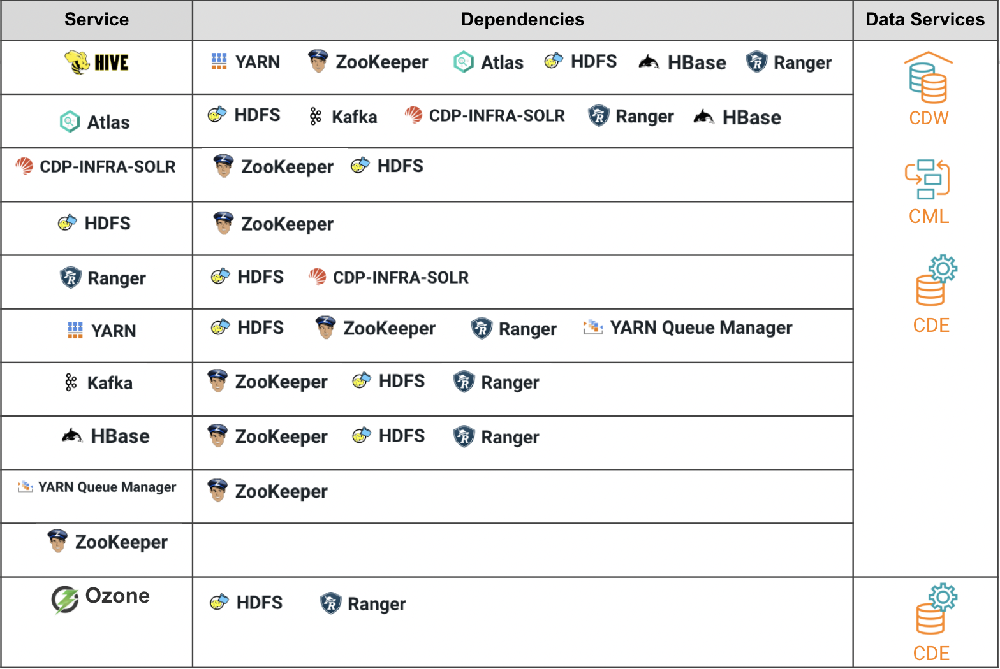

# Minimum Prerequisites
{: .no_toc }
The following components need to be prepared prior to the installation of CDP Private Cloud Platform.

- TOC
{:toc}

---

## Cloudera Subscription

1. Obtain a valid product subscription from Cloudera. Cloudera Manager requires a valid license to install accordingly. 

## Compute, Storage and Network

1. The hardware requirements are determined by the specific CDP services to be installed on both CDP Base and ECS.
2. The required minimum CDP Base services and its dependencies to install CML, CDW and CDE is illustrated in the following table.




3. Services such as HDFS, Zookeeper and [Ozone](https://docs.cloudera.com/cdp-private-cloud-upgrade/latest/release-guide/topics/cdpdc-ozone.html) have special storage requirements.

## DNS Server

1. TBA

## NTP Server

1. TBA

## Kerberos Server

1. TBA

## LDAP Server

1. TBA

## Relational Database

1. The database requirements is described in this [link](https://docs.cloudera.com/cdp-private-cloud-base/7.1.7/installation/topics/cdpdc-database-requirements.html).
  ```yaml
  theme: "just-the-docs"
  ```

2. _Optional:_ Initialize search data (creates `search-data.json`)
  ```bash
  $ bundle exec just-the-docs rake search:init
  ```


3. Point your web browser to [link](https://docs.cloudera.com/cdp-private-cloud-base/7.1.7/installation/topics/cdpdc-database-requirements.html)