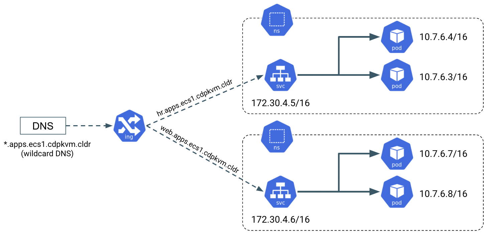

# Prerequisites
{: .no_toc }

CDP Private Cloud (CDP PvC) Platform and ECS (Embedded Compute Service) require direct integration with some 3rd party/external components as represented by the purple-coloured boxes depicted in the following logical architecture diagram. ECS platform hosts Cloudera Data Warehouse (CDW), Cloudera Machine Learning (CML) and Cloudera Data Engineering (CDE) data services.


The following prerequisites need to be prepared prior to installing CDP PvC with ECS solution. 

- TOC
{:toc}

---

## Cloudera Subscription

- Obtain a valid product subscription from Cloudera. Cloudera Manager requires a valid license to install accordingly. 

## Hardware

- The minimum CDP PvC Base services and its dependencies to install CML, CDW and CDE are illustrated in the following table.

    
    
- Hardware requirements are determined by specific CDP services to be installed in both CDP PvC Base cluster and ECS platform. For instance, CDP PvC Base services such as [HDFS](https://docs.cloudera.com/cdp-private-cloud-upgrade/latest/release-guide/topics/cdpdc-hdfs.html), [Zookeeper](https://docs.cloudera.com/cdp-private-cloud-upgrade/latest/release-guide/topics/cdpdc-zookeeper.html) and [Ozone](https://docs.cloudera.com/cdp-private-cloud-upgrade/latest/release-guide/topics/cdpdc-ozone.html) have dedicated storage requirements. 
- All ECS hosts need to be equipped with SSD/NVMe disk as the physical disk for [Longhorn storage](https://longhorn.io/docs/1.2.4/best-practices/#minimum-recommended-hardware). Longhorn could only use a single volume disk per node and thereby LVM is recommended to be used for exposing a single volume backed by one/many physical disk.
- CDW requires locally attached SCSI device (SSD/NVMe) on each ECS worker/agent node.


## Host Settings

- The supported OS and the filesystems are listed [here](https://docs.cloudera.com/cdp-private-cloud-base/7.1.7/installation/topics/cdpdc-os-requirements.html).
- [JDK](https://docs.cloudera.com/cdp-private-cloud-base/7.1.7/installation/topics/cdpdc-java-requirements.html) must be installed in each host.
- [Data at Rest](https://docs.cloudera.com/cdp-private-cloud-base/7.1.7/installation/topics/cdpdc-data-at-rest-encryption-requirements.html) is not mandatory and not covered in this article.
- For every ECS node that is equipped with Nvidia GPU card, ensure that the GPU hosts have Nvidia Drivers and Nvidia-container-runtime installed.
- All ECS nodes must be installed with nfs-utils package.

    ```bash
    # yum install nfs-utils
    ```

## External NFS

- CML requires external [NFS server](https://docs.cloudera.com/machine-learning/1.3.4/private-cloud-requirements/topics/ml-pvc-external-nfs-server.html) to store the project files. NFS version 4.1 must be supported.

## DNS Server

- An external DNS server must be able to route inbound traffic to both CDP Base platform and ECS. It must contain forward and reverse zones.
- Wildcard DNS entry must be configured; e.g. `*.apps.ecs1.cdpkvm.cldr`. This helps to reduce Day-2 operational task to set separate DNS entry for each newly provisioned external-facing application/service.



## NTP Server

- Every CDP PvC Base and ECS node must be installed with NTP client and able to synchronize the time with the external NTP server.

## Kerberos + LDAP Server

- An external Kerberos server and the Kerberos key distribution center (KDC) (with a realm established) must be available to provide authentication to CDP services, users and hosts.
- An external LDAP-compliant identity/directory server is required to enable the CDP solution to look up user accounts and groups in the directory.

## Relational Database

- The database requirements is described in this [link](https://docs.cloudera.com/cdp-private-cloud-base/7.1.7/installation/topics/cdpdc-database-requirements.html). 
- [SSL](https://docs.cloudera.com/cdp-private-cloud-data-services/1.3.4/installation/topics/cdppvc-installation-external-db-setup.html) must be enabled in the database.
- This demo uses PostgreSQL 12 database as the external database.
- Create the following databases in the external PostgreSQL server with its users and the associated privileges. Note that simple passwords are being created but the actual production environment should make use of complex passwords. Not every created database is being used here but serves as a placeholder for future use case.

  ```yaml
  CREATE ROLE scm LOGIN PASSWORD 'scm';
  CREATE ROLE rman LOGIN PASSWORD 'rman';
  CREATE ROLE hue LOGIN PASSWORD 'hue';
  CREATE ROLE metastore LOGIN PASSWORD 'metastore';
  CREATE ROLE oozie LOGIN PASSWORD 'oozie';
  CREATE ROLE schemaregistry LOGIN PASSWORD 'schemaregistry';
  CREATE ROLE smm LOGIN PASSWORD 'smm';
  CREATE DATABASE scm OWNER scm ENCODING 'UTF8';
  CREATE DATABASE rman OWNER rman ENCODING 'UTF8';
  CREATE DATABASE hue OWNER hue ENCODING 'UTF8';
  CREATE DATABASE metastore OWNER metastore ENCODING 'UTF8';
  CREATE DATABASE oozie OWNER oozie ENCODING 'UTF8';
  CREATE DATABASE schemaregistry OWNER schemaregistry ENCODING 'UTF8';
  CREATE DATABASE smm OWNER smm ENCODING 'UTF8';
  ALTER DATABASE metastore SET standard_conforming_strings=off;
  ALTER DATABASE oozie SET standard_conforming_strings=off;
  CREATE DATABASE ranger ENCODING 'UTF8';
  CREATE USER rangeradmin WITH PASSWORD 'rangeradmin';
  GRANT ALL PRIVILEGES ON DATABASE ranger TO rangeradmin;
  CREATE DATABASE streamsmsgmgr;
  CREATE USER streamsmsgmgr WITH PASSWORD 'streamsmsgmgr';
  GRANT ALL PRIVILEGES ON DATABASE "streamsmsgmgr" to streamsmsgmgr;
  CREATE DATABASE registry;
  CREATE USER registry WITH PASSWORD 'registry';
  GRANT ALL PRIVILEGES ON DATABASE "registry" to registry;
  CREATE USER cdpadmin WITH PASSWORD 'cdpadmin';
  CREATE DATABASE dbenv OWNER cdpadmin ENCODING 'UTF8';
  CREATE DATABASE dbmlx OWNER cdpadmin ENCODING 'UTF8';
  CREATE DATABASE dbdwx OWNER cdpadmin ENCODING 'UTF8';
  CREATE DATABASE dbliftie OWNER cdpadmin ENCODING 'UTF8';
  CREATE DATABASE dbdex OWNER cdpadmin ENCODING 'UTF8';
  CREATE DATABASE dbresourcepoolmanager OWNER cdpadmin ENCODING 'UTF8';
  CREATE DATABASE dbclusteraccessmanager OWNER cdpadmin ENCODING 'UTF8';
  CREATE DATABASE dbalerts OWNER cdpadmin ENCODING 'UTF8';
  CREATE DATABASE dbums OWNER cdpadmin ENCODING 'UTF8';
  CREATE DATABASE cmregistration OWNER cdpadmin ENCODING 'UTF8';
  CREATE DATABASE clusterproxy OWNER cdpadmin ENCODING 'UTF8';
  CREATE DATABASE metastoredb1 OWNER cdpadmin ENCODING 'UTF8';
  CREATE DATABASE dasdb1 OWNER cdpadmin ENCODING 'UTF8';
  CREATE DATABASE huedb1 OWNER cdpadmin ENCODING 'UTF8';
  ```

## Load Balancer

- An external load balancer is needed to route traffics towards redundant nodes of a particular service.

## Internet

- A stable connectivity to internet is required during installation.

---
   
   Next Step
   {: .label .label-blue }
   
- After preparing the abovementioned prerequisites, proceed to check out the steps to install Cloudera Manager in the subsequent [subtopic]({{ site.baseurl }}).