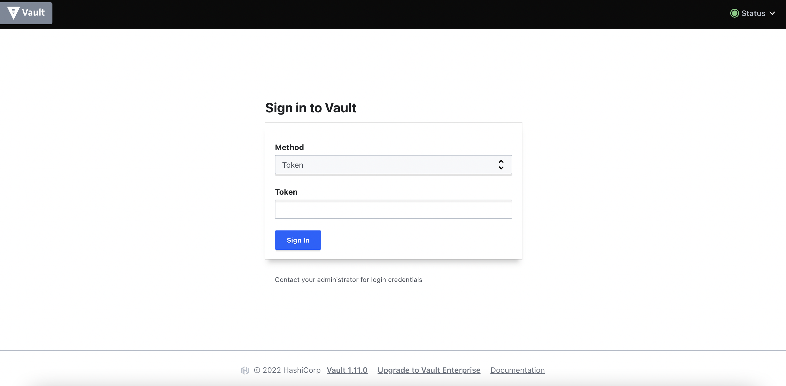
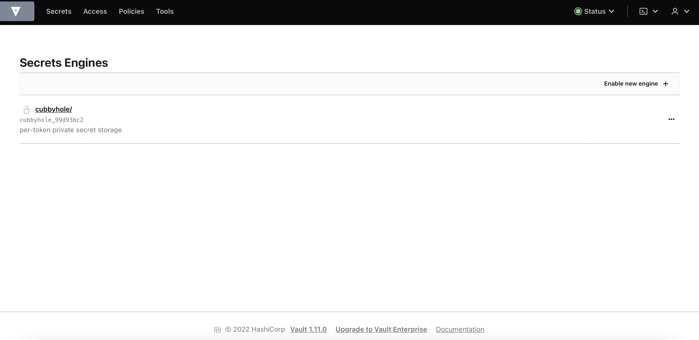

# Vault Deployment
{: .no_toc }

This article describes the steps to deploy the external Hashicorp Vault in the designated Vault server.

---


1. Install the following software package.
    ```bash
    # yum install -y yum-utils
    ```

2. Add the repo.

    ```bash
    # yum-config-manager --add-repo https://rpm.releases.hashicorp.com/RHEL/hashicorp.repo
    ```


    
    
        