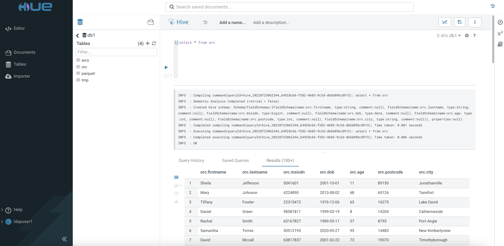

---

layout: default
title: Parquet, ORC, Avro and CSV Benchmarking
parent: Data Warehousing
nav_order: 1

---

# Parquet, ORC, Avro and CSV Benchmarking

- There is a variety of file format choices in the Hadoop ecosystem. The popular file formats are ORC, Parquet, CSV and Avro. Parquet and ORC are both columnar-storage type whereas ORC is of the row-based format.
- While Impala engine is designed to achieve low-latency and high-performance interactive SQL queries, Impala is endorsing Parquet as it has some [limitations](https://impala.apache.org/docs/build/html/topics/impala_file_formats.html) supporting other file formats.
- This article describes the steps to test the performance of these file formats in both Hive LLAP and Impala query engine using Cloudera Data Warehouse (CDW) with 1 executor engine pod in CDP Private Cloud platform.

- TOC
{:toc}

---
## Prerequisites

- The performance benchmarking tests are carried out using CDW on the CDP Private Cloud (Openshift) platform with the following hardware specification.

| CPU          | Intel(R) Xeon(R) Gold 5220R CPU @ 2.20GHz | 
| Memory  | DIMM DDR4 Synchronous Registered (Buffered) 2933 MHz (0.3 ns) | 
| Disk | SSD P4610 1.6TB SFF    | 


- A sample data of 300 million CSV rows is produced using a python script with the [faker](https://faker.readthedocs.io/en/master/) generator. The schema of each row is sequenced as `Lastname, Firstname, MSISDN, Date of Birth, Postcode, City` as illustrated below.

    ```yaml
    Maria,Harmon,32378521,1998-11-14,17,30766,Durhammouth
    Anne,Adams,29481072,1982-10-28,36,70830,Deannabury
    Deborah,Sanders,21125797,2002-04-07,56,63993,New Ronaldland
    ```

- Copy the file to the HDFS cluster.

    ```bash
    # hdfs dfs -put 300mil.csv /tmp/sampledata/
    
    # hdfs dfs -du -h /tmp/sampledata/
    16.0 G  47.9 G  /tmp/sampledata/300mil.csv    
    ```

- In CDW, create a `Hive LLAP` and an `Impala` virtual warehouse with only 1 executor each.

    

## Testing Procedure

1. Access `Hue` tool of the `Hive` virtual warehouse. Create database `db1`.

        
 
2. Use the SQL Editor to create an external table in the database `db1`.
 
           

3. Execute the following command and take note of the speed result. Repeat running the same command and jot down the result again.
    
    
    
4. Create a Hive managed table using the ORC file format based on the schema as shown below. The data type of the specific file format can obtained [here](https://docs.cloudera.com/cdp-private-cloud-base/7.1.7/impala-reference/topics/impala-file-formats.html).
    
    

5. Insert the data from the external `tmp` table into this newly created ORC-based table. Take note of the speed to execute this task completely.

    
    
6. Check the result of the loaded data.    

    
    

7. Run the following SQL queries twice and take note of the speed result.

    ```yaml
    SELECT COUNT (*) FROM db1.orc;   
    ```    
    
    ```yaml
    SELECT AVG(age) FROM db1.orc where lastname = 'Davis' and age > 30 and age < 40;
    ``` 
    
8. Repeat step 4 to 6 for file format Parquet using the table with following schema.

    ```yaml
    CREATE TABLE db1.parquet(
    FirstName string, LastName string,    
    MSISDN bigint, DOB date, age int,
    Postcode int, City string)
    STORED AS parquet
    TBLPROPERTIES ('parquet.schema.literal'='{
    "name": "sample1",
    "type": "record",
    "fields": [
    {"name":"one", "type":"binary"},
    {"name":"two", "type":"binary"},
    {"name":"three", "type":"INT64"},
    {"name":"four", "type":"date"},
    {"name":"five", "type":"INT32"},
    {"name":"six", "type":"INT32"},
    {"name":"seven", "type":"binary"}
    ]}')
    ```

9. Run the following SQL queries twice and take note of the speed result.

    ```yaml
    SELECT COUNT (*) FROM db1.parquet;   
    ```    
    
    ```yaml
    SELECT AVG(age) FROM db1.parquet where lastname = 'Davis' and age > 30 and age < 40;
    ``` 

10. Repeat step 4 to 6 for file format Avro using the table with following schema.

    ```yaml
    CREATE TABLE db1.avro(
    FirstName string, LastName string,    
    MSISDN bigint, DOB date, age int,
    Postcode int, City string)
    STORED AS avro
    TBLPROPERTIES ('avro.schema.literal'='{
    "name": "sample1",
    "type": "record",
    "fields": [
    {"name":"FirstName", "type":"string"},
    {"name":"LastName", "type":"string"},
    {"name":"MSISDN", "type":"long"},
    {"name":"DOB", "type":"string"},
    {"name":"age", "type":"int"},
    {"name":"Postcode", "type":"int"},
    {"name":"City", "type":"string"}
    ]}')
    ```    

11. Run the following SQL queries twice and take note of the speed result.

    ```yaml
    SELECT COUNT (*) FROM db1.avro;
    ```    

    ```yaml
    SELECT AVG(age) FROM avro where lastname = 'Davis' and age > 30 and age < 40;
    ``` 

12. Access `Hue` tool of the `Impala` virtual warehouse. Create database `db2`.
   
 
13. Use the SQL Editor to create an external table in the database `db2`.
    

14. Create a managed table using the Parquet file format based on the schema as shown below.
    
    ```yaml
    CREATE TABLE db2.parquet2(
    FirstName string, LastName string,    
    MSISDN bigint, DOB date, age int,
    Postcode int, City string)
    STORED AS parquet
    TBLPROPERTIES ('parquet.schema.literal'='{
    "name": "sample1",
    "type": "record",
    "fields": [
    {"name":"one", "type":"binary"},
    {"name":"two", "type":"binary"},
    {"name":"three", "type":"INT64"},
    {"name":"four", "type":"date"},
    {"name":"five", "type":"INT32"},
    {"name":"six", "type":"INT32"},
    {"name":"seven", "type":"binary"}
    ]}')
    ```    

15. Insert the data from the external `tmp` table into this newly created ORC-based table. Take note of the speed to execute this task completely.

    ```yaml
    insert into table db2.parquet2 select * from db1.tmp;  
    ```    
    
16. Run the following SQL queries twice and take note of the speed result.

    ```yaml
    SELECT COUNT (*) FROM db2.parquet2;   
    ```    
    
    ```yaml
    SELECT AVG(age) FROM db2.parquet2 where lastname = 'Davis' and age > 30 and age < 40;
    ``` 
    
17. Repeat step 16 for `tmp` table with file format CSV.

    ```yaml
    SELECT COUNT (*) FROM db1.tmp;   
    ```    
    
    ```yaml
    SELECT AVG(age) FROM db1.tmp where lastname = 'Davis' and age > 30 and age < 40;
    ``` 
    
## Performance Result

- The following table shows the time taken (in seconds) to run each SQL query and its associated file format without SNAPPY compression.


| File Format  | Engine | INSERT | SELECT COUNT (1st)|SELECT COUNT (2nd) |SELECT AVG(1st)|SELECT AVG(2nd)|
|:-------------|:----------------|:------------------|:------------------|---------------|---------------|
| CSV          | Hive   | N.A.   |26.83              | 2.28              |44.2           |4.1            |
| ORC          | Hive   | 507    |0.40               | 0.39              |8.13           |0.39           | 
| Avro         | Hive   | 355    |0.40               | 0.38              |207            |0.40           |
| Parquet      | Hive   | 332    |0.38               | 0.38              |11.78          |0.37           |
| Parquet      | Parquet| 32     |0.36               | 0.35              |1.76           |1.62           |
| CSV          | Parquet| N.A.   |3.12               | 1.75              |4.69           |4.1            |

## Conclusion

- In comparison to running the same SQL queries in other platform, CDW in CDP Private Cloud platform might take shorter duration to process the queries due to its high-speed caching mechanism especially when running the same query repeatedly.
- Parquet stands out in terms of speed of running interactive SQL query. As it is a pioneer file format for Impala, running SQL query in Impala produces quicker result compared to running the same query in Hive engine.
- Although Parquet emerges as the winner, both Avro and ORC are also being used for other purpose and use case. Avro is popular for its schema evolution mechanism and ORC provides high efficiency in terms of storing the Hive data.

---