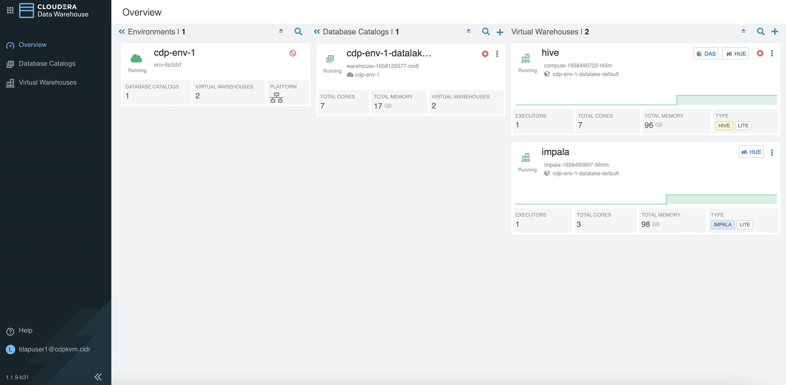
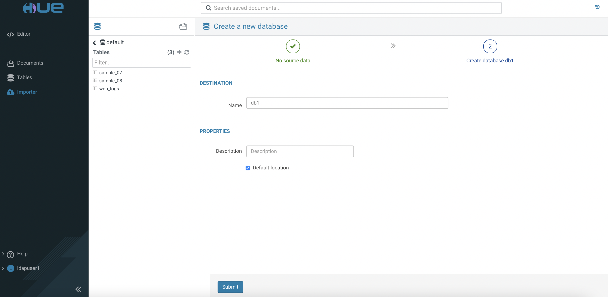
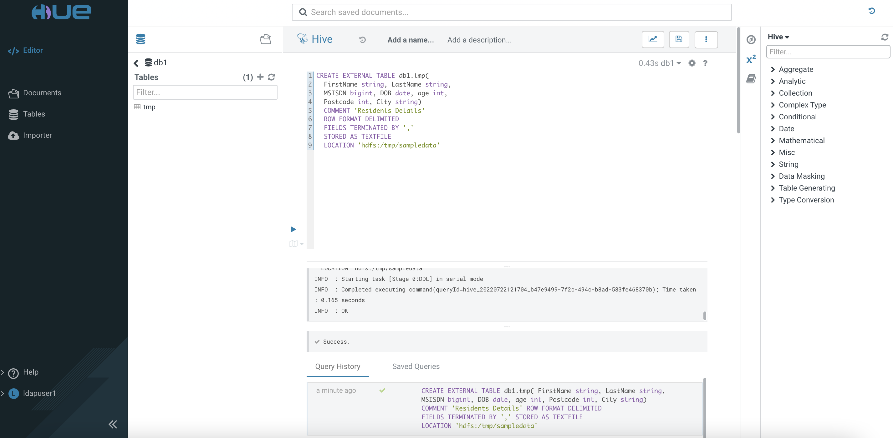
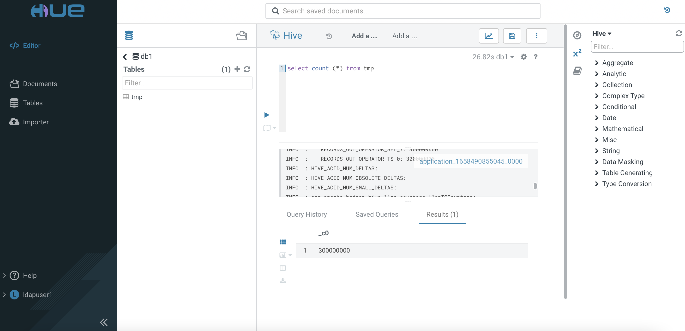
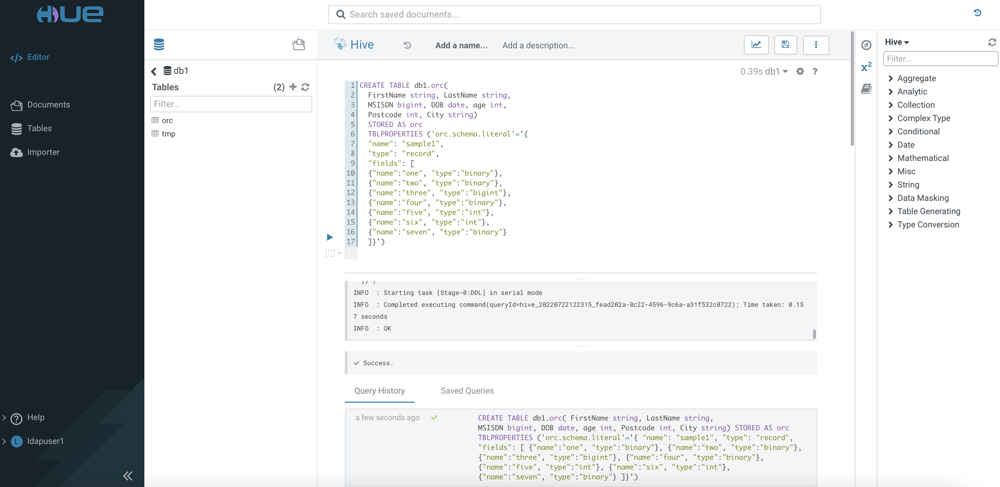
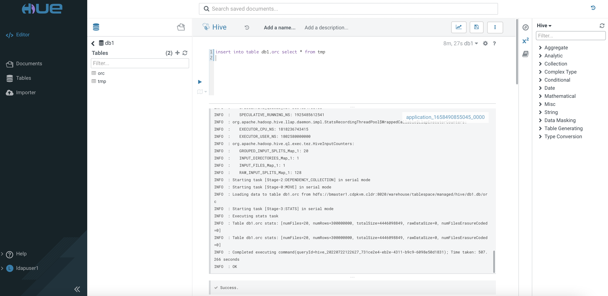

# Parquet, ORC, Avro and CSV Benchmarking
{: .no_toc }

- There is a variety of file format choices in the [Hadoop ecosystem](https://docs.cloudera.com/cdp-private-cloud-base/7.1.7/impala-reference/topics/impala-file-formats.html). The popular file formats are ORC, Parquet, CSV and Avro. Parquet and ORC are both columnar-storage type whereas ORC is of the row-based format.
- This article describes the steps to test the performance of these file formats in both Hive LLAP and Impala query engine.

- TOC
{:toc}

---


## Prerequisites

- The performance benchmarking tests are carried out using CDW on the CDP PvC (Openshift) platform with the following hardware specification.

| CPU          | Intel(R) Xeon(R) Gold 5220R CPU @ 2.20GHz | 
| Memory  | DIMM DDR4 Synchronous Registered (Buffered) 2933 MHz (0.3 ns) | 
| Disk | SSD P4610 1.6TB SFF    | 


- A sample data of 300 million CSV rows is produced using a python script with the [faker](https://faker.readthedocs.io/en/master/) generator. The schema of each row is sequenced as `Lastname, Firstname, MSISDN, Date of Birth, Postcode, City` as illustrated below.

    ```yaml
    Maria,Harmon,32378521,1998-11-14,17,30766,Durhammouth
    Anne,Adams,29481072,1982-10-28,36,70830,Deannabury
    Deborah,Sanders,21125797,2002-04-07,56,63993,New Ronaldland
    ```

- Copy the file to the HDFS cluster.

    ```bash
    # hdfs dfs -put 300mil.csv /tmp/sampledata/
    
    # hdfs dfs -du -h /tmp/sampledata/
    16.0 G  47.9 G  /tmp/sampledata/300mil.csv    
    ```

- In CDW, create a `Hive LLAP` and an `Impala` virtual warehouse with only 1 executor each.

    

## Testing Procedure using Hive LLAP

1. Access `Hue` tool of the `Hive LLAP` virtual warehouse. Create database `db1`.

        
 
2. Use the SQL Editor to create an external table in the database `db1`.
 
           

3. Execute the following command and take note of the speed result. Repeat running the same command and jot down the result again.
    
    
    
4. Create a Hive managed table using the ORC file format based on the schema as shown below. The data type of the specific file format can obtained [here](https://docs.cloudera.com/cdp-private-cloud-base/7.1.7/impala-reference/topics/impala-file-formats.html).
    
    

5. Load the data from the external `tmp` table into this newly created ORC-based table. Take note of the speed to execute this task completely.

    

6. Execute the following command and take note of the query speed result. Repeat running the same command and jot down the result again.

    ```bash
    SELECT COUNT (*) FROM db1.orc;   
    ```    
    
7. Repeat step 4 to 5 for file format Parquet using the table with following schema.

    ```yaml
    CREATE TABLE db1.parquet(
    FirstName string, LastName string,    
    MSISDN bigint, DOB date, age int,
    Postcode int, City string)
    STORED AS parquet
    TBLPROPERTIES ('parquet.schema.literal'='{
    "name": "sample1",
    "type": "record",
    "fields": [
    {"name":"one", "type":"binary"},
    {"name":"two", "type":"binary"},
    {"name":"three", "type":"INT64"},
    {"name":"four", "type":"date"},
    {"name":"five", "type":"INT32"},
    {"name":"six", "type":"INT32"},
    {"name":"seven", "type":"binary"}
    ]}')
    ```

8. Execute the following command and take note of the query speed result. Repeat running the same command and jot down the result again.

    ```bash
    SELECT COUNT (*) FROM db1.parquet;   
    ```    

9. Repeat step 4 to 5 for file format Avro using the table with following schema.

    ```yaml
    CREATE TABLE db1.avro(
    FirstName string, LastName string,    
    MSISDN bigint, DOB date, age int,
    Postcode int, City string)
    STORED AS avro
    TBLPROPERTIES ('avro.schema.literal'='{
    "name": "sample1",
    "type": "record",
    "fields": [
    {"name":"one", "type":"string"},
    {"name":"two", "type":"string"},
    {"name":"three", "type":"long"},
    {"name":"four", "type":"string"},
    {"name":"five", "type":"int"},
    {"name":"six", "type":"int"},
    {"name":"seven", "type":"string"}
    ]}')
    ```    

10. Run the following SQL query and take note of the speed result. Repeat running the same command and jot down the result again.

    ```bash
    SELECT COUNT (*) FROM db1.avro;   
    ```    
    
## Performance Result

- The following table shows the speed result (seconds) for each file format and its query.
- Note that the 2nd run requires shorter duration to complete the task due to the caching mechanism in the CDW platform.


| File Format  | Engine | INSERT | SELECT COUNT (1st run)|SELECT COUNT (2nd run)|
|:-------------|:----------------|:----------------------|:---------------------|
| CSV          | Hive   | N.A.   |26.83                 | 2.28               |
| ORC          | Hive   | 507    |0.40                  | 0.39               | 
| Parquet      | Hive   | 332    |0.38                  | 0.38               |
| Avro         | Hive   |        | 

## Conclusion

- ORC stands out in terms of performance and it is better suited as the file format for Hive LLAP. 
- Parquet is a preferred file format for Impala.