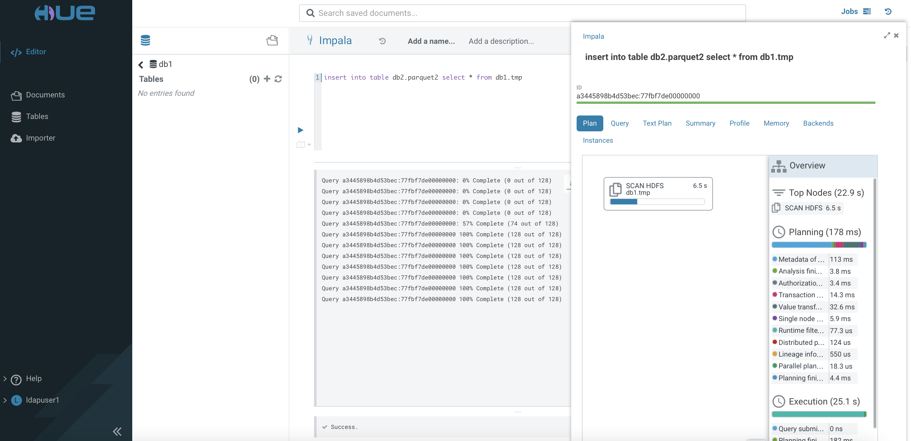

# Parquet, Orc, Avro and CSV Benchmarking
{: .no_toc }

CDW 

- TOC
{:toc}

---


## Prerequisites

- The performance benchmarking tests are carried out using CDW on the CDP PvC (Openshift) platform with the following hardware specification.

| CPU          | Intel(R) Xeon(R) Gold 5220R CPU @ 2.20GHz | 
| Memory  | DIMM DDR4 Synchronous Registered (Buffered) 2933 MHz (0.3 ns) | 
| Disk | SSD P4610 1.6TB SFF    | 


- A sample data with 300 million rows of csv data is produced using python script with the [faker](https://faker.readthedocs.io/en/master/) generator. The format is shown as follows.

    ```yaml
    Maria,Harmon,32378521,1998-11-14,17,30766,Durhammouth
    ```

- Copy the file to the HDFS cluster.

    ```bash
    # hdfs dfs -put 300mil.csv /tmp/sampledata/
    
    # hdfs dfs -du -h /tmp/sampledata/
    16.0 G  47.9 G  /tmp/sampledata/300mil.csv    
    ```

- In CDW, create a `Hive LLAP` and an `Impala` virtual warehouse with only 1 executor each.

    

## Testing Procedure in Hive LLAP

1. Access `Hue` tool of the `Hive LLAP` virtual warehouse. Create database `db1`.

        
 
2. Use the SQL Editor to create an external table in the database `db1`.
 
           

3. Execute the following command and take note of the speed result. Repeat running the same command and jot down the result again.
    
    
    
4. Create a Hive managed table using ORC data format.
    
    

5. Load the data in this newly created ORC based table with the data from the external `tmp` table. Take note of the speed to execute this task completely.

    

6. Execute the following command and take note of the speed result. Repeat running the same command and jot down the result again.

    
    
    
7. Repeat step 4 to 6 for data format AVRO using the following SQL script.


    ```yaml
    Maria,Harmon,32378521,1998-11-14,17,30766,Durhammouth
    ```
    
## Performance Result

| Data Format    | Speed |
|    | INSERT | SELECT COUNT (1st run)|SELECT COUNT (2nd run)|
|:-------------|:------------------|
| csv          |         | 
| orc        |          | 
| parquet       |            | 
| avro     |           | 


