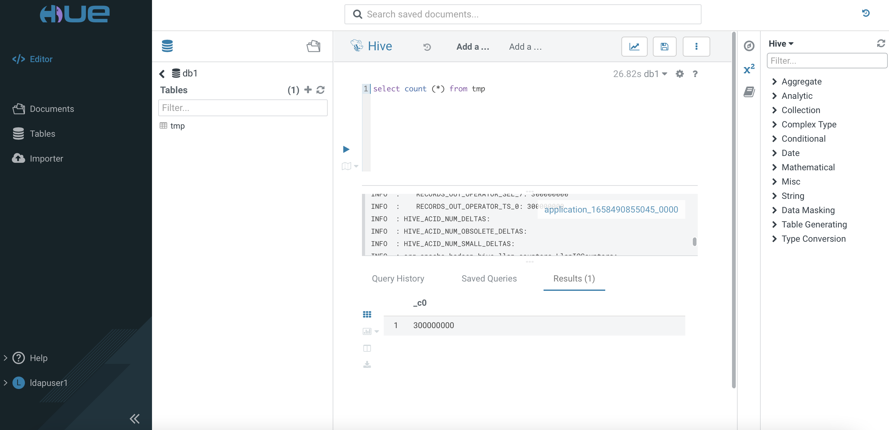

# Auto-scaling in CDW
{: .no_toc }

Auto-scaling is becoming a new "norm" feature in any data warehouse solution. Auto-scaling prevents over-provisioning of computing resources and scale up only when additional resources are needed to process the higher than expected workloads at a specific time.  The ability to scale down automatically helps to save infrastructure cost when the resources are no longer needed due to lower workloads.

This article demonstrates how CDW in CDP Private Cloud platform scales up/down by auto-provisioning the container pod in Openshift depending on the needs of the SQL queries.

- TOC
{:toc}

---
## Prerequisites


- A random sample data of 300 million CSV rows is produced using a python script with the [faker](https://faker.readthedocs.io/en/master/) generator. The schema of each row is sequenced as `Lastname, Firstname, MSISDN, Date of Birth, Postcode, City` as illustrated below.

    ```yaml
    Maria,Harmon,32378521,1998-11-14,17,30766,Durhammouth
    Anne,Adams,29481072,1982-10-28,36,70830,Deannabury
    Deborah,Sanders,21125797,2002-04-07,56,63993,New Ronaldland
    ```

- Copy the file to the HDFS cluster.

    ```bash
    # hdfs dfs -put 300mil.csv /tmp/sampledata/
    
    # hdfs dfs -du -h /tmp/sampledata/
    16.0 G  47.9 G  /tmp/sampledata/300mil.csv    
    ```

- In CDW, create a `hive` virtual warehouse with minimum 1 executor and maximum 2 executors.

    
    
    
    
 
## Setup Beeline tool
 
1. Assuming that the default ingress certificate in Openshift has already been [replaced](https://docs.openshift.com/container-platform/4.7/security/certificates/replacing-default-ingress-certificate.html) with the generated certificate. In this case, the location of the file is /root/ingressca.crt.
 
2. Import the cert into the default location of OpenJDK cacerts directory in which Beeline will read that SSL truststore by default.
    
    ```bash  
    # keytool  -importcert -alias beeline -keystore /usr/lib/jvm/java-11-openjdk-11.0.15.0.9-2.el7_9.x86_64/lib/security/cacerts  -file  /root/ingressca.crt
    ```
3. Verify that the certificate has been imported successfully. 
    ```bash
    # keytool -list -v -keystore /usr/lib/jvm/java-11-openjdk-11.0.15.0.9-2.el7_9.x86_64/lib/security/cacerts | grep beeline
    ```

## Testing Procedure

1. Access `Hue` tool of the `hive` virtual warehouse. Create database `db1`.

        
 
2. Use the SQL Editor to create an external table in the database `db1`.
 
           

3. Run the following SQL command and verify the results accordingly.
    
    
    
4. Create a Hive managed table using the Avro file format based on the schema as shown below.
    
    ```yaml
    CREATE TABLE db1.avro(
    FirstName string, LastName string,    
    MSISDN bigint, DOB date, age int,
    Postcode int, City string)
    STORED AS avro
    TBLPROPERTIES ('avro.schema.literal'='{
    "name": "sample1",
    "type": "record",
    "fields": [
    {"name":"FirstName", "type":"string"},
    {"name":"LastName", "type":"string"},
    {"name":"MSISDN", "type":"long"},
    {"name":"DOB", "type":"string"},
    {"name":"age", "type":"int"},
    {"name":"Postcode", "type":"int"},
    {"name":"City", "type":"string"}
    ]}')
    ```   

5. Create another Hive managed table using the ORC file format based on the schema as shown below.
    
    ```yaml
    CREATE TABLE db1.orc(
    FirstName string, LastName string,    
    MSISDN bigint, DOB date, age int,
    Postcode int, City string)
    STORED AS orc
    TBLPROPERTIES ('orc.schema.literal'='{
    "name": "sample1",
    "type": "record",
    "fields": [
    {"name":"one", "type":"binary"},
    {"name":"two", "type":"binary"},
    {"name":"three", "type":"bigint"},
    {"name":"four", "type":"binary"},
    {"name":"five", "type":"int"},
    {"name":"six", "type":"int"},
    {"name":"seven", "type":"binary"}
    ]}')
    ```   
    
6. Open a terminal console, check the status of pods in the `hive` namespace. Note that there is only 1 query-executor pod provisioned.

    ```bash
    # oc -n compute-1658641968-r8vh get pods
    NAME                             READY   STATUS    RESTARTS   AGE
    das-webapp-0                     1/1     Running   0          4m26s
    hiveserver2-0                    1/1     Running   0          4m26s
    huebackend-0                     1/1     Running   0          4m26s
    huefrontend-78b8577f7c-fb4fp     1/1     Running   0          4m26s
    query-coordinator-0-0            1/1     Running   0          4m19s
    query-executor-0-0               1/1     Running   0          4m19s
    standalone-compute-operator-0    1/1     Running   0          4m26s
    usage-monitor-5f9cfb8487-2zrrk   1/1     Running   0          4m26s

    # oc -n compute-1658641968-r8vh get pvc
    NAME                                                  STATUS   VOLUME              CAPACITY   ACCESS MODES   STORAGECLASS   AGE
    query-executor-1658641992-volume-query-executor-0-0   Bound    local-pv-c8fe6eea   200Gi      RWO            cdw-disk       4m23s
    ``` 

7. Open another terminal console, insert the data into the ORC-based table from the external `tmp` table by using the `Beeline` tool.  


    ```bash
    # beeline -u "jdbc:hive2://hs2-hive.apps.ocp4.cdpkvm.cldr/db1;transportMode=http;httpPath=cliservice;ssl=true;retries=3" -n ldapuser1 -p ldapuser1
    
    ... filtered ...

    Beeline version 3.1.3000.7.1.7.0-551 by Apache Hive
    0: jdbc:hive2://hs2-hive.apps.ocp4.cdpkvm.cld> INSERT INTO table db1.orc SELECT * from db1.tmp; 
    INFO  : Compiling command(queryId=hive_20220724060525_ed941551-d345-497d-b9f8-550a770809e5): INSERT INTO table db1.orc SELECT * from db1.tmp
    INFO  : No Stats for db1@tmp, Columns: firstname, city, dob, postcode, msisdn, age, lastname
    INFO  : Semantic Analysis Completed (retrial = false)
    INFO  : Created Hive schema: Schema(fieldSchemas:[FieldSchema(name:tmp.firstname, type:string, comment:null), FieldSchema(name:tmp.lastname, type:string, comment:null), FieldSchema(name:tmp.msisdn, type:bigint, comment:null), FieldSchema(name:tmp.dob, type:date, comment:null), FieldSchema(name:tmp.age, type:int, comment:null), FieldSchema(name:tmp.postcode, type:int, comment:null), FieldSchema(name:tmp.city, type:string, comment:null)], properties:null)
    INFO  : Completed compiling command(queryId=hive_20220724060525_ed941551-d345-497d-b9f8-550a770809e5); Time taken: 0.374 seconds
    INFO  : Executing command(queryId=hive_20220724060525_ed941551-d345-497d-b9f8-550a770809e5): INSERT INTO table db1.orc SELECT * from db1.tmp
    INFO  : Compute 'hive' is active.
    INFO  : Query ID = hive_20220724060525_ed941551-d345-497d-b9f8-550a770809e5
    INFO  : Total jobs = 1
    INFO  : Launching Job 1 out of 1
    INFO  : Starting task [Stage-1:MAPRED] in serial mode
    INFO  : Subscribed to counters: [] for queryId: hive_20220724060525_ed941551-d345-497d-b9f8-550a770809e5
    INFO  : Tez session hasn't been created yet. Opening session
    INFO  : Dag name: INSERT INTO table db1.orc SELECT *...db1.tmp (Stage-1)
    INFO  : Status: Running (Executing on YARN cluster with App id application_1658642600148_0000)

    ----------------------------------------------------------------------------------------------
        VERTICES      MODE        STATUS  TOTAL  COMPLETED  RUNNING  PENDING  FAILED  KILLED  
    ----------------------------------------------------------------------------------------------
    Map 1 ..........      llap     SUCCEEDED     20         20        0        0       0       0  
    Reducer 2 ......      llap     SUCCEEDED      1          1        0        0       0       0  
    ----------------------------------------------------------------------------------------------
    VERTICES: 02/02  [==========================>>] 100%  ELAPSED TIME: 491.30 s   
    ----------------------------------------------------------------------------------------------
    INFO  : Status: DAG finished successfully in 490.14 seconds

    ... filtered ...
    
    INFO  : Starting task [Stage-2:DEPENDENCY_COLLECTION] in serial mode
    ----------------------------------------------------------------------------------------------
    VERTICES      MODE        STATUS  TOTAL  COMPLETED  RUNNING  PENDING  FAILED  KILLED  
    ----------------------------------------------------------------------------------------------
    Map 1 ..........      llap     SUCCEEDED     20         20        0        0       0       0  
    Reducer 2 ......      llap     SUCCEEDED      1          1        0        0       0       0  e=0, numFilesErasureCoded=0]
    ----------------------------------------------------------------------------------------------
    VERTICES: 02/02  [==========================>>] 100%  ELAPSED TIME: 491.32 s   
    ----------------------------------------------------------------------------------------------
    300,000,000 rows affected (492.022 seconds) 
    ```    

    
8. Open another SSH terminal, insert the data into the Avro-based table from the external `tmp` table by using the `Beeline` tool.  

    ```bash
    # beeline -u "jdbc:hive2://hs2-hive.apps.ocp4.cdpkvm.cldr/db1;transportMode=http;httpPath=cliservice;ssl=true;retries=3" -n ldapuser1 -p ldapuser1

    ... filtered ...

    Beeline version 3.1.3000.7.1.7.0-551 by Apache Hive
    0: jdbc:hive2://hs2-hive.apps.ocp4.cdpkvm.cld> INSERT INTO table db1.avro SELECT * from db1.tmp;
    22/07/24 14:09:14 [main]: INFO jdbc.HiveConnection: Could not connect to the server. Retrying one more time.
    INFO  : Compiling command(queryId=hive_20220724060914_ac401654-1582-4415-8b9a-d76abbeee5a0): INSERT INTO table db1.avro SELECT * from db1.tmp
    INFO  : No Stats for db1@tmp, Columns: firstname, city, dob, postcode, msisdn, age, lastname
    INFO  : Semantic Analysis Completed (retrial = false)
    INFO  : Created Hive schema: Schema(fieldSchemas:[FieldSchema(name:_col0, type:string, comment:null), FieldSchema(name:_col1, type:string, comment:null), FieldSchema(name:_col2, type:bigint, comment:null), FieldSchema(name:_col3, type:string, comment:null), FieldSchema(name:_col4, type:int, comment:null), FieldSchema(name:_col5, type:int, comment:null), FieldSchema(name:_col6, type:string, comment:null)], properties:null)
    INFO  : Completed compiling command(queryId=hive_20220724060914_ac401654-1582-4415-8b9a-d76abbeee5a0); Time taken: 0.432 seconds
    INFO  : Executing command(queryId=hive_20220724060914_ac401654-1582-4415-8b9a-d76abbeee5a0): INSERT INTO table db1.avro SELECT * from db1.tmp
    INFO  : Compute 'hive' is active.
    INFO  : Query ID = hive_20220724060914_ac401654-1582-4415-8b9a-d76abbeee5a0
    INFO  : Total jobs = 1
    INFO  : Launching Job 1 out of 1
    INFO  : Starting task [Stage-1:MAPRED] in serial mode
    INFO  : Subscribed to counters: [] for queryId: hive_20220724060914_ac401654-1582-4415-8b9a-d76abbeee5a0
    INFO  : Tez session hasn't been created yet. Opening session
    ----------------------------------------------------------------------------------------------
        VERTICES      MODE        STATUS  TOTAL  COMPLETED  RUNNING  PENDING  FAILED  KILLED  
    ----------------------------------------------------------------------------------------------
    Map 1 ..........      llap     SUCCEEDED     20         20        0        0       0       0  
    Reducer 2 ......      llap     SUCCEEDED      1          1        0        0       0       0  
    ----------------------------------------------------------------------------------------------
    VERTICES: 02/02  [==========================>>] 100%  ELAPSED TIME: 345.48 s   
    ----------------------------------------------------------------------------------------------
    INFO  : Status: DAG finished successfully in 344.74 seconds

    ... filtered ...
    
    ----------------------------------------------------------------------------------------------
        VERTICES      MODE        STATUS  TOTAL  COMPLETED  RUNNING  PENDING  FAILED  KILLED  
    ----------------------------------------------------------------------------------------------
    Map 1 ..........      llap     SUCCEEDED     20         20        0        0       0       0  
    Reducer 2 ......      llap     SUCCEEDED      1          1        0        0       0       0  ize=0, numFilesErasureCoded=0]
    ----------------------------------------------------------------------------------------------
    VERTICES: 02/02  [==========================>>] 100%  ELAPSED TIME: 346.46 s   
    ----------------------------------------------------------------------------------------------
    300,000,000 rows affected (608.205 seconds) 
    ```    
    

9. Take note of the the pod's log in the `hive` namespace.

    ```bash
    # oc -n compute-1658641968-r8vh logs -f usage-monitor-5f9cfb8487-2zrrk
    ```
    
    The first SQL query can be processed by the single query-executor pod without the need to scale up.    
    ```yaml
    time="2022-07-24T06:09:45Z" level=info msg="ReadyReplicas for query-coordinator-0: 1"
    time="2022-07-24T06:09:45Z" level=info msg="ReadyReplicas for query-coordinator-0: 1"
    time="2022-07-24T06:09:45Z" level=info msg="freeCoordinators: 0 executingQueries: 1 standaloneQueryCount: 0"
    time="2022-07-24T06:09:55Z" level=info msg="ReadyReplicas for query-coordinator-0: 1"
    time="2022-07-24T06:09:55Z" level=info msg="ReadyReplicas for query-coordinator-0: 1"
    time="2022-07-24T06:09:55Z" level=info msg="freeCoordinators: -1 executingQueries: 2 standaloneQueryCount: 0"
    ```

    When the second query hits the system, CDW decides to scale up after approximately 60 seconds (as configured).     
    ```yaml    
    time="2022-07-24T06:10:55Z" level=info msg="Queued query wait time of 94.655000 secs exceeded threshold 60, adding an additional compute group."
    time="2022-07-24T06:10:55Z" level=info msg="Auto-scale decision: 1"
    time="2022-07-24T06:10:55Z" level=info msg="Updating compute-1658641968-r8vh/hive to 2 compute groups"
    time="2022-07-24T06:11:05Z" level=info msg="ReadyReplicas for query-coordinator-0: 1"
    time="2022-07-24T06:11:05Z" level=info msg="ReadyReplicas for query-coordinator-1: 0"
    time="2022-07-24T06:11:05Z" level=info msg="compute-1658641968-r8vh/hive: 1 coordinators found for 2 compute groups, expected 2. May still be waiting for the results of a scaleup/scaledown"
    ```

    Because the maximum pod has been configured as 2, the system is not able to provision more than 2 executor pods.
    ```yaml 
    time="2022-07-24T06:13:35Z" level=info msg="Sending metrics event: {MetricsEvent ExecutingQueries: 2, QueryCount: 3, StandaloneQueryCount: 0 QueuedQueries: 1, WaitPercentiles: map[50:214640 60:214640 70:214640 80:214640 90:214640 95:214640 96:214640 97:214640 98:214640 99:214640]}"
    time="2022-07-24T06:13:35Z" level=info msg="ReadyReplicas for query-coordinator-0: 1"
    time="2022-07-24T06:13:35Z" level=info msg="ReadyReplicas for query-coordinator-1: 1"
    time="2022-07-24T06:13:35Z" level=info msg="Queued query wait time of 214.640000 secs exceeded threshold 60, adding an additional compute group."
    time="2022-07-24T06:13:35Z" level=info msg="Additional compute groups capped to 0 due to hitting max compute groups limit of 2"
    time="2022-07-24T06:13:35Z" level=info msg="Auto-scale decision: 0"
    ```
    
    When one of the queries has successfully been processed completely, CDW decides to scale down.  
    ```yaml 
    time="2022-07-24T06:13:55Z" level=info msg="freeCoordinators: 1 executingQueries: 1 standaloneQueryCount: 0"
    time="2022-07-24T06:13:55Z" level=info msg="Number of free coordinators at 1 - scaling down by 1 compute group."
    time="2022-07-24T06:13:55Z" level=info msg="Auto-scale decision: -1"
    time="2022-07-24T06:13:55Z" level=info msg="Updating compute-1658641968-r8vh/hive to 1 compute groups"
    time="2022-07-24T06:13:55Z" level=info msg="Auto-suspend update: enabled: true, duration: 5m0s, minGroups: 1, maxGroups: 2, numGroups: 2"
    ```    


10. During the time when CDW scales up, an additional pod has been provisioned as shown below.


   ```bash
   # oc -n compute-1658641968-r8vh get pods
   NAME                             READY   STATUS    RESTARTS   AGE
   das-webapp-0                     1/1     Running   0          19m
   hiveserver2-0                    1/1     Running   0          19m
   huebackend-0                     1/1     Running   0          19m
   huefrontend-78b8577f7c-fb4fp     1/1     Running   0          19m
   query-coordinator-0-0            1/1     Running   0          10m
   query-coordinator-1-0            1/1     Running   0          2m
   query-executor-0-0               1/1     Running   0          10m
   query-executor-1-0               1/1     Running   0          2m1s
   standalone-compute-operator-0    1/1     Running   0          19m
   usage-monitor-5f9cfb8487-2zrrk   1/1     Running   0          19m

   # oc -n compute-1658641968-r8vh get pvc
   NAME                                                  STATUS   VOLUME              CAPACITY   ACCESS MODES   STORAGECLASS   AGE
   query-executor-1658641992-volume-query-executor-0-0   Bound    local-pv-c8fe6eea   200Gi      RWO            cdw-disk       19m
   query-executor-1658643055-volume-query-executor-1-0   Bound    local-pv-dc533915   200Gi      RWO            cdw-disk       2m5s
   ```

   

    
---