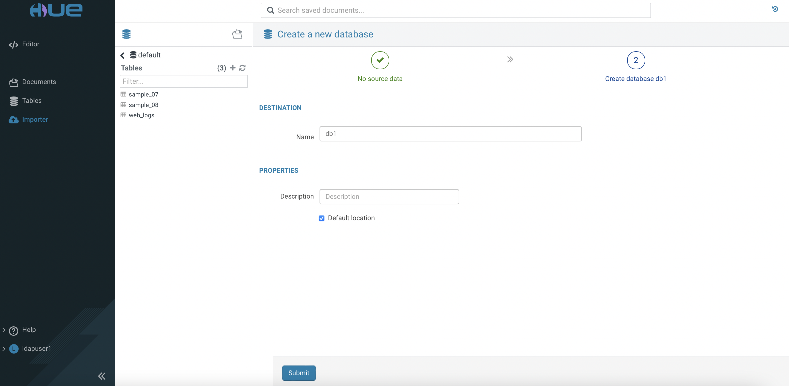

# SNAPPY Compression for Parquet, ORC, Avro

SNAPPY is a high speed compression/decompression library that allows Parquet-based table in particular to reduce storage space while increase performance to a certain degree.

This article describes the steps to gauge the query performance and storage output upon applying SNAPPY compression on the database tables with Avro, ORC and Parquet file formats in both Hive LLAP and Impala query engine using CDW in CDP Private Cloud platform.

- TOC
{:toc}

---


## Prerequisites

- The tests are carried out using CDW on the CDP Private Cloud (Openshift) platform with the following hardware specification.

| CPU          | Intel(R) Xeon(R) Gold 5220R CPU @ 2.20GHz | 
| Memory  | DIMM DDR4 Synchronous Registered (Buffered) 2933 MHz (0.3 ns) | 
| Disk | SSD P4610 1.6TB SFF    | 


- A random sample data of 300 million CSV rows is produced using a python script with the [faker](https://faker.readthedocs.io/en/master/) generator. The schema of each row is sequenced as `Lastname, Firstname, MSISDN, Date of Birth, Postcode, City` as illustrated below.

    ```yaml
    Maria,Harmon,32378521,1998-11-14,17,30766,Durhammouth
    Anne,Adams,29481072,1982-10-28,36,70830,Deannabury
    Deborah,Sanders,21125797,2002-04-07,56,63993,New Ronaldland
    ```

- Copy the file to the HDFS storage cluster.

    ```bash
    # hdfs dfs -put 300mil.csv /tmp/sampledata/
    
    # hdfs dfs -du -h /tmp/sampledata/
    16.0 G  47.9 G  /tmp/sampledata/300mil.csv    
    ```

- In CDW, create a `Hive` and an `Impala` virtual warehouse with only 1 executor each.

    

## Testing Procedure

1. Access `Hue` tool of the `Hive` virtual warehouse. Create database `db1`.

        
 
2. Use the SQL Editor to create an external table in the database `db1`.
 
           

3. Execute the following command and take note of the speed result. Repeat running the same command and jot down the result again.
    
    
    
4. Create a Hive managed table using the ORC file format with SNAPPY compression as illustrated below.

    ```yaml
    SET hive.exec.compress.output=true;
    CREATE TABLE db1.orc_snappy(
    FirstName string, LastName string,    
    MSISDN bigint, DOB date, age int,
    Postcode int, City string)
    STORED AS orc
    TBLPROPERTIES ("orc.compress"="SNAPPY",'orc.schema.literal'='{
    "name": "sample1",
    "type": "record",
    "fields": [
    {"name":"one", "type":"binary"},
    {"name":"two", "type":"binary"},
    {"name":"three", "type":"bigint"},
    {"name":"four", "type":"binary"},
    {"name":"five", "type":"int"},
    {"name":"six", "type":"int"},
    {"name":"seven", "type":"binary"}
    ]}');
    ```
  
5. Insert the data from the external `tmp` table into this newly created ORC-based table. Take note of the speed to execute this task completely.

    ```yaml
    INSERT INTO TABLE db1.orc_snappy SELECT * FROM tmp;
    ```
    
6. Check the result of the loaded data.    
    
    ```yaml
    SELECT * FROM db1.orc_snappy;
    ```

7. Run the following SQL queries twice and take note of the speed to complete the task.

    ```yaml
    SELECT COUNT (*) FROM db1.orc_snappy;   
    ```    
    
    ```yaml
    SELECT AVG(age) FROM db1.orc_snappy where lastname = 'Davis' and age > 30 and age < 40;
    ``` 
    
8. Repeat step 4 for file format Parquet by creating a table with the following schema.

    ```yaml
    CREATE TABLE db1.parquet_snappy(
    FirstName string, LastName string,    
    MSISDN bigint, DOB date, age int,
    Postcode int, City string)
    STORED AS parquet
    TBLPROPERTIES ("parquet.compression"="SNAPPY",'parquet.schema.literal'='{
    "name": "sample1",
    "type": "record",
    "fields": [
    {"name":"one", "type":"binary"},
    {"name":"two", "type":"binary"},
    {"name":"three", "type":"INT64"},
    {"name":"four", "type":"date"},
    {"name":"five", "type":"INT32"},
    {"name":"six", "type":"INT32"},
    {"name":"seven", "type":"binary"}
    ]}')
    ```

9. Insert the data from the external `tmp` table into this newly created Parquet-based table. Take note of the speed to execute this task completely.

    ```yaml
    INSERT INTO TABLE db1.parquet_snappy SELECT * FROM tmp;
    ```
    
10. Run the following SQL queries twice and take note of the speed result.

    ```yaml
    SELECT COUNT (*) FROM db1.parquet_snappy;   
    ```    
    
    ```yaml
    SELECT AVG(age) FROM db1.parquet_snappy where lastname = 'Davis' and age > 30 and age < 40;
    ``` 

11. Repeat step 4 for file format Avro by creating a table with the following schema.

    ```yaml
    set hive.exec.compress.output=true;
    set avro.output.codec=snappy;
    CREATE TABLE db1.avro_snappy(
    FirstName string, LastName string,    
    MSISDN bigint, DOB date, age int,
    Postcode int, City string)
    STORED AS avro
    TBLPROPERTIES ('avro.schema.literal'='{
    "name": "sample1",
    "type": "record",
    "fields": [
    {"name":"FirstName", "type":"string"},
    {"name":"LastName", "type":"string"},
    {"name":"MSISDN", "type":"long"},
    {"name":"DOB", "type":"string"},
    {"name":"age", "type":"int"},
    {"name":"Postcode", "type":"int"},
    {"name":"City", "type":"string"}
    ]}');
    ```
    
12. Run the following SQL queries twice and take note of the speed to complete the task.

    ```yaml
    SELECT COUNT (*) FROM db1.avro_snappy;
    ```    

    ```yaml
    SELECT AVG(age) FROM db1.avro_snappy where lastname = 'Davis' and age > 30 and age < 40;
    ``` 

13. Access `Hue` tool of the `Impala` virtual warehouse. Create database `db2`.
   
 
14. Use the SQL Editor to create an external table in the database `db2`.
    

15. Create a managed table using the Parquet file format based on the schema as shown below.
    
    ```yaml
    CREATE TABLE db2.parquet2_snappy(
    FirstName string, LastName string,    
    MSISDN bigint, DOB date, age int,
    Postcode int, City string)
    STORED AS parquet
    TBLPROPERTIES (
    "parquet.compression"="SNAPPY",
    'parquet.schema.literal'='{
    "name": "sample1",
    "type": "record",
    "fields": [
    {"name":"one", "type":"string"},
    {"name":"two", "type":"string"},
    {"name":"three", "type":"long"},
    {"name":"four", "type":"date"},
    {"name":"five", "type":"long"},
    {"name":"six", "type":"int"},
    {"name":"seven", "type":"string"}
    ]}')
    ```    

16. Insert the data from the external `tmp` table into this newly created Parquet-based table. Take note of the speed to execute this task completely.

    ```yaml
    INSERT INTO table db2.parquet2_snappy SELECT * from db1.tmp;  
    ```    
    
17. Run the following SQL queries twice and take note of the speed result.

    ```yaml
    SELECT COUNT (*) FROM db2.parquet2_snappy;   
    ```    
    
    ```yaml
    SELECT AVG(age) FROM db2.parquet2_snappy where lastname = 'Davis' and age > 30 and age < 40;

## Compression Verification
    
- By default, ZLIB compression is enabled for any managed ORC-based table in `Hive` engine in CDW unless specified. In this case, SNAPPY compression is enabled for `orc_snappy` table as highlighted in the testing procedure above.
- Verify the compression codec in the dataset file as shown below.

    ```bash
    # hive --orcfiledump /warehouse/tablespace/managed/hive/db1.db/orc/delta_0000001_0000001_0000/bucket_00000_0 | grep Compression
    Compression: ZLIB
    Compression size: 32768
    ``` 
    
    ```bash   
    # hive --orcfiledump /warehouse/tablespace/managed/hive/db1.db/orc_snappy/delta_0000001_0000001_0000/bucket_00000_0 | grep Compression
    Compression: SNAPPY
    Compression size: 32768
    ```     
- By default, no compression is enabled for any managed Avro-based table in `Hive` engine in CDW unless specified. In this case, SNAPPY compression is enabled for `avro_snappy` table as specified in the testing procedure above.
- Verify the compression codec in the dataset file as shown below.

    ```bash  

    # hadoop fs -copyToLocal /warehouse/tablespace/managed/hive/db1.db/avro_snappy/delta_0000001_0000001_0000/000000_0 tmp.avro
    
    # avro-tools getmeta tmp.avro | grep codec
    avro.codec	snappy
    ``` 
    

    ```bash
    # hadoop fs -copyToLocal /warehouse/tablespace/managed/hive/db1.db/avro/delta_0000001_0000001_0000/000000_0 tmp2.avro

    # avro-tools getmeta tmp2.avro | grep codec
    #
    ``` 
    
- By default, the dataset is `UNCOMPRESSED` for any managed Parquet-based table in `Hive` engine in CDW unless specified. In this case, SNAPPY compression is enabled for `parquet_snappy` table as specified in the testing procedure above.
- Verify the compression method in the dataset file as shown below.

    ```bash 
    # hadoop fs -copyToLocal /warehouse/tablespace/managed/hive/db1.db/parquet/delta_0000001_0000001_0000/000000_0 tmp2.parquet

    # parquet-tools meta tmp2.parquet
    file:        file:/root/tmp2.parquet 
    creator:     parquet-mr version 1.10.99.2021.0.6-b96 (build 83328831d0a79be26dd977c497fd38b301335b4a) 
    extra:       writer.date.proleptic = false 
    extra:       writer.time.zone = UTC 
    extra:       writer.model.name = 3.1.3000.2021.0.6-b96 
    extra:       writer.zone.conversion.legacy = false 

    file schema: hive_schema 
    --------------------------------------------------------------------------------------------------------------------------------------------------------------
    firstname:   OPTIONAL BINARY L:STRING R:0 D:1
    lastname:    OPTIONAL BINARY L:STRING R:0 D:1
    msisdn:      OPTIONAL INT64 R:0 D:1
    dob:         OPTIONAL INT32 L:DATE R:0 D:1
    age:         OPTIONAL INT32 R:0 D:1
    postcode:    OPTIONAL INT32 R:0 D:1
    city:        OPTIONAL BINARY L:STRING R:0 D:1

    row group 1: RC:3890100 TS:135252863 OFFSET:4 
    --------------------------------------------------------------------------------------------------------------------------------------------------------------
    firstname:    BINARY UNCOMPRESSED DO:0 FPO:4 SZ:4883456/4883456/1.00 VC:3890100 ENC:RLE,BIT_PACKED,PLAIN_DICTIONARY ST:[min: Aaron, max: Zoe, num_nulls: 0]
    lastname:     BINARY UNCOMPRESSED DO:0 FPO:4883460 SZ:4886753/4886753/1.00 VC:3890100 ENC:RLE,BIT_PACKED,PLAIN_DICTIONARY ST:[min: Abbott, max: Zuniga, num_nulls: 0]
    msisdn:       INT64 UNCOMPRESSED DO:0 FPO:9770213 SZ:31126845/31126845/1.00 VC:3890100 ENC:RLE,BIT_PACKED,PLAIN ST:[min: 26, max: 99999984, num_nulls: 0]
    dob:          INT32 UNCOMPRESSED DO:0 FPO:40897058 SZ:15566445/15566445/1.00 VC:3890100 ENC:RLE,BIT_PACKED,PLAIN ST:[min: 1970-01-01, max: 2022-07-15, num_nulls: 0]
    age:          INT32 UNCOMPRESSED DO:0 FPO:56463503 SZ:3418278/3418278/1.00 VC:3890100 ENC:RLE,BIT_PACKED,PLAIN_DICTIONARY ST:[min: 0, max: 99, num_nulls: 0]
    postcode:     INT32 UNCOMPRESSED DO:0 FPO:59881781 SZ:15566445/15566445/1.00 VC:3890100 ENC:RLE,BIT_PACKED,PLAIN ST:[min: 501, max: 99950, num_nulls: 0]
    city:         BINARY UNCOMPRESSED DO:0 FPO:75448226 SZ:59804641/59804641/1.00 VC:3890100 ENC:RLE,BIT_PACKED,PLAIN_DICTIONARY,PLAIN ST:[min: Aaronberg, max: Zunigaville, num_nulls: 0]
    ``` 

    ```bash   
    # hadoop fs -copyToLocal /warehouse/tablespace/managed/hive/db1.db/parquet_snappy/delta_0000001_0000001_0000/000000_0 tmp.parquet

    # parquet-tools meta tmp.parquet
    file:        file:/root/tmp.parquet 
    creator:     parquet-mr version 1.10.99.2021.0.6-b96 (build 83328831d0a79be26dd977c497fd38b301335b4a) 
    extra:       writer.date.proleptic = false 
    extra:       writer.time.zone = UTC 
    extra:       writer.model.name = 3.1.3000.2021.0.6-b96 
    extra:       writer.zone.conversion.legacy = false 

    file schema: hive_schema 
    --------------------------------------------------------------------------------------------------------------------------------------------------------------
    firstname:   OPTIONAL BINARY L:STRING R:0 D:1
    lastname:    OPTIONAL BINARY L:STRING R:0 D:1
    msisdn:      OPTIONAL INT64 R:0 D:1
    dob:         OPTIONAL INT32 L:DATE R:0 D:1
    age:         OPTIONAL INT32 R:0 D:1
    postcode:    OPTIONAL INT32 R:0 D:1
    city:        OPTIONAL BINARY L:STRING R:0 D:1

    row group 1: RC:5390100 TS:188413650 OFFSET:4 
    --------------------------------------------------------------------------------------------------------------------------------------------------------------
    firstname:    BINARY SNAPPY DO:0 FPO:4 SZ:6763410/6763856/1.00 VC:5390100 ENC:BIT_PACKED,PLAIN_DICTIONARY,RLE ST:[min: Aaron, max: Zoe, num_nulls: 0]
    lastname:     BINARY SNAPPY DO:0 FPO:6763414 SZ:6765842/6767152/1.00 VC:5390100 ENC:BIT_PACKED,PLAIN_DICTIONARY,RLE ST:[min: Abbott, max: Zuniga, num_nulls: 0]
    msisdn:       INT64 SNAPPY DO:0 FPO:13529256 SZ:31528932/43129170/1.37 VC:5390100 ENC:BIT_PACKED,PLAIN,RLE ST:[min: 26, max: 99999997, num_nulls: 0]
    dob:          INT32 SNAPPY DO:0 FPO:45058188 SZ:21555328/21568770/1.00 VC:5390100 ENC:BIT_PACKED,PLAIN,RLE ST:[min: 1970-01-01, max: 2022-07-15, num_nulls: 0]
    age:          INT32 SNAPPY DO:0 FPO:66613516 SZ:4737802/4736178/1.00 VC:5390100 ENC:BIT_PACKED,PLAIN_DICTIONARY,RLE ST:[min: 0, max: 99, num_nulls: 0]
    postcode:     INT32 SNAPPY DO:0 FPO:71351318 SZ:21571232/21568770/1.00 VC:5390100 ENC:BIT_PACKED,PLAIN,RLE ST:[min: 501, max: 99950, num_nulls: 0]
    city:         BINARY SNAPPY DO:0 FPO:92922550 SZ:41644490/83879754/2.01 VC:5390100 ENC:BIT_PACKED,PLAIN,PLAIN_DICTIONARY,RLE ST:[min: Aaronberg, max: Zunigaville, num_nulls: 0]
    ```
    
- By default, SNAPPY compression is enabled for any managed Parquet-based table in `Impala` engine in CDW unless specified.

    
## Performance Result

- The following table shows the time taken (in seconds) to run each SQL query in the specific file format table without SNAPPY compression. This result is adapted from the previous test as described [here]({{ site.baseurl }}).


| File Format  | Engine | INSERT | SELECT COUNT (1st)|SELECT COUNT (2nd) |SELECT AVG(1st)|SELECT AVG(2nd)|
|:-------------|:----------------|:------------------|:------------------|---------------|---------------|
| ORC (ZLIB)   | Hive   | 507    |0.40               | 0.39              |8.13           |0.39           | 
| Avro         | Hive   | 513    |0.40               | 0.38              |287            |0.40           |
| Parquet      | Hive   | 332    |0.38               | 0.38              |11.78          |0.37           |


- The following table shows the time taken (in seconds) to run each SQL query in the specific file format table with SNAPPY compression.

| File Format  | Engine | INSERT | SELECT COUNT (1st)|SELECT COUNT (2nd) |SELECT AVG(1st)|SELECT AVG(2nd)|
|:-------------|:----------------|:------------------|:------------------|---------------|---------------|
| ORC          | Hive   | 450    |0.38               | 0.38              |5.93           |0.39           | 
| Avro         | Hive   | 323    |0.38               | 0.38              |208            |0.40           |
| Parquet      | Hive   | 352    |0.38               | 0.38              |0.37           |0.37           |
| Parquet      | Parquet| 32     |0.36               | 0.35              |1.76           |1.62           |


## Storage Output

- The following output shows the HDFS storage size of the generated managed tables in `Hive` engine (with and without SNAPPY compression) for each file format table. 

    ```bash
    # hdfs dfs -du -h /warehouse/tablespace/managed/hive/db1.db
    13.0 G  38.9 G  /warehouse/tablespace/managed/hive/db1.db/avro
    9.5 G   28.4 G  /warehouse/tablespace/managed/hive/db1.db/avro_snappy
    4.1 G   12.4 G  /warehouse/tablespace/managed/hive/db1.db/orc
    4.8 G   14.5 G  /warehouse/tablespace/managed/hive/db1.db/orc_snappy
    9.7 G   29.0 G  /warehouse/tablespace/managed/hive/db1.db/parquet
    7.0 G   20.9 G  /warehouse/tablespace/managed/hive/db1.db/parquet_snappy
    ```   
- By default, `Impala` engine applies SNAPPY compression on the Parquet-based table.

    ```bash
    # hdfs dfs -du -h /warehouse/tablespace/managed/hive/db2.db
    6.4 G  19.3 G  /warehouse/tablespace/managed/hive/db2.db/parquet2
    6.4 G  19.3 G  /warehouse/tablespace/managed/hive/db2.db/parquet2_snappy
    ```    

## Conclusion

- SNAPPY compression helps saving HDFS storage space and also offers higher performance result in terms of speed to complete the INSERT and SELECT queries. 
- ZLIB compression seems saving slighly more storage but lagging in speed performance for ORC-base table in `Hive` engine compared to SNAPPY compression.
- Avro is the worst performer with or without compression codec in place.
- Parquet stands out in terms of achieving the highest speed for running the interactive SQL query. As it is a pioneer file format for `Impala`, running SQL query in Parquet-based table in Impala produces quicker result compared to running the same query in Hive engine with SNAPPY compression codec (which is enabled by default).

---

