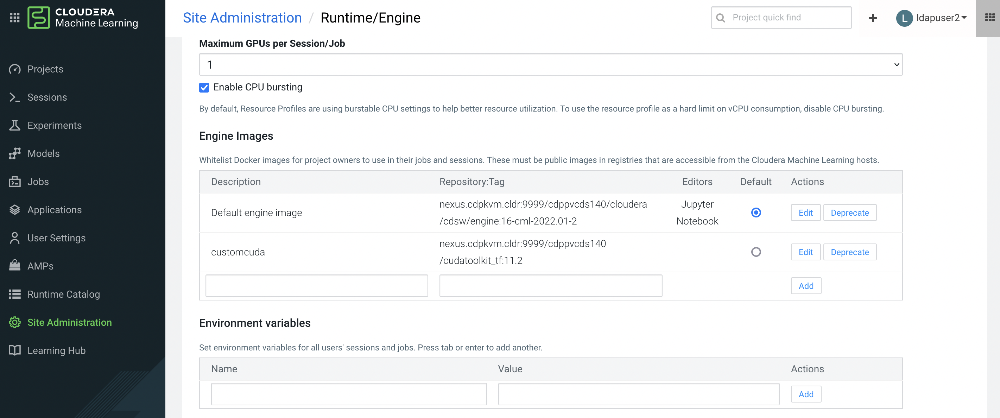
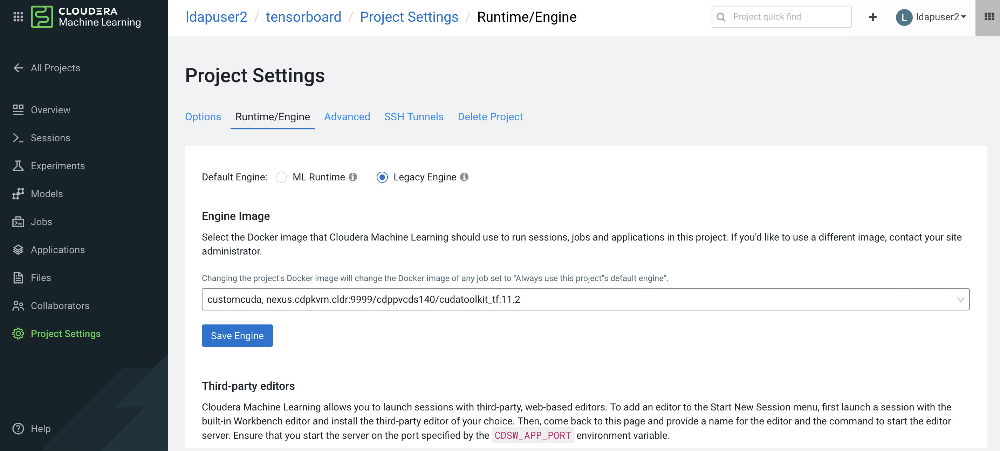
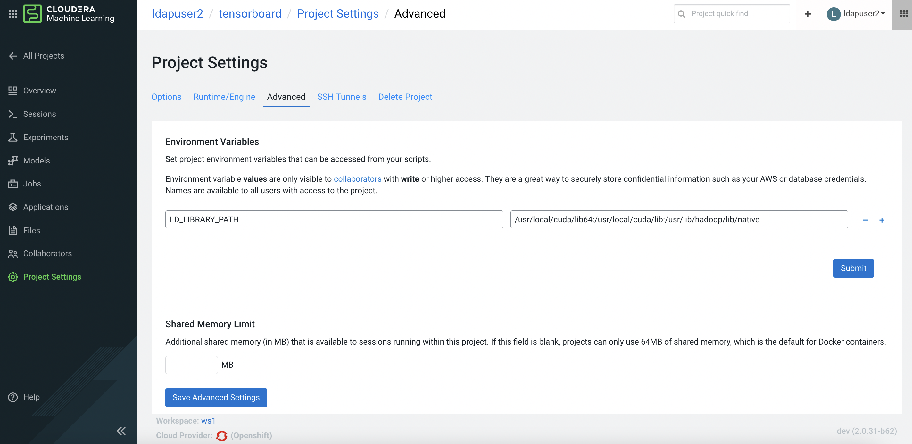
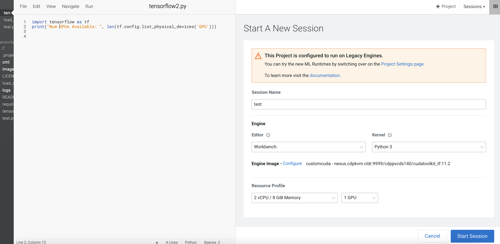
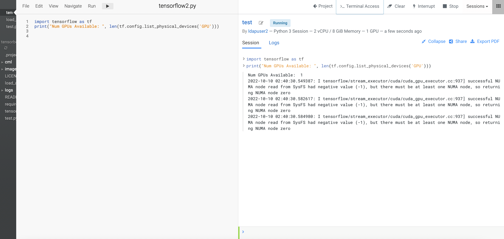

# Custom Docker Image
{: .no_toc }

Kubernetes containers are typically running using non-root user for ensuring a high degree of security. As a result, installing an OS software package in the running pod is prohibited and hence, concrete planning is a must to make sure that the installed OS software and its associated drivers suffice the application's requirement. 
This article describes the method to build a custom docker image by installing the compatible CUDA driver version in the CML (Cloudera Machine Learning) engine image so that the CML session pod can make use of the GPU card.

- TOC
{:toc}

---

1. Prepare the Dockerfile as shown in the following example. The filename is cudatoolkit_for_tf.Dockerfile.

    ```yaml
    FROM docker.repository.cloudera.com/cloudera/cdsw/engine:16-cml-2022.01-2
    USER root
    ARG OS=ubuntu1804
    ARG cudnn_version=8.1.0.77
    ARG cuda_version=cuda11.2

    RUN wget https://developer.download.nvidia.com/compute/cuda/repos/${OS}/x86_64/cuda-${OS}.pin 
    RUN mv cuda-${OS}.pin /etc/apt/preferences.d/cuda-repository-pin-600
    RUN apt-key adv --fetch-keys https://developer.download.nvidia.com/compute/cuda/repos/${OS}/x86_64/3bf863cc.pub
    RUN add-apt-repository "deb https://developer.download.nvidia.com/compute/cuda/repos/${OS}/x86_64/ /"
    RUN apt-get update

    RUN apt-get install -y cuda-toolkit-11-2
    RUN apt-get install -y libcudnn8=${cudnn_version}-1+${cuda_version}
    RUN apt-get install -y libcudnn8-dev=${cudnn_version}-1+${cuda_version}
    RUN apt-get install -y python3
    RUN apt-get install -y python3-pip
    RUN python3 -m pip install tensorflow
    ```

2. Build the docker image. 

    ```bash
    docker build --network host -t nexus.cdpkvm.cldr:9999/cdppvcds140/cudatoolkit_tf:11.3 . -f cudatoolkit_for_tf.Dockerfile
    ```
    
3. Upon successful build, push it into the Nexus registry. In this example, a Nexus docker registry is positioned to host the container image.   

    ```bash
    docker image push nexus.cdpkvm.cldr:9999/cdppvcds140/cudatoolkit_tf:11.3
    ```
    
4. In CML, navigate to Site Administration > Runtime/Engine and add the new docker image under the Engine Image section.





5. Assuming a CML project has already been created, navigate to Project Settings > Runtime/Engine of the project. Select the custom image.



6. Add the environment variable to inform the OS about the location of the CUDA library for this project.



7. Create a CML session with GPU in the resource profile.



8. Run the following Tensorflow code to detect the presence of GPU card.




---
