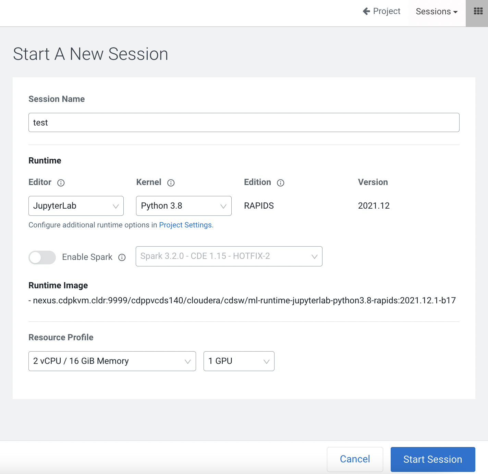
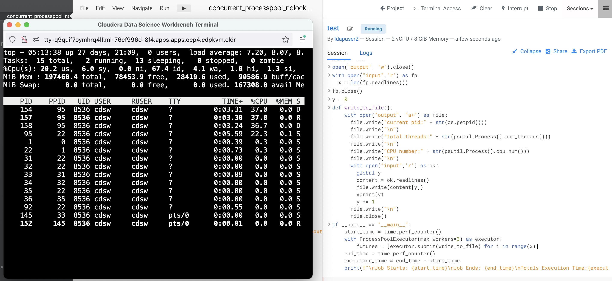

# Dask
{: .no_toc }

Dask enhances Python performance using parallel computing concept. To do so, Dask offers a list of libraries that mimics the popular data science tools such as numpy and pandas. For instance, Dask arrays organize Numpy arrays, break them into chunks to complete the computation process in a parallel fashion. As a result, large dataset can be processed using multiple nodes as opposed to the typical single node resource. This article describes the behavioural outcome in terms of speed and CPU utilization when using Dask arrays with different chunk sizes.

The following experiments are carried out using Jupyterlab notebook in Cloudera Machine Learning (CML) on the Kubernetes platform powered by Openshift 4.8 with the hardware specification as described below. Here's the [link](https://github.com/dennislee22/machineLearning/blob/master/dask_cml.ipynb) to download the complete notebook.

| CPU          | Intel(R) Xeon(R) Gold 5220R CPU @ 2.20GHz | 
| Memory  | DIMM DDR4 Synchronous Registered (Buffered) 2933 MHz (0.3 ns) | 
| Disk | SSD P4610 1.6TB SFF    | 

- TOC
{:toc}

---
## Dask with Single Worker


- Create a Jupyterlab session with 2 CPU/16 GiB memory profile.



```python
import os
import time
import cdsw
import dask

dask_scheduler = cdsw.launch_workers(
    n=1,
    cpu=2,
    memory=2,
    code=f"!dask-scheduler --host 0.0.0.0 --dashboard-address 127.0.0.1:8090",
)

# Wait for the scheduler to start.
time.sleep(10)
```


```python
print("//".join(dask_scheduler[0]["app_url"].split("//")))
```

    http://365pzs0e7skkzbqh.ml-76cf996d-8f4.apps.apps.ocp4.cdpkvm.cldr/


```python
scheduler_workers = cdsw.list_workers()
scheduler_id = dask_scheduler[0]["id"]
scheduler_ip = [
    worker["ip_address"] for worker in scheduler_workers if worker["id"] == scheduler_id
][0]

scheduler_url = f"tcp://{scheduler_ip}:8786"

scheduler_url
```


    'tcp://10.254.0.215:8786'


```python
from dask.distributed import Client
client = Client(scheduler_url)
client
```


<div>
    <div style="width: 24px; height: 24px; background-color: #e1e1e1; border: 3px solid #9D9D9D; border-radius: 5px; position: absolute;"> </div>
    <div style="margin-left: 48px;">
        <h3 style="margin-bottom: 0px;">Client</h3>
        <p style="color: #9D9D9D; margin-bottom: 0px;">Client-51bb3e6c-50eb-11ed-80cb-0a580afe03e9</p>
        <table style="width: 100%; text-align: left;">

        <tr>

            <td style="text-align: left;"><strong>Connection method:</strong> Direct</td>
            <td style="text-align: left;"></td>

        </tr>


            <tr>
                <td style="text-align: left;">
                    <strong>Dashboard: </strong> <a href="http://10.254.0.215:8090/status" target="_blank">http://10.254.0.215:8090/status</a>
                </td>
                <td style="text-align: left;"></td>
            </tr>


        </table>


            <details>
            <summary style="margin-bottom: 20px;"><h3 style="display: inline;">Scheduler Info</h3></summary>
            <div style="">
    <div>
        <div style="width: 24px; height: 24px; background-color: #FFF7E5; border: 3px solid #FF6132; border-radius: 5px; position: absolute;"> </div>
        <div style="margin-left: 48px;">
            <h3 style="margin-bottom: 0px;">Scheduler</h3>
            <p style="color: #9D9D9D; margin-bottom: 0px;">Scheduler-8e342ed5-d39c-475f-9099-57bee13ca80b</p>
            <table style="width: 100%; text-align: left;">
                <tr>
                    <td style="text-align: left;">
                        <strong>Comm:</strong> tcp://10.254.0.215:8786
                    </td>
                    <td style="text-align: left;">
                        <strong>Workers:</strong> 1
                    </td>
                </tr>
                <tr>
                    <td style="text-align: left;">
                        <strong>Dashboard:</strong> <a href="http://10.254.0.215:8090/status" target="_blank">http://10.254.0.215:8090/status</a>
                    </td>
                    <td style="text-align: left;">
                        <strong>Total threads:</strong> 16
                    </td>
                </tr>
                <tr>
                    <td style="text-align: left;">
                        <strong>Started:</strong> 4 minutes ago
                    </td>
                    <td style="text-align: left;">
                        <strong>Total memory:</strong> 14.81 GiB
                    </td>
                </tr>
            </table>
        </div>
    </div>

    <details style="margin-left: 48px;">
        <summary style="margin-bottom: 20px;">
            <h3 style="display: inline;">Workers</h3>
        </summary>


        <div style="margin-bottom: 20px;">
            <div style="width: 24px; height: 24px; background-color: #DBF5FF; border: 3px solid #4CC9FF; border-radius: 5px; position: absolute;"> </div>
            <div style="margin-left: 48px;">
            <details>
                <summary>
                    <h4 style="margin-bottom: 0px; display: inline;">Worker: tcp://10.254.3.233:35955</h4>
                </summary>
                <table style="width: 100%; text-align: left;">
                    <tr>
                        <td style="text-align: left;">
                            <strong>Comm: </strong> tcp://10.254.3.233:35955
                        </td>
                        <td style="text-align: left;">
                            <strong>Total threads: </strong> 16
                        </td>
                    </tr>
                    <tr>
                        <td style="text-align: left;">
                            <strong>Dashboard: </strong> <a href="http://10.254.3.233:39221/status" target="_blank">http://10.254.3.233:39221/status</a>
                        </td>
                        <td style="text-align: left;">
                            <strong>Memory: </strong> 14.81 GiB
                        </td>
                    </tr>
                    <tr>
                        <td style="text-align: left;">
                            <strong>Nanny: </strong> tcp://10.254.3.233:37997
                        </td>
                        <td style="text-align: left;"></td>
                    </tr>
                    <tr>
                        <td colspan="2" style="text-align: left;">
                            <strong>Local directory: </strong> /home/cdsw/dask-worker-space/worker-435lk0kz
                        </td>
                    </tr>


                    <tr>
                        <td style="text-align: left;">
                            <strong>GPU: </strong>NVIDIA A100-PCIE-40GB
                        </td>
                        <td style="text-align: left;">
                            <strong>GPU memory: </strong> 39.59 GiB
                        </td>
                    </tr>


                    <tr>
                        <td style="text-align: left;">
                            <strong>Tasks executing: </strong> 0
                        </td>
                        <td style="text-align: left;">
                            <strong>Tasks in memory: </strong> 0
                        </td>
                    </tr>
                    <tr>
                        <td style="text-align: left;">
                            <strong>Tasks ready: </strong> 0
                        </td>
                        <td style="text-align: left;">
                            <strong>Tasks in flight: </strong>0
                        </td>
                    </tr>
                    <tr>
                        <td style="text-align: left;">
                            <strong>CPU usage:</strong> 8.0%
                        </td>
                        <td style="text-align: left;">
                            <strong>Last seen: </strong> Just now
                        </td>
                    </tr>
                    <tr>
                        <td style="text-align: left;">
                            <strong>Memory usage: </strong> 130.96 MiB
                        </td>
                        <td style="text-align: left;">
                            <strong>Spilled bytes: </strong> 0 B
                        </td>
                    </tr>
                    <tr>
                        <td style="text-align: left;">
                            <strong>Read bytes: </strong> 9.79 kiB
                        </td>
                        <td style="text-align: left;">
                            <strong>Write bytes: </strong> 10.60 kiB
                        </td>
                    </tr>


                </table>
            </details>
            </div>
        </div>


    </details>
</div>
            </details>


    </div>
</div>


```python
import dask.array as da
rs = da.random.RandomState()
x = rs.normal(10, 1, size=(10000, 10000), chunks=(1000, 1000))
x
```


<table>
    <tr>
        <td>
            <table>
                <thead>
                    <tr>
                        <td> </td>
                        <th> Array </th>
                        <th> Chunk </th>
                    </tr>
                </thead>
                <tbody>

                    <tr>
                        <th> Bytes </th>
                        <td> 762.94 MiB </td>
                        <td> 7.63 MiB </td>
                    </tr>

                    <tr>
                        <th> Shape </th>
                        <td> (10000, 10000) </td>
                        <td> (1000, 1000) </td>
                    </tr>
                    <tr>
                        <th> Count </th>
                        <td> 100 Tasks </td>
                        <td> 100 Chunks </td>
                    </tr>
                    <tr>
                    <th> Type </th>
                    <td> float64 </td>
                    <td> numpy.ndarray </td>
                    </tr>
                </tbody>
            </table>
        </td>
        <td>
        <svg width="170" height="170" style="stroke:rgb(0,0,0);stroke-width:1" >

  <!-- Horizontal lines -->
  <line x1="0" y1="0" x2="120" y2="0" style="stroke-width:2" />
  <line x1="0" y1="12" x2="120" y2="12" />
  <line x1="0" y1="24" x2="120" y2="24" />
  <line x1="0" y1="36" x2="120" y2="36" />
  <line x1="0" y1="48" x2="120" y2="48" />
  <line x1="0" y1="60" x2="120" y2="60" />
  <line x1="0" y1="72" x2="120" y2="72" />
  <line x1="0" y1="84" x2="120" y2="84" />
  <line x1="0" y1="96" x2="120" y2="96" />
  <line x1="0" y1="108" x2="120" y2="108" />
  <line x1="0" y1="120" x2="120" y2="120" style="stroke-width:2" />

  <!-- Vertical lines -->
  <line x1="0" y1="0" x2="0" y2="120" style="stroke-width:2" />
  <line x1="12" y1="0" x2="12" y2="120" />
  <line x1="24" y1="0" x2="24" y2="120" />
  <line x1="36" y1="0" x2="36" y2="120" />
  <line x1="48" y1="0" x2="48" y2="120" />
  <line x1="60" y1="0" x2="60" y2="120" />
  <line x1="72" y1="0" x2="72" y2="120" />
  <line x1="84" y1="0" x2="84" y2="120" />
  <line x1="96" y1="0" x2="96" y2="120" />
  <line x1="108" y1="0" x2="108" y2="120" />
  <line x1="120" y1="0" x2="120" y2="120" style="stroke-width:2" />

  <!-- Colored Rectangle -->
  <polygon points="0.0,0.0 120.0,0.0 120.0,120.0 0.0,120.0" style="fill:#ECB172A0;stroke-width:0"/>

  <!-- Text -->
  <text x="60.000000" y="140.000000" font-size="1.0rem" font-weight="100" text-anchor="middle" >10000</text>
  <text x="140.000000" y="60.000000" font-size="1.0rem" font-weight="100" text-anchor="middle" transform="rotate(-90,140.000000,60.000000)">10000</text>
</svg>
        </td>
    </tr>
</table>


```python
start = time.time()
total = (x + 1)[::2, ::2].sum().compute()
end = time.time()
print("Result:", total)
print("Time Taken:{}".format(end - start))
```

    Result: 275011123.9345571
    Time Taken:20.333498001098633


```python
start = time.time()
total = (x + 1)[::2, ::2].sum().compute(num_workers=9)
end = time.time()
print("Result:", total)
print("Time Taken:{}".format(end - start))
```

    Result: 275011123.9345571
    Time Taken:17.990230798721313


```python
start = time.time()
total = (x + 1)[::2, ::2].sum().compute(num_workers=1)
end = time.time()
print("Result:", total)
print("Time Taken:{}".format(end - start))
```

    Result: 275011123.9345571
    Time Taken:26.49886441230774


```python
start = time.time()
total = (x + 1)[::2, ::2].sum().compute(scheduler='single-threaded')
end = time.time()
print("Result:", total)
print("Time Taken:{}".format(end - start))
```

    Result: 275011123.9345571
    Time Taken:4.032877683639526


```python
start = time.time()
total = (x + 1)[::2, ::2].sum().compute(scheduler='threads')
end = time.time()
print("Result:", total)
print("Time Taken:{}".format(end - start))
```

    Result: 275011123.9345571
    Time Taken:0.6311771869659424


```python
import cupy
rs = da.random.RandomState(RandomState=cupy.random.RandomState)
x = rs.normal(10, 1, size=(10000, 10000), chunks=(1000, 1000))
x

start = time.time()
total = (x + 1)[::2, ::2].sum().compute(scheduler='single-threaded')
end = time.time()
print("Result:", total)
print("Time Taken:{}".format(end - start))
```

    Result: 274998139.072111
    Time Taken:1.2028133869171143


```python
more_worker = 2
dask_workers = cdsw.launch_workers(
    n=more_worker,
    cpu=2,
    memory=8,
    code=f"!dask-worker {scheduler_url}",
)

# Wait for the workers to start.
time.sleep(10)
```


```python
client
```


<div>
    <div style="width: 24px; height: 24px; background-color: #e1e1e1; border: 3px solid #9D9D9D; border-radius: 5px; position: absolute;"> </div>
    <div style="margin-left: 48px;">
        <h3 style="margin-bottom: 0px;">Client</h3>
        <p style="color: #9D9D9D; margin-bottom: 0px;">Client-51bb3e6c-50eb-11ed-80cb-0a580afe03e9</p>
        <table style="width: 100%; text-align: left;">

        <tr>

            <td style="text-align: left;"><strong>Connection method:</strong> Direct</td>
            <td style="text-align: left;"></td>

        </tr>


            <tr>
                <td style="text-align: left;">
                    <strong>Dashboard: </strong> <a href="http://10.254.0.215:8090/status" target="_blank">http://10.254.0.215:8090/status</a>
                </td>
                <td style="text-align: left;"></td>
            </tr>


        </table>


            <details>
            <summary style="margin-bottom: 20px;"><h3 style="display: inline;">Scheduler Info</h3></summary>
            <div style="">
    <div>
        <div style="width: 24px; height: 24px; background-color: #FFF7E5; border: 3px solid #FF6132; border-radius: 5px; position: absolute;"> </div>
        <div style="margin-left: 48px;">
            <h3 style="margin-bottom: 0px;">Scheduler</h3>
            <p style="color: #9D9D9D; margin-bottom: 0px;">Scheduler-8e342ed5-d39c-475f-9099-57bee13ca80b</p>
            <table style="width: 100%; text-align: left;">
                <tr>
                    <td style="text-align: left;">
                        <strong>Comm:</strong> tcp://10.254.0.215:8786
                    </td>
                    <td style="text-align: left;">
                        <strong>Workers:</strong> 3
                    </td>
                </tr>
                <tr>
                    <td style="text-align: left;">
                        <strong>Dashboard:</strong> <a href="http://10.254.0.215:8090/status" target="_blank">http://10.254.0.215:8090/status</a>
                    </td>
                    <td style="text-align: left;">
                        <strong>Total threads:</strong> 64
                    </td>
                </tr>
                <tr>
                    <td style="text-align: left;">
                        <strong>Started:</strong> 10 minutes ago
                    </td>
                    <td style="text-align: left;">
                        <strong>Total memory:</strong> 29.52 GiB
                    </td>
                </tr>
            </table>
        </div>
    </div>

    <details style="margin-left: 48px;">
        <summary style="margin-bottom: 20px;">
            <h3 style="display: inline;">Workers</h3>
        </summary>


        <div style="margin-bottom: 20px;">
            <div style="width: 24px; height: 24px; background-color: #DBF5FF; border: 3px solid #4CC9FF; border-radius: 5px; position: absolute;"> </div>
            <div style="margin-left: 48px;">
            <details>
                <summary>
                    <h4 style="margin-bottom: 0px; display: inline;">Worker: tcp://10.254.0.218:37905</h4>
                </summary>
                <table style="width: 100%; text-align: left;">
                    <tr>
                        <td style="text-align: left;">
                            <strong>Comm: </strong> tcp://10.254.0.218:37905
                        </td>
                        <td style="text-align: left;">
                            <strong>Total threads: </strong> 24
                        </td>
                    </tr>
                    <tr>
                        <td style="text-align: left;">
                            <strong>Dashboard: </strong> <a href="http://10.254.0.218:34401/status" target="_blank">http://10.254.0.218:34401/status</a>
                        </td>
                        <td style="text-align: left;">
                            <strong>Memory: </strong> 7.36 GiB
                        </td>
                    </tr>
                    <tr>
                        <td style="text-align: left;">
                            <strong>Nanny: </strong> tcp://10.254.0.218:38803
                        </td>
                        <td style="text-align: left;"></td>
                    </tr>
                    <tr>
                        <td colspan="2" style="text-align: left;">
                            <strong>Local directory: </strong> /home/cdsw/dask-worker-space/worker-pom7foht
                        </td>
                    </tr>


                    <tr>
                        <td style="text-align: left;">
                            <strong>Tasks executing: </strong> 0
                        </td>
                        <td style="text-align: left;">
                            <strong>Tasks in memory: </strong> 0
                        </td>
                    </tr>
                    <tr>
                        <td style="text-align: left;">
                            <strong>Tasks ready: </strong> 0
                        </td>
                        <td style="text-align: left;">
                            <strong>Tasks in flight: </strong>0
                        </td>
                    </tr>
                    <tr>
                        <td style="text-align: left;">
                            <strong>CPU usage:</strong> 4.0%
                        </td>
                        <td style="text-align: left;">
                            <strong>Last seen: </strong> Just now
                        </td>
                    </tr>
                    <tr>
                        <td style="text-align: left;">
                            <strong>Memory usage: </strong> 127.66 MiB
                        </td>
                        <td style="text-align: left;">
                            <strong>Spilled bytes: </strong> 0 B
                        </td>
                    </tr>
                    <tr>
                        <td style="text-align: left;">
                            <strong>Read bytes: </strong> 2.15 kiB
                        </td>
                        <td style="text-align: left;">
                            <strong>Write bytes: </strong> 2.00 kiB
                        </td>
                    </tr>


                </table>
            </details>
            </div>
        </div>

        <div style="margin-bottom: 20px;">
            <div style="width: 24px; height: 24px; background-color: #DBF5FF; border: 3px solid #4CC9FF; border-radius: 5px; position: absolute;"> </div>
            <div style="margin-left: 48px;">
            <details>
                <summary>
                    <h4 style="margin-bottom: 0px; display: inline;">Worker: tcp://10.254.2.5:38941</h4>
                </summary>
                <table style="width: 100%; text-align: left;">
                    <tr>
                        <td style="text-align: left;">
                            <strong>Comm: </strong> tcp://10.254.2.5:38941
                        </td>
                        <td style="text-align: left;">
                            <strong>Total threads: </strong> 24
                        </td>
                    </tr>
                    <tr>
                        <td style="text-align: left;">
                            <strong>Dashboard: </strong> <a href="http://10.254.2.5:43885/status" target="_blank">http://10.254.2.5:43885/status</a>
                        </td>
                        <td style="text-align: left;">
                            <strong>Memory: </strong> 7.36 GiB
                        </td>
                    </tr>
                    <tr>
                        <td style="text-align: left;">
                            <strong>Nanny: </strong> tcp://10.254.2.5:41833
                        </td>
                        <td style="text-align: left;"></td>
                    </tr>
                    <tr>
                        <td colspan="2" style="text-align: left;">
                            <strong>Local directory: </strong> /home/cdsw/dask-worker-space/worker-grolipjk
                        </td>
                    </tr>


                    <tr>
                        <td style="text-align: left;">
                            <strong>Tasks executing: </strong> 0
                        </td>
                        <td style="text-align: left;">
                            <strong>Tasks in memory: </strong> 0
                        </td>
                    </tr>
                    <tr>
                        <td style="text-align: left;">
                            <strong>Tasks ready: </strong> 0
                        </td>
                        <td style="text-align: left;">
                            <strong>Tasks in flight: </strong>0
                        </td>
                    </tr>
                    <tr>
                        <td style="text-align: left;">
                            <strong>CPU usage:</strong> 4.0%
                        </td>
                        <td style="text-align: left;">
                            <strong>Last seen: </strong> Just now
                        </td>
                    </tr>
                    <tr>
                        <td style="text-align: left;">
                            <strong>Memory usage: </strong> 127.61 MiB
                        </td>
                        <td style="text-align: left;">
                            <strong>Spilled bytes: </strong> 0 B
                        </td>
                    </tr>
                    <tr>
                        <td style="text-align: left;">
                            <strong>Read bytes: </strong> 417.5593743822537 B
                        </td>
                        <td style="text-align: left;">
                            <strong>Write bytes: </strong> 0.94 kiB
                        </td>
                    </tr>


                </table>
            </details>
            </div>
        </div>

        <div style="margin-bottom: 20px;">
            <div style="width: 24px; height: 24px; background-color: #DBF5FF; border: 3px solid #4CC9FF; border-radius: 5px; position: absolute;"> </div>
            <div style="margin-left: 48px;">
            <details>
                <summary>
                    <h4 style="margin-bottom: 0px; display: inline;">Worker: tcp://10.254.3.233:35955</h4>
                </summary>
                <table style="width: 100%; text-align: left;">
                    <tr>
                        <td style="text-align: left;">
                            <strong>Comm: </strong> tcp://10.254.3.233:35955
                        </td>
                        <td style="text-align: left;">
                            <strong>Total threads: </strong> 16
                        </td>
                    </tr>
                    <tr>
                        <td style="text-align: left;">
                            <strong>Dashboard: </strong> <a href="http://10.254.3.233:39221/status" target="_blank">http://10.254.3.233:39221/status</a>
                        </td>
                        <td style="text-align: left;">
                            <strong>Memory: </strong> 14.81 GiB
                        </td>
                    </tr>
                    <tr>
                        <td style="text-align: left;">
                            <strong>Nanny: </strong> tcp://10.254.3.233:37997
                        </td>
                        <td style="text-align: left;"></td>
                    </tr>
                    <tr>
                        <td colspan="2" style="text-align: left;">
                            <strong>Local directory: </strong> /home/cdsw/dask-worker-space/worker-435lk0kz
                        </td>
                    </tr>


                    <tr>
                        <td style="text-align: left;">
                            <strong>GPU: </strong>NVIDIA A100-PCIE-40GB
                        </td>
                        <td style="text-align: left;">
                            <strong>GPU memory: </strong> 39.59 GiB
                        </td>
                    </tr>


                    <tr>
                        <td style="text-align: left;">
                            <strong>Tasks executing: </strong> 0
                        </td>
                        <td style="text-align: left;">
                            <strong>Tasks in memory: </strong> 0
                        </td>
                    </tr>
                    <tr>
                        <td style="text-align: left;">
                            <strong>Tasks ready: </strong> 0
                        </td>
                        <td style="text-align: left;">
                            <strong>Tasks in flight: </strong>0
                        </td>
                    </tr>
                    <tr>
                        <td style="text-align: left;">
                            <strong>CPU usage:</strong> 8.0%
                        </td>
                        <td style="text-align: left;">
                            <strong>Last seen: </strong> Just now
                        </td>
                    </tr>
                    <tr>
                        <td style="text-align: left;">
                            <strong>Memory usage: </strong> 436.68 MiB
                        </td>
                        <td style="text-align: left;">
                            <strong>Spilled bytes: </strong> 0 B
                        </td>
                    </tr>
                    <tr>
                        <td style="text-align: left;">
                            <strong>Read bytes: </strong> 16.45 kiB
                        </td>
                        <td style="text-align: left;">
                            <strong>Write bytes: </strong> 15.04 kiB
                        </td>
                    </tr>


                </table>
            </details>
            </div>
        </div>


    </details>
</div>
            </details>


    </div>
</div>


```python
import dask.array as da
rs = da.random.RandomState()
x = rs.normal(10, 1, size=(10000, 10000), chunks=(1000, 1000))
x

start = time.time()
total = (x + 1)[::2, ::2].sum().compute()
end = time.time()
print("Result:", total)
print("Time Taken:{}".format(end - start))
```

    Result: 274998653.37743837
    Time Taken:30.304303646087646


```python
start = time.time()
total = (x + 1)[::2, ::2].sum().compute(num_workers=9)
end = time.time()
print("Result:", total)
print("Time Taken:{}".format(end - start))
```

    Result: 274998653.37743837
    Time Taken:25.068480253219604


```python
start = time.time()
total = (x + 1)[::2, ::2].sum().compute(scheduler='single-threaded')
end = time.time()
print("Result:", total)
print("Time Taken:{}".format(end - start))
```

    Result: 274998653.37743837
    Time Taken:3.8503987789154053


```python
start = time.time()
total = (x + 1)[::2, ::2].sum().compute(scheduler='threads')
end = time.time()
print("Result:", total)
print("Time Taken:{}".format(end - start))
```

    Result: 274998653.37743837
    Time Taken:0.45389604568481445


```python
cdsw.stop_workers()
```


    [<Response [204]>, <Response [204]>, <Response [204]>]


    distributed.client - ERROR - Failed to reconnect to scheduler after 30.00 seconds, closing client
    _GatheringFuture exception was never retrieved
    future: <_GatheringFuture finished exception=CancelledError()>
    asyncio.exceptions.CancelledError


```python

```


## Dask with Multiple Workers

Now let's use multiple workers to run the same code with the same intended outcome.

1. In the CML session, open a `Terminal Access` box and run the `top` command (type g4 to view the PPID).

2. Run the same Python code with `max_workers=3` and observe the processing time taken by Python to run the code. 

3. When the code is being executed, note that 3 child processes are spawned to execute the code concurrently.

        
 
4. It takes approximately 13 seconds with 3 workers to run the program.

    ```yaml
    Job Starts: 2408966.582076456
    Job Ends: 2408980.419085899
    Totals Execution Time:13.84 seconds.
    ```
    
5. Next, check the integrity of the output file. To reiterate, the purpose of this code is read line by line from the `input` file and write each line into the `output` file in a sequential manner. Run the following script. In the event of no output is produced, it shows the code achieves the intended outcome without data corruption. The result shows the same outcome as the previous test (using single worker).

    ```bash
    $ cnt=0;for i in `cat output | grep line`; do cnt=`expr $cnt + 1` ; if [ $i != line$cnt ]; then echo $i;fi ; done
    line1
    line1
    line4
    line2
    line5
    line2
    line3
    line6
    line3
    line4
    ```

    Excerpt from the `output` file:

    ```yaml
    current pid:154
    total threads:1
    CPU number:10
    line1

    current pid:154
    total threads:1
    CPU number:10
    line2

    current pid:154
    total threads:1
    CPU number:10
    line3

    current pid:158
    total threads:1
    CPU number:5
    line1

    current pid:157
    total threads:1
    CPU number:22
    line1
    ```

## Dask using GPU

Now let's use multiple workers to run the same code with the same intended outcome.

1. In the CML session, open a `Terminal Access` box and run the `top` command (type g4 to view the PPID).

2. Run the same Python code with `max_workers=3` and observe the processing time taken by Python to run the code. 

3. When the code is being executed, note that 3 child processes are spawned to execute the code concurrently.


Conclusion: Although concurrent.futures.ProcessPoolExecutor is able to complete the program at a faster speed with more workers in place, the outcome of the output file fails to deliver the intention of the code. The line number is not written sequentially. This is the behaviour of race condition as a result of multiple processes writing into the same file in parallel. In other words, concurrent.futures.ProcessPoolExecutor is not thread-safe as tt creates a pool of processes to execute calls asynchronously. In a nutshell, while multiprocessing is able to use the available/allocated CPU cores to run multiple processes in order to reduce the completion time, it is not suitable for every use case especially CPU-bound and long running task.

---


