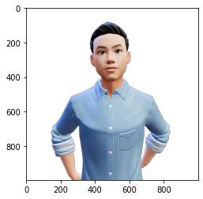
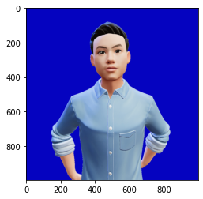
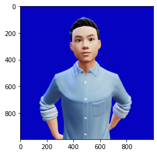

# Image Processing
{: .no_toc }

Image is made of pixels. Thanks to the extensive Python modules such as numpy and openCV, image can be converted into numbers, manipulated and subsequently reproduced into a different outcome. This blogpost explores the processing time taken to produce the same outcome upon using different techniques.

The experiments are carried out using Cloudera Machine Learning (CML) on Kubernetes platform powered by Openshift 4.8 with the hardware specification as described below. CML is embedded with `workbench` and `Jupyterlab` notebook IDE for data scientist to do coding, EDA, etc. It's always a good practice using IDE to explore the performance output, e.g. whether the code is fully/under utilizing the allocated CPU resource or becomes "noisy neighbour" in the multi-tenant Kubernetes platform. 

| CPU          | Intel(R) Xeon(R) Gold 5220R CPU @ 2.20GHz | 
| Memory  | DIMM DDR4 Synchronous Registered (Buffered) 2933 MHz (0.3 ns) | 
| Disk | SSD P4610 1.6TB SFF    | 


- TOC
{:toc}

---

The following experiments are carried out using the Jupyterlab notebook. Here's the [link](https://github.com/dennislee22/machineLearning/blob/master/img_processing.ipynb) to download the complete notebook.

- Declare the variables.

```python
#Variables Declaration

import time
import cv2
import numpy as np
from numpy import asarray
import psutil
import os
import matplotlib.pylab as plt
import sys
from PIL import Image

new_color = 5,3,192,255
old_color = 0, 0, 0, 0
width, height = 988,988
img = Image.open('me.png')
ori_img_array = asarray(img)
```

- Display image details based on the image file.

```python
#Show image details

plt.imshow(img)
print("Source Image format:", img.format)
print("Image size:", img.size)
print("Image mode:", img.mode)
numpyraw = asarray(img)  
#np.set_printoptions(threshold=sys.maxsize)
np.save('bbb.npy',numpyraw)
print("Values of original image:\n",numpyraw[0:1,0:3])  
```

    Source Image format: PNG
    Image size: (998, 998)
    Image mode: RGBA
    Values of original image:
     [[[0 0 0 0]
      [0 0 0 0]
      [0 0 0 0]]]
    

    

- Display image details using numpy raw integers!

```python
#Show image using numpy integers

numpyraw = np.load('bbb.npy')
print("Some contents of numpy file:\n",numpyraw[0:1,0:3])
plt.imshow(numpyraw)
```
    Some contents of numpy file:
     [[[0 0 0 0]
      [0 0 0 0]
      [0 0 0 0]]]
    <matplotlib.image.AxesImage at 0x7ff82611d4f0>
    

    

- Check out the time taken to change the background colour using `putpixel()` function.

```python
#Replace colour with specific pixel number using putpixel() fn

start=time.time()
imgtmp = img
width, height = imgtmp.size
pix = img.load()
for x in range(0, width):
        for y in range(0, height):
            if pix[x,y] == old_color:
                imgtmp.putpixel((x, y), new_color)
plt.imshow(imgtmp)
tampered_img_array = asarray(imgtmp)
print("Values of original image:\n",ori_img_array[0:1,0:3])    
print("\nValues of tampered image:\n",tampered_img_array[0:1,0:3])

end = time.time()
print("Time Taken:{}".format(end - start))
```

    Values of original image:
     [[[0 0 0 0]
      [0 0 0 0]
      [0 0 0 0]]]
    
    Values of tampered image:
     [[[  5   3 192 255]
      [  5   3 192 255]
      [  5   3 192 255]]]
    Time Taken:1.7054669857025146
    

    

- Check out the time taken to change the background colour using the typical Python loop.

```python
#Replace colour with specific numpy array

start = time.time()
numpyraw = np.load('bbb.npy')
for x in range(0, width):
        for y in range(0, height):
            if (numpyraw[x][y] == [0, 0, 0, 0]).all() :
                numpyraw[x][y] = [5,3,192,255]
print("Values of original image:\n",ori_img_array[0:1,0:3])    
print("\nValues of tampered image:\n",numpyraw[0:1,0:3])
plt.imshow(numpyraw)

end = time.time()
print("Time Taken:{}".format(end - start))
```

    Values of original image:
     [[[0 0 0 0]
      [0 0 0 0]
      [0 0 0 0]]]
    
    Values of tampered image:
     [[[  5   3 192 255]
      [  5   3 192 255]
      [  5   3 192 255]]]
    Time Taken:8.568198680877686
    

    

- Check out the time taken to change the background colour using openCV module.

```python
# Use cv2 to convert background

start = time.time()
#edges = cv2.Canny(ori_img_array, 100, 200)
#plt.imshow(edges)
masked = np.copy(ori_img_array)
lower = np.array([0,0,0,0])  
upper = np.array([0,0,0,0])

mask = cv2.inRange(masked, lower, upper)
plt.imshow(mask)
masked[mask != 0] = [5,3,192,255]
plt.imshow(masked)

end = time.time()
print("Time Taken:{}".format(end - start))
```
    Time Taken:0.11178255081176758


    

Conclusion: 
Different techniques take varied processing time and utilize CPU resource differently to produce the same output. While a typical Python code is executed using single thread process, certain openCV module such as Canny triggers multiple threads automatically (without specifying in the code) to manipulate the image. As a result, this process becomes "noisy neighbour" on the multi-tenant Kubernetes platform unless CPU limit is applied restrict the CPU usage.

---

