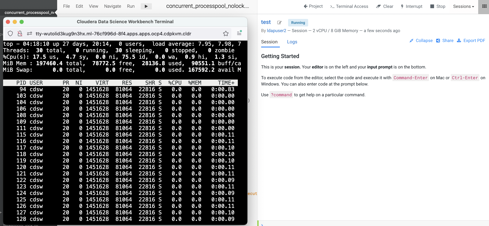
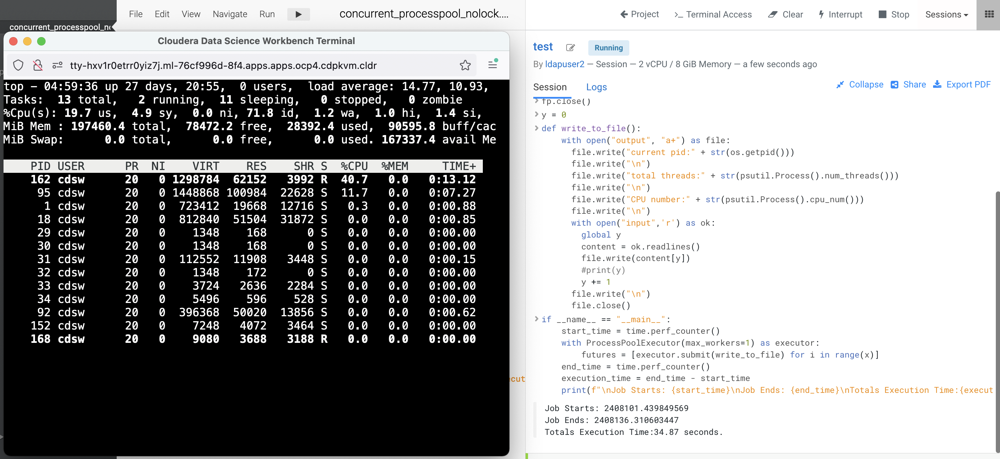

# Multiprocessing in Python
{: .no_toc }

As described in the previous article, Python uses a single CPU thread to execute the code by default in order to prevent race condition and ensure thread-safe. That is particularly important for I/O-bound task. To enhance the speed to complete a particular CPU-bound task, multiprocessing module allows spawning multiple child processes to carry out the task. This article describes the outcome in the Kubernetes infrastructure layer and its pros and cons when multiprocessing Python module is triggered in the machine learning code. Let's run some experiments to find out more.

The following experiments are carried out using Cloudera Machine Learning (CML) on Kubernetes platform powered by Openshift 4.8 with the hardware specification as described below. CML is embedded with `workbench` and `Jupyterlab` notebook IDE for data scientist to do coding, EDA, etc. In this experiment, the CML workbench is used as it is lightweight, quicker to spin up and easy to use.

| CPU          | Intel(R) Xeon(R) Gold 5220R CPU @ 2.20GHz | 
| Memory  | DIMM DDR4 Synchronous Registered (Buffered) 2933 MHz (0.3 ns) | 
| Disk | SSD P4610 1.6TB SFF    | 

- TOC
{:toc}

---
## Single Worker in ProcessPoolExecutor

The following experiment uses Python code to read line by line from the `input` file and write each line into the `output` file in a sequential manner.

1. Create a CML workbench session with 2 CPU/8 GiB memory profile. Open a `Terminal Access` box and run the `top` command to check the total threads are spawned by the process ID of the session pod. In this example, the process ID is 94. Note that there are 30 threads being opened by the process of this running session pod.

    ```bash
    $ top -p 94 -H
    ```

        
 
2. Create the same `input` file as described in this [threading article]({{ site.baseurl }}) with 10000 entries using the simple Bash script in the terminal console.

    ```bash
    $ > input;for i in {1..10000};do echo line$i >> input;done; head -20 input
    ```
    
3. Create a new file and copy this [Python script](https://github.com/dennislee22/machineLearning/blob/master/ProcessPoolExecutor_noqueue.py) into the workbench and run it.
 
    
        

4. Observe the processing time taken by Python to run the code. Run a few times to ensure the result is consistent. In this case, it takes approximately 34 seconds with 1 worker to run the program.

    ```yaml
    Job Starts: 2408101.439849569
    Job Ends: 2408136.310603447
    Totals Execution Time:34.87 seconds.
    ```
    
5. Next, check the integrity of the output file. To reiterate, the purpose of this code is read line by line from the `input` file and write each line into the `output` file in a sequential manner. Run the following script. In the event of no output is produced, it shows the code achieves the intended outcome without data corruption. The result shows the same outcome as the previous test (using single worker).

    ```bash
    $ cnt=0;for i in `cat output | grep line`; do cnt=`expr $cnt + 1` ; if [ $i != line$cnt ]; then echo $i;fi ; done
    ```

## Multiple Workers in ProcessPoolExecutor

Now let's use multiple workers to run the same code with the same intended outcome.

1. In the CML session, open a `Terminal Access` box and run the `top` command (type g4 to view the PPID).

2. Run the same Python code with `max_workers=3` and observe the processing time taken by Python to run the code. 

3. When the code is being executed, note that 3 child processes are spawned to execute the code concurrently.

        
 
4. It takes approximately 13 seconds with 3 workers to run the program.

    ```yaml
    Job Starts: 2408966.582076456
    Job Ends: 2408980.419085899
    Totals Execution Time:13.84 seconds.
    ```
    
5. Next, check the integrity of the output file. To reiterate, the purpose of this code is read line by line from the `input` file and write each line into the `output` file in a sequential manner. Run the following script. In the event of no output is produced, it shows the code achieves the intended outcome without data corruption. The result shows the same outcome as the previous test (using single worker).

    ```bash
    $ cnt=0;for i in `cat output | grep line`; do cnt=`expr $cnt + 1` ; if [ $i != line$cnt ]; then echo $i;fi ; done
    line1
    line1
    line4
    line2
    line5
    line2
    line3
    line6
    line3
    line4
    ```

    Excerpt from the `output` file:

    ```yaml
    current pid:154
    total threads:1
    CPU number:10
    line1

    current pid:154
    total threads:1
    CPU number:10
    line2

    current pid:154
    total threads:1
    CPU number:10
    line3

    current pid:158
    total threads:1
    CPU number:5
    line1

    current pid:157
    total threads:1
    CPU number:22
    line1
    ```

Conclusion: Although concurrent.futures.ProcessPoolExecutor is able to complete the program at a faster speed with more workers in place, the outcome of the output file fails to deliver the intention of the code. The line number is not written sequentially. This is the behaviour of race condition as a result of multiple processes writing into the same file in parallel. In other words, concurrent.futures.ProcessPoolExecutor is not thread-safe as tt creates a pool of processes to execute calls asynchronously. In a nutshell, while multiprocessing is able to use the available/allocated CPU cores to run multiple processes in order to reduce the completion time, it is not suitable for every use case especially CPU-bound and long running task.

---


