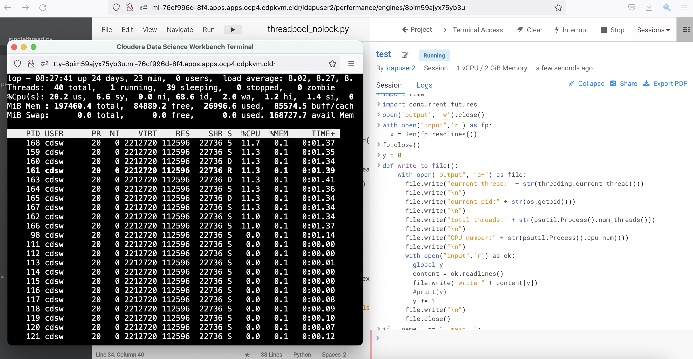

# Threading in Python
{: .no_toc }

Python has become the de-facto language framework for writing machine learning code due to its rich modules ecosystem. I personally like Python because it's human readable and offers a wide range of easy-to-use libraries especially in the data science realm. 

By default, Python uses a single CPU thread to execute the code. This is largely due to GIL (Global Interpreter Lock) as single thread is safe to prevent corrupted output as a result of race condition. While thread-safe is good, it does come with a price - the allocated/available CPU resource is underutilized and it takes longer time to run the code. Today, there are ways to improve the performance with the likes of using multithreading and multiprocessing modules but this must be done carefully because there's always a reason for GIL to exist. At first glance, the term `multithreading` sounds promising to speed up a particular Python program. Let's run some experiments to find out if this is really the case.

The following experiments are carried out using Cloudera Machine Learning (CML) on Kubernetes platform powered by Openshift 4.8 with the hardware specification as described below. CML is embedded with `workbench` and `Jupyterlab` notebook IDE for data scientist to do coding, EDA, etc. In this experiment, the CML workbench is used as it is lightweight, quicker to spin up and easy to use.

| CPU          | Intel(R) Xeon(R) Gold 5220R CPU @ 2.20GHz | 
| Memory  | DIMM DDR4 Synchronous Registered (Buffered) 2933 MHz (0.3 ns) | 
| Disk | SSD P4610 1.6TB SFF    | 

- TOC
{:toc}

---
## Single Thread in Python

1. Create a CML workbench session with 1 CPU/2 GiB memory profile. Open a `Terminal Access` box and run the `top` command to check the total threads are spawned by the process ID of the session pod. In this example, the process ID is 94. Note that there are 30 threads being opened by the process of this running session pod.

    ```bash
    $ top -p 94 -H
    ```

        
 
2. Create a simple `input` file with the following Bash script in the terminal console.

    ```bash
    $ > input;for i in {1..20};do echo line$i >> input;done; head -20 input
    line1
    line2
    line3
    line4
    line5
    line6
    line7
    line8
    line9
    line10
    line11
    line12
    line13
    line14
    line15
    line16
    line17
    line18
    line19
    line20
    ```

3. Create a new file and copy this [Python script](https://github.com/dennislee22/machineLearning/blob/master/singlethread.py) into the workbench and run it. This script is coded to read line by line from the `input` file and write each line into the `output` file in a sequential manner.
 
    

4. After the process is completed, check the outcome of the `output` file. It shows details such as current CPU thread core of the hosting node, current pid, total of threads, which CPU core is scheduled to run the program at one point of time and finally the read/written line. As expected, the code writes each line number to the `output` file sequentially without data corruption as Python runs the code linearly with a single Mainthread process.

    ```bash
    $ more output
    current thread:<_MainThread(MainThread, started 140555361314624)>
    current pid:94
    total threads:30
    CPU number:6
    line1

    current thread:<_MainThread(MainThread, started 140555361314624)>
    current pid:94
    total threads:30
    CPU number:6
    line2

    current thread:<_MainThread(MainThread, started 140555361314624)>
    current pid:94
    total threads:30
    CPU number:6
    line3

    current thread:<_MainThread(MainThread, started 140555361314624)>
    current pid:94
    total threads:30
    CPU number:6
    line4

    current thread:<_MainThread(MainThread, started 140555361314624)>
    current pid:94
    total threads:30
    CPU number:6
    line5

    current thread:<_MainThread(MainThread, started 140555361314624)>
    current pid:94
    total threads:30
    CPU number:6
    line6

    current thread:<_MainThread(MainThread, started 140555361314624)>
    current pid:94
    total threads:30
    CPU number:6
    line7

    current thread:<_MainThread(MainThread, started 140555361314624)>
    current pid:94
    total threads:30
    CPU number:6
    line8

    current thread:<_MainThread(MainThread, started 140555361314624)>
    current pid:94
    total threads:30
    CPU number:6
    line9

    current thread:<_MainThread(MainThread, started 140555361314624)>
    current pid:94
    total threads:30
    CPU number:6
    line10

    current thread:<_MainThread(MainThread, started 140555361314624)>
    current pid:94
    total threads:30
    CPU number:6
    line11

    current thread:<_MainThread(MainThread, started 140555361314624)>
    current pid:94
    total threads:30
    CPU number:6
    line12

    current thread:<_MainThread(MainThread, started 140555361314624)>
    current pid:94
    total threads:30
    CPU number:6
    line13

    current thread:<_MainThread(MainThread, started 140555361314624)>
    current pid:94
    total threads:30
    CPU number:6
    line14

    current thread:<_MainThread(MainThread, started 140555361314624)>
    current pid:94
    total threads:30
    CPU number:6
    line15

    current thread:<_MainThread(MainThread, started 140555361314624)>
    current pid:94
    total threads:30
    CPU number:6
    line16

    current thread:<_MainThread(MainThread, started 140555361314624)>
    current pid:94
    total threads:30
    CPU number:6
    line17

    current thread:<_MainThread(MainThread, started 140555361314624)>
    current pid:94
    total threads:30
    CPU number:6
    line18

    current thread:<_MainThread(MainThread, started 140555361314624)>
    current pid:94
    total threads:30
    CPU number:6
    line19

    current thread:<_MainThread(MainThread, started 140555361314624)>
    current pid:94
    total threads:30
    CPU number:6
    line20 
    ```    

5. Let's recreate the file with more entries and rerun the Python code.

    ```bash
    $ > input;for i in {1..10000};do echo line$i >> input;done; head -20 input
    ```
    
6. Observe the processing time taken by Python to run the code. Run a few times to ensure the result is consistent. In this case, it takes approximately 32 seconds to run the program with the intended outcome.

    ```yaml
    Job Starts: 2071176.127430943
    Job Ends: 2071208.742637604
    Totals Execution Time:32.62 seconds.
    ```

# Multithreading with Threading Module in Python

Let's shift gear by executing the same code and add the Threading Module.

1. Create a CML workbench session with 1 CPU/2 GiB memory profile.

2. Run this [Python script](https://github.com/dennislee22/machineLearning/blob/master/multithreading.py). Use the same `input` file with 10000 entries. Similar to the previous script, the script is amended by adding [Threading](https://docs.python.org/3/library/threading.html) class module.

3. After the process is completed, check the outcome of the newly generated `output` file. It shows the process uses multiple threads to run the code as indicated below.

    ```bash
    $ more output
    current thread:<Thread(Thread-3, started 139772086433536)>
    current pid:97
    total threads:31
    CPU number:1
    line1

    current thread:<Thread(Thread-4, started 139772086433536)>
    current pid:97
    total threads:31
    CPU number:1
    line2

    current thread:<Thread(Thread-5, started 139772086433536)>
    current pid:97
    total threads:31
    CPU number:1
    line3

    current thread:<Thread(Thread-6, started 139772086433536)>
    current pid:97
    total threads:31
    CPU number:1
    line4

    current thread:<Thread(Thread-7, started 139772086433536)>
    current pid:97
    total threads:31
    CPU number:1
    line5

    current thread:<Thread(Thread-8, started 139772086433536)>
    current pid:97
    total threads:31
    CPU number:1
    line6

    current thread:<Thread(Thread-9, started 139772086433536)>
    current pid:97
    total threads:31
    CPU number:1
    line7

    current thread:<Thread(Thread-10, started 139772086433536)>
    current pid:97
    total threads:31
    CPU number:1
    line8

    current thread:<Thread(Thread-11, started 139772086433536)>
    current pid:97
    total threads:31
    CPU number:1
    line9
    ```
    
5. Next, check the integrity of the output file. To reiterate, the purpose of this code is read line by line from the `input` file and write each line into the `output` file in a sequential manner. Run the following script. In the event of no output is produced, it shows the code achieves the intended outcome without data corruption. The result shows the same outcome as the previous test (using single thread). It seems Threading module is safe-thread when using the correct method.

    ```bash
    $ cnt=0;for i in `cat output | grep line`; do cnt=`expr $cnt + 1` ; if [ $i != line$cnt ]; then echo $i;fi ; done
    ```

6. However, the processing time taken by Python to run this code with multithreading is longer with approximately 50 seconds!

    ```yaml
    Job Starts: 2071685.346476694
    Job Ends: 2071735.755200198
    Totals Execution Time:50.41 seconds.
    ```

# concurrent.futures.ThreadPoolExecutor in Python

Now let's add concurrent.futures.ThreadPoolExecutor module to run the same code with the same intended outcome.

1. Run this [script](https://github.com/dennislee22/machineLearning/blob/master/concurrent_threadpool_nolock.py) in the CML workbench session.

2. The processing time taken by Python to run the code with concurrent.futures.ThreadPoolExecutor module is shorter at 24 seconds. Great! 

    ```yaml
    Job Starts: 2070084.875582402
    Job Ends: 2070109.707474271
    Totals Execution Time:24.83 seconds.
    ```

3. Explore outcome of the newly generated `output` file. It shows the process spawns 10 threads (defined by the number of workers) to run the code. The total threads before the running code was 30 and has increased to 40 when executing the code.

    
    
    ```bash
    current thread:<Thread(ThreadPoolExecutor-0_1, started 139664655841024)>
    current pid:98
    total threads:36
    CPU number:2
    line1

    current thread:<Thread(ThreadPoolExecutor-0_3, started 139664639055616)>
    current pid:98
    total threads:36
    CPU number:2
    line2

    current thread:<Thread(ThreadPoolExecutor-0_0, started 139664664233728)>
    current pid:98
    total threads:36
    CPU number:2
    line3

    current thread:<Thread(ThreadPoolExecutor-0_2, started 139664647448320)>
    current pid:98
    total threads:38
    CPU number:2
    line4

    current thread:<Thread(ThreadPoolExecutor-0_5, started 139664283399936)>
    current pid:98
    total threads:40
    CPU number:2
    line5

    current thread:<Thread(ThreadPoolExecutor-0_1, started 139664655841024)>
    current pid:98
    total threads:40
    CPU number:2
    line6

    current thread:<Thread(ThreadPoolExecutor-0_4, started 139664630662912)>
    current pid:98
    total threads:40
    CPU number:2
    line7

    current thread:<Thread(ThreadPoolExecutor-0_6, started 139664275007232)>
    current pid:98
    total threads:40
    CPU number:2
    line8

    current thread:<Thread(ThreadPoolExecutor-0_8, started 139664258221824)>
    current pid:98
    total threads:40
    CPU number:2
    line9

    current thread:<Thread(ThreadPoolExecutor-0_0, started 139664664233728)>
    current pid:98
    total threads:40
    CPU number:2
    line10

    current thread:<Thread(ThreadPoolExecutor-0_4, started 139664630662912)>
    current pid:98
    total threads:40
    CPU number:2
    line11

    current thread:<Thread(ThreadPoolExecutor-0_9, started 139664249829120)>
    current pid:98
    total threads:40
    CPU number:2
    line12

    current thread:<Thread(ThreadPoolExecutor-0_3, started 139664639055616)>
    current pid:98
    total threads:40
    CPU number:2
    line13

    current thread:<Thread(ThreadPoolExecutor-0_7, started 139664266614528)>
    current pid:98
    total threads:40
    CPU number:2
    line14
    ```
    
4. Subsequently, check the integrity of the output. Run the following script to check if the code writes each line number to the `output` file sequentially. The result is negative.

    ```bash
    $ cnt=0;for i in `cat output | grep line`; do cnt=`expr $cnt + 1` ; if [ $i != line$cnt ]; then echo $i;fi ; done
    line26
    line25
    line41
    line40
    line84
    line83
    line96
    line95
    ```
    
    Excerpt from the `output` file:

    
    ```yaml
    current thread:<Thread(ThreadPoolExecutor-1_9, started 139664249829120)>
    current pid:98
    total threads:40
    CPU number:2
    line26

    current thread:<Thread(ThreadPoolExecutor-1_8, started 139664283399936)>
    current pid:98
    total threads:40
    CPU number:2
    line25

    current thread:<Thread(ThreadPoolExecutor-1_0, started 139664258221824)>
    current pid:98
    total threads:40
    CPU number:2
    line27
    ```

5. The outcome is not in line with the intention of the code. The line number is not written sequentially beginning from line26. Unlike the previous outcome, the line numbers are no longer in sequence, e.g. line25 is written after line26 by ThreadPoolExecutor-1_8 and ThreadPoolExecutor-1_9 respectively. This is the behaviour of race condition as a result of multiple threads writing into the same file in parallel. In other words, concurrent.futures.ThreadPoolExecutor is not thread-safe despite able to complete the program at a faster speed.

# concurrent.futures.ThreadPoolExecutor with Lock in Python

Now let's use concurrent.futures.ThreadPoolExecutor module with locking mechanism to run the code with the same intention.

1. Run this [script](https://github.com/dennislee22/machineLearning/blob/master/concurrent_threadpool_lock.py) in the CML workbench session.

2. Next, check the integrity of the output. Run the following script to check if the code writes each line number to the `output` file sequentially. The outcome is good with sequential entries in place.

    ```bash
    $ cnt=0;for i in `cat output | grep line`; do cnt=`expr $cnt + 1` ; if [ $i != line$cnt ]; then echo $i;fi ; done
    ```

3. The processing time taken by Python to run the code with concurrent.futures.ThreadPoolExecutor with Lock module is now taking longer than the code with single thread despite 10 workers/threads are spawned.

    ```yaml
    Job Starts: 2077114.640889352
    Job Ends: 2077154.378118582
    Totals Execution Time:39.74 seconds.
    ```

4. Let's rerun the same test by adjusting `max_workers=1`. Ironically, the speed is almost similar to that of running the script using the default single thread process.

    ```yaml
    Job Starts: 2078032.097896568
    Job Ends: 2078064.409348964
    Totals Execution Time:32.31 seconds.
    ```

5. While introducing lock in concurrent.futures.ThreadPoolExecutor module ensure integrity of the outcome, it comes with  a price of lower speed because only one thread can obtain the lock at a time. Other threads need to wait for the lock to be released.

Conclusion: 
At first glance, multithreading sounds promising to enhance the speed to run specific Python code. In reality, the outcome depends heavily on how the code is written and its objective. While running a Python code with more threads could be faster but might not necessarily achieve the intended outcome. Single thread could work faster than multithreading for ensuring a high degree of integrity. In addition, creating multiple threads also creates resource overhead. In a nutshell, applying multithreading will not guarantee highest performance and could lead to a backfire as it might effectuate data corruption as witnessed in the experiment. Lastly, GIL still exists for a reason :)
    

---

