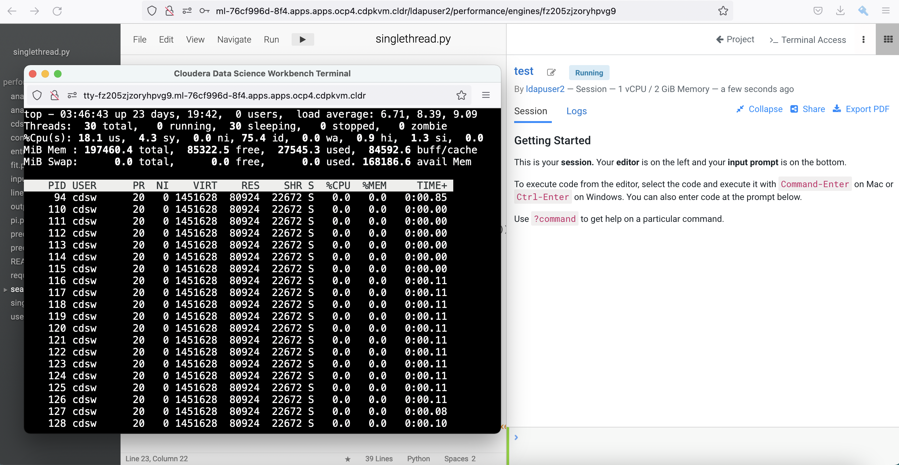
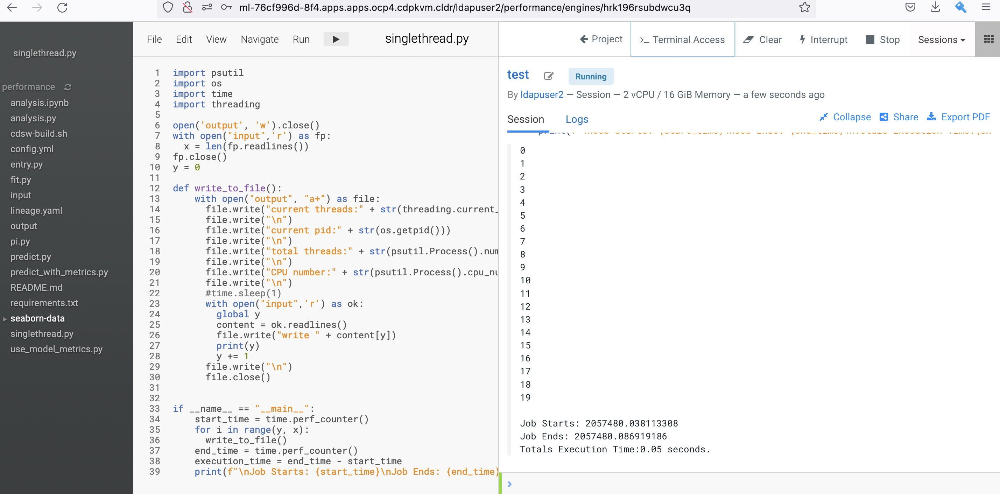

# Python Performance in Machine Learning
{: .no_toc }

Python has become the de-facto language framework for writing machine learning code due to its rich modules ecosystem. I like Python because it's human readable and offers wide range of easy-to-use libraries especially in the data science realm. This blog is articulated to explore ways to enhance the Python code performance in order to deliver quicker result for data scientists. 
By default, Python uses single CPU thread to execute the code. This is largely due to GIL (Global Interpreter Lock) as single thread is safe to prevent corrupted output as a result of race condition. While thread-safe is good, it does come with a price - the allocated/available CPU resource is underutilized and it takes longer time to run the code. Today, there are ways to improve the performance with the likes of using multithreading and multiprocessing modules but this must be done carefully because there's always a reason for GIL to exist. Let's run some experiments to find out more.

The following experiments are carried out using Cloudera Machine Learning (CML) on Openshift with the hardware specification as shown below.

| CPU          | Intel(R) Xeon(R) Gold 5220R CPU @ 2.20GHz | 
| Memory  | DIMM DDR4 Synchronous Registered (Buffered) 2933 MHz (0.3 ns) | 
| Disk | SSD P4610 1.6TB SFF    | 

- TOC
{:toc}

---
## Single Thread in Python

Run and explore the outcome of the following experiment when a typical Python code executes with a single process thread.

1. Create a CML session with 1 CPU/2 GiB memory profile. Open a `Terminal Access` box and run the top command to check the total threads being used by the process ID of the session pod. In this example, the process ID is 94. Note that there are 30 threads being opened by the process of this running session pod.

    ```bash
    $ top -p 94 -H
    ```

        
 
2. Create a simple `input` file with the following content.

    ```yaml
    line1
    line2
    line3
    line4
    line5
    line6
    line7
    line8
    line9
    line10
    line11
    line12
    line13
    line14
    line15
    line16
    line17
    line18
    line19
    line20
    ```

3. Run this Python script.
 
    

4. Check the outcome of the `output` file.

    ```bash
    $ more output
    current thread:<_MainThread(MainThread, started 140555361314624)>
    current pid:94
    total threads:30
    CPU number:6
    write line1

    current thread:<_MainThread(MainThread, started 140555361314624)>
    current pid:94
    total threads:30
    CPU number:6
    write line2

    current thread:<_MainThread(MainThread, started 140555361314624)>
    current pid:94
    total threads:30
    CPU number:6
    write line3

    current thread:<_MainThread(MainThread, started 140555361314624)>
    current pid:94
    total threads:30
    CPU number:6
    write line4

    current thread:<_MainThread(MainThread, started 140555361314624)>
    current pid:94
    total threads:30
    CPU number:6
    write line5

    current thread:<_MainThread(MainThread, started 140555361314624)>
    current pid:94
    total threads:30
    CPU number:6
    write line6

    current thread:<_MainThread(MainThread, started 140555361314624)>
    current pid:94
    total threads:30
    CPU number:6
    write line7

    current thread:<_MainThread(MainThread, started 140555361314624)>
    current pid:94
    total threads:30
    CPU number:6
    write line8

    current thread:<_MainThread(MainThread, started 140555361314624)>
    current pid:94
    total threads:30
    CPU number:6
    write line9

    current thread:<_MainThread(MainThread, started 140555361314624)>
    current pid:94
    total threads:30
    CPU number:6
    write line10

    current thread:<_MainThread(MainThread, started 140555361314624)>
    current pid:94
    total threads:30
    CPU number:6
    write line11

    current thread:<_MainThread(MainThread, started 140555361314624)>
    current pid:94
    total threads:30
    CPU number:6
    write line12

    current thread:<_MainThread(MainThread, started 140555361314624)>
    current pid:94
    total threads:30
    CPU number:6
    write line13

    current thread:<_MainThread(MainThread, started 140555361314624)>
    current pid:94
    total threads:30
    CPU number:6
    write line14

    current thread:<_MainThread(MainThread, started 140555361314624)>
    current pid:94
    total threads:30
    CPU number:6
    write line15

    current thread:<_MainThread(MainThread, started 140555361314624)>
    current pid:94
    total threads:30
    CPU number:6
    write line16

    current thread:<_MainThread(MainThread, started 140555361314624)>
    current pid:94
    total threads:30
    CPU number:6
    write line17

    current thread:<_MainThread(MainThread, started 140555361314624)>
    current pid:94
    total threads:30
    CPU number:6
    write line18

    current thread:<_MainThread(MainThread, started 140555361314624)>
    current pid:94
    total threads:30
    CPU number:6
    write line19

    current thread:<_MainThread(MainThread, started 140555361314624)>
    current pid:94
    total threads:30
    CPU number:6
    write line20 
    ```    
    
    
Conclusion: The above Python script is coded to read line by line from the `input` file and write each line to the `output` file. Python runs the code linearly with a single CPU process thread. The output file also shows which CPU is scheduled to run the process thread at one point of time. As expected, the code writes each line number to the `output` file sequentially without data corruption.


---