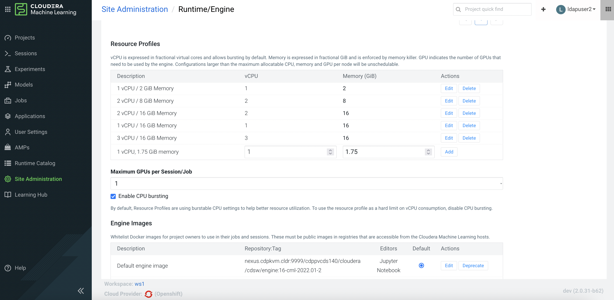
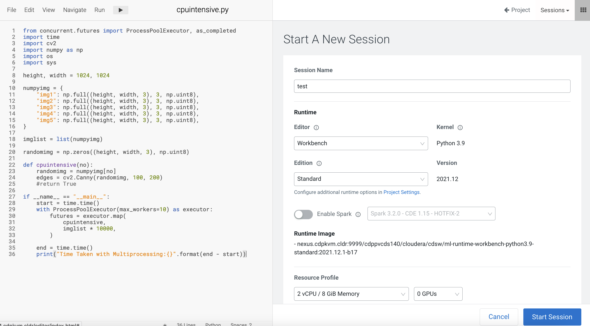
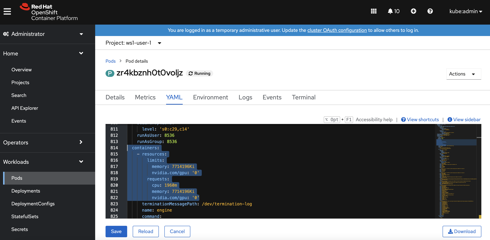
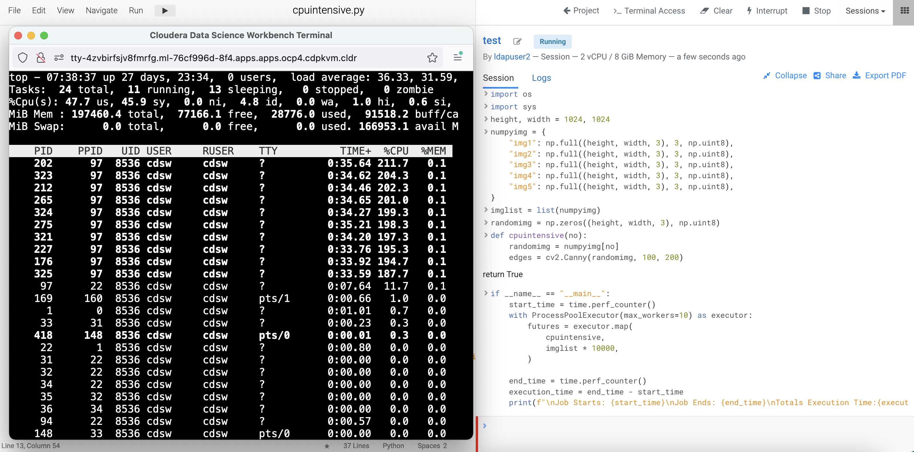
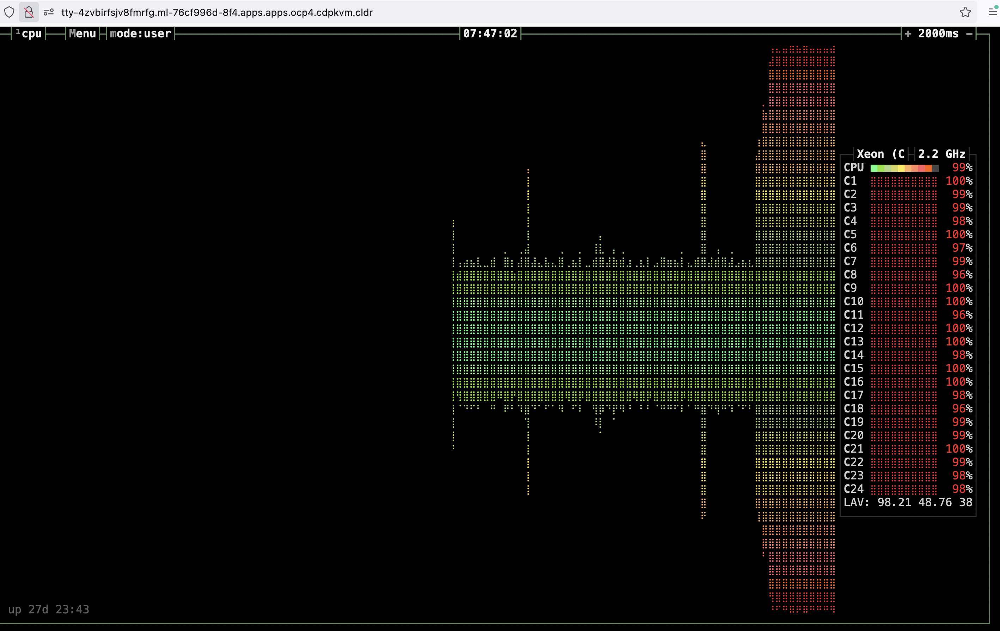
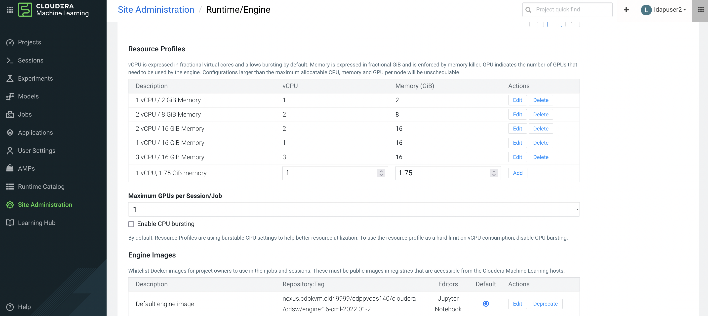
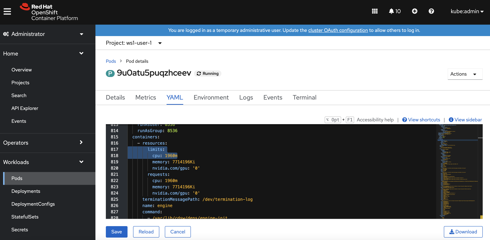
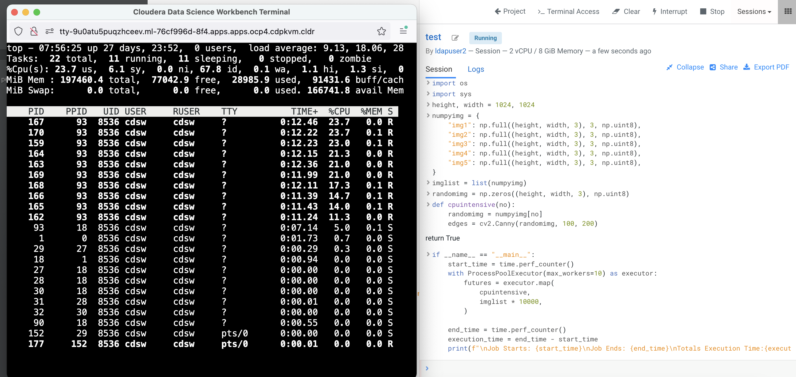

# Noisy Neighbour
{: .no_toc }

In the previous articles, we have witnessed how Python [multithreading]({{ site.baseurl }}) and [multiprocessing]({{ site.baseurl }}) modules can be used to expedite the execution of a particular code, provided that the use case is suitable. As running multiple processes utilizes the available CPU resource, it also creates "noisy neighbour" scenario even on the multi-tenant Kubernetes platform. Let's find out more in the following experiments.

The following experiments are carried out using Cloudera Machine Learning (CML) on Kubernetes platform powered by Openshift 4.8 with the hardware specification as described below. CML is embedded with `workbench` and `Jupyterlab` notebook IDE for data scientist to do coding, EDA, etc. In this experiment, the CML workbench is used as it is lightweight, quicker to spin up and easy to use.

| CPU          | Intel(R) Xeon(R) Gold 5220R CPU @ 2.20GHz | 
| Memory  | DIMM DDR4 Synchronous Registered (Buffered) 2933 MHz (0.3 ns) | 
| Disk | SSD P4610 1.6TB SFF    | 

- TOC
{:toc}

---
# Multiprocessing with no CPU limit

1. By default, CML enables `CPU Bursting` feature. As a result, no CPU limit is configured across all CML session pods.

        
 
2. Create a CML workbench session with 2 CPU/8 GiB memory profile. 

     
    
3. In the Openshift dashboard, verify that there is no CPU limit configured for the session pod of the user namespace.

     
    
    
4. Open a `Terminal Access` box of the CML session and run the `top` command.


5. Run the following compute intensive Python code. It uses openCV Canny module that triggers multiple processes automatically to manipulate the image.

    ```yaml
    from concurrent.futures import ProcessPoolExecutor, as_completed
    import time
    import cv2
    import numpy as np
    import os
    import sys
    
    height, width = 1024, 1024

    numpyimg = {
        "img1": np.full((height, width, 3), 3, np.uint8),
        "img2": np.full((height, width, 3), 3, np.uint8),
        "img3": np.full((height, width, 3), 3, np.uint8),
        "img4": np.full((height, width, 3), 3, np.uint8),
        "img5": np.full((height, width, 3), 3, np.uint8),
        }

    imglist = list(numpyimg)
    randomimg = np.zeros((height, width, 3), np.uint8)

    def cpuintensive(no):    
        randomimg = numpyimg[no]
        edges = cv2.Canny(randomimg, 100, 200)
    
    if __name__ == "__main__":
        start_time = time.perf_counter()
        with ProcessPoolExecutor(max_workers=10) as executor:
          futures = executor.map(
            cpuintensive,
            imglist * 10000,         
        )
        end_time = time.perf_counter() 
        execution_time = end_time - start_time  
        print(f"\nJob Starts: {start_time}\nJob Ends: {end_time}\nTotals Execution Time:{execution_time:0.2f} seconds.")
    ```

6. Take note of the total execution time.

7. Note that the above CPU intensive code spawns 10 child processes and utilizing all CPU cores available on the Kubernetes node/host which is housing the CML session pod. 

     
    
8. You may also install `bpytop` Python module to monitor the CPU utilization dashboard. 

     
    

# Multiprocessing with CPU limit

1. Now let's apply the CPU limit in the CML global configuration and observe the outcome. Untick `CPU Bursting` feature.

      

2. Create a CML workbench session with 2 CPU/8 GiB memory profile. 

3. In the Openshift dashboard, verify that CPU limit is now configured for the session pod of the user namespace.

        
    
4. Open a `Terminal Access` box of the CML session and run the `top` command.

5. Run the above compute intensive Python code. Observe CPU utilization as well as the total execution time.

6. The CPU utilization is now limited to the set limit of 1960 milicore and it takes longer to execute the same code.
 
      

Conclusion: Kubernetes is a multi-tenant platform with the capability of hosting many namespaces without conflict of resources. However, the running pod could make use of all CPU cores in the hosting node if CPU limit is not in place. This effectively creates "noisy neighbour" scenario and impacts the performance of other running pods in the same node/host of different namespace.

---