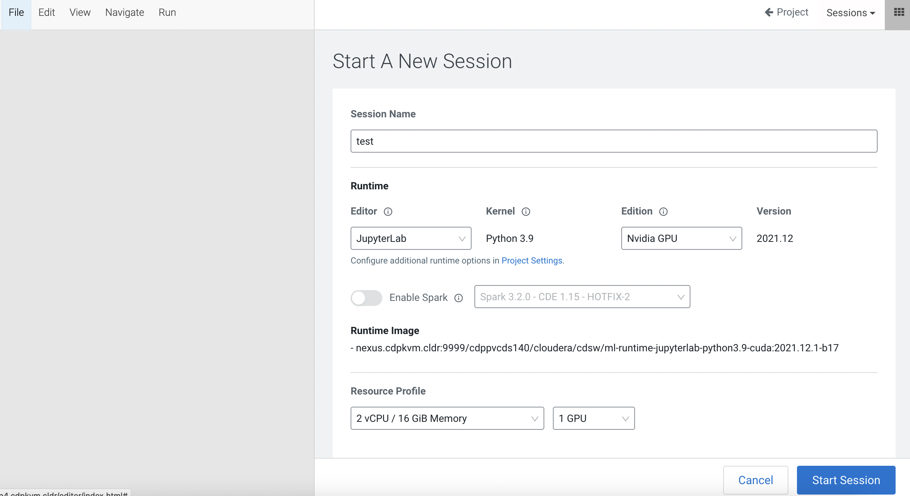
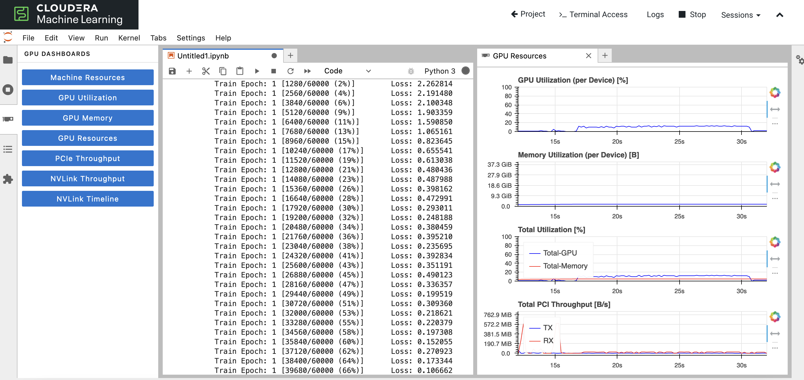
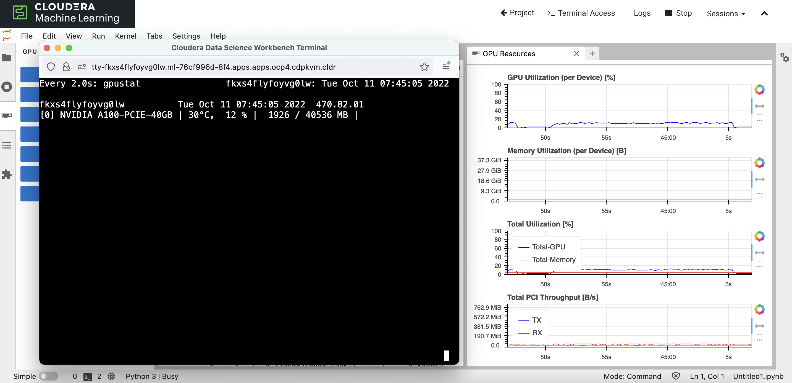

# Nvidia GPU Dashboard
{: .no_toc }

One might wonder why the system takes a long time to train a model using GPU. One of the possible reasons could be GPU card is not fully utilized to its maximum capability due to how the script/code is written. Question is how does one know if the GPU card is firing its cylinders to its full potential? Let's do an experiment using Cloudera Machine Learning (CML) on Kubernetes platform powered by Openshift 4.8. CML is embedded with `workbench` and `Jupyterlab` notebook IDE for data scientist to do coding, EDA, etc. The experiment makes use of `Jupyterlab` notebook to explore the performance output, e.g. whether the code is fully/under utilizing the allocated GPU resource.

In this case, [Jupyterlab-nvdashboard](https://github.com/rapidsai/jupyterlab-nvdashboard) is to be installed to give an overview of the GPU utilization when running the code in the `Jupyterlab` notebook.


- TOC
{:toc}

---

1. Create a CML Jupyterlab session with 2 CPU/16 GiB memory and 1 GPU profile. 

     

2. Open a `Terminal Access` box of the CML session and install the `Jupyterlab-nvdashboard` Python module.

    ```bash
    pip3 install jupyterlab-nvdashboard
    ```    

3. Upon successful installation, you can open and view the Nvidia real-time GPU dashboard. Run a [sample code](https://github.com/dennislee22/machineLearning/blob/master/training_torch_nn.py) to train a model using GPU card and monitor the graph.

    
    
4. To validate the dashboard, you may also install and run the Python module `gpustat` to check the actual utilization percentage at any point of time.

     
    


---