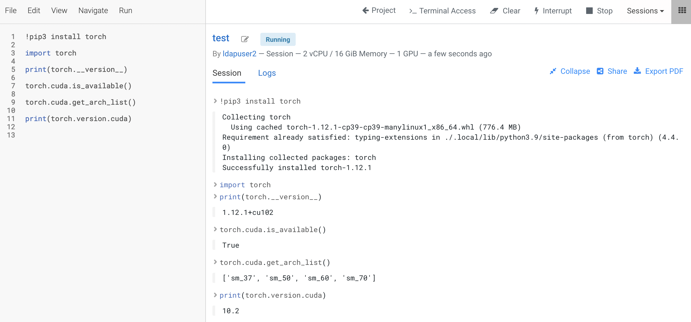

# Pytorch
{: .no_toc }

Pytorch is a popular ML framework based on Python language. The following articles describe the Pytorch use cases running on Cloudera Machine Learning (CML) atop Kubernetes platform powered by Openshift 4.8.

- TOC
{:toc}

---
## How to use train model using GPU/CPU?

1. Create a CML workbench session with 2 CPU/16 GiB memory and 1 GPU profile. 
    
2. Open a `Terminal Access` box of the CML session and run the nvidia-smi command. Note that the CUDA toolkit version is 11.4.

     

3. Let's check the pytorch's CUDA version and its arch_list upon installing the latest `torch` package. Note that the CUDA version of this torch variant is 10.2. The latest CUDA version is usually better. 

     

4. Uninstall that torch version and reinstall torch using the output generated by this [Pytorch website](https://pytorch.org/get-started/locally/). This time the output shows CUDA version is 11.3 and its arch_list include sm_86.

     

     

5. Test training a model with a GPU card using the Fashion MNIST dataset. Use this sample [Pytorch code](https://github.com/dennislee22/machineLearning/blob/master/training_torch.py). The model training is successfully completed using GPU in 33 seconds.

     

6. Test training the model using the same code but this time using CPU `device = torch.device("cpu")` instead of GPU. The model training is successfully completed using CPU in 39.9 seconds with [CPU bursting enabled]({{ site.baseurl }}). Take note of the noisy neighbour scenario when all CPU cycles of the hosting node are fired up to train the model.

     
    
         

---