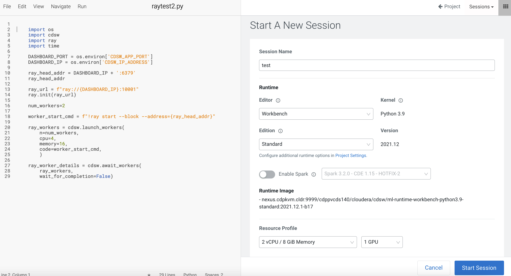
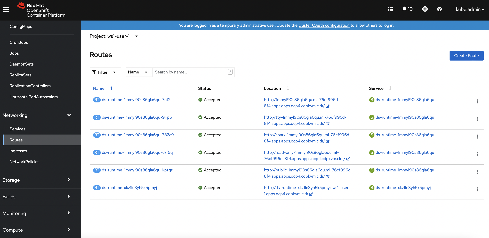
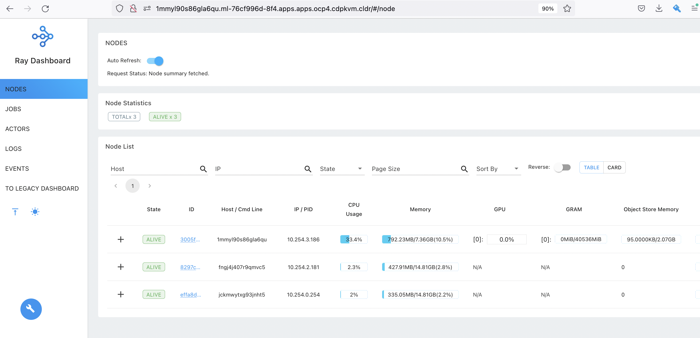

# Ray
{: .no_toc }

Running Python code on the Kubernetes pod could only utilize the available/allocated CPU and memory resources in the hosting node/host. Thanks to [Ray](https://www.ray.io/), you may run machine learning Python code in a distributed computing environment. Let's find out the procedure to do so in Cloudera Machine Learning (CML) on Kubernetes platform powered by Openshift 4.8.

- TOC
{:toc}

---

1. Create a CML workbench session with 2 CPU/8 GiB memory and 1 GPU profile. 

     

2. Open a `Terminal Access` box of the CML session and install the necessary Python modules.

    ```bash
    pip3 install pandas ray[tune] tensorboard gpustat aiohttp aiohttp_cors pydantic opencensus async_timeout
    ```    
    
3. Start the Ray process in the background. 

    ```bash
    ray start --head --block --include-dashboard=true --dashboard-port=8090 --num-gpus=1 &
    ``` 
    
4. Run the following code in the CML session.

    ```yaml
    import os
    import cdsw
    import ray
    import time

    DASHBOARD_PORT = os.environ['CDSW_APP_PORT']
    DASHBOARD_IP = os.environ['CDSW_IP_ADDRESS']

    ray_head_addr = DASHBOARD_IP + ':6379'
    ray_head_addr

    ray_url = f"ray://{DASHBOARD_IP}:10001" 
    ray.init(ray_url)

    num_workers=2

    worker_start_cmd = f"!ray start --block --address={ray_head_addr}"
    
    ray_workers = cdsw.launch_workers(
        n=num_workers, 
        cpu=4, 
        memory=16, 
        code=worker_start_cmd,
        )

    ray_worker_details = cdsw.await_workers(
        ray_workers, 
        wait_for_completion=False)
    ```
    
5. In the Openshift dashboard, find out the URL of the created route for this CML session pod. Open the browser and navigate to that URL. You will be able to see Ray dashboard. Note that there are 3 worker pods and one of them is equipped with GPU card as selected when provisioning the CML session pod. 

     
    
     


---