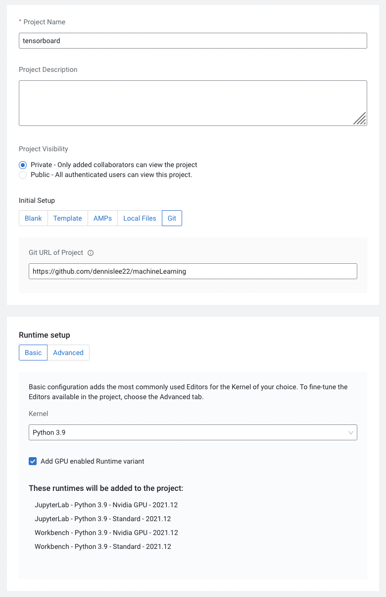
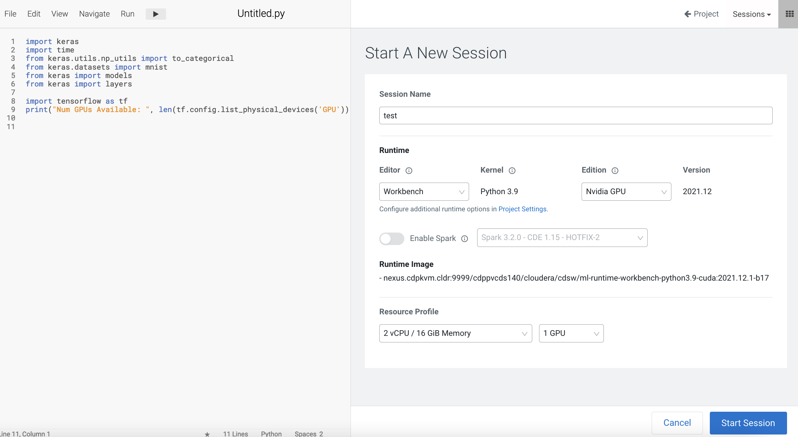
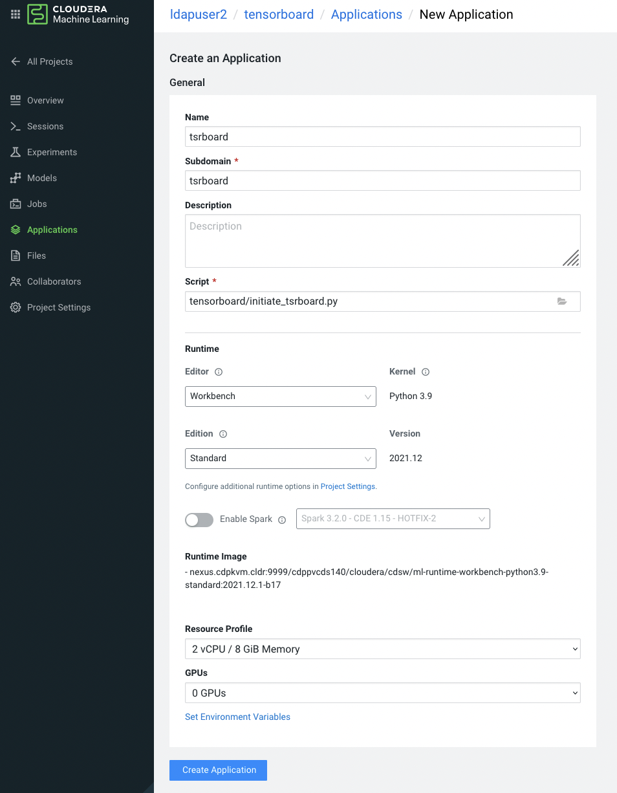
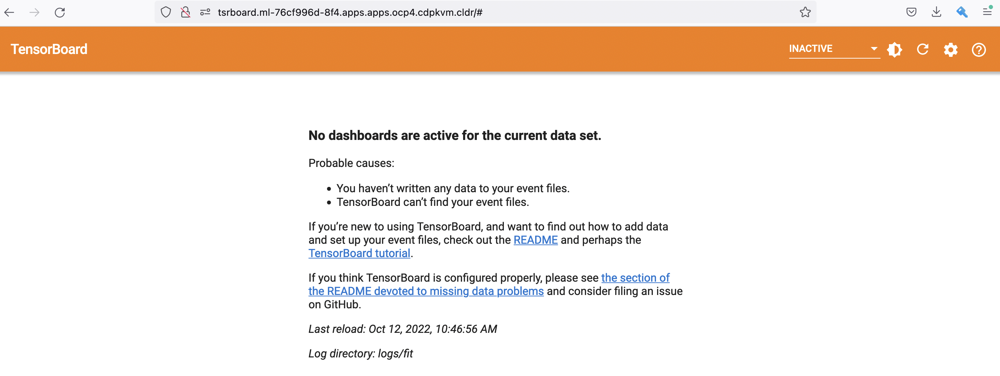
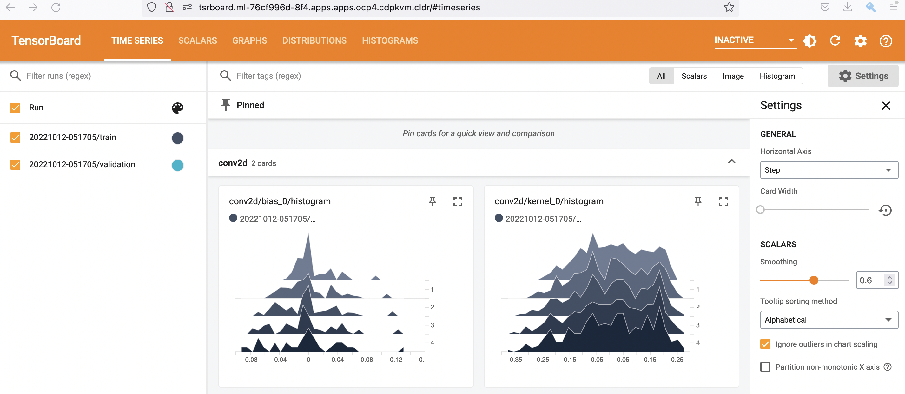

# Tensorflow
{: .no_toc }

Tensorflow is a popular AI/ML framework focusing on training and inference of DNN. The following articles describe the Tensorflow use cases running on Cloudera Machine Learning (CML) atop Kubernetes platform powered by Openshift 4.8.

- TOC
{:toc}

---

## Tensorboard

1. Create a new CML project as shown in the screenshot below. The github link is `https://github.com/dennislee22/machineLearning`.

     

2. Create a CML workbench session in that project with 2 CPU/8 GiB memory and 1 GPU (Nvidia) profile. Open a `Terminal Access` box of the CML session and install the necessary Python modules. After successful installation, close the terminal and session.

    
    
    ```bash
    pip3 install tensorflow matplotlib protobuf
    ``` 

3. Navigate to CML Application and create a new application as depicted below.
    
    
    
4. Subsequently, open a new browser to view the Tensorboard dashboard.

    
    
5. In the CML workbench session, run this sample [code](https://github.com/dennislee22/machineLearning/blob/master/keras_tensorboard.py) to train the Keras model with GPU/CPU. Refresh the Tensorboard dashboard and explore the details.

    

    

---